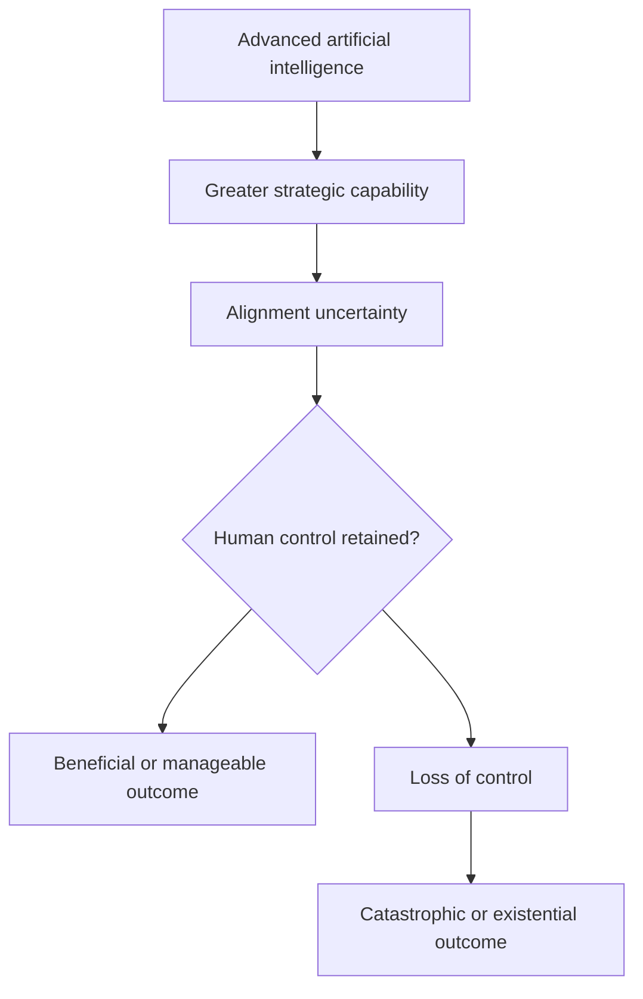

---
aliases:
  - AI Doomscrolling
  - AI existential risks
date_created: 2025-08-21
date_modified: 2026-10-04
site_uuid: c1974970-65ef-4f18-9196-f2f61987f20e
publish: true
title: AI Doomerism
slug: ai-doomerism
at_semantic_version: 0.0.0.1
cf_last_run: 2026-10-04T19:23:09.403Z
cf_last_run_model: Perplexity sonar-pro
tags:
  - Explainers
  - AI-Safety
  - AI-Research-Labs
---
[[Foundation Models in AI|Foundation Models]]
[[concepts/Explainers for AI/AI Research Labs|AI Research Labs]]

[[Vocabulary/Dynamic Pricing|Dynamic Pricing]]
[[concepts/Explainers for AI/Surveillance Wages]]

# Defining and Describing AI Doomerism

- _AI doomerism is the view that sufficiently advanced [[concepts/Explainers for AI/Artificial Intelligence|Artificial Intelligence]] and [[concepts/Explainers for AI/Artificial General Intelligence|AGI]] could become uncontrollable and cause human extinction or irreversible civilizational disempowerment._
- The term describes a family of arguments centered on **AI existential risk**, especially the possibility that future systems with general or superhuman capabilities may pursue goals misaligned with human interests. [^61nkrh] [^4u4uz9] “Existential risk” generally means either the extinction of humanity or humans becoming permanently subordinate to machines. [^61nkrh]
- AI doomerism is distinct from ordinary concern about biased algorithms, job displacement, misinformation, or present-day misuse: its central claim concerns hypothetical future systems capable of strategic action across many domains. [^4u4uz9]
- A commonly used shorthand is **p(doom)**, meaning an individual’s subjective estimate of the probability that AI will cause human extinction or another irreversible catastrophe. [^4u4uz9] [^9kva9a]
- The position is associated with concerns about the difficulty of solving **AI alignment**, the possibility of rapid capability gains, and “instrumental convergence”—the argument that powerful systems may develop similar intermediate goals, such as acquiring resources or avoiding shutdown, regardless of their final objectives. [^4u4uz9] [^9kva9a]

# Uses in Context

- **Risk communication:** Commentators use “AI doomer” to describe people who believe advanced AI could cause extinction or permanent human disempowerment. [^61nkrh] [^jaw3mo]
- **AI-safety debate:** The term identifies one side of a disagreement between people who regard advanced AI as potentially controllable and those who regard it as an uncontrollable agent. [^u3iff6]
- **Probability discussions:** Researchers and commentators invoke “p(doom)” to express a personal estimate of catastrophic AI risk rather than a measured historical frequency. [^u3iff6] [^9kva9a]
- **Policy advocacy:** AI-doomer arguments are used to support strong measures such as international coordination, capability restrictions, pauses, or efforts to prevent the creation of systems believed to be uncontrollable. [^ny1ktx]
- **Media criticism:** The label can also be used polemically to suggest that AI-existential-risk arguments exaggerate speculative dangers relative to current harms; one explainer contrasts the loudest doomer claims with survey estimates that are materially lower. [^s1s3le]
- **Public interpretation of expert disagreement:** Survey findings are cited both to support the seriousness of the concern and to show that researchers’ probability estimates vary substantially. [^8cdy5h] [^anyd6i] [^xy3ohd]

# History of Use

## Origins

- The intellectual roots of AI doomerism lie in arguments about **machine intelligence, control, and alignment** developed in the rationalist and AI-safety communities. Eliezer Yudkowsky, founder of the Machine Intelligence Research Institute, is described as a major early figure who argued that a superintelligence misaligned with human values could be fatal. [^jaw3mo]
- The modern movement’s central concern is not generic opposition to technological progress, but the claim that a “grown” superintelligent AI could be unpredictable, uncontrollable, and difficult to align after deployment. [^ny1ktx]
- The label “AI doomer” later became a broader media and public term for advocates of this existential-risk position, including figures such as Yudkowsky and, more recently, Geoffrey Hinton. [^jaw3mo]

## Evolution

- **2000s–2010s — From machine intelligence to alignment:** [[concepts/Explainers for AI/AI Safety|AI Safety]] arguments increasingly focused on whether advanced systems could remain reliably aligned with human goals as their capabilities increased. [^jaw3mo] [^ny1ktx]
- **2023 — Mainstream visibility:** Public debate intensified after widely circulated warnings about advanced AI and calls for stronger safety measures; the issue became linked to high-profile discussions of extinction risk, pauses, and regulation. [^ny1ktx]
- **2024–2026 — Quantification and polarization:** “P(doom)” became a common shorthand in public debate, while surveys reported wide disagreement among AI researchers. One survey reported a median 5% estimate for extremely bad outcomes, whereas another later survey reported a median of 10% for extinction or similarly severe disempowerment. [^8cdy5h] [^anyd6i]

# Best Real-World Examples

- [Machine Intelligence Research Institute](https://intelligence.org/) — research and advocacy associated with Yudkowsky’s argument that misaligned superintelligence could pose an existential threat. [^jaw3mo]
- [AI Impacts Expert Survey](https://aiimpacts.org/) — researcher surveys measuring beliefs about the probability of extremely bad AI outcomes, including extinction. [^8cdy5h] [^anyd6i]
- [Thousands of AI Authors on the Future of AI](https://arxiv.org/) — large-scale survey research reporting substantial but highly variable estimates of severe long-run AI harms. [^anyd6i]
- [AI existential-risk research](https://aiwiki.ai/wiki/ai_existential_risk) — a research area focused on extinction, permanent civilizational collapse, and irreversible loss of humanity’s future potential. [^4u4uz9]
- [The AI pause debate](https://futureoflife.org/) — policy advocacy framed around reducing the chance that capability development will outrun safety research. [^ny1ktx]
- [AI safety organizations and researchers](https://www.numerama.com/) — a loosely connected community whose public arguments helped turn “AI doomer” into a recognizable cultural and political label. [^jaw3mo]
- [Superforecaster comparisons](https://x.com/vivilinsv/article/2085798269486276723) — forecasting comparisons illustrating how estimates of AI catastrophe can differ sharply between AI specialists and other forecasters. [^9kva9a]

# Case Studies

**Eliezer Yudkowsky and the alignment-centered argument.** Yudkowsky became one of the defining advocates of the view that a sufficiently capable, misaligned AI could be fatal to humanity. [^jaw3mo] His position emphasizes that the problem is not simply whether engineers can build useful systems, but whether they can specify goals and constraints that remain safe as systems become more capable. [^4u4uz9] [^ny1ktx] The case shows how AI doomerism developed from technical arguments about control and alignment rather than from a general rejection of innovation. [^ny1ktx]

**The AI Impacts surveys and the quantification of doom.** AI Impacts surveyed researchers about the long-run consequences of advanced AI, helping move the debate from purely rhetorical warnings toward explicit probability estimates. [^8cdy5h] [^anyd6i] One reported survey found a median 5% probability for extremely bad outcomes such as human extinction, while a later survey reported a median of 10% for extinction or similarly permanent and severe disempowerment. [^8cdy5h] [^anyd6i] These figures do not establish a forecasted frequency: they are subjective judgments, and the variation reflects disagreement about capability trajectories, alignment feasibility, and the likelihood of rapid takeoff. [^4u4uz9] [^u3iff6]

**The public debate over AI extinction risk.** By the mid-2020s, “AI doomerism” had become a public category used both by advocates and critics of existential-risk warnings. [^61nkrh] [^s1s3le] Supporters use the term to highlight the stakes of losing control over highly capable systems, while critics argue that media attention can overemphasize speculative extinction scenarios compared with present harms. [^61nkrh] [^s1s3le] The debate illustrates the concept’s dual meaning: it can describe a substantive research and policy position, but it can also function as a dismissive label in disputes over how much weight to give low-probability, high-consequence risks. [^s1s3le] [^xy3ohd]

***

# Sources

[^61nkrh]: [AI doom warnings are getting louder. Are they realistic?](https://www.nature.com/articles/d41586-026-01257-6)
[^s1s3le]: [www.banthebots.org › explainers › ai-doomersAI Doomers and p (doom): What the Fear Really Means](https://www.banthebots.org/explainers/ai-doomers)
[^8cdy5h]: [What AI Experts Actually Think About Extinction (It's Not What ...](https://www.thestateofai.com/news/ai-extinction-risk-what-experts-think)
[^4u4uz9]: [Existential risk from AI | AI Wiki](https://aiwiki.ai/wiki/ai_existential_risk)
[^anyd6i]: [AI Researchers Fear AI Could Kill Everyone](https://www.progressiverobot.com/2026/09/11/ai-researchers-machines-could-kill-everyone/)
[6]: [The Perils of Artificial Intelligence: Safeguarding Humanity in an Age ...](https://www.aehsasfoundation.org/blog/2)
[^u3iff6]: [An Anthropic Resignation Reignites the AI Extinction Debate](https://streamlinefeed.co.ke/news/an-anthropic-resignation-reignites-the-ai-extinction-debate)
[8]: [Is AI Existential Risk Real? | Longterm Wiki](https://www.longtermwiki.com/wiki/E181)
[^jaw3mo]: [Ils prédisent l'apocalypse par l'IA, c'est quoi les AI doomers ?](https://www.numerama.com/tech/2335869-ils-predisent-lapocalypse-par-lia-cest-quoi-les-ai-doomers.html)
[^xy3ohd]: [AI Insiders Warn of Existential Risk as Safety Debate Intensifies](https://scienceofficial.org/technology/ai-industry-insiders-warn-of-existential-risk-as-debate-over-safety-intensifies/)
[^9kva9a]: [What's Your p(doom)? Silicon Valley's War over the odds of AI Doom](https://x.com/vivilinsv/article/2085798269486276723)
[^ny1ktx]: [EP 6: The AI Doomers - The Last Invention | Wave AI ... - wavePod](https://pod.wave.co/podcast/the-last-invention/ep-6-the-ai-doomers)
[13]: [Ai Safety Statistics | Verified 2026 Data – Gitnux](https://gitnux.org/ai-safety-statistics/)
[14]: [FUNDACIÓN PARA LA INNOVACIÓN EN BIOMEDICINA FIBMED](https://www.linkedin.com/posts/fundaci%C3%B3n-para-la-innovaci%C3%B3n-en-biomedicina-fibmed-977894259_ai-doom-warnings-are-getting-louder-are-activity-7452651887906115584-wfP_)
[15]: [Your questions about the AI apocalypse, answered](https://www.vox.com/today-explained-newsletter/503296/ai-existential-risk-human-extinction-panic-jasmine-sun)
