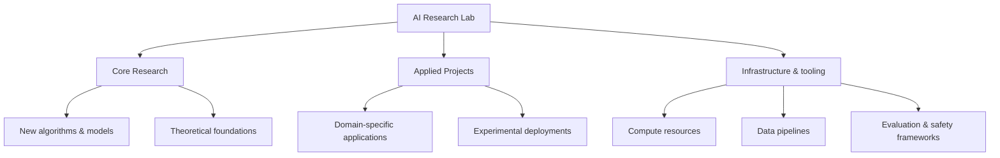

[[Tooling/AI-Toolkit/Model Producers/Anthropic|Anthropic]]
[[Tooling/AI-Toolkit/Model Producers/Midjourney|Midjourney]]
[[Tooling/AI-Toolkit/Model Producers/Mistral|Mistral]]
[[Tooling/AI-Toolkit/Model Producers/Thinking Machines|Thinking Machines]]
[[Tooling/AI-Toolkit/Model Producers/Moonshot AI|Moonshot AI]]
[[concepts/Explainers for AI/Frontier Models|Frontier Models]]

_AI research labs are the “brain centers” of the AI ecosystem: dedicated groups that systematically study, build, and test artificial intelligence systems, turning new ideas into working models and applications._[^jx0b4e] [^49u5k6]

AI research labs are organized research units—usually within universities, independent institutes, startups, or specialized corporate groups—where scientists, engineers, and domain experts collaborate to develop new AI methods, improve existing models, and apply them to real-world problems. [^jx0b4e] [^uv1jas] [^49u5k6] They matter because they concentrate talent, compute resources, and long-horizon research agendas, creating much of the foundational knowledge, algorithms, and tooling that later diffuse into products, public infrastructure, and policy. [^rgjd6f] [^mg5zfb] [^vlspp4] Historically, such labs anchored the emergence of AI as an academic discipline in the late 1950s and 1960s and continue to shape both frontier capabilities (e.g., new architectures, safety techniques) and practical deployment patterns in industry. [^rgjd6f] [^mg5zfb] [^vlspp4] [^07eyqk]  

[IMAGE 1: Collage of historical AI labs (MIT AI Lab, Stanford AI Lab, Carnegie Mellon lab) alongside modern frontier labs like OpenAI and DeepMind, showing evolving facilities and people at work.]

# Defining and Describing AI Research Labs

AI research labs are described as “special places where experts study and create new AI technologies” and “innovation hubs where new ideas become reality.”[^jx0b4e] They are “real, tangible spaces where researchers, engineers, and problem-solvers collaborate to push the boundaries of what artificial intelligence can do.”[^49u5k6]  

More formally, an AI research lab is a **specialized research and development center** focusing on artificial intelligence and machine learning, often spanning subfields like machine learning, computer vision, natural language processing, robotics, and autonomous systems. [^uv1jas] [^ue4jk6] [^tqx4eh] [^ny8y3l] University-based AI groups describe their mission as “the study and development of intelligent, autonomous systems” with both theoretical foundations and applications. [^uv1jas] Similarly, academic AI groups and labs “span machine learning, computer vision, natural language processing, robotics and more,” emphasizing breadth and depth across subdomains. [^ue4jk6] [^tqx4eh]  

In industry-facing contexts, AI labs are framed as hubs where “cutting-edge machine learning research collides with practical business challenges,” distinct from traditional company departments. [^49u5k6] These labs identify promising AI use cases, design execution strategies, and help move projects “beyond proof-of-concept stages…to full-scale deployment.”[^49u5k6] They often act as the **mechanism that decides what’s worth building** before large engineering investments, especially in newer “AI Lab” operating models described as “a series of workshops” that prioritize use cases and test solutions. [^dd3pve]  

# Uses in Context

- AI research labs are invoked as **“brain centers in the AI ecosystem”** that focus on discovering new methods and improving existing AI models, emphasizing their central role in shaping future AI capabilities. [^jx0b4e]  

- In business and consulting writing, the term is used to describe “specialized hubs where cutting-edge machine learning research collides with practical business challenges,” positioning AI labs as vehicles for innovation that link academic rigor to commercial outcomes. [^49u5k6]  

- University materials refer to “Artificial Intelligence research in the Department of Computing” and “Artificial Intelligence Groups & Labs” to denote organized research entities that cover topics such as machine learning, computer vision, NLP, and robotics, embedding AI labs in the institutional structure of departments and schools. [^uv1jas] [^ue4jk6] [^tqx4eh] [^30kmvo] [^ny8y3l] [^faf9ef]  

- Industry strategy writing distinguishes **“AI frontier labs”** (e.g., Anthropic, OpenAI, DeepMind) that “answer one question: *what can AI become?*” from organizational “AI Labs” that improve “the organization’s ability to decide what to do with what models can do,” showing a conceptual split between capability research labs and decision/strategy labs. [^dd3pve]  

- Historical and encyclopedic sources speak of “Artificial Intelligence laboratories set up at many British and US universities in the latter 1950s and early 1960s,” using “AI lab” or “AI research laboratory” as the standard label for institutional centers of AI work. [^vlspp4] [^07eyqk]  

# History of Use

## Origins

- Historical overviews of AI identify the **MIT Artificial Intelligence Laboratory**, inaugurated in 1959 under the leadership of John McCarthy and Marvin Minsky, as the world’s first dedicated AI research laboratory bearing the “artificial intelligence” name. [^rgjd6f] [^f0966j]  

- Accounts of the history of AI note that after the Dartmouth Conference in 1956, “Artificial Intelligence laboratories were set up at many British and US universities in the latter 1950s and early 1960s,” including MIT, Carnegie Mellon, Stanford, and Edinburgh, which became major centers of AI research and funding. [^vlspp4] [^07eyqk]  

- A detailed “House · MIT AI Laboratory” history describes how in 1959 McCarthy “turned [the phrase] ‘Artificial Intelligence’ into a laboratory at MIT,” and in 1970 “the AI Group formally split off from Project MAC and became the MIT AI Laboratory” under Minsky, marking “the first lab to bear the name” and to study AI systematically. [^f0966j]  

## Evolution

- **1950s–1960s – Foundational academic AI labs.** University AI laboratories at MIT, Carnegie Mellon, Stanford, and Edinburgh, supported by agencies like ARPA/DARPA, became core centers where symbolic AI, planning, search, learning, and early robotics and natural language systems were developed, effectively defining what an AI research lab was in practice. [^mg5zfb] [^vlspp4] [^f0966j] [^07eyqk]  

- **1970s–2000s – Institutional consolidation and broadening.** The MIT AI Lab’s 1970 separation from Project MAC, and later the 2003 merger with the Laboratory for Computer Science to form the Computer Science and Artificial Intelligence Laboratory (CSAIL), illustrate how early, relatively small labs evolved into large, multi-area institutes that house broader computer science and AI research under one umbrella. [^f0966j] [^8tcn4d]  

- **2010s–2020s – Frontier and applied labs.** New independent and corporate-affiliated frontier labs such as DeepMind, OpenAI, and Anthropic emerged to push cutting-edge model capabilities, while industry-facing AI labs and “AI Lab” operating models were described as systems of workshops and decision frameworks that help organizations prioritize use cases and deploy AI, reflecting a split between capability research labs and applied/strategy labs. [^49u5k6] [^dd3pve]  

# Best Real-World Examples

- [MIT Computer Science and Artificial Intelligence Laboratory](url) — A major university lab formed by merging the MIT AI Lab with the Laboratory for Computer Science in 2003, continuing a lineage from the first named artificial intelligence laboratory. [^f0966j] [^8tcn4d]  

- [Stanford Artificial Intelligence Laboratory (SAIL)](url) — A university AI lab founded after John McCarthy’s move to Stanford in 1963, becoming one of the early academic centers of excellence in AI research. [^mg5zfb] [^vlspp4] [^07eyqk]  

- [Carnegie Mellon University AI Laboratory](url) — An academic AI laboratory at Carnegie Mellon supported by DARPA/ARPA grants, historically known for pioneering work in machine learning, planning, and vision. [^mg5zfb] [^vlspp4] [^07eyqk]  

- [Edinburgh University AI Laboratory](url) — A British university AI lab established in 1965 by Donald Michie, cited as one of the four main academic AI centers for many years. [^vlspp4]  

- [Imperial College London AI Research in Computing](url) — A contemporary university AI research cluster focused on “intelligent, autonomous systems,” bridging foundational research and applications. [^uv1jas]  

- [Allen School AI Groups & Labs, University of Washington](url) — A constellation of AI research labs across machine learning, vision, NLP, and robotics at a modern computing department, exemplifying the multi-lab academic structure. [^ue4jk6]  

- [Design Sprint Academy “AI Lab” operating model](url) — A practitioner-defined AI lab concept framed as a series of workshops that prioritize and test AI use cases, emphasizing decision systems rather than model development. [^dd3pve]  

# Case Studies

### 1. MIT AI Lab and the Institutional Birth of “Artificial Intelligence”

In the late 1950s, following the Dartmouth Conference that coined “Artificial Intelligence” as a research agenda, John McCarthy and Marvin Minsky led the creation of an AI group at MIT that would become the MIT AI Laboratory. [^rgjd6f] [^f0966j] [^07eyqk] By 1959 McCarthy “turned ‘Artificial Intelligence’ into a laboratory at MIT,” institutionalizing the term in a named research lab, and in 1970 the AI Group formally split from Project MAC with Minsky as director, giving “artificial intelligence” an independent institutional body. [^f0966j] This lab became a “methodological womb,” where core ideas in symbolic AI—knowledge representation, search, planning, learning, and natural language understanding—were first attempted in a systematic way. [^f0966j]  

Over subsequent decades, MIT’s AI Lab was neither the largest nor the wealthiest, but historical accounts emphasize that it was “the first lab to bear the name, the first to study it systematically, the first to inscribe it in textbooks.”[^f0966j] Its later merger with the Laboratory for Computer Science to form CSAIL in 2003 shows how an originally focused AI research lab expanded into a broader institute while retaining AI at its core. [^8tcn4d] This case illustrates how AI research labs can both define a field’s identity and evolve structurally as the field broadens and intertwines with general computer science.  

### 2. Distributed Academic AI Labs: Stanford, CMU, and Edinburgh

During the 1960s, agency funding—especially from ARPA/DARPA—enabled the creation of multiple university AI labs that functioned as a distributed network of research centers. [^mg5zfb] [^vlspp4] [^07eyqk] Historical summaries describe Stanford’s AI Lab, founded by John McCarthy in 1963 after his move from MIT, as a key site for knowledge representation, reasoning, and autonomous robotics. [^mg5zfb] [^vlspp4] [^07eyqk] At Carnegie Mellon University, DARPA grants supported Newell and Simon’s program, leading to a lab that blended symbolic AI with emerging subfields in machine learning, planning, and vision. [^mg5zfb] [^vlspp4] [^07eyqk] In the United Kingdom, Donald Michie established an AI laboratory at the University of Edinburgh in 1965, adding a major European node. [^vlspp4]  

These four institutions—MIT, Carnegie Mellon, Stanford, and Edinburgh—are described as the main centers of AI research and funding in academia for many years, collectively shaping much of early AI practice. [^vlspp4] Their labs built the infrastructure, talent pipelines, and collaborations that fueled fundamental advances and supported the transition of AI from experimental efforts to recognized academic programs and research careers. [^mg5zfb] [^vlspp4] [^07eyqk] This case shows that the concept of an AI research lab quickly expanded from a single pioneering lab to a global network of specialized, institution-based centers, with funding agencies and cross-lab collaboration playing crucial roles.  

### 3. Modern AI Labs as Business Operating Models

Recent practitioner writing reframes the “AI Lab” as an organizational operating model rather than only a technical research group. [^49u5k6] [^dd3pve] One article characterizes AI research labs as “specialized hubs where cutting-edge machine learning research collides with practical business challenges,” designed to move organizations beyond high failure rates of AI proofs-of-concept (statistically around 34%) toward full-scale deployment. [^49u5k6] Another describes an AI Lab as “a series of workshops” that prioritize AI use cases, shape solutions, and test them, emphasizing clear choices and concrete outputs rather than only model capability. [^dd3pve]  

In this framing, “AI frontier labs” such as [[Tooling/AI-Toolkit/Model Producers/Anthropic|Anthropic]], [[Tooling/AI-Toolkit/Model Producers/OpenAI|OpenAI]], and [[organizations/DeepMind|DeepMind]] are said to answer “what can AI become?” by improving models’ capabilities, while the organizational AI Lab improves “the organization’s ability to decide what to do with what models can do.”[^dd3pve] The AI Lab “sits upstream” of engineering, tools, and data infrastructure, acting as the mechanism that decides what’s worth building. [^dd3pve] This case highlights how the term “AI lab” has expanded beyond traditional university or corporate research facilities to include process-oriented, cross-functional structures that govern AI strategy and experimentation inside organizations, reflecting a broader, more operationalized understanding of AI research labs in contemporary practice. [^49u5k6] [^dd3pve]  

[IMAGE 2: Diagram-style illustration of a modern organizational AI Lab as workshops and decision loops feeding into engineering and deployment teams.]

***

# Sources

[^jx0b4e]: [How Ai Research Labs Drive...](https://www.thelasttech.com/ai/what-is-ai-research-lab-in-ai-ecosystem)
[^rgjd6f]: [The First AI Research Laboratory | HistoryNG](https://historyng.com/firsts/the-first-ai-research-laboratory)
[^uv1jas]: [Artificial Intelligence | Faculty of Engineering](https://www.imperial.ac.uk/computing/research/artificial-intelligence/)
[^ue4jk6]: [Artificial Intelligence Groups & Labs](https://www.cs.washington.edu/research/artificial-intelligence/ai-groups-labs/)
[^49u5k6]: [Understanding AI Research Labs Where Innovation ...](https://www.ubesg.com/post/understanding-ai-research-labs)
[^mg5zfb]: [Chapter: 9 Development in Artificial Intelligence](https://www.nationalacademies.org/read/6323/chapter/11)
[^vlspp4]: [History of artificial intelligence](https://www.leviathanencyclopedia.com/article/History_of_artificial_intelligence)
[^f0966j]: [House · MIT AI Laboratory | History of AI - zsjunai.github.io](https://zsjunai.github.io/history-of-ai/en/houses/mit-ai-lab)
[^07eyqk]: [What Is the Early History of Artificial Intelligence?](https://brollyacademy.com/early-history-of-artificial-intelligence/)
[^tqx4eh]: [List of university artificial intelligence research centers - Wikipedia](https://en.wikipedia.org/wiki/List_of_university_artificial_intelligence_research_centers)
[^30kmvo]: [Research Labs - School of Data Science](https://datascience.virginia.edu/research/labs)
[^dd3pve]: [You don't need more AI Pilots. You need a system for ...](https://www.designsprint.academy/blog/you-dont-need-more-ai-pilots-you-need-a-system-for-deciding-which-ones-to-run-enter-the-ai-lab)
[^8tcn4d]: [MIT Computer Science and Artificial Intelligence Laboratory](https://en.wikipedia.org/wiki/MIT_Computer_Science_and_Artificial_Intelligence_Laboratory)
[^ny8y3l]: [Research Areas and Labs - USC Viterbi](https://www.cs.usc.edu/research/research-areas-labs/)
[^faf9ef]: [Artificial Intelligence & Advanced Computing Systems | Research](https://www.unomaha.edu/college-of-information-science-and-technology/research-labs/collaboratoriums/artificial-intelligence-advanced-computing-systems.php)
