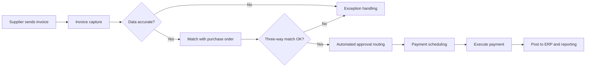

---
aliases:
  - AP Automation
  - Accounts Payable Automation
  - AP Automations
date_created: 2026-05-27
date_modified: 2026-06-05
site_uuid: 56df2362-4c9d-4216-bfe5-5965ce803b2d
publish: true
title: Accounts Payable Automations
slug: accounts-payable-automations
at_semantic_version: 0.0.0.1
cf_last_run: 2026-06-05T20:50:01.966Z
cf_last_run_model: Perplexity sonar-pro
augmented_with: Perplexity AI using Sonar Pro
---

[[Tooling/AI-Toolkit/Agentic AI/Appzen|Appzen]]
[[concepts/Explainers for AI/Accounting AI|Accounting AI]]
[[concepts/Explainers for AI/Artificial Intelligence|Enterprise AI]]
[[Vocabulary/Enterprise Resource Planning|Enterprise Resource Planning]]

_Accounts payable automations use software, AI, and digital workflows to turn slow, manual invoice-to-payment work into a fast, largely touchless process that cuts costs and errors while improving control and visibility. [^g995vu] [^n1rztu] [^7yhsk4] [^10padc]_

Accounts payable (AP) automation refers to technologies—typically cloud software with OCR, AI/ML, and workflow engines—that **capture invoices, validate data, route approvals, and execute payments** with minimal manual intervention. [^g995vu] [^n1rztu] [^7yhsk4] [^107odm] [^10padc] It applies wherever organizations must process significant volumes of supplier invoices and reimbursements, and matters because manual AP is error-prone, expensive per invoice, and a drag on closing the books and managing cash flow. [^g995vu] [^n1rztu] [^2budki] [^6865x9] By integrating with ERP and procurement systems, AP automation helps finance teams improve on-time payments, strengthen compliance, and gain real-time insight into liabilities and spend. [^g995vu] [^2budki] [^p50tep] [^10padc]  

# Defining and Describing Accounts Payable Automations

Accounts payable (AP) automation is broadly defined as **the use of technology (AP automation software, e‑invoicing, AI/OCR) to digitize and optimize the AP process from invoice capture through payment and posting.**[^g995vu] [^n1rztu] [^7yhsk4] [^107odm] [^10padc]  

- insightsoftware defines AP automation as “the use of technology, such as AP automation software and e-invoicing, to digitize and optimize the AP process,” reducing manual work by applying **OCR, artificial intelligence, and machine learning to capture invoice data and validate transactions.**[^g995vu]  
- Xero describes AP automation as **software that helps you manage and pay your bills more efficiently**, where “instead of manually entering invoices, chasing approvals, and writing checks, the software handles these repetitive tasks,” capturing invoice details, routing approvals, and processing payments digitally. [^n1rztu]  
- Navan (formerly TripActions) calls AP automation “systems that **capture, validate, route, and reconcile transactions**” to replace manual invoice-to-payment workflows. [^10padc]  
- Accounting Seed similarly defines AP automation as “the use of technology to digitize and optimize the invoice-to-payment process within an organization.”[^107odm]  

**Core functional capabilities typically include:**  

- **Invoice capture and digitization:** Invoices are ingested via email, upload, EDI, or e‑invoicing and converted to structured data using OCR and AI. [^g995vu] [^n1rztu] [^7yhsk4] [^10padc] [^myyd8b]  
- **Data validation and matching:** Systems validate vendor, amount, and tax details; then perform **2‑way or 3‑way matching** against purchase orders and receipts. [^g995vu] [^2budki] [^7yhsk4] [^10padc]  
- **Approval workflows:** Automated routing based on rules for amounts, cost centers, and categories; AI can help flag anomalies or route exceptions. [^g995vu] [^n1rztu] [^2budki] [^7yhsk4] [^myyd8b]  
- **Payment processing:** Automated payment scheduling and execution via ACH, virtual card, wires, or checks, often with early payment discounts and controls. [^n1rztu] [^2budki] [^7yhsk4] [^p50tep] [^10padc]  
- **Integration and posting:** Tight integration with ERP, general ledger, and procurement systems for real-time posting and reconciliation. [^g995vu] [^2budki] [^p50tep] [^107odm] [^10padc]  
- **Analytics and compliance:** Dashboards for AP KPIs (cycle time, cost per invoice, discount capture) plus audit trails and policy enforcement. [^g995vu] [^2budki] [^6865x9] [^p50tep] [^10padc]  

AP automation is typically delivered as **cloud-based SaaS**, often tailored to mid-market and enterprise finance teams but increasingly accessible to small businesses through integrated accounting platforms. [^n1rztu] [^2budki] [^107odm] [^keia5g]  

# Uses in Context

- In **finance and accounting operations**, companies use “accounts payable automation” to describe projects that “digitize invoices, validate invoice data, and automate approval workflows” across the AP cycle. [^g995vu]  
- Small-business guides frame it as a way to “streamline your invoice process,” where AP automation “cuts invoice costs, speeds payments, reduces errors, and improves cash flow as you grow.”[^n1rztu]  
- Procurement and finance leaders talk about AP automation software that “digitizes and streamlines the process of receiving, approving, and paying supplier invoices,” reducing manual errors and speeding reconciliation. [^2budki]  
- SaaS vendors position “AI-powered AP automation” as a lever to “revolutionize your invoice process” by automating approval workflows, reducing bottlenecks, and ensuring timely payments. [^7yhsk4] [^myyd8b]  
- HR/payroll and workforce platforms increasingly include AP automation to “free finance teams from repetitive manual tasks by handling the routine and time-consuming processes inherent in accounts payable.”[^6865x9]  
- Enterprise spend-management platforms describe AP automation as one of the “six capabilities that drive ROI,” emphasizing automated capture, validation, routing, and reconciliation of AP transactions. [^10padc]  

# History of Use

## Origins

The underlying **accounts payable function** dates back to early bookkeeping and double-entry accounting, but **AP automation** as a distinct term emerged with the shift from paper-based invoice processing to imaging, OCR, and workflow software in the late 20th and early 21st centuries. [^g995vu] [^p50tep] [^107odm]  

- Early document imaging and workflow products in the 1990s digitized invoices and routed them for approval, laying the groundwork for what vendors later branded “AP automation,” though these systems were largely on‑premises and focused on scanning rather than AI. [^g995vu] [^p50tep]  
- As cloud SaaS matured in the 2000s–2010s, a wave of **specialist startups** (for example Tipalti in 2010, Bill.com in 2006, and Airbase and Ramp later in the 2010s) built full “invoice-to-pay” automation platforms, popularizing the explicit phrase **“accounts payable automation”** in marketing, webinars, and buyer guides rather than in academic literature. [^7yhsk4] [^10padc] [^keia5g]  
- Industry guides and vendor encyclopedias, like insightsoftware’s “Accounts Payable Automation” entry and Xero’s “accounts payable automation” guide, helped codify the definition and scope of the term for practitioners rather than originating it in academia. [^g995vu] [^n1rztu]  

There is no evidence of a single academic paper or book that formally introduced the exact term “accounts payable automation”; instead, it emerged from **industry practice**, documentation, and marketing by early AP-focused SaaS startups and workflow vendors. [^g995vu] [^n1rztu] [^7yhsk4] [^107odm] [^10padc]  

## Evolution

- **2000s – From scanning to workflow-driven AP:** Organizations moved from purely manual AP to imaging and workflow solutions that could scan invoices, capture basic data via OCR, and route them for approval, but with limited integration and automation. [^g995vu] [^p50tep] [^107odm]  
- **2010s – Cloud AP automation platforms:** Cloud-native AP automation startups expanded capabilities to include end-to-end invoice capture, PO matching, approval routing, and payment execution, with deep ERP integrations and global payments, turning AP automation into a standard category in finance software stacks. [^7yhsk4] [^107odm] [^10padc] [^keia5g]  
- **2020s – AI- and analytics-powered AP:** Vendors increasingly apply AI/ML to invoice data extraction, anomaly detection, and smart routing, marketing “AI-powered AP automation” as a way to further reduce manual touchpoints and accelerate approvals while strengthening compliance and analytics. [^g995vu] [^7yhsk4] [^6865x9] [^p50tep] [^10padc] [^myyd8b]  

# Best Real-World Examples

- **[Ramp](url)** – [[Tooling/Enterprise Jobs-to-be-Done/Ramp|Ramp]] – A spend-management startup that offers AI- and OCR-based **AP automation** to “handle invoice capture, matching, approval routing, and payment execution without manual data entry,” tightly integrated with corporate cards and accounting systems. [^7yhsk4]  
- **[Tipalti](url)** – [[Tipalti]] – A payout and AP automation platform (startup-founded) that automates global supplier onboarding, invoice processing, tax compliance, and mass payments, exemplifying end-to-end invoice-to-pay automation for high-volume payers. [^keia5g]  
- **[Airbase](url)** – [[Airbase]] – A relatively young spend-management company that combines corporate cards, bill payments, and AP automation to centralize approvals and automate invoice workflows for mid-market firms. [^keia5g]  
- **[Serrala AP Automation](url)** – A specialist provider promoting “AI-powered AP automation” that speeds invoice approvals, reduces bottlenecks, and ensures timely payments for large enterprises. [^myyd8b]  
- **[Navan (TripActions) AP Automation](url)** – A travel and spend-management platform that extends into AP automation, emphasizing the six ROI-driving capabilities of capturing, validating, routing, paying, and reconciling AP transactions. [^10padc]  
- **[Xero Bills / AP Automation](url)** – [[Xero Bills]] – A cloud accounting platform for small businesses that integrates AP automation features—capturing invoices, routing approvals, and processing payments digitally—into its core accounting environment. [^n1rztu]  
- **[SAP Concur Invoice](url)** – An AP module within a larger travel and expense suite that helps enterprises automate invoice capture, approvals, and payments to improve cash flow and compliance. [^p50tep]  

# Case Studies

**Case Study 1 – Mid-market company cuts invoice costs and cycle time with cloud AP automation**  

A typical mid-market organization processing thousands of invoices monthly faces “manual data entry, paper-based processes, and fragmented systems” that drive up cost per invoice and increase late payments. [^g995vu] [^n1rztu] [^2budki] [^6865x9] By implementing a cloud-based AP automation solution with OCR invoice capture, rules-based approval workflows, and ERP integration, such companies can digitize invoices, validate data automatically, and route approvals electronically. [^g995vu] [^n1rztu] [^2budki] [^10padc] Vendor case reports and guides note that AP automation can **“cut invoice costs, speed payments, reduce errors, and improve cash flow”** by replacing manual entry and checks with digital processes. [^n1rztu] [^6865x9] [^10padc] Over time, finance teams report fewer exceptions, faster month-end close due to real-time posting, and clearer visibility into liabilities, illustrating how AP automation transforms AP from a back-office cost center to a more strategic function. [^g995vu] [^6865x9] [^p50tep] [^10padc]  

**Case Study 2 – Scaling startup finance team uses AP automation to handle growth without adding headcount**  

High-growth startups often face rapidly increasing invoice volumes from suppliers, contractors, and SaaS vendors while maintaining lean finance teams. Platforms like Ramp and similar spend-management tools highlight that AP automation using AI and OCR can “handle invoice capture, matching, approval routing, and payment execution without manual data entry,” allowing small teams to manage enterprise-level volume. [^7yhsk4] By integrating AP automation directly with ERP or accounting systems and corporate cards, these companies centralize spend approvals and ensure that invoices are automatically coded and posted once approved. [^7yhsk4] [^107odm] [^10padc] This setup reduces reliance on spreadsheets and email approvals, cuts down on errors and duplicate payments, and provides real-time spend visibility to founders and CFOs, demonstrating AP automation’s role in enabling efficient scale. [^2budki] [^7yhsk4] [^6865x9] [^10padc]  

**Case Study 3 – Enterprise improves compliance and auditability through AI-powered AP automation**  

Large enterprises with complex approval matrices and strict regulatory requirements turn to AI-powered AP automation to enhance compliance and audit readiness. Providers like Serrala describe systems that “automate approval workflows, allowing invoices to move through the system faster, reducing approval bottlenecks, and ensuring timely payments,” while also providing detailed audit trails. [^myyd8b] By automatically validating invoices against purchase orders, enforcing role-based approvals, and logging every action in the workflow, AP automation software helps ensure policy compliance and simplifies internal and external audits. [^g995vu] [^2budki] [^p50tep] [^myyd8b] These enterprises also benefit from advanced analytics on payment terms, discount capture, and vendor performance, revealing optimization opportunities and demonstrating how AP automation can support both operational efficiency and governance objectives. [^g995vu] [^2budki] [^6865x9] [^p50tep] [^10padc] [^myyd8b]

***

# Sources

[^g995vu]: [Accounts Payable Automation - insightsoftware](https://insightsoftware.com/encyclopedia/accounts-payable-automation/)
[^n1rztu]: [Accounts payable automation: streamline your invoice process - Xero](https://www.xero.com/us/guides/accounts-payable-automation/)
[^2budki]: [Accounts payable automation software: A 2026 buyer's guide](https://business.amazon.com/en/blog/accounts-payable-automation-software)
[^7yhsk4]: [What Is Accounts Payable Automation & How Does It Work? - Ramp](https://ramp.com/blog/accounts-payable/what-is-ap-automation)
[^6865x9]: [18 Benefits of Accounts Payable (AP) Automation - Paylocity](https://www.paylocity.com/resources/learn/articles/ap-automation-benefits/)
[^p50tep]: [Accounts Payable in 2026: AP Automation Explained | SAP Concur US](https://www.concur.com/blog/article/accounts-payable-explained)
[^107odm]: [AP Automation and How It Can Help - Accounting Seed](https://www.accountingseed.com/resource/blog/what-is-ap-automation/)
[^10padc]: [AP Automation: 6 Capabilities That Drive ROI - Navan](https://navan.com/blog/the-complete-guide-to-accounts-payable-automation)
[^myyd8b]: [Revolutionize Accounts Payable with AI-Powered Automation - Serrala](https://www.serrala.com/blog/ai-powered-ap-automation-how-to-revolutionize-your-invoice-process)
[^keia5g]: [13 Top Accounts Payable Automation Tools for 2026 - HighRadius](https://www.highradius.com/resources/Blog/best-ap-automation-tools/)
