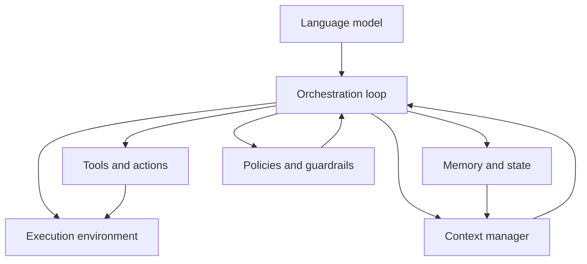

https://youtu.be/1a1VXDdIyrk?is=-yM2plpfgMP69wxY

https://youtu.be/1a1VXDdIyrk?is=tar1Ksp2Bil6v4G9

[[Tooling/AI-Toolkit/Agentic AI/OpenCode|OpenCode]]
[[Tooling/Software Development/Developer Experience/DevTools/Pi Coding Agent|Pi.dev]]
[[Tooling/AI-Toolkit/Generative AI/Code Generators/Claude Code|Claude Code]]
[[Tooling/AI-Toolkit/Agentic AI/OpenClaw|OpenClaw]]
[[Tooling/AI-Toolkit/Agentic AI/Hermes Agent|Hermes Agent]]

[[concepts/Explainers for AI/Agentic Engineering|Agentic Engineering]]

# Defining and Describing Agent Harnesses

_An **agent harness** is the practical “rigging” that turns a raw language model into a reliable, constrained, and context-aware agent that can safely do real work._

Across current usage, **agent harness** (and closely related terms like **AI harness** or **AI agent harness**) refers to the **software and context infrastructure that wraps an [[Vocabulary/Large Language Models|LLM]] or [[concepts/Explainers for AI/Agent Loops|Agent Loops]]**, including tools, workflows, memory, permissions, and environment, so that the model’s reasoning can connect to real execution in a predictable way. [^s3fjtf] [^e4uow5] [^8bmnhu] [^9t2uix] It matters because useful production agents are almost never “just the model”: the harness decides what the agent can see, what it can do, how it keeps state, how it avoids errors, and how it integrates into existing systems. [^s3fjtf] [^p3e02h] [^f6chqd] [^8bmnhu] [^9t2uix] The concept shows up in engineering blogs, conference talks, and system design write‑ups whenever teams move from “LLM demo” to “production agent” and realize most of the hard work is in building this harness layer. [^p3e02h] [^e4uow5] [^8bmnhu] [^9t2uix]

## What an Agent Harness Typically Includes

Different authors use slightly different breakdowns, but they converge on a similar idea: the harness is **everything around the model** that makes it a usable, safe system. [^8bmnhu] [^9t2uix]

- Avi Chawla defines the harness as “the complete software infrastructure wrapping an LLM, including the orchestration loop, tools, memory, context management, state persistence, and failure handling.”[^8bmnhu]
- MongoDB’s engineering team writes that **“the LLM is the smallest part of your agent system”** and that the **harness comprises six components around the model**, with an underlying platform layer that turns it into a reusable foundation. [^9t2uix]
- Microsoft’s Agent Framework blog calls the **agent harness “the layer where model reasoning connects to real execution: shell and filesystem access, approval flows, and context management across long-running sessions.”**[^s3fjtf]
- [[PuppyGraph]]’s explainer describes an agent harness as the **architecture and runtime that connects an agent to tools, data sources, and control logic so it can perform tasks reliably in production.**[^f6chqd]

Common elements include:

- **[[concepts/Agent Orchestration|Agent Orchestration]] loop** (agent loop, planner/executor) that turns model calls into multi‑step workflows. [^8bmnhu] [^9t2uix]
- **Tools / actions / skills** such as shell commands, database queries, APIs, or SaaS actions. [^s3fjtf] [^p3e02h] [^f6chqd] [^8bmnhu] [^9t2uix]
- **Context management** (retrieval, compaction, tiered caches, prompt assembly) governing what the model sees at each step. [^s3fjtf] [^e4uow5] [^8bmnhu] [^9t2uix]
- **Memory and state** (short‑term conversation, long‑term knowledge, task state, logs). [^8bmnhu] [^9t2uix]
- **Execution environment** (local shell, hosted container, sandbox, [[concepts/Continuous Integration and Continuous Delivery|CI/CD]] pipeline step). [^o11cqn] [^s3fjtf] [^f6chqd] [^9t2uix]
- **Policies and guardrails** (permissions, approvals, safety checks, constraints on actions). [^s3fjtf] [^p3e02h] [^f6chqd] [^9t2uix]

Although some products and frameworks use the noun “harness” in their branding (e.g., Harness.io’s “Worker Agents”), the specific term **“agent harness”** in the LLM/agent sense is mostly a **practice/architecture concept** used by practitioners, not a standardized product feature name. [^o11cqn] [^s3fjtf] [^p3e02h] [^e4uow5] [^f6chqd] [^8bmnhu] [^9t2uix]

---

# Uses in Context

- **Production engineering for LLM agents.** Avi Chawla uses “agent harness” to mean the **“complete software infrastructure wrapping an LLM”** and frames his article as explaining *“The Anatomy of an Agent Harness”* for people turning models into robust agent systems. [^8bmnhu]
- **Connecting reasoning to execution.** Microsoft’s Agent Framework blog defines **“Agent harness is the layer where model reasoning connects to real execution: shell and filesystem access, approval flows, and context management across long-running sessions.”**[^s3fjtf] Practitioners invoke it when discussing how agents actually run commands, modify files, and persist state.
- **Framing the non‑model work in agent systems.** MongoDB’s article **“The Agent Harness: Why the LLM Is the Smallest Part of Your Agent System”** uses the phrase to emphasize that most engineering effort lies in “the harness” around the model rather than the model itself. [^9t2uix]
- **Taming multi‑product SaaS complexity.** In a [[Tooling/Enterprise Jobs-to-be-Done/Factorial]] CTO talk, the narrative moves from “LLM magic” to **“a production agent harness: semantic tools, skills, smaller schemas, runtime context, deterministic computation, permissions, and browser-based actions”**, showing how the harness concept explains the difference between a demo and a production capability. [^p3e02h]
- **Code‑centric AI workflows.** PuppyGraph’s blog post **“What is Agent Harness? How Does it Work?”** explains the agent harness as the architecture connecting agents to graph data and tools so they can reliably answer questions and perform graph operations, emphasizing structured components and a platform‑like harness layer. [^f6chqd]
- **Adjacent “AI harness” usage in repos.** Activepieces engineer Louai Boumediene defines **“AI harness (noun): The set of files, folders, conventions, and infrastructure inside a codebase that turns the raw power of an AI agent into reliable, project specific output.”**[^e4uow5] Although he uses *AI harness* rather than *agent harness*, the meaning strongly overlaps with how practitioners use agent harness in tooling discussions. [^e4uow5]

---

# History of Use

## Origins

- The phrase **“AI harness”** in a clearly defined, practice‑oriented sense appears in a 2024 blog post by **Louai Boumediene (Activepieces)**, who writes: **“AI harness (noun): The set of files, folders, conventions, and infrastructure inside a codebase that turns the raw power of an AI agent into reliable, project specific output.”**[^e4uow5] This is one of the earliest explicit dictionary‑style definitions for the harness concept around agents in codebases. [^e4uow5]
- The more specific phrase **“agent harness”** is used in 2024 practitioner content such as **MongoDB’s “The Agent Harness: Why the LLM Is the Smallest Part of Your Agent System”** and **Avi Chawla’s “The Anatomy of an Agent Harness”**, both of which treat it as a systems‑engineering concept for production LLM agents rather than a product name. [^8bmnhu] [^9t2uix]
- **Microsoft’s Agent Framework** blog post (2024) uses “Agent harness” to label the layer that bridges model reasoning with host capabilities like shells, file systems, and approval flows, embedding the term into a concrete open‑source framework rather than just an abstract idea. [^s3fjtf]
- A 2025 arXiv paper **“Code as Agent Harness: Toward Executable, Verifiable, and Stateful Multi-Agent Systems”** generalizes the notion into a research setting, defining code structures that function as a harness to support individual and multi‑agent reasoning and execution, including role coordination and intermediate result sharing over codebases. [^hgtxj0]

## Evolution

- **2024 – Codebase‑centric harness practices.** Boumediene’s *AI harness* article introduces the harness as a set of repo‑level conventions (AGENTS.md, `.agents/` folder, skills, tiered context cache), giving practitioners a concrete, reproducible pattern: “the set of files, folders, conventions, and infrastructure inside a codebase” that makes agents effective. [^e4uow5]
- **2024 – System‑level harness architectures.** MongoDB and Avi Chawla independently expand the harness concept to whole agent systems, emphasizing orchestration loops, tools, memory, context management, and state persistence as first‑class components, and coining lines like “the LLM is the smallest part of your agent system.”[^8bmnhu] [^9t2uix]
- **2024 – Framework‑embedded harness layers.** Microsoft’s Agent Framework bakes the term into API design, distinguishing **local shell harness**, **hosted shell harness**, and context compaction as practical harness building blocks for production agents that need real execution and long‑running sessions. [^s3fjtf]
- **2024–2025 – Research formalization.** The arXiv paper “Code as Agent Harness” formalizes the harness idea for multi‑agent systems over code, arguing that code itself can serve as the harness enabling “executable, verifiable, and stateful” interactions, including coordination of multiple agents with shared state. [^hgtxj0] This shifts the term from purely practitioner jargon toward a research‑level concept. [^hgtxj0]

---

# Best Real-World Examples

- **[Activepieces AI harness practices](https://dev.to/louaiboumediene/the-ai-harness-why-your-ai-coding-agent-is-only-as-smart-as-the-repo-you-put-it-in-cml)** — An open‑source automation startup whose engineer defines and documents an “AI harness” pattern (AGENTS.md, `.agents/` folder, tiered context cache, skills) for making coding agents reliable inside real repos. [^e4uow5]
- **[MongoDB agent harness architecture](https://www.mongodb.com/company/blog/technical/agent-harness-why-llm-is-smallest-part-of-your-agent-system)** — An engineering write‑up that breaks down an agent harness into six components around the model plus a platform layer, illustrating how a database company structures tools, memory, and orchestration. [^9t2uix]
- **[“The Anatomy of an Agent Harness”](https://blog.dailydoseofds.com/p/the-anatomy-of-an-agent-harness)** — Avi Chawla’s newsletter post that walks through the components of a robust agent harness (orchestration loop, tools, memory, context management, state persistence, retries) with concrete code‑level guidance. [^8bmnhu]
- **[Microsoft Agent Framework – Agent Harness](https://devblogs.microsoft.com/agent-framework/agent-harness-in-agent-framework/)** — An open‑source framework where “Agent harness” names the layer connecting model reasoning to shell and filesystem execution, with separate **local** and **hosted shell harnesses** plus context compaction utilities. [^s3fjtf]
- **[Factorial ONE agent harness](https://www.youtube.com/watch?v=wcLf4t72shs)** — A SaaS startup CTO talk describing how they turned a 25‑product HR suite into a single AI agent by designing a production harness with semantic tools, skills, runtime context, deterministic computation, permissions, and browser‑based actions. [^p3e02h]
- **[PuppyGraph agent harness for graph workloads](https://www.puppygraph.com/blog/agent-harness)** — A graph‑focused startup that describes an “agent harness” for connecting agents to graph data, tools, and orchestration so they can answer graph queries and perform graph operations reliably. [^f6chqd]
- **[Code as Agent Harness (research prototype)](https://arxiv.org/html/2605.18747v1)** — An academic proposal where code structures are designed to function as an agent harness for multi‑agent systems, supporting role coordination, intermediate result sharing, and verifiable execution over large codebases. [^hgtxj0]

---

# Case Studies

## 1. Activepieces: Turning Coding Agents into Repo‑Native Workers

Activepieces is an open‑source automation startup whose engineer Louai Boumediene documented their approach to building reliable coding agents in a 2024 article titled **“The AI Harness: why your AI coding agent is only as smart as the repo you put it in.”**[^e4uow5] He defines **AI harness** as *“the set of files, folders, conventions, and infrastructure inside a codebase that turns the raw power of an AI agent into reliable, project specific output,”* explicitly comparing it to a saddle that lets you “actually ride” the horse the AI already is. [^e4uow5] Their harness pattern includes an **AGENTS.md** file that loads on every session and acts as the “codebase’s constitution,” capturing architecture rules, coding rules with enforcement, commands, project‑specific gotchas, and PR rules. [^e4uow5] They organize skills and rules in a canonical `.agents/` folder and then **symlink** it into tool‑specific directories like `.claude/skills`, ensuring a single source of truth regardless of which agent client is used. [^e4uow5]

The harness also uses a **“agent context as a tiered cache”** mental model: different context layers (global, feature‑specific, ephemeral) load at different times and sizes so the model gets the right information without burning too much context window. [^e4uow5] This case shows how a small team can get outsized results from coding agents by investing in repo‑level harness design—files, conventions, and context strategies—rather than tweaking prompts in isolation. [^e4uow5] It illustrates the **context‑engineering** and **context‑vigilance** roles of an agent harness: carefully curating what the model sees, when, and how, to achieve reliable, project‑specific behavior. [^e4uow5]

## 2. MongoDB & Avi Chawla: Systematizing the Agent Harness Architecture

Avi Chawla’s post **“The Anatomy of an Agent Harness”** and [[Tooling/Enterprise Jobs-to-be-Done/MongoDB|MongoDB]]’s article **“The Agent Harness: Why the LLM Is the Smallest Part of Your Agent System”** jointly showcase how engineering teams are systematizing the harness concept as a reusable architecture. [^8bmnhu] [^9t2uix] Chawla describes the harness as “the complete software infrastructure wrapping an LLM,” and breaks it down into elements like the orchestration loop (deciding when and how to call the model and tools), a tool layer, memory and state persistence, context management, and failure handling/retries. [^8bmnhu] MongoDB similarly argues that the **harness comprises six components around the model**, with an underlying layer that turns it into a platform, emphasizing that the model itself is a relatively small component in a robust agent system. [^9t2uix]

In practice, this means modeling agents as **platform services** rather than scripts: defining tools and their schemas, implementing state stores, managing conversation context, and providing policies and guardrails that govern what the agent can do. [^8bmnhu] [^9t2uix] Both pieces demonstrate how the harness concept helps organizations move from ad‑hoc experiments to **state‑of‑the‑art** agentic systems that are maintainable and extensible. They also show that innovation here is being driven by individual engineers and smaller teams—blog authors, internal platform teams—who codify patterns long before they appear in big vendor marketing. [^8bmnhu] [^9t2uix]

## 3. Microsoft Agent Framework: Harness as a First‑Class Layer

Microsoft’s **Agent Framework** exemplifies how a large adopter can incorporate the agent harness idea into a concrete, open‑source toolkit rather than inventing the concept itself. [^s3fjtf] In their blog post **“Agent Harness in Agent Framework,”** the team writes: **“Agent harness is the layer where model reasoning connects to real execution: shell and filesystem access, approval flows, and context management across long-running sessions.”**[^s3fjtf] They introduce three practical building blocks: a **Local shell harness** for controlled host‑side execution, a **Hosted shell harness** for managed execution environments, and **context compaction** for keeping long conversations efficient and reliable. [^s3fjtf]

The framework allows developers to configure what commands agents may run, what file system areas they may access, and how approval flows work, all within the harness layer. [^s3fjtf] This design illustrates how the harness acts as a **safety and integration boundary**: the model never talks directly to the raw machine or production systems, but instead interacts through a harness that mediates capabilities and enforces policies. [^s3fjtf] It shows how big‑tech adopters are popularizing the term by embedding it into frameworks, while the underlying innovation—treating the harness as the primary engineering artifact around agents—originated in practitioner blogs and smaller teams. [^s3fjtf] [^e4uow5] [^8bmnhu] [^9t2uix]

## 4. Factorial ONE: A Production Agent Harness for a 25‑Product SaaS

In a recorded talk, **Ilya Zayats, CTO at [[Tooling/Enterprise Jobs-to-be-Done/Factorial]]**, describes building **Factorial ONE**, an AI agent placed “on top of a 25‑product SaaS company.”[^p3e02h] The talk explicitly frames the journey as moving “from ‘LLM magic’ to a production agent harness,” where the harness includes **semantic tools, skills, smaller schemas, runtime context, deterministic computation, permissions, and browser-based actions.”**[^p3e02h] Zayats notes that the main formula they ended up with was “one LLM loop, three tools, nothing more, and then you have a harness,” describing how this minimal but carefully designed structure covers the whole product area at Factorial. [^p3e02h]

This harness lets the agent understand the product, navigate across different modules, take actions in the UI (via browser‑based actions), and create new work items, all while operating within well‑defined schemas and permission models. [^p3e02h] The case demonstrates how a startup can use an agent harness to unify a complex multi‑product surface into a single, coherent agentic interface, emphasizing context engineering (what schemas and docs are visible when) and strict permissioning to keep behavior safe and predictable. [^p3e02h] It reinforces the idea that **the harness—not the raw LLM—is what makes an agent truly “production‑ready.”**[^p3e02h] [^8bmnhu] [^9t2uix]

***

# Sources

[^o11cqn]: [Worker Agents | Harness Developer Hub](https://developer.harness.io/docs/platform/harness-ai/harness-agents)
[^s3fjtf]: [Agent Harness in Agent Framework - Microsoft Developer Blogs](https://devblogs.microsoft.com/agent-framework/agent-harness-in-agent-framework/)
[^p3e02h]: [From Magic to Harness: Building an AI Agent for a 25-Product SaaS ...](https://www.youtube.com/watch?v=wcLf4t72shs)
[^e4uow5]: [The AI Harness: why your AI coding agent is only as smart as the ...](https://dev.to/louaiboumediene/the-ai-harness-why-your-ai-coding-agent-is-only-as-smart-as-the-repo-you-put-it-in-cml)
[^f6chqd]: [What is Agent Harness? How Does it Work? - PuppyGraph](https://www.puppygraph.com/blog/agent-harness)
[^8bmnhu]: [The Anatomy of an Agent Harness - by Avi Chawla](https://blog.dailydoseofds.com/p/the-anatomy-of-an-agent-harness)
[^9t2uix]: [The Agent Harness: Why the LLM Is the Smallest Part of ... - MongoDB](https://www.mongodb.com/company/blog/technical/agent-harness-why-llm-is-smallest-part-of-your-agent-system)
[^hgtxj0]: [Code as Agent Harness Toward Executable, Verifiable, and Stateful ...](https://arxiv.org/html/2605.18747v1)
