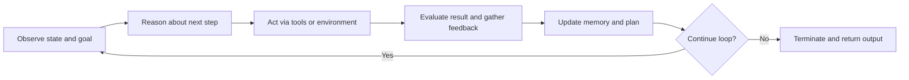

---
aliases:
  - Agent Loops
  - Agent Loop
  - agent loop
  - agent loops
  - loop
  - loops
date_created: 2026-06-22
date_modified: 2026-07-06
tags:
  - Agentic-Engineering
  - State-Of-The-Art-Practices
  - Best-Practices
cf_last_run: 2026-07-06T20:13:41.721Z
cf_last_run_model: Perplexity sonar-pro
site_uuid: d029c434-6f2b-4e32-bffe-02299b9fadb5
publish: true
title: Agent Loops
slug: agent-loops
at_semantic_version: 0.0.1.1
---
[[Tooling/AI-Toolkit/Model Producers/Anthropic|Anthropic]]
[[concepts/Explainers for AI/Agentic Engineering|Agentic Engineering]]

# Defining and Describing Agent Loops

[IMAGE 1: Simple loop diagram showing an AI agent cycling through Observe → Think/Reason → Act → Reflect/Update with arrows returning to the start.]

_An **agent loop** is the repeating cycle through which an AI agent observes the world, reasons, acts, evaluates what happened, and then does it again until a goal is truly finished. [^cgyn68] [^yf61u3] [^41evtl] [^vbhg0s]_

In agentic engineering, *agent loops* describe the core execution pattern inside autonomous agents: a structured, iterative cycle that replaces “one-shot” prompt–response interactions with stepwise work toward a goal. [^cgyn68] [^yf61u3] [^9cgwt0] [^e7vx8g] [^41evtl] They matter whenever you want [[concepts/Explainers for AI/Agentic System Intelligence|Agentic System Intelligence]] to behave more like workers than calculators—planning, calling tools, checking results, and adapting over multiple steps instead of emitting a single answer. [^cgyn68] [^9hqp0f] [^e7vx8g] [^ur7pfy] [^vbhg0s] Agent loops show up in coding agents, supply‑chain optimization, IT service management, multi‑agent systems, and any domain where AI needs to think, decide, and learn from action over time. [^cgyn68] [^41evtl] [^x9tons] [^vbhg0s]

---

### Core definition

- An **agent loop** is commonly defined as “the continuous iterative cycle through which autonomous AI systems operate, consisting of perception, reasoning, action, and feedback phases that enable agents to pursue goals and adapt their behavior based on results.”[^41evtl]  
- Oracle’s agentic engineering blog similarly describes an agent loop as “a cyclical, iterative execution pattern inside a single agent run” where the harness repeatedly assembles context, invokes a reasoning model, and then acts (responds, calls tools, writes memory, or updates its plan). [^4vjvyf]  
- EMA.ai characterizes agent loops as “the cycle that lets an AI agent work through a task step by step instead of producing a one-shot answer,” introducing “a disciplined cycle that adapts as the task unfolds and continues until the goal is truly complete.”[^cgyn68]  
- Tredence describes “the agent loop” as a repeatable cycle where agents “perceive surroundings, reason options, decide on actions, execute them, learn from outcomes, and repeat until goals are achieved.”[^vbhg0s]

### Canonical phases

Across sources, the loop is usually broken into a small set of recurring phases: [^cgyn68] [^yf61u3] [^9hqp0f] [^9cgwt0] [^e7vx8g] [^41evtl] [^vbhg0s] [^qxnqo1]

- **Perceive / Observe** – Read the goal, context, inputs, current environment, and constraints. [^cgyn68] [^9hqp0f] [^9cgwt0] [^e7vx8g] [^41evtl] [^vbhg0s]  
- **Reason / Think / Decide** – Use a model (often an LLM) to decide the next step or plan adjustment. [^cgyn68] [^yf61u3] [^9hqp0f] [^9cgwt0] [^e7vx8g] [^41evtl] [^vbhg0s] [^qxnqo1]  
- **Act / Execute** – Perform the step via tools, APIs, code execution, or environment interaction. [^cgyn68] [^9hqp0f] [^9cgwt0] [^79fshl] [^e7vx8g] [^41evtl] [^vbhg0s] [^qxnqo1]  
- **Observe / Feedback / Reflect** – Evaluate results, detect failures or partial progress, and derive learning signals. [^cgyn68] [^9hqp0f] [^e7vx8g] [^41evtl] [^ur7pfy] [^vbhg0s] [^1p3ceg]  
- **Update / Learn / Iterate** – Refresh state, memory, or policies and decide whether to continue or terminate. [^cgyn68] [^9cgwt0] [^e7vx8g] [^41evtl] [^vbhg0s] [^1p3ceg] [^qxnqo1]  

EMA.ai explicitly enumerates a five‑phase loop: *Perceive, Reason, Act, Observe, Update* that repeats until task completion or a stop rule. [^cgyn68] Barnacle.ai’s agent primer presents a “Basic Agent Loop” as *Observe → Think → Act → Reflect → then repeat*. [^9hqp0f] MindStudio’s loop‑engineering articles generalize a loop as “a repeating cycle where the model takes an action, receives feedback from the environment, and uses that feedback to decide its next move,” continuing until a termination condition is met. [^9cgwt0] [^e7vx8g]

### Planning vs reactive agent loops

The Agentic Engineering Guide by Siddhant Khare notes that “every agent, regardless of framework, runs a variation of the same loop: observe the current state, decide what to do next, take an action, observe the result, and repeat,” but distinguishes **planning agents** from **reactive agents** within this pattern. [^yf61u3]

- **Planning agent loops** maintain an explicit plan or goal tree and update it over iterations. [^yf61u3]  
- **Reactive agent loops** respond more directly to current state without long‑horizon planning, still following the same observe–act–feedback rhythm. [^yf61u3]  

Alibaba Cloud’s blog on continuous iteration paradigms for AI agents similarly describes conventional agent loops as perception–decision–execution–feedback cycles used by decision‑making agents that “dynamically adjust the next step based on various states and inputs.”[^h04cly]

### Relation to agentic engineering

Agent loops are treated as foundational mechanics within **agentic engineering**—the discipline of designing AI systems that act autonomously toward goals: [^yf61u3] [^9cgwt0] [^e7vx8g] [^x9tons]

- MindStudio’s “What Is Agentic Engineering?” article states that “the underlying mechanics include agent loops, tool access, and multi-agent coordination,” and illustrates a *development loop* (receive task, plan, execute, evaluate, iterate, return result) as a basic agentic pattern. [^x9tons]  
- Its series on loop engineering calls loop engineering “the practice of designing AI agent systems that operate in iterative cycles—taking an action, observing the result, reasoning about it, and repeating until a goal is achieved,” explicitly rooted in agent loops. [^e7vx8g]  
- Oracle’s “Agent Loop Decoded” blog is framed as a guide to “three levels of agent architecture” that every **agent engineer** should know, emphasizing loops as central design concerns rather than incidental implementation details. [^4vjvyf]  

### Agent loops vs one-shot copilots

Practitioners often contrast agent loops with traditional single‑turn LLM “copilots” or chatbots: [^cgyn68] [^9hqp0f] [^e7vx8g] [^ur7pfy] [^1p3ceg]

- EMA.ai argues that “the agent loop closes this gap” by replacing “a single prompt and reply” with a cycle that “adapts as the task unfolds and continues until the goal is truly complete.”[^cgyn68]  
- Barnacle.ai describes agent loops as “the defining characteristic of true agents,” stressing that the AI “observes results, plans next steps, and adjusts its approach dynamically” rather than just answering once. [^9hqp0f]  
- MindStudio notes that in agentic AI, a loop lets the model “take an action, receive feedback … and use that feedback to decide its next move,” continuing until a task is complete or a stopping criterion triggers. [^e7vx8g]  
- The AI Operator newsletter describes an agent loop system as one where “a model does a task, checks the result, and saves what it learned so the next run starts from a better place,” allowing the loop to “accumulate skills and rules over time” even if the underlying model weights never change. [^1p3ceg]  
- Addy Osmani’s write‑up on self‑improving coding agents emphasizes an iterative agent loop—nicknamed the “Ralph Wiggum” technique—where development is broken into many small tasks and an AI agent runs in a loop to tackle them one by one, improving over runs. [^ur7pfy]

### Minimal formalization

Reddit discussions in agent‑builder communities summarize a **minimal agent loop** as: [^qxnqo1]

1. Invoke the LLM.  
2. Retrieve the next action or tool invocation.  
3. Carry out the action.  
4. Return the outcome to the LLM.  
5. Continue this process until the objective is achieved. [^qxnqo1]  

MindStudio’s loop engineering piece offers a similar concise formalization: the agent receives or observes state, acts, evaluates whether the loop should continue, and if yes, loops back to step 1 with updated context. [^9cgwt0]

### Diagram (process view)

---

# Uses in Context

- EMA.ai introduces agent loops as “the foundation of multi-agent ecosystems,” explaining that they let AI agents “work through a task step by step instead of producing a one-shot answer” and “create real autonomy” by giving AI “a structured cycle to think, act, evaluate, and adapt.”[^cgyn68]  
- Barnacle.ai invokes “the ‘Agent Loop’—a cycle of observing, thinking, acting, and reflecting” as “the defining characteristic of true agents,” using the term to distinguish dynamic agents from static workflows. [^9hqp0f]  
- MindStudio’s loop‑engineering articles describe “autonomous agent loops” and “agentic loops” as the new meta for coding agents, emphasizing that loop design (termination conditions, feedback signals, tool calls) is now a core engineering concern rather than an implementation detail. [^9cgwt0] [^e7vx8g]  
- Oracle’s developer blog “The Agent Loop Decoded” uses the concept to teach three levels of agent architecture—basic tool‑calling agents, memory‑aware agents, and self‑refining agents—framing agent loops as a mental model for agent engineers. [^4vjvyf]  
- Tredence’s industry blog on “The Agent Loop” uses the term in enterprise contexts, claiming that “AI Agent loops can reduce supply chain costs by 20 to 50 per cent” and significantly cut IT ticket volume, positioning agent loops as a mechanism for operational efficiency. [^vbhg0s]  
- Addy Osmani’s article on self‑improving coding agents talks about “self‑improving agent loops” and an iterative “agent loop” at the heart of the approach, showing how orchestrated loops with memory persistence and structured context enable practical coding automation workflows. [^ur7pfy]  

---

# History of Use

## Origins

- The looped “perception–reasoning–action–feedback” structure has roots in earlier AI agent models and decision systems, but contemporary sources trace most modern *agent loops* in LLM‑based agents back to the **ReAct** (Reason + Act) pattern and related iterative prompting techniques, which MindStudio explicitly notes: “Most modern agent loops trace back to the ReAct pattern (Reason + Act).”[^e7vx8g]  
- Independent practitioners and smaller companies appear to have popularized the specific term “agent loop” in the context of LLM agents: EMA.ai’s 2025 article “Agent Loops: The Foundation of Multi-Agent Ecosystems” presents an early, detailed public definition and five‑phase schema for agent loops in multi‑agent systems. [^cgyn68]  
- The Agentic Engineering Guide by Siddhant Khare (an independent author) devotes a full chapter (“Ch. 17: The Agent Loop”) to explaining agent loops, categorizing them into planning vs reactive and providing a framework for agent engineers, indicating early adoption in specialist educational materials outside big‑tech marketing. [^yf61u3]  
- Community discussions, such as the 2026 Reddit thread “What are you using to build your agent loop?” show builders using the term informally to describe their LLM–tool orchestration cycles with a simple 5‑step loop (invoke LLM, choose action, execute, feed back result, repeat). [^qxnqo1]  

Given the available sources, *agent loops* as a named concept in **agentic engineering** seem to have emerged from independent blogs, educational guides, and practitioner communities rather than from big‑tech incumbents’ official product documentation. [^cgyn68] [^yf61u3] [^ur7pfy] [^1p3ceg] [^qxnqo1]

## Evolution

- **2025 — Multi-agent ecosystems framing.** EMA.ai’s 2025 article “Agent Loops: The Foundation of Multi-Agent Ecosystems” reframes agent loops as the “foundation” of multi‑agent ecosystems, introduces a five‑phase Perceive–Reason–Act–Observe–Update loop, and argues that loops are what “create real autonomy” beyond one‑shot copilots. [^cgyn68]  
- **Early 2026 — Agentic engineering guides and coding workflows.** In 2026, Siddhant Khare’s Agentic Engineering Guide formalizes agent loops into planning vs reactive categories, making them central to agentic engineering pedagogy, [^yf61u3] while Addy Osmani’s piece on self‑improving coding agents documents how to “set up these self‑improving agent loops” with orchestrated loops, memory, and context files for practical coding automation. [^ur7pfy]  
- **2026 — Loop engineering and enterprise adoption.** MindStudio’s series on loop engineering (for general agents and coding agents) elevates “loop engineering” itself as “the new meta for autonomous AI agent workflows,” tying agent loops to broader concepts like agentic AI and multi‑agent coordination, [^9cgwt0] [^e7vx8g] [^x9tons] while Tredence and other industry blogs extend the agent loop framing into domains like supply chain and IT service management, quantifying potential cost and ticket volume reductions. [^vbhg0s]  
- **2026 — Formal SDK patterns and reference lifecycles.** Documentation for agent SDKs (e.g., Claude Agent SDK) now describes “Agent Loops: How the Core Execution Cycle Works” as a defined lifecycle where system messages mark loop start, the assistant alternates between tool calls and answers, and tool results feed back into the loop until termination, indicating maturation of the concept into concrete APIs and harness patterns. [^79fshl]  

---

# Best Real-World Examples

- [EMA.ai multi-agent ecosystems](url) – EMA.ai’s multi‑agent platform and blog exemplify agent loops with explicit Perceive–Reason–Act–Observe–Update cycles for agents collaborating on complex tasks. [^cgyn68]  
- [The Agentic Engineering Guide](url) – Siddhant Khare’s educational guide systematically explains agent loops, distinguishing planning and reactive loops in practical agent architectures. [^yf61u3]  
- [MindStudio loop-engineering tools](url) – MindStudio’s visual builder lets people “experiment with autonomous agent loops without setting up infrastructure from scratch,” embodying agent loops in a no‑code environment. [^9cgwt0]  
- [Self-improving coding agents (Addy Osmani)](url) – Osmani’s workflows for self‑improving coding agents rely on orchestrated agent loops, with agents iteratively tackling small coding tasks and persisting learnings. [^ur7pfy]  
- [Claude Agent SDK agent loops](url) – The Claude Agent SDK documents an explicit “agent loop lifecycle” with system initialization, iterative tool calls, and termination, providing a concrete implementation pattern. [^79fshl]  
- [AI Operator’s research swarm loops](url) – The AI Operator newsletter reports on a “112‑agent research swarm” and uses agent loops as the pattern where models “do a task, check the result, and save what [they] learned” across runs. [^1p3ceg]  
- [Tredence enterprise agent loops](url) – Tredence describes deploying agent loops in supply chain and IT service management, estimating substantial cost and ticket reductions from autonomous, loop‑driven workflows. [^vbhg0s]  

---

# Case Studies

## EMA.ai: Agent loops as the foundation of multi-agent ecosystems

EMA.ai presents one of the clearest early practical treatments of agent loops in multi‑agent ecosystems. [^cgyn68] In its 2025 article “Agent Loops: The Foundation of Multi-Agent Ecosystems,” EMA.ai defines an agent loop as “the cycle that lets an AI agent work through a task step by step instead of producing a one-shot answer” and introduces a five‑phase loop—Perceive, Reason, Act, Observe, Update—that repeats until the task is complete or a stop rule triggers. [^cgyn68] The article emphasizes that loops “create real autonomy” by giving agents a structured cycle to “think, act, evaluate, and adapt” and argues that many perceived failures of agents come from poorly designed loops rather than model limitations. [^cgyn68]  

In practice, EMA.ai’s framing shows how individual agents within a multi‑agent ecosystem each maintain their own loop, allowing them to handle sub‑tasks, coordinate via messages, and refine their behavior over time. [^cgyn68] This case illustrates the role of agent loops not just inside a single harness but as building blocks for larger systems where multi‑agent collaboration, tool orchestration, and adaptive behavior depend on well‑specified loops. [^cgyn68] It highlights how smaller, specialized platforms can pioneer conceptual clarity around agent loops before larger incumbents adopt similar language.

## Self-improving coding agents: The “Ralph Wiggum” loop

Addy Osmani’s write‑up on “Self-Improving Coding Agents” documents a practitioner‑driven approach to building coding workflows around iterative agent loops. [^ur7pfy] Osmani explains that “at the heart of this approach is an iterative agent loop often nicknamed the ‘Ralph Wiggum’ technique (popularized by Geoffrey Huntley and folks like Ryan Carson),” where development is broken into many small tasks and an AI agent runs in a loop to tackle them one by one. [^ur7pfy] The article covers how to orchestrate these loops, including structuring context files, managing memory persistence, and coordinating multiple runs so that the agent can self‑improve over time. [^ur7pfy]  

By focusing on real coding workflows rather than abstract architecture, this case shows agent loops as practical tools: each iteration involves observing the current code and task, reasoning about changes, acting by modifying files or running commands, and then evaluating results (tests, linting) before repeating. [^ur7pfy] Over many iterations, the loop produces more reliable and maintainable code than one‑shot suggestions, and the agent accumulates project‑specific knowledge through persisted context. [^ur7pfy] This narrative demonstrates how indie practitioners and developer‑advocates can shape agent loop practice, with big‑tech tools later acting as adopters or platforms rather than originators.

## MindStudio and Oracle: Formalizing loop engineering for agentic systems

MindStudio’s loop‑engineering articles and Oracle’s “Agent Loop Decoded” blog together show how the concept of agent loops moved from indie practice into more formal engineering discourse. [^4vjvyf] [^9cgwt0] [^e7vx8g] [^x9tons] MindStudio describes loop engineering as “the practice of designing AI agent systems that operate in iterative cycles—taking an action, observing the result, reasoning about it, and repeating until a goal is achieved,” and states that “most modern agent loops trace back to the ReAct pattern (Reason + Act).”[^e7vx8g] Its posts on autonomous agent loops and coding agents discuss termination conditions, feedback mechanisms, and tool orchestration as key design decisions, and advertise a visual builder where people can “experiment with autonomous agent loops without setting up infrastructure from scratch.”[^9cgwt0] [^e7vx8g]  

Oracle’s developer blog, while from a large incumbent, acts as a **popularizer** rather than originator: “The Agent Loop Decoded” explains agent loops in terms of “three levels of agent architecture”—from basic tool‑calling agents to memory‑aware and self‑refining agents—and defines the loop as a “cyclical, iterative execution pattern inside a single agent run” that repeatedly assembles context, invokes a reasoning model, and acts. [^4vjvyf] By presenting these patterns to a broad developer audience, Oracle helps standardize the vocabulary and mental models around agent loops. [^4vjvyf] Together, these examples show a trajectory where smaller platforms and independent authors first codify loop engineering practices, and larger companies later document and disseminate them to mainstream developer communities. [^4vjvyf] [^9cgwt0] [^e7vx8g] [^x9tons]

[IMAGE 2: Screenshot-style illustration of a visual builder canvas showing nodes for Observe, Reason, Act, Evaluate connected in a loop, labeled as “agent loop workflow”.]

***

# Sources

[^4vjvyf]: [The Agent Loop Decoded | developers - Oracle Blogs](https://blogs.oracle.com/developers/the-agent-loop-decoded-three-levels-every-agent-engineer-must-know)
[^cgyn68]: [Agent Loops: The Foundation of Multi-Agent Ecosystems - EMA.ai](https://www.ema.ai/additional-blogs/addition-blogs/building-ai-agents-agent-loop)
[^yf61u3]: [Ch. 17: The Agent Loop - The Agentic Engineering Guide](https://agents.siddhantkhare.com/17-agent-loop/)
[^9hqp0f]: [The 4 Levels of AI Agents: When to Use Workflows vs Autonomous ...](https://www.barnacle.ai/blog/2025-09-25-agents-intro)
[^9cgwt0]: [What Is Loop Engineering? The New Meta for Autonomous AI Agent ...](https://www.mindstudio.ai/blog/what-is-loop-engineering-autonomous-ai-agent-workflows)
[^79fshl]: [Claude Agent SDK: Agent Loops, Tool Calls, and Multi-Step Workflows](https://www.augmentcode.com/guides/claude-agent-sdk-agent-loops-tool-calls)
[^h04cly]: [From ReAct to Ralph Loop A Continuous Iteration Paradigm for AI ...](https://www.alibabacloud.com/blog/from-react-to-ralph-loop-a-continuous-iteration-paradigm-for-ai-agents_602799)
[^e7vx8g]: [What Is Loop Engineering? The New Meta for AI Coding Agents](https://www.mindstudio.ai/blog/what-is-loop-engineering-ai-coding-agents)
[^41evtl]: [What Is An Agent Loop - The Complete Guide to AI Agent Architecture](https://www.vincirufus.com/en/posts/agent-loop/)
[^x9tons]: [What Is Agentic Engineering? The Shift Beyond Vibe Coding](https://www.mindstudio.ai/blog/what-is-agentic-engineering)
[^ur7pfy]: [Self-Improving Coding Agents - Addy Osmani](https://addyosmani.com/blog/self-improving-agents/)
[^vbhg0s]: [The Agent Loop: How AI Thinks, Decides, and Learns From Action](https://www.tredence.com/blog/ai-agent-loop)
[13]: [How I use agent loops and goals (Claude Code + Codex). - YouTube](https://www.youtube.com/watch?v=WRkVuebZqLU)
[^1p3ceg]: [AI Agent Loops Decoded: What's Real, What's Hype - The AI Operator](https://theaioperator.io/p/ai-agent-loops-decoded-whats-real)
[^qxnqo1]: [What are you using to build your agent loop? : r/AI_Agents - Reddit](https://www.reddit.com/r/AI_Agents/comments/1u28t54/what_are_you_using_to_build_your_agent_loop/)
