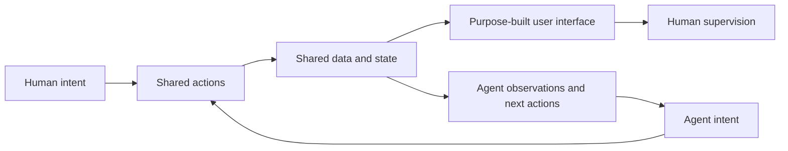

[[Vocabulary/Agentic AI|Agentic AI]]
[[Vocabulary/AI Native Applications|AI Native Applications]]

# Defining and Describing Agent Native

- 

_Agent Native means designing software for an AI agent to operate the product—not merely adding an AI feature to software designed for human clicking._ [^4uery4] [^33yiab]

Agent-native software treats the agent as the primary operator while the human supervises. [^4uery4] [^33yiab] In a broader architectural sense, it gives humans and agents access to the same product through shared actions, data, permissions, and context. [^hbdnh1] The concept applies when software must support delegation, autonomous execution, and human review within one coherent workspace. [^4uery4] [^hbdnh1] Its importance lies in avoiding a split architecture in which the user interface and the agent have different capabilities or inconsistent state. [^p0l36m] [^r0hqq8]

# Uses in Context

- **Product architecture:** “Agent-native applications” are described as software in which humans and AI agents operate the same product through shared actions, data, permissions, and context. [^hbdnh1]
- **User-experience design:** The term distinguishes an agent-led product from a conventional human interface with AI features added afterward; the agent is the “primary operator” and the human supervises. [^4uery4] [^33yiab]
- **Application frameworks:** Builder.io uses Agent-Native to describe an open-source TypeScript framework in which each capability is defined once as an action that both an agent and the UI can call. [^p0l36m] [^r0hqq8]
- **Service businesses:** The term is used for platforms built on the assumption that an AI agent, rather than a human clicking through a screen, is the primary operator. [^i92h8s]
- **Enterprise automation:** Agent-native systems can combine persistent skills, memory, permissions, scheduled automations, and multi-agent delegation in a shared workspace. [^b7ehh4] [^mztmc5]
- **Software engineering:** The related idea of AI-created software shifts engineering work toward specifying and managing “intent and constraints” that guide autonomous agents. [^ge4r4r]

# History of Use

## Origins

The available evidence does not establish a single original inventor or an uncontested first publication for “Agent Native.” The term appears to have developed through several overlapping communities: independent practitioners, startups, open-source developers, and later industry analysts. [^33yiab]

- A 2026 account identifies Gartner’s February 2025 report, *Innovation Insight: Agent-Native I&O*, as an early institutional use, while also noting that a16z used “agent-native architecture” in a March 2025 discussion of MCP. [^33yiab]
- Builder.io subsequently used the term for an open-source framework that makes humans and agents “two ways of operating the same product,” rather than separate front ends. [^p0l36m] [^hbdnh1]
- The strongest architectural formulation in the available sources is therefore not a claim of exclusive ownership, but a convergence around shared actions, shared state, and agent-first operation. [^33yiab] [^p0l36m] [^hbdnh1]

## Evolution

- **2025 — Analyst and infrastructure vocabulary:** Gartner applied “agent-native” to infrastructure and operations, while venture and developer discussions extended it to architecture and protocols such as MCP. [^33yiab]
- **2026 — Open-source implementation:** Builder.io’s Agent-Native framework operationalized the concept with shared actions, shared data, permissions, authentication, skills, memory, automations, and agent teams. [^p0l36m] [^r0hqq8] [^b7ehh4]
- **2026 — Broader product category:** Independent projects began applying the label to mail, calendars, content, slides, analytics, forms, asset libraries, and company knowledge systems. [^ehsl24]

# Best Real-World Examples

- [BuilderIO/agent-native](https://github.com/BuilderIO/agent-native) — open-source TypeScript framework in which agents and interfaces use the same actions and data. [^p0l36m] [^r0hqq8]
- [Agent-Native framework examples](https://sourceforge.net/projects/agent-native.mirror/) — implementations spanning meetings, design, slides, analytics, calendars, mail, media, content, and planning. [^b7ehh4]
- [QueTea333/agent-native](https://github.com/QueTea333/agent-native) — an open-source suite applying the model to mail, calendars, documents, slides, video, analytics, forms, company memory, and asset management. [^ehsl24]
- [Tessl](https://www.gv.com/news/guy-podjarny-interview-tessl-ai-software-development) — startup-oriented example of software development organized around autonomous agents guided by explicit intent and constraints. [^ge4r4r]
- [Factory](https://www.antoinebuteau.com/lessons-from-matan-grinberg/) — AI lab building autonomous software-engineering agents called “Droids,” illustrating agent-first execution in development workflows. [^wh46bl]
- [Toolformer](https://github.com/aloth/awesome-ai-agents) — research example of language models learning to use tools autonomously, an important technical precursor to agent-operated software. [^gff1om]
- [MetaGPT](https://github.com/aloth/awesome-ai-agents) — multi-agent collaboration system that models specialized roles and coordination, illustrating the expansion from single agents to agent organizations. [^gff1om]

# Case Studies

**Builder.io’s Agent-Native framework.** Builder.io presents Agent-Native as an open-source TypeScript framework for applications that pair autonomous work with a purpose-built interface. [^p0l36m] Its central design decision is to define each capability once as an action: the agent invokes the action as a tool, while the UI invokes the same action from code. [^p0l36m] [^r0hqq8] The framework also gives both sides shared validation, permissions, implementation, data, and application state. [^r0hqq8] This changes the product model from “an interface with an assistant” to a single system with two operating modes—delegation by the agent and direct manipulation by the human. [^hbdnh1] The case demonstrates that agent-native design is principally an architectural discipline, not a conversational interface layered onto an existing application.

**QueTea333’s application suite.** An independent open-source project applies the agent-native pattern across familiar software categories, including mail, calendars, content, presentations, video, analytics, forms, company memory, and digital assets. [^ehsl24] Its description emphasizes that agent and UI share one database and one state, so changes from either side appear immediately in the other. [^ehsl24] The project also describes context-aware interaction, user-specific skills and memory, sub-agents, and MCP servers. [^ehsl24] What changed was the unit of product design: instead of embedding a general chatbot inside separate applications, each application is rebuilt around agent access to its underlying workflows and data. The example shows how the concept can be used by small or independent teams to reimagine mature categories without reproducing every human-driven navigation path.

**Tessl and agent-oriented software development.** Tessl, led by CEO Guy Podjarny, is described as building a foundational layer for software created and maintained in partnership with autonomous agents. [^ge4r4r] Its approach places “intent and constraints” at the center of engineering work, rather than treating code authoring as the sole primary activity. [^ge4r4r] In this model, engineers guide agents that generate and evolve software while maintaining the conditions that make the resulting system correct and useful. [^ge4r4r] The case extends Agent Native beyond end-user applications: the same principle applies when the primary producer or operator of a workflow is an agent and human expertise is expressed through goals, constraints, review, and supervision.

***

# Sources

[^4uery4]: [Agent-Native vs Agentic vs AI-Native: The Difference (2026)](https://www.shiplight.ai/blog/agent-native-vs-agentic-vs-ai-native)
[^33yiab]: [What Is Agent-Native? Definition and Competing Meanings (2026)](https://www.shiplight.ai/blog/what-is-agent-native)
[^p0l36m]: [BuilderIO/agent-native: A framework for building agentic apps - GitHub](https://github.com/BuilderIO/agent-native)
[^r0hqq8]: [README.md](https://github.com/BuilderIO/agent-native/blob/main/README.md)
[5]: [agent-native · GitHub Topics · GitHub](https://github.com/topics/agent-native)
[^ge4r4r]: [Remaking Software Development for the AI Era with Tessl](https://www.gv.com/news/guy-podjarny-interview-tessl-ai-software-development)
[^b7ehh4]: [Agent-Native](https://sourceforge.net/projects/agent-native.mirror/)
[^ehsl24]: [agent-native/README.md at main · QueTea333/agent-native · GitHub](https://github.com/QueTea333/agent-native/blob/main/README.md)
[^gff1om]: [aloth/awesome-ai-agents](https://github.com/aloth/awesome-ai-agents)
[^wh46bl]: [Lessons from Matan Grinberg](https://www.antoinebuteau.com/lessons-from-matan-grinberg/)
[^hbdnh1]: [What Agent-Native Looks Like...](https://www.builder.io/blog/agent-native-architecture)
[^mztmc5]: [agent-native:基于 SQL 与 Nitro 的代理应用开发框架项目 - AtomGit ...](https://gitcode.com/GitHub_Trending/ag/agent-native)
[13]: [Shared State And Reactive...](https://dev.to/terminalchai/agent-native-builderios-framework-for-building-true-agentic-apps-13mm)
[14]: [Awesome Agent Frameworks - GitHub](https://github.com/alexbevi/awesome-agent-frameworks)
[^i92h8s]: [What Does Agent-Native Actually Mean for a Service Company?](https://butterbase.ai/blog/what-does-agent-native-mean)
