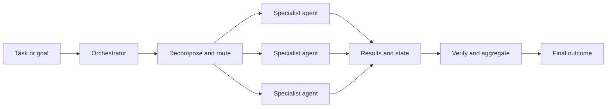

---
tags:
  - Agent-Orchestration
  - Agentic-AI
  - Agentic-Employees
  - Agentic-Engineering
  - Agentic-Workflow-Engines
  - Agentic-Workforce-Platforms
date_created: 2025-05-25
date_modified: 2026-10-07
site_uuid: d5736a9a-19c0-4388-9fa0-d60d8f164161
publish: true
title: Agent Orchestration
slug: agent-orchestration
at_semantic_version: 0.0.0.1
cf_last_run: 2026-10-07T04:26:02.048Z
cf_last_run_model: Perplexity sonar-pro
for_clients:
  - Laerdal
  - Param
---

[[Tooling/AI-Toolkit/AI Programming Frameworks/LangChain|LangChain]]
[[Tooling/AI-Toolkit/AI Programming Frameworks/LangGraph|LangGraph]]

# Defining and Describing Agent Orchestration

- 

_Agent orchestration turns a collection of AI agents into a coordinated system rather than a set of isolated assistants._

Agent orchestration is the design and execution of workflows in which one or more AI agents receive tasks, use tools or other agents, exchange state or messages, and produce a coordinated result. Common orchestration mechanisms include graph-based routing, sequential pipelines, hierarchical delegation, supervisor–worker systems, and peer-to-peer handoffs. [^xe9g4h] [^59xn2b] [^xprxb0] The concept applies when a task is too complex, long-running, specialized, or stateful for a single agent to complete reliably; orchestration supplies the control logic for decomposition, routing, retries, persistence, aggregation, and verification. [^xe9g4h] [^i8tvnh] Its importance lies in making agentic systems more controllable and composable, although additional agents also introduce coordination overhead, error propagation, and observability requirements. [^xe9g4h] [^i8tvnh]

# Uses in Context

- In software engineering, “orchestration runtime” refers to the execution layer responsible for graphs, events, branches, retries, checkpoints, and long-running workflows. [^xe9g4h]
- In multi-agent systems, orchestration describes assigning distinct roles—such as research, analysis, and execution—to agents that collaborate on a shared task. [^59xn2b]
- In graph-based systems, developers model agents as nodes, state transitions as edges, and conditional logic as routing rules. [^2q12mn] [^t5afyg]
- In role-based systems, orchestration means defining agents with roles, goals, backstories, and tools, then assigning them tasks within a sequential or hierarchical process. [^t5afyg] [^f2zx9f]
- In conversational systems, orchestration can mean asynchronous message exchange in which agents communicate until they converge on a result. [^2q12mn] [^54lh6c]
- In enterprise discussions, the term commonly conveys a control layer that coordinates autonomous agents across systems and domains rather than merely invoking a single language model. [^59xn2b]

# History of Use

## Origins

- The modern technical idea descends from **[[Vocabulary/Multi-Agent Automation|Multi-Agent Systems]]**, distributed-artificial-intelligence research, and market-based task allocation. Reid Smith’s [[Contract Net Protocol]], published in 1980 and based on his 1978 Stanford dissertation, described distributed nodes announcing tasks, bidding for them, and awarding contracts to one another. [^aw6gs9]
- The phrase **agent orchestration** is newer than the underlying research tradition. Current usage generally applies orchestration to the coordination layer that decomposes work, delegates subtasks, manages communication, and aggregates results across autonomous agents. [^w37qyi] [^59xn2b]
- In contemporary generative-AI engineering, orchestration became a practical framework concern as developers began combining language models with tools, memory, persistent state, routing, and multiple specialized agents. [^xe9g4h] [^7p97mk] [^i8tvnh]

## Evolution

- **1980 — Distributed task allocation:** The Contract Net Protocol formalized a manager–contractor pattern in which distributed nodes announce, bid on, and award tasks. [^aw6gs9]
- **2023–2024 — Conversational multi-agent frameworks:** AutoGen popularized agent collaboration through message-based conversations, while role-based systems such as CrewAI framed collaboration as teams of specialized agents working through assigned tasks. [^2q12mn] [^xprxb0] [^f2zx9f]
- **2024–2026 — Stateful workflow orchestration:** Graph-oriented systems such as LangGraph expanded the concept toward explicit state, conditional edges, persistence, loops, checkpoints, and long-running execution rather than only agent-to-agent conversation. [^xe9g4h] [^t5afyg] [^ldg4ap]

# Best Real-World Examples

- [LangGraph](https://www.langchain.com/langgraph) — a low-level orchestration runtime for stateful, long-running agents with graph nodes, edges, persistence, and cyclic reasoning. [^xe9g4h] [^ldg4ap]
- [CrewAI](https://www.crewai.com/) — a role-based multi-agent framework in which agents with defined roles, goals, and tools collaborate through sequential or hierarchical processes. [^t5afyg] [^f2zx9f]
- [AutoGen](https://github.com/microsoft/autogen) — an event-driven, conversational multi-agent framework that coordinates agents through messages and group-chat patterns. [^2q12mn] [^54lh6c] [^i8tvnh]
- [LlamaIndex Workflows](https://www.llamaindex.ai/) — a workflow approach for event-driven agent coordination, including routing and handoffs between agents. [^xe9g4h] [^xprxb0]
- [OpenAI Agents SDK](https://openai.github.io/openai-agents-python/) — an example of handoff-based orchestration in which one agent can transfer control to another specialized agent. [^xprxb0]
- [MetaGPT](https://github.com/geekan/MetaGPT) — a software-production example that uses role specialization and structured process pipelines to coordinate multiple agents. [^xprxb0]
- [Framework-Agnostic Agent Orchestration](https://github.com/AxmeAI/framework-agnostic-agent-orchestration) — an open-source effort aimed at routing across different agent frameworks rather than binding orchestration to one runtime. [^o6u6xk]

# Case Studies

**[[Tooling/AI-Toolkit/AI Programming Frameworks/LangGraph|LangGraph]] and stateful agent workflows.** LangGraph represents a shift from loosely defined agent conversations toward explicit workflow control. Its orchestration model treats agents or operations as graph nodes, state as information carried through the workflow, and edges as transitions that may be conditional or cyclic. [^xe9g4h] [^t5afyg] This makes it suitable for long-running systems that require persistence, retries, checkpoints, and human intervention rather than a single prompt-response cycle. [^xe9g4h] [^ldg4ap] The case shows that agent orchestration is not synonymous with “many agents”: a single stateful agent can also require orchestration when its execution involves loops, tools, branching, and durable state. [^xe9g4h] [^ldg4ap]

**[[Tooling/AI-Toolkit/Agentic AI/Agentic Workspaces/Crew AI|Crew AI]] and role-based collaboration.** CrewAI organizes work around a “crew” metaphor: developers assign agents roles, goals, backstories, and tools, then connect them through tasks and process types such as sequential and hierarchical execution. [^t5afyg] [^f2zx9f] This structure is useful when a problem can be decomposed into recognizable specialties—for example, research, analysis, drafting, and review—because the workflow makes delegation and responsibility visible. [^59xn2b] [^t5afyg] The case illustrates a startup-style, developer-oriented path to orchestration in which the central abstraction is not a general-purpose enterprise scheduler but a team of cooperating specialists. [^t5afyg] [^f2zx9f]

**[[Tooling/AI-Toolkit/Agentic AI/AutoGen|AutoGen]] and conversational coordination.** AutoGen frames orchestration as interaction among agents through messages, with event-driven communication and conversation loops used to complete complex tasks. [^2q12mn] [^54lh6c] [^i8tvnh] Group-chat patterns can select the next speaker dynamically, allowing agents to contribute according to the evolving context instead of following only a fixed pipeline. [^xprxb0] This approach demonstrates both the flexibility and the risk of conversational orchestration: dynamic delegation can support complex collaboration, but it requires controls for termination, speaker selection, shared context, and result quality. [^xprxb0] [^i8tvnh]

***

# Sources

[^xe9g4h]: [AI agent frameworks compared: LangGraph, CrewAI, AutoGen, and ...](https://arize.com/guides/ai-agent-handbook/agent-frameworks/)
[^w37qyi]: [Multi-Agent Orchestration - skills](https://github.com/qodex-ai/ai-agent-skills/blob/main/skills/multi-agent-orchestration/SKILL.md)
[^59xn2b]: [aimultiple.com › agentic-orchestrationTop 10+ Agentic Orchestration Frameworks & Tools](https://aimultiple.com/agentic-orchestration)
[^2q12mn]: [LangGraph vs CrewAI vs AutoGen: Which AI Agent Framework Should You Use in 2026?](https://dev.to/pratikpathak/langgraph-vs-crewai-vs-autogen-which-ai-agent-framework-should-you-use-in-2026-12h4)
[^o6u6xk]: [Framework-Agnostic Agent Orchestration - GitHub](https://github.com/AxmeAI/framework-agnostic-agent-orchestration)
[^t5afyg]: [Faq](https://airbyte.com/agentic-data/best-ai-agent-frameworks)
[^54lh6c]: [PydanticAI](https://fme.safe.com/guides/ai-agent-architecture/langgraph-alternatives/)
[^7p97mk]: [Best AI Agent Harness Tools and Frameworks 2026](https://atlan.com/know/best-ai-agent-harness-tools-2026/)
[^xprxb0]: [Best Multi-Agent Frameworks in 2026](https://resources.rework.com/tools/ai-agents/best-multi-agent-frameworks-2026)
[10]: [LangGraph vs CrewAI vs AutoGen: The Complete Multi ...](https://dev.to/pockit_tools/langgraph-vs-crewai-vs-autogen-the-complete-multi-agent-ai-orchestration-guide-for-2026-2d63)
[^i8tvnh]: [Choosing the Right AI Agent Framework: A Comprehensive Guide](https://www.getmaxim.ai/blog/choosing-the-right-ai-agent-framework-a-comprehensive-guide/)
[12]: [3. Autogen](https://dev.to/dextralabs/top-10-agentic-ai-frameworks-compared-langgraph-vs-crewai-vs-autogen-vs-benchmarks-inside-1d6g)
[^f2zx9f]: [Best AI agent frameworks (2026)](https://www.dataiku.com/blog/ai-agent-frameworks)
[^ldg4ap]: [The best AI agent frameworks in 2026 - LangChain](https://www.langchain.com/resources/ai-agent-frameworks)
[^aw6gs9]: [Multi-agent system, defined without the hype | Gil Allouche](https://gilallouche.com/writing/multi-agent-system-defined-without-the-hype/)
