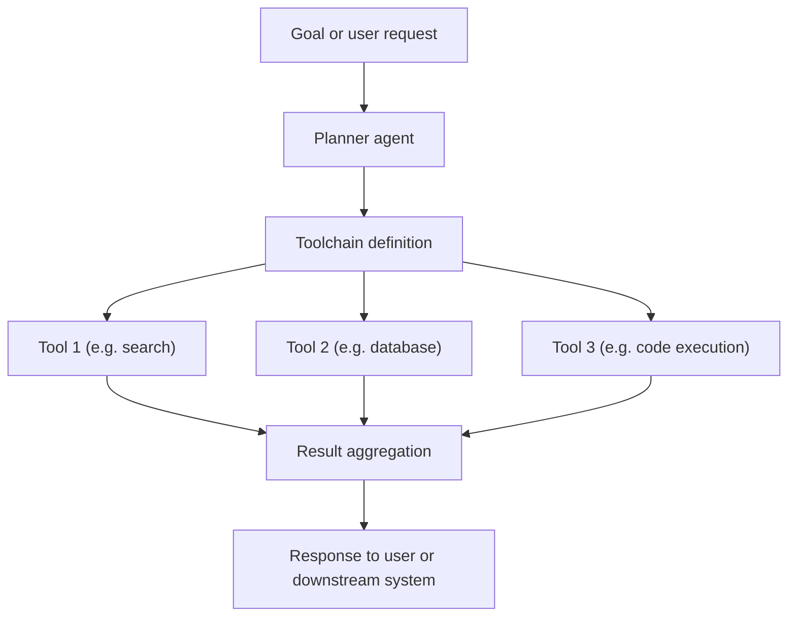

---
aliases:
  - agent toolchains
  - agent toolchain
  - Agent Toolchain
date_created: 2025-09-20
date_modified: 2026-06-22
tags:
  - Agentic-AI
  - State-Of-The-Art-Practices
  - Enterprise-AI
  - Lossless-Thinking
cf_last_run: 2026-06-22T19:43:17.021Z
cf_last_run_model: Perplexity sonar-pro
for_clients:
  - Laerdal
  - Param
  - FullStackVC
site_uuid: b396d7dd-479c-47da-bff2-fdc11d7afeb2
publish: true
title: Agent Toolchains
slug: agent-toolchains
at_semantic_version: 0.0.1.1
---
[[Tooling/AI-Toolkit/AI Programming Frameworks/Composio|Composio]]
[[Tooling/AI-Toolkit/AI Programming Frameworks/LangChain|LangChain]]
[[concepts/Explainers for AI/Model Context Protocol|Model Context Protocol]]

_“Agent toolchains” are the deliberate wiring together of multiple tools, services, and sometimes multiple agents so an AI agent can execute multi‑step goals reliably, repeatably, and at scale._

In an agentic‑AI setting, a **toolchain** is the structured sequence or graph of tools (APIs, databases, external services, code execution, search, etc.) that an agent can call—often learned, orchestrated, or inferred rather than hard‑coded. [^l4tzd5] This matters because modern AI agents are valuable less for isolated prompts and more for how they *compose tools into workflows* that solve real tasks end‑to‑end (for example in software engineering, customer support, or data processing), and many recent frameworks, research papers, and products are converging on “agent toolchains” as a core abstraction. [^twv43w] [^l4tzd5] [^5yqytr] [^zc90hl]  

---

# Defining and Describing Agent Toolchains

**Working definition**

- In contemporary agentic‑AI research and practice, an **agent toolchain** is a *reusable sequence or graph of tool invocations* that an AI agent uses to complete a class of tasks, often discovered or optimized through schema‑guided reasoning or multi‑agent coordination. [^l4tzd5] [^5yqytr] [^zc90hl] 
- A 2026 multi‑agent framework paper describes agents that “*explore a few sampled entities to infer reusable toolchains and generalize them to all remaining entities*,” emphasizing that toolchains are patterns of tool use that can be applied repeatedly across similar problems. [^l4tzd5] 
- In agentic software engineering, LangChain characterizes modern systems as **“swarms of AI agents”** that coordinate and call tools and services rather than functioning as a single monolithic model, effectively turning software processes into interacting toolchains of agents and utilities. [^5yqytr] 
- Agent frameworks such as those surveyed by Botpress highlight that they provide reusable logic, orchestration, and collaboration “to make better AI agents faster,” which in practice means giving developers a structured way to define and manage the set of tools, memory, and workflows an agent can use—i.e., its toolchain. [^zc90hl] 

**What agent toolchains are *not***

- They are not just a single API call like *“call search then show result”*; they usually encode **multi‑step reasoning and action** across heterogeneous tools, often with branching, retries, and statefulness. [^twv43w] [^l4tzd5] [^5yqytr] 
- They are distinct from generic “pipelines” in that the **agent decides which tools in the chain to use and in what order**, guided by goals and context, instead of fixed, purely deterministic flowcharts. [^twv43w] [^5yqytr] 

**Where the concept applies**

- Agent toolchains are most relevant in **agentic‑AI systems** where LLM‑based or symbolic agents have autonomy to choose tools—such as enterprise automation, AI‑assisted software engineering, data analysis, and operations runbooks. [^twv43w] [^5yqytr] [^l7ndax] [^zc90hl] 
- They are also an important abstraction in research on **schema‑guided reasoning**, where agents infer reusable tool use patterns (toolchains) that can be generalized to new entities or tasks. [^l4tzd5] 

---

# Uses in Context

- A schema‑guided multi‑agent framework on ScienceDirect explicitly discusses agents that “*infer reusable toolchains and generalize them to all remaining entities*,” using the term to denote structured, repeatable sequences of tool calls that can be applied across many similar instances in a dataset or domain. [^l4tzd5] 
- In the same work, “toolchains” are described as **inferred** by exploration over “a few sampled entities,” indicating a use of the term for *learned* patterns of tool use rather than hand‑designed flows. [^l4tzd5] 
- Agentic software‑engineering discussions (for example by LangChain) frame modern development as using **coordinated agents** that call tools and services in concert, where each agent has access to specific tools and contributes part of a larger workflow—effectively toolchains spanning multiple agents. [^5yqytr] 
- AI agent frameworks surveyed by Botpress emphasize reusable logic, orchestration, and collaboration for agents, describing frameworks as a way to “allow for faster deployment, reusable logic, and easier collaboration,” which in practice means giving developers a way to define and reuse agent toolchains across applications. [^zc90hl] 
- Enterprise “agentic AI” tools lists (e.g., Moveworks’ overview of “top agentic AI tools for business”) describe platforms that combine LLM agents with integrations into ticketing systems, HR, IT, and knowledge bases, implicitly selling pre‑built **toolchains** for common enterprise workflows such as employee support and IT operations. [^l7ndax] 

---

# History of Use

## Origins

- The *specific* phrase **“agent toolchains”** is not yet a standard named construct in classic AI literature; instead, the notion emerges from earlier work on **tool‑augmented agents** and **multi‑step tool use** in LLMs, then gets named more explicitly in recent multi‑agent and schema‑guided reasoning research. [^l4tzd5] [^5yqytr] [^zc90hl] 
- A 2026 ScienceDirect paper on a *“Multi‑agent framework for schema‑guided reasoning and tool …”* appears to be among the earliest scholarly uses where agents “infer reusable toolchains,” explicitly elevating **toolchains** as a primary object of reasoning and generalization. [^l4tzd5] 
- Around the same period, practitioner communities around LLM agents and frameworks (e.g., LangChain and open‑source agent frameworks cataloged by Botpress) popularize the idea of **structured, reusable sequences of tool calls** as a central design concern, even when not always using the exact label “agent toolchain.”[^5yqytr] [^zc90hl] 

## Evolution

- **2023–2024 – Tool‑augmented LLM agents.** Early “tools + LLM” systems (call‑an‑API, run‑code, browse‑the‑web) evolve into frameworks where agents choose among many tools; this marks the shift from single‑tool usage to *implicit* toolchains, even if the term is not always used. [^5yqytr] [^zc90hl] 
- **2024–2025 – Multi‑agent and schema‑guided reasoning.** Research on multi‑agent frameworks shows agents exploring entities to “infer reusable toolchains,” explicitly recognizing that discovering and reusing tool use patterns is a key capability and formalizing the term in a research context. [^l4tzd5] 
- **2025–2026 – Frameworks and engineering practices.** Agent frameworks and engineering guides (e.g., surveys of “top agent frameworks”) describe patterns for orchestrating tools, memory, and collaboration for agents, effectively turning “agent toolchains” into a design and implementation concern for real‑world systems rather than just a research idea. [^5yqytr] [^zc90hl] 

---

# Best Real-World Examples

- [Multi‑agent schema‑guided reasoning framework](https://www.sciencedirect.com/science/article/pii/S0926580526001299) – research system where agents “infer reusable toolchains” from sampled entities and generalize them, directly exemplifying the agent toolchain concept in scientific work. [^l4tzd5] 
- [Botpress survey of AI agent frameworks](https://botpress.com/blog/ai-agent-frameworks) – comparative overview of seven free frameworks that help developers define agent tools, memory, and workflows, effectively providing infrastructure for building and managing agent toolchains. [^zc90hl] 
- [LangChain agentic engineering guidance](https://www.langchain.com/blog/agentic-engineering-redefining-software-engineering) – describes software engineering with “swarms of AI agents” coordinating via tools and services, using chains of tool calls across multiple agents to mirror real‑world teams. [^5yqytr] 
- [Moveworks agentic AI platform](https://www.moveworks.com/us/en/resources/blog/agentic-ai-tools-for-business) – enterprise product that offers agentic AI tools integrated into IT, HR, and other systems, providing pre‑built agent workflows that amount to domain‑specific toolchains for employee support and operations. [^l7ndax] 
- [Cloudflare Project Think / Agents SDK](https://blog.cloudflare.com/project-think) – [[Tooling/Software Development/Cloud Infrastructure/Cloudflare|Cloudflare]] – gives each agent identity, persistent state, and sub‑agents, letting developers compose long‑running, multi‑tool workflows on Cloudflare infrastructure, i.e., highly stateful agent toolchains at the edge. [^twv43w] 
- [Harness Worker Agents](https://developer.harness.io/docs/platform/harness-ai/harness-agents) – [[concepts/Continuous Integration and Continuous Delivery|CI/CD]] platform feature where “Worker Agents are AI‑powered automation units that execute tasks inside Harness pipelines,” effectively embedding agents with defined tools into existing DevOps toolchains. [^60ynye] 

---

# Case Studies

**1. Schema‑guided agents inferring reusable toolchains**

A 2026 ScienceDirect paper presents a **multi‑agent framework for schema‑guided reasoning and tool use** in which agents do not rely solely on hand‑crafted workflows, but instead “explore a few sampled entities to infer reusable toolchains and generalize them to all remaining entities.”[^l4tzd5] In this setup, the agents probe a subset of entities (for example, objects in a dataset or tasks in a domain) to discover efficient sequences of tool calls that solve the problem, and then apply those discovered toolchains broadly, significantly improving scalability and efficiency. [^l4tzd5] This case shows that agent toolchains can be *learned artifacts*—patterns of tool use that emerge from exploration—rather than static flows, and that formalizing them enables generalization across large, heterogeneous collections of tasks. [^l4tzd5] 

**2. Agent frameworks as toolchain infrastructure**

[[Botpress]]’ 2026 overview of “Top 7 Free AI Agent Frameworks” argues that “AI agent frameworks are a shortcut to making better AI agents faster,” because they support “faster deployment, reusable logic, and easier collaboration.”[^zc90hl] Concretely, these frameworks provide abstractions for defining tools (APIs, functions, external services), agent roles, memory, and orchestration logic so that developers can compose and reuse complex sequences of actions without rebuilding them from scratch each time. [^zc90hl] This effectively turns **agent toolchains** into first‑class engineering artifacts: teams can define, version, and share toolchains across projects, with the framework handling routing, error handling, and state, illustrating how the concept moves from research into practical software architecture. [^zc90hl] 

**3. Enterprise agentic AI products embedding toolchains**

[[Tooling/AI-Toolkit/Knowledge AI/MoveWorks|MoveWorks]]’ guide to “10 Top Agentic AI Tools Transforming Enterprise Businesses” describes platforms that integrate LLM agents with enterprise systems like IT ticketing, HR, and knowledge management to “streamline workflows and boost efficiency.”[^l7ndax] These products typically embed pre‑configured sequences where an agent receives a request (such as an IT issue), queries multiple internal systems, updates records, and communicates back to the user, all via integrated tools and APIs. [^l7ndax] Although the marketing copy speaks in terms of “agentic AI tools,” the underlying reality is that each offering packages **domain‑specific agent toolchains** for common enterprise processes, showing how the concept becomes a marketable capability: pre‑built chains of agent actions over existing business tools. [^l7ndax] 

***

# Sources

[1]: [Agent Authentication - Aembit](https://aembit.io/glossary/agent-authentication/)
[^60ynye]: [Worker Agents | Harness Developer Hub](https://developer.harness.io/docs/platform/harness-ai/harness-agents)
[^twv43w]: [Project Think: building the next generation of AI agents on Cloudflare](https://blog.cloudflare.com/project-think/)
[^l4tzd5]: [Multi-agent framework for schema-guided reasoning and tool ...](https://www.sciencedirect.com/science/article/pii/S0926580526001299)
[^5yqytr]: [How Swarms of AI Agents Are Redefining Software Engineering](https://www.langchain.com/blog/agentic-engineering-redefining-software-engineering)
[6]: [AI Agent Development Services | Agentic AI Company](https://www.coherentsolutions.com/artificial-intelligence/agentic-ai)
[7]: [The Agentic AI wave is here. Is your infrastructure ready? 79% of IT ...](https://www.facebook.com/googlecloud/posts/the-agentic-ai-wave-is-here-is-your-infrastructure-ready79-of-it-leaders-are-ado/1268759272068064/)
[^l7ndax]: [10 Top Agentic AI Tools Transforming Enterprise Businesses](https://www.moveworks.com/us/en/resources/blog/agentic-ai-tools-for-business)
[^zc90hl]: [Top 7 Free AI Agent Frameworks [2026] - Botpress](https://botpress.com/blog/ai-agent-frameworks)
