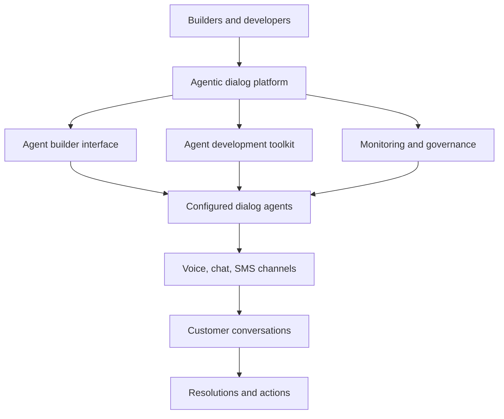

---
aliases:
  - Agentic Dialog Platform
date_created: 2026-06-03
date_modified: 2026-06-09
cf_last_run: 2026-06-09T01:23:07.962Z
cf_last_run_model: Perplexity sonar-pro
site_uuid: e6121f7f-5a0d-4c00-b30b-cce64ee0453d
publish: true
title: Agentic Dialog Platforms
slug: agentic-dialog-platforms
at_semantic_version: 0.0.1.1
tags:
  - Agentic-AI
  - Agentic-Call-Centers
  - Helpdesk-AI
  - Explainers
  - Customer-Success-AI
  - Customer-Experience
---

_An agentic dialog platform is a conversational AI environment where dialog agents are built, run, and governed so they can autonomously handle complex, multi‑turn customer interactions rather than just respond to single queries. [^efx630] [^djkwy5] [^syr6ds]_

In practice, **Agentic Dialog Platforms** are full‑stack systems for creating and operating “agentic” voice and chat experiences—agents that can maintain context, follow business rules, take actions, and resolve customer issues across channels at production scale. [^efx630] [^djkwy5] [^syr6ds] They matter because they move organizations beyond simple chatbots toward autonomous, voice‑first, enterprise‑grade agents that can handle high call volumes, reduce human workload, and deliver consistent service in many languages and markets. [^efx630] [^djkwy5] [^9fu2j7] The term is currently used most prominently by PolyAI, which positions itself as “the Agentic Dialog Platform for building the conversational enterprise,” but it also reflects a broader industry push toward *agentic AI* that can initiate, manage, and complete customer conversations proactively. [^syr6ds] [^9fu2j7]

# Defining and Describing Agentic Dialog Platforms

An **Agentic Dialog Platform** is a type of **conversational AI platform** designed to build, run, govern, and improve dialog agents that can autonomously manage complex customer conversations at enterprise scale. [^efx630] [^djkwy5] [^syr6ds] [^w2qlj1] PolyAI describes its offering as “the Agentic Dialog Platform for building the conversational enterprise, used to build, run, govern, and improve dialog agents at scale.”[^syr6ds] Like other conversational AI platforms, it provides a software environment to **build, deploy, and manage AI‑driven conversational experiences**, but it emphasizes *agentic* behavior—agents that can maintain context, apply policies, and drive conversations to resolution with minimal human intervention. [^efx630] [^syr6ds] [^w2qlj1] [^9fu2j7]

Key characteristics drawn from current usage:

- **Enterprise‑grade conversational AI infrastructure**: PolyAI’s platform exposes “the same conversational AI infrastructure used by hundreds of global enterprises” to outside builders. [^efx630] [^djkwy5] This includes production‑ready deployment, monitoring, analytics, and controls for large‑scale contact centers. [^djkwy5] [^syr6ds]
- **Autonomous, context‑aware dialog agents**: The platform is “designed for complex enterprise conversations such as medical appointment screenings, gas leak inquiries, and payment authorization issues, where conversational AI systems must maintain context and deliver resolutions without relying heavily on human intervention.”[^efx630]
- **Voice‑first, omnichannel support**: PolyAI provides “voice‑first, omnichannel virtual agents across voice, chat and SMS,” aligning with the platform’s role as the backbone for phone, chat, and messaging conversations. [^djkwy5]
- **Self‑serve builder experience**: The Agentic Dialog Platform is “opened to all builders,” allowing “any team with an email address” to create “production‑ready dialog agents in under 10 minutes.”[^efx630] [^djkwy5] Builders can either describe their use case in natural language or use a developer‑oriented toolkit. [^0jnmlh]
- **Global, multilingual reach**: The same platform currently powers customer conversations “across 75 languages and 25 countries” for brands like Marriott International, Foot Locker, PG&E, Caesars Entertainment, UniCredit, and FedEx. [^efx630] [^djkwy5]
- **Agentic AI principles**: In the broader sense, *agentic AI* refers to AI that can monitor user behavior, detect friction, and “initiate a conversation with helpful suggestions” rather than waiting passively for tickets. [^9fu2j7] An agentic dialog platform is an environment where such proactive, task‑oriented agents can be designed and governed.

# Uses in Context

- Media coverage notes that PolyAI “announced it is opening its **Agentic Dialog Platform** to all builders, giving developers and enterprise teams access to the same conversational AI infrastructure used by hundreds of global enterprises.”[^efx630]
- CMSWire describes that “PolyAI on May 18 opened its **Agentic Dialog Platform** to the public, making enterprise‑grade conversational AI available to any team with an email address,” emphasizing the platform as a self‑serve environment for dialog agents. [^djkwy5]
- PolyAI’s press release positions the company as “**the Agentic Dialog Platform for building the conversational enterprise**, used to build, run, govern, and improve dialog agents at scale,” invoking the term as an identity for a class of enterprise platforms. [^syr6ds]
- The platform is described as being “designed for complex enterprise conversations such as medical appointment screenings, gas leak inquiries, and payment authorization issues,” using the term to signal capability for high‑stakes, transactional dialog. [^efx630]
- In the broader conversational AI discourse, QuickBlox explains that “agentic AI” in customer conversations can “monitor customer behavior, detect friction points, and initiate a conversation with helpful suggestions,” providing conceptual grounding for the “agentic” part of Agentic Dialog Platforms. [^9fu2j7]
- Grid Dynamics defines a **conversational AI platform** as “the software environment that organizations use to build, deploy, and manage AI‑driven conversational experiences,” which is the broader category within which Agentic Dialog Platforms sit. [^w2qlj1]

# History of Use

## Origins

- The phrase **“Agentic Dialog Platform”** appears to be introduced and strongly branded by **PolyAI**, a UK‑based startup founded in 2017 that builds AI voice assistants for customer service. [^efx630] [^djkwy5] [^syr6ds] PolyAI’s press materials explicitly call it “the Agentic Dialog Platform for building the conversational enterprise.”[^syr6ds]
- PolyAI originally offered enterprise conversational AI as a more traditional managed service and later packaged the underlying infrastructure as a self‑serve platform that it branded as the **Agentic Dialog Platform**. [^djkwy5] [^syr6ds]
- The underlying concept builds on earlier notions of **conversational AI platforms**—software environments for building, deploying, and managing conversational experiences [^w2qlj1]—and **agentic AI** in customer support, where AI agents can act proactively and autonomously in conversations. [^9fu2j7]

Given current indexed sources, there is no evidence that a large incumbent tech company coined this specific term; it appears to originate from PolyAI’s product positioning rather than from an academic paper or big‑tech research lab. [^efx630] [^djkwy5] [^syr6ds]

## Evolution

- **2017–2023: PolyAI as an enterprise conversational AI provider**  
  PolyAI, founded in 2017, focused on “voice‑first, omnichannel virtual agents” for mid‑to‑large enterprises managing high‑volume contact centers, providing AI chatbots and virtual agents as a specialized vendor. [^djkwy5] During this period, the underlying infrastructure that would become the Agentic Dialog Platform was used mainly via enterprise engagements. [^djkwy5] [^syr6ds]
- **May 18 (year reported): Opening the Agentic Dialog Platform to all builders**  
  On May 18, PolyAI “opened its Agentic Dialog Platform to the public,” making the same infrastructure available self‑serve to “any team with an email address,” free for the first two months. [^efx630] [^djkwy5] This marked a shift from bespoke deployments to a productized, builder‑oriented platform for creating dialog agents in under 10 minutes. [^efx630] [^djkwy5]
- **Introduction of dual build modes (Poly Agent Builder and ADK)**  
  In a company video, PolyAI describes “two ways to build” on the Agentic Dialog Platform: the **Poly Agent Builder**, where users “describe your use case in natural language and it configures your agent, knowledge base, and conversation flows automatically,” and an **Agent Development Kit (ADK)** for developers to build agents using their own IDE, coding assistants, Git, and terminal‑based deployment. [^0jnmlh] This reflects the evolution toward serving both non‑technical builders and software engineers within the same platform.

# Best Real-World Examples

- [PolyAI Agentic Dialog Platform](https://pulse2.com/polyai-agentic-dialog-platform-opened-to-all-builders/) – PolyAI’s flagship platform, explicitly branded as “the Agentic Dialog Platform for building the conversational enterprise,” used to build, run, govern, and improve dialog agents at scale. [^efx630] [^syr6ds]
- [Marriott International virtual agents](https://pulse2.com/polyai-agentic-dialog-platform-opened-to-all-builders/) – Customer service dialog agents for Marriott, powered by PolyAI’s platform, handling hotel guest inquiries and reservations across multiple languages and channels. [^efx630] [^djkwy5]
- [Foot Locker customer support agents](https://pulse2.com/polyai-agentic-dialog-platform-opened-to-all-builders/) – Retail customer service agents running on the Agentic Dialog Platform to manage high‑volume inquiries about orders, returns, and store information. [^efx630] [^djkwy5]
- [PG&E (Pacific Gas and Electric) gas leak and utility support agents](https://pulse2.com/polyai-agentic-dialog-platform-opened-to-all-builders/) – Utility support conversations for scenarios like gas leak inquiries, illustrating the platform’s use in safety‑critical, complex dialogs. [^efx630]
- [Caesars Entertainment guest service agents](https://pulse2.com/polyai-agentic-dialog-platform-opened-to-all-builders/) – Hospitality and gaming customer interactions (reservations, loyalty programs) automated by dialog agents built on PolyAI’s platform. [^efx630] [^djkwy5]
- [UniCredit banking support agents](https://pulse2.com/polyai-agentic-dialog-platform-opened-to-all-builders/) – Financial services dialog agents handling account queries and customer support across countries and languages using the Agentic Dialog Platform. [^efx630] [^djkwy5]
- [FedEx logistics and shipment support agents](https://pulse2.com/polyai-agentic-dialog-platform-opened-to-all-builders/) – Shipping and logistics customer conversations (tracking, delivery issues) powered by PolyAI’s platform, demonstrating applicability in complex operational environments. [^efx630] [^djkwy5]

# Case Studies

### PolyAI’s Agentic Dialog Platform as a self‑serve product

[[Tooling/AI-Toolkit/Agentic AI/Poly AI|Poly AI]], founded in 2017 to provide AI chatbots and voice‑first virtual agents for high‑volume contact centers, initially operated primarily through enterprise engagements, deploying customized conversational AI for large brands. [^djkwy5] Over time, they abstracted their internal infrastructure—responsible for “complex conversations for hundreds of enterprises” across 75 languages and 25 countries—into a generalized platform. [^efx630] [^djkwy5] [^syr6ds] In May, PolyAI “opened its Agentic Dialog Platform to the public,” allowing any team with an email address to access the same infrastructure that powered deployments for Marriott, Foot Locker, PG&E, Caesars Entertainment, UniCredit, and FedEx, with the service free for the first two months. [^efx630] [^djkwy5] This shift illustrates how a startup that pioneered production‑grade voice agents productized its stack into what it calls an Agentic Dialog Platform, democratizing access to agentic conversational capabilities that had previously been confined to large‑budget projects. [^efx630] [^djkwy5] [^syr6ds]

### Complex enterprise conversations: PG&E gas leak and medical screenings

PolyAI describes its Agentic Dialog Platform as “designed for complex enterprise conversations such as medical appointment screenings, gas leak inquiries, and payment authorization issues,” highlighting use cases where agents must follow strict protocols, gather structured information, and route or resolve issues safely. [^efx630] For a utility such as PG&E, dialog agents built on the platform can guide callers reporting a gas leak through critical safety questions and next steps, requiring the system to maintain context, handle interruptions, and escalate appropriately without relying heavily on human intervention. [^efx630] Similarly, in medical appointment screenings, agents must collect health information, verify identities, and schedule or triage visits, again showcasing the need for agentic behavior that adheres to policies while managing sensitive, multi‑turn conversations. [^efx630] [^syr6ds] These deployments show how an Agentic Dialog Platform enables smaller service teams to stand up sophisticated, policy‑driven agents that previously would have required extensive custom engineering.

### Two build paths: Poly Agent Builder vs. Agent Development Kit

To broaden who can create agentic dialog experiences, PolyAI’s platform offers two distinct build paths. [^0jnmlh] In a product walkthrough, the company explains that **Poly Agent Builder** allows non‑technical users to “describe your use case in natural language and it configures your agent, knowledge base, and conversation flows automatically,” effectively turning natural‑language specifications into working dialog agents. [^0jnmlh] For software engineers, the **Agent Development Kit (ADK)** provides a more traditional development experience: “Developers use this to build dialog agents the same way they build everything else. Use your own IDE, a coding assistant like Claude, version with Git, deploy from your terminal.”[^0jnmlh] This dual‑track design exemplifies the agentic dialog platform concept: it is not just a runtime for agents, but an integrated environment that supports both low‑code and code‑centric creation of autonomous conversational agents, aligning with how modern teams actually build and ship software. [^0jnmlh] [^djkwy5]

***

# Sources

[^efx630]: [PolyAI: Agentic Dialog Platform Opened To All Builders - Pulse 2.0](https://pulse2.com/polyai-agentic-dialog-platform-opened-to-all-builders/)
[^0jnmlh]: [PolyAI opens Agentic Dialog Platform to every enterprise builder](https://www.youtube.com/watch?v=8TtQh5Ac--Q)
[^djkwy5]: [PolyAI Makes Enterprise Conversational AI Self-Serve - CMSWire](https://www.cmswire.com/customer-experience/polyai-makes-enterprise-conversational-ai-self-serve/)
[^syr6ds]: [PolyAI opens its Agentic Dialog Platform, making the tech behind ...](https://www.prnewswire.com/news-releases/polyai-opens-its-agentic-dialog-platform-making-the-tech-behind-complex-conversations-for-hundreds-of-enterprises-available-to-every-builder-302774666.html)
[^w2qlj1]: [Conversational AI platforms - Grid Dynamics](https://www.griddynamics.com/glossary/conversational-ai-platforms)
[^9fu2j7]: [Why Agentic AI Is the Future of Customer Conversations - QuickBlox](https://quickblox.com/blog/why-agentic-ai-is-the-future-of-customer-conversations/)
