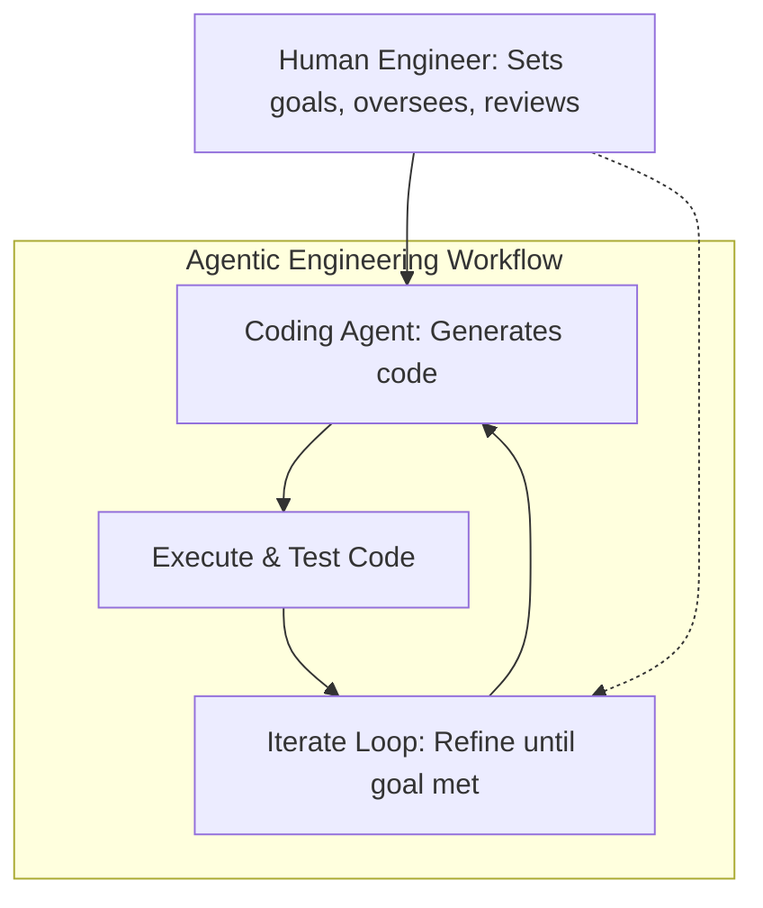

_Source: https://addyosmani.com/blog/agentic-engineering/_
# Defining and Describing Agentic Engineering

*_Agentic engineering is the practice of professional software engineers leveraging AI coding agents that autonomously generate, execute, and iterate on code to accelerate development while maintaining human oversight on architecture and quality._[^05arys] [^9jg20d]

It applies in modern software engineering workflows where AI agents, capable of both writing and running code like Claude Code or OpenAI Codex, handle implementation tasks under human direction. [^05arys] [^gn2fwy] "Code execution is the defining capability that makes agentic engineering possible," enabling agents to iterate toward working software independently of constant human prompting. [^05arys] This matters because it shifts development from manual coding to orchestrated AI collaboration, boosting productivity through reliable, testable outputs while enforcing engineering discipline like planning and relentless testing. [^9jg20d] [^39lvc5]

# Uses in Context
- In individual developer workflows, agentic engineering describes using coding agents to build software by prompting goals, then letting agents generate, execute, and loop on code until complete. [^05arys]
- "Agentic engineering is a multi-agent coordination model where AI agents act as digital team members — each with defined roles, shared memory, and a common observability layer — to move software through the full delivery pipeline."[^4kgd3g]
- It distinguishes disciplined AI-assisted development from "vibe coding," where humans architect, review, and ensure correctness while agents implement: "AI does the implementation, human owns the architecture, quality, and correctness."[^9jg20d]
- In team contexts, it refers to patterns like red/green TDD adapted for agents to produce succinct, reliable code with minimal extra prompting. [^39lvc5]
- Broader usage frames it as "professional software engineers using coding agents to improve and accelerate their work," emphasizing autonomy via code execution. [^39lvc5] [^gn2fwy]
- In production talks, it's invoked for "production-grade agent-driven software development" balancing agent speed with human-in-the-loop control for code quality and security. [^tds8ua]

# History of Use

## Origins
Simon Willison, an independent developer and creator of tools like Datasette, coined "agentic engineering" in a blog post on his weblog to describe "the practice of developing software with the assistance of coding agents" that can write and execute code. [^05arys] He introduced it in the context of tools like Claude Code, OpenAI Codex, and Gemini CLI, highlighting code execution as key to iterative, goal-driven development. [^05arys] [^gn2fwy] This indie practitioner framing counters hype around isolated AI tools, positioning it as a professional engineering discipline. [^05arys]

## Evolution

_Source: https://www.projectpro.io/article/agentic-ai-developer/1180_

- **February 2026**: Willison expands with "Agentic Engineering Patterns," a project documenting practices like test-first development for agents, formalizing it as repeatable coding methods. [^39lvc5] [^gn2fwy]
- **Early 2026**: Andrej Karpathy endorses the term, praising its description of "orchestrating AI agents... while you act as architect, reviewer, and decision-maker," making it "professionally legible" for teams and job descriptions. [^9jg20d]
- **2026**: LangChain redefines it as "swarms of AI agents" mimicking engineering teams with worker agents for tasks like debugging, showing 93% faster root-cause analysis in pilots. [^4kgd3g]

# Best Real-World Examples
- **[Claude Code](https://www.anthropic.com/claude)**: Coding agent used in agentic engineering for goal-prompted code generation and execution loops. [^05arys] [^gn2fwy]
- **[OpenAI Codex](https://openai.com/codex)**: Enables autonomous iteration by writing and running code, core to Simon Willison's patterns. [^05arys] [^39lvc5]
- **[Gemini CLI](https://deepmind.google/technologies/gemini/)**: Example agent for executing code in development workflows. [^05arys]
- **[LangChain Agentic Engineering Pilot](https://www.langchain.com/blog/agentic-engineering-redefining-software-engineering)**: Multi-agent system reduced debugging time by 93% and workflows by 65% across 512 sessions. [^4kgd3g]
- **[Simon Willison's Agentic Engineering Patterns](https://simonwillison.net/guides/agentic-engineering-patterns/what-is-agentic-engineering/)**: Open-source documentation of TDD and other patterns for agent-driven coding. [^39lvc5]
- **[Kilo Code Agents](https://www.youtube.com/watch?v=BEKc4P87XKo)**: Brendan O’Leary's production-grade agents for reliable collaboration in engineering environments. [^tds8ua]

# Case Studies

Simon Willison, an indie developer known for Datasette and LLMS, pioneered agentic engineering patterns in February 2026 by launching a dedicated project to catalog best practices for coding agents like Claude Code and OpenAI Codex. [^39lvc5] Facing the "new era of coding agent development," he documented workflows such as red/green TDD, where agents write tests first then code to pass them, yielding "more succinct and reliable code with minimal extra prompting."[^39lvc5] [^05arys] This evolved his initial definition from a 2025 blog post, emphasizing agent autonomy via code execution over turn-by-turn human guidance. [^05arys] [^gn2fwy] The result: accessible, open patterns that professionals adopt to accelerate work without sacrificing rigor, demonstrating agentic engineering's indie roots in practical tooling over corporate hype. [^39lvc5]

LangChain's 2026 pilot deployed agentic engineering as a "multi-agent coordination model" with worker agents handling development, testing, and debugging like a "loosely coupled engineering team."[^4kgd3g] In 20+ workflows, it achieved a 93% reduction in time-to-root-cause and 65% faster execution, saving 200+ hours in one month by compressing testing—not just code gen. [^4kgd3g] Unlike single-session coders like Codex, their system added a "control plane" for long-term memory and traceability across the delivery lifecycle, with coding agents nested inside workers. [^4kgd3g] This showed agentic engineering's power in structural shifts: reducing coordination overhead and redefining human roles to high-value oversight, proving small teams can outpace incumbents via swarm architectures. [^4kgd3g]

Brendan O’Leary of Kilo Code, in a 2026 talk, detailed scaling agentic engineering from "magical demos" to production, focusing on autonomy, context management, and human-in-the-loop for secure, quality code. [^tds8ua] Teams moved past "vibe coding" by designing agents as "reliable collaborators" that succeed in real environments where copilots fail. [^tds8ua] [^9jg20d] Drawing from hands-on builds, it highlighted failure modes like poor context and remedies via disciplined workflows. [^tds8ua] The change: faster development without trust erosion, exemplifying how indie devs ([[Kilo AI]] Code as emerging player) teach agent reliability, influencing broader adoption beyond big tech popularizers. [^tds8ua] [^9jg20d]

***

# Sources

[^05arys]: [What is agentic engineering? - Simon Willison's Weblog](https://simonwillison.net/guides/agentic-engineering-patterns/what-is-agentic-engineering/)
[^4kgd3g]: [Agentic Engineering: How Swarms of AI Agents Are Redefining ...](https://www.langchain.com/blog/agentic-engineering-redefining-software-engineering)
[^9jg20d]: [Agentic Engineering - AddyOsmani.com](https://addyosmani.com/blog/agentic-engineering/)
[^39lvc5]: [Writing about Agentic Engineering Patterns - Simon Willison's Weblog](https://simonwillison.net/2026/Feb/23/agentic-engineering-patterns/)
[5]: [What Is Agentic Engineering - YouTube](https://www.youtube.com/watch?v=FqPwHHrN1bg&vl=en)
[^gn2fwy]: [Agentic Engineering Patterns - Simon Willison's Newsletter - Substack](https://simonw.substack.com/p/agentic-engineering-patterns)
[^tds8ua]: [Agentic Engineering: Working With AI, Not Just Using It - YouTube](https://www.youtube.com/watch?v=BEKc4P87XKo)
[8]: [What is agentic engineering? - Hacker News](https://news.ycombinator.com/item?id=47393908)
[^058yz1]: 2026, Mar. "[The Agent Race Is Getting Serious | Redeployed](https://redeployed.tecla.io/p/the-agent-race-is-getting-serious)". Gino Ferrand. [Redeployed](https://redeployed.tecla.io).
