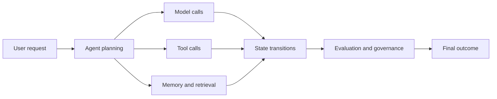

---
tags:
  - Agentic-AI
  - Solutions-For-Scale
  - Agents-as-a-Service
  - AI-Agents
  - Observability-Tools
date_created: 2026-10-05
date_modified: 2026-10-10
cf_last_run: 2026-10-05T19:01:08.328Z
cf_last_run_model: Perplexity sonar-pro
cf_retrieved_source_count: 6
cf_last_run_retrieval: 2026-10-05T18:59:02.908Z
aliases:
  - Agent Observability
---

[[Vocabulary/Observability|Observability]]
[[concepts/Explainers for AI/Agents-as-a-Service|Agents-as-a-Service]]

## Retrieved sources

### AgentX AI — 
https://agentx.so/ [^E1] 

```yaml
founded_year: "2023"
funding: "Total Funding: USD 1,700,000 (Pre seed 2023-11-10: USD 1.7M; Seed 2023-10-01)"
pricing_model: Free Trial, Demo Available
name: AgentX AI
headquarters:
  address: 440 N Wolfe Rd, Sunnyvale, California 94085, US
  city: Sunnyvale
  country: United States
workforce:
  total: 13
financials:
  fundingTotal: 1700000
  fundingLatestRound:
    name: Pre seed
    date: 2023-11-10
    amount: 1700000
```

AgentX AI provides an enterprise platform to orchestrate, evaluate, trace, and observe AI workforces and agents, enabling creation and management of AI agents using multiple large language models and AI providers.

### Prefactor — 
https://prefactor.ai/ [^E2]

```yaml
founded_year: "2024"
funding: "Total funding USD 1,233,576 (Pre seed rounds: USD 987,600 on 2026-05-01; USD 100,300 on 2025-06-01; USD 145,676 on 2024-11-26)"
name: Prefactor
headquarters:
  address: San Francisco, US
  city: San Francisco
  country: United States
  workforce:
    total: 6
```

Prefactor is an agent observability and evaluation platform for production AI agents. It continuously scores every agent for quality, drift, and risk in production, surfaces quality regressions and drift as they happen, and shows engineering teams exactly how their agents are performing at scale.

### Agency — 
https://agen.cy/ [^E3]

```yaml
founded_year: "2023"
funding: "Total Funding: USD 2,600,000 (Seed 2025-02-08; Pre seed 2024-08-28: USD 2.6M)"
name: Agency
headquarters:
  address: 525 Market St, San Francisco, California 94105, US
  city: San Francisco
  country: United States
  workforce:
    total: 521
```

Agency AI is an AI agent developer that provides tools, observability, and expertise to help startups and enterprises build safe and reliable AI agents.

### evaluagent® — 
https://evaluagent.com/ [^E4]

```yaml
founded_year: "2012"
funding: USD 21,021,218 total funding; Series A 2023 USD 20,000,000; Angel 2016 USD 395,000; Seed 2012 USD 242,082
name: evaluagent®
headquarters:
  address: Middlesbrough, England TS2 1AE, GB
  city: Middlesbrough
  country: United Kingdom
```

evaluagent® provides call center QA and performance improvement software that enables Auto-QA of every conversation across all channels, with conversation intelligence to uncover patterns, root causes, and predictive signals.

### Glass — 
https://glasshq.ai/ [^E5]

```yaml
founded_year: "2024"
funding: "Total Funding: USD 280,000; Pre seed (2025-06-01): USD 180,000; Angel (2024-06-01): USD 100,000"
name: Glass
headquarters:
  address: 東京都千代田区神田三崎町3丁目5-9, Tokyo, 150-0011, JP
  city: Tokyo
  country: Japan
  workforce:
    total: 3
```

Glass is an AI-agents observability platform offering traceability for interactions, LLM calls, agent chains, tool usage, and agent steps. It also analyzes the cost and ROI impact of agent misbehavior.

### OpenObserve — 
https://openobserve.ai/ [^E6]

```yaml
founded_year: "2022"
funding: Total funding USD 13,600,000 (Series A USD 10.0M in 2026-04-01; Seed USD 3.6M in 2022-03-19)
name: OpenObserve
headquarters:
  address: 315 Montgomery St, 10th Floor, San Francisco, California 94104, US
  city: San Francisco
  country: United States
  workforce:
    total: 34
```

OpenObserve is an open-source unified-observability platform combining logs, metrics, traces, and real-user monitoring, with support for AI-driven operations and LLM observability.

# Value Proposition & Features

**Agentic Observability** is an Airrived capability announced on September 14, 2026, rather than a separately identified standalone company. It extends Airrived’s enterprise Agentic OS with end-to-end visibility into AI-agent behavior, from enterprise data entering the platform through agent reasoning, execution, and business outcomes. [^dk8xer] [^hbm64l]

Its central value proposition is a unified control layer for understanding **what agents do, what data they use, what permissions they have, what actions they take, and what those actions cost**. Airrived positions this visibility as a foundation for moving enterprise agents beyond limited pilots into larger production deployments. [^hbm64l] [^h1bey1]

- **End-to-end tracing:** Follows the path from enterprise integrations and data through Context Lake, agentic applications, individual agents, actions, and outcomes. [^dk8xer] [^hbm64l]
- **Agent governance:** Surfaces each agent’s creator, owner, users, roles, permissions, and permitted actions. [^hbm64l] [^h1bey1]
- **Human approval controls:** Indicates whether [[concepts/Explainers for AI/Human-in-the-Loop|Human-in-the-Loop]] approval is required before an agent acts. [^hbm64l] [^h1bey1]
- **Data-use visibility:** Shows which enterprise data agents touched during execution. [^hbm64l] [^53xr7e]
- **Decision and action monitoring:** Tracks agent reasoning, execution, decisions, and resulting actions. [^dk8xer] [^hbm64l]
- **Cost monitoring:** Tracks model or token consumption and links activity to costs. [^53xr7e]
- **Risk visibility:** Helps expose sensitive-data exposure, agent risks, and potentially unauthorized behavior. [^53xr7e] [^pjs7xs]
- **Business-outcome linkage:** Connects agent activity to operational results rather than limiting monitoring to infrastructure telemetry. [^dk8xer] [^h1bey1]

The architecture is described as part of Airrived’s **Agentic OS**, which brings together Context Lake, AI applications, agents, orchestration, reasoning, models, governance, observability, and infrastructure. [^pjs7xs] The available sources do not provide a technical deployment diagram, API specification, supported frameworks, or details of the underlying telemetry standards.

## Screenshots

No three publicly available official screenshots were identified in the retrieved results.

## Product Roadmap / Announcements

As of October 5, 2026,

- **September 14, 2026:** Airrived announced Agentic Observability at GISEC Dubai as an expansion of its enterprise Agentic OS. [^dk8xer] [^hbm64l]
- **September 14, 2026:** The announcement described tracing from enterprise data and integrations through Context Lake, agentic applications, agents, actions, and outcomes. [^hbm64l]
- **September 14, 2026:** Airrived introduced visibility into ownership, permissions, permitted actions, human approval, data access, and cost. [^hbm64l] [^53xr7e]

No public product roadmap or later feature schedule was identified in the retrieved results.

## Recent Developments

The most recent retrieved reporting, dated September 30, 2026, continued to describe Agentic Observability as Airrived’s control layer for tracking agent ownership, permissions, data use, costs, risks, and business outcomes. [^0gr85f] No separate financing, customer, acquisition, or general-availability announcement for Agentic Observability was found.

# History and Origin Story

Agentic Observability originated as a September 2026 expansion of Airrived’s enterprise Agentic OS, unveiled at GISEC Dubai. The product reflects Airrived’s stated effort to extend its platform from building and running agents to governing and monitoring their complete operational lifecycle, including data context, permissions, actions, and outcomes. [^dk8xer] [^hbm64l] [^pjs7xs] Its positioning fits naturally alongside [[content-areas/AI-Factories-Datacenters/Concepts/Datacenter Operations|Datacenter Operations]] because it treats agent activity as an operational control problem, although the retrieved sources do not document a separate founding team, incorporation date, or standalone corporate history for the product.

# Notable Team Members

No founders or individual leaders were identified in the retrieved results. The available material attributes the announcement to Airrived but does not name a product lead, founder, or executive associated specifically with Agentic Observability. [^dk8xer] [^hbm64l]

# Market Sizing

## Category, Market Size, and Category Growth

Agentic Observability is best classified as **enterprise AI-agent observability, governance, and control-plane software**. Its scope overlaps with LLM observability and AI-operations tooling, but its stated differentiation is extending beyond traces and model performance to ownership, permissions, data access, costs, risks, actions, and business outcomes. [^hbm64l] [^049spg] [^pjs7xs]

No credible market-size or category-growth estimate specific to Airrived’s Agentic Observability was identified in the retrieved results. The sources establish market activity through comparable offerings: [[Tooling/Software Development/Cloud Infrastructure/Snowflake|Snowflake]] described an Agent Observability capability for monitoring, debugging, and improving agents and LLM applications, while AgentX AI, Prefactor, Glass, and OpenObserve represent adjacent observability or evaluation approaches. [^049spg] [^E1] [^E2] [^E5] [^E6]

## Pricing

No public pricing was identified for Agentic Observability.

## Revenue Trajectory Estimates

No reliable revenue or ARR figure for Airrived or Agentic Observability was identified in the retrieved results.

# Competitive Landscape

## Who it's for, who it's not for

Agentic Observability is aimed at enterprises operating multiple AI agents or agentic applications and needing centralized visibility into ownership, permissions, data access, human approvals, execution, costs, risks, and operational outcomes. [^hbm64l] [^h1bey1] It is especially relevant to organizations moving from agent pilots toward production-scale deployment. [^h1bey1]

It is not positioned as a general-purpose developer tracing library, a call-center QA product, or a standalone agent-building environment; the available description places it inside Airrived’s broader enterprise Agentic OS. [^hbm64l] [^pjs7xs] Small teams seeking self-serve observability with transparent public pricing may find the lack of published pricing and the enterprise control-plane orientation less suitable.

## Viable Alternatives

- **[[AgentX AI]]:** Enterprise platform for orchestrating, evaluating, tracing, and observing AI workforces and agents. [^E1]
- **[[Prefactor]]:** Production-agent evaluation and observability focused on quality, drift, risk, and regressions. [^E2]
- **Glass:** AI-agent observability with detailed traces, tool-use visibility, failure analysis, and cost-impact analysis. [^E5]
- **[[OpenObserve]]:** Open-source unified observability combining logs, metrics, traces, real-user monitoring, and LLM observability. [^E6]
- **Observe by Snowflake Agent Observability:** Emerging Snowflake capability for monitoring, debugging, and improving AI agents and LLM applications. [^049spg]

## Competitor Table

| Competitor                                                                                                                | Description                                                                                                            |
| ------------------------------------------------------------------------------------------------------------------------- | ---------------------------------------------------------------------------------------------------------------------- |
| [AgentX AI](https://agentx.so/)                                                                                           | Orchestrates, evaluates, traces, and observes AI workforces and agents.                                          |
| [Prefactor](https://prefactor.ai/)                                                                                        | Scores production agents for quality, drift, and risk and surfaces regressions.                                  |
| [Glass](https://glasshq.ai/)                                                                                              | Provides detailed agent traces, tool-use analysis, failure detection, and cost-impact analysis.                  |
| [OpenObserve](https://openobserve.ai/)                                                                                    | Open-source unified observability platform with logs, metrics, traces, and LLM observability.                    |
| [Observe by Snowflake](https://www.snowflake.com/en/blog/ai-agent-observability-monitor-debug-optimize-llm-applications/) | Provides forthcoming monitoring, debugging, and improvement capabilities for AI agents and LLM applications. |

Sources for Table: [^e1] [^e2] [^e5] [^e6] [^049spg]


***
# Sources

[^dk8xer]: [Airrived Introduces Agentic Observability to Track AI Agent ...](https://briefglance.com/companies/airrived/pulses/78026)
[^hbm64l]: [Airrived Launches Agentic Observability, Giving Enterprises ...](https://www.morningstar.com/news/business-wire/20260914862881/airrived-launches-agentic-observability-giving-enterprises-real-time-visibility-and-control-over-every-ai-agent-decision)
[^h1bey1]: [Airrived launches observability for enterprise AI agents](https://itbrief.news/story/airrived-launches-observability-for-enterprise-ai-agents)
[^0gr85f]: [Airrived Launches Observability for Enterprise AI Agents](https://ground.news/article/airrived-adds-agentic-observability-to-track-ai-agent-actions-and-risks)
[^049spg]: [AI Agent Observability coming to Observe by Snowflake](https://www.snowflake.com/en/blog/ai-agent-observability-monitor-debug-optimize-llm-applications/)
[^53xr7e]: [Airrived adds Agentic Observability for enterprise AI agents | AiToolMap](https://aitoolmap.org/news/airrived-adds-agentic-observability/)
[^pjs7xs]: [Airrived adds Agentic Observability to track AI agent actions and risks - Help Net Security](https://www.helpnetsecurity.com/2026/09/14/airrived-agentic-observability-expansion/)
[^g2yway]: [Agent-Observability — What Is Actually Standardised, and What Is Still Vendor-Specific](https://dxclouditive.com/en/blog/agent-observability/)
[^nw6jix]: [Snowflake previews Agent Observability for LLM monitoring](https://agentry.news/agent/snowflake-previews-agent-observability-for-llm-monitoring)
[^8nqxb7]: [Agentic AI Observability Services | See What Your Agents Actually Did](https://flytebit.com/agentic-ai-observability-services/)
[11]: [The Cyber Security Hub™ (@TheCyberSecHub) on ...](https://x.com/TheCyberSecHub/status/2099469860535484605)
[^5f4qhl]: [#Agent-Observability · AIニュース · Did Codex Reset](https://didcodexreset.com/ja/news/tag/agent-observability)
[^481y9o]: [Agentic observability: Closing the gap between IT teams and executive visibility](https://news.lavx.hu/article/agentic-observability-closing-the-gap-between-it-teams-and-executive-visibility)
[^g9xrfs]: [AIRRIVED Agentic Observability at GISEC GLOBAL Dubai](https://www.linkedin.com/posts/gurtu_airrived-launches-agentic-observability-activity-7505835042468675584-dkMA)
[^pqynx6]: [AI Observability for LLMs and Agents: A 2026 Guide | LLMTools](https://llmtools.cc/blog/ai-observability-for-llms-and-agents/)

## Sources (retrieved)

[^E1]: [Exa.ai](https://exa.ai) API response for data on [AgentX AI](https://agentx.so/)
[^E2]: [Exa.ai](https://exa.ai) API response for data on [Prefactor](https://prefactor.ai/)
[^E3]: [Exa.ai](https://exa.ai) API response for data on [Agency](https://agen.cy/)
[^E4]: [Exa.ai](https://exa.ai) API response for data on [evaluagent®](https://evaluagent.com/)
[^E5]: [Exa.ai](https://exa.ai) API response for data on [Glass](https://glasshq.ai/)
[^E6]: [Exa.ai](https://exa.ai) API response for data on [OpenObserve](https://openobserve.ai/)

# Defining and Describing Agentic Observability

- 

_Agentic observability makes autonomous AI behavior inspectable rather than mysterious._

Agentic observability is the practice of capturing and analyzing an AI agent’s observable execution path, including model calls, retrieval, tool use, memory operations, state changes, handoffs, errors, latency, cost, and outc. [^pqynx6][15] It applies when an agent performs multi-step, tool-using, or autonomous work whose behavior cannot be explained adequately by a single input-outpu [^g2yway]og.[8] Its purpose is to help teams debug failures, evaluate quality and safety, control cost, enforce governance, and reconstruct what happened during a productio [^dk8xer] [^53xr7e][1][6]



# Uses in Context

- **Engineering and debugging:** Teams use the term to describe structured traces of model calls, tool invocations, latency, token counts, errors, and evaluation s [^dk8xer]es.[1]
- **Security and compliance:** Agentic observability can provide an audit record of which agent acted, under which identity, which tool it called, and which systems it acc [^dk8xer]ed.[1]
- **Quality assurance:** Practitioners apply it to replaying complete agent runs and evaluating full traces, sub-traces, or individual spans in produc. [^5f4qhl][12]
- **Cost management:** Agent observability is used to attribute token usage and expenditure to particular agents, model calls, or workflow [^hbm64l]p [^g9xrfs]][14]
- **Governance and trust:** It is invoked as a prerequisite for understanding whether an agent’s outputs and actions are accurate, relevant, safe, and comp [^g2yway]n [^g9xrfs]][14]
- **Operations:** A related usage describes AI agents being integrated into telemetry pipelines for real-time reasoning, root-cause analysis, and remedi [^0gr85f]on.[4]

# History of Use

## Origins

The exact first appearance of the phrase **“agentic observability”** is not established by the available sources. The more established precursor is **agent observability**, defined as visibility into the inputs, outputs, and component parts of an LLM system that uses tools in a [^g2yway]op.[8] The concept emerged from the practical need to extend conventional application-performance monitoring to systems whose behavior unfolds through multi-step decisions, tool calls, retrieval, memory, and state transi [^53xr7e] [^nw6jix][6][9]

- Early usage centered on recording the complete lifecycle of an agent task as a structured trace, rather than treating the final answer as the only observable artifac [^pqynx6]][15]
- Contemporary definitions commonly describe four pillars: monitoring, tracing, evaluation, and govern. [^481y9o][13]
- The adjective **agentic** is now used in two related ways: to describe observability *of* autonomous agents, and to describe observability systems that themselves use agents for diagnosis or remedi [^h1bey1]on. [^p [^0gr85f]xs][4][7]

## Evolution

- **2025 — From LLM monitoring to agent tracing:** Agent observability was framed around visibility into tool-using LLM systems, with production trust depending on visibility into inputs, outputs, and component beh [^g2yway]or.[8]
- **2026 — From traces to evaluation and governance:** Platforms increasingly combined end-to-end traces with online and offline evaluations, annotation workflows, datasets, cost attribution, and compliance-oriented audit re [^dk8xer] [^53xr7e][1][6 [^5f4qhl]][12]
- **2026 — From observing agents to agentic operations:** The term expanded to include AI-assisted interpretation of telemetry, root-cause analysis, issue prevention, and remediation across operational syste[^p [^0gr85f]xs][4][7]

# Best Real-World Examples

- [Arize Phoenix](https://arize.com/blog/best-ai-observability-tools-for-autonomous-agents-in-2026/) — reconstructs observable agent execution, including model calls, retrieval, tools, memory, handoffs, errors, latency, cost, and outc. [^pqynx6][15]
- [Langfuse](https://www.montecarlo.ai/blog-agent-observability-tools) — uses traces and spans to record prompts, responses, latency, token counts, and cost for LLM and tool c. [^g9xrfs][14]
- [OpenInference](https://www.augmentcode.com/guides/agent-observability-for-ai-coding) — provides span kinds and instrumentation practices for tracing agent workflows, including agent identity and session bound [^hbm64l]es.[2]
- [OpenObserve](https://agentry.news/openobserve-10-ships-agent-tracing-and-llm-evaluation) — combines agent tracing, LLM monitoring, evaluation, session annotation, datasets, and experimentation in an open-source observability plat. [^8nqxb7][10]
- [MLflow](https://mlflow.org/articles/tags/best-practices-for-agent-observability/) — describes agent observability through monitoring, tracing, evaluation, governance, and “span-per-tick” execution tra. [^481y9o][13]
- [Confident AI](https://www.confident-ai.com/knowledge-base/playbook/ai-agent-observability) — captures tool selections, retrievals, memory operations, sub-agent handoffs, model calls, and intermediate execution steps as replayable tr. [^5f4qhl][12]
- [ITBench SRE Agent](https://huggingface.co/datasets/lyuchao/ITBench-Trajectories) — represents the emerging use of agent trajectories and benchmark datasets for evaluating agents performing IT and site-reliability [^049spg]ks.[5]

# Case Studies

**Open-source observability platforms.** OpenObserve’s 2026 release illustrates the movement from conventional logs, metrics, and traces toward a unified AI-observability layer. The release added full-session agent tracing, LLM-specific monitoring, trace and session evaluations, annotation queues, datasets, a testing playground, and experiment workf. [^8nqxb7][10] The change shows that agentic observability is not limited to collecting telemetry: it increasingly includes the ability to inspect, label, evaluate, and compare agent behavior over . [^8nqxb7][10]

**AI coding agents.** Guidance for AI coding systems recommends establishing a trace boundary for every agent run, attaching agent and session identifiers, instrumenting the workflow with OpenInference span kinds, attributing model-call costs, and alerting on tool-call loops and context ove [^hbm64l]ow.[2] This operational pattern reflects why ordinary application monitoring is insufficient: coding agents can fail through nondeterministic, multi-step interactions even when individual model calls appear he [^hbm64l]hy.[2]

**Production evaluation and trust.** Agent-observability platforms increasingly evaluate not only final answers but also intermediate behavior. Confident AI describes online evaluation at the level of the full run, extracted sub-traces such as planning or retrieval, and individual spans such as a tool . [^5f4qhl][12] Monte Carlo similarly characterizes observability as visibility into an agent’s inputs, outputs, and component parts, linking that visibility to trust in produ [^g2yway]on.[8] Together, these practices show that the unit of analysis is shifting from the response to the **trajectory**: the sequence of decisions, actions, state changes, and outcomes that produced it.[8 [^pqynx6]][15]


***

# Sources

[^dk8xer]: [What are the best AI agent observability platforms in 2026?](https://www.speakeasy.com/blog/best-ai-agent-observability-platforms-2026)
[^hbm64l]: [Agent Observability for AI Coding: How to Trace What Your Agents ...](https://www.augmentcode.com/guides/agent-observability-for-ai-coding)
[^h1bey1]: [What Is Agentic Observability?](https://www.dash0.com/knowledge/what-is-agentic-observability)
[^0gr85f]: [What Is Agentic Observability? Definition, Benefits, and Real-World ...](https://www.splunk.com/en_us/blog/learn/agentic-observability.html)
[^049spg]: [lyuchao/ITBench-Trajectories · Datasets at Hugging Face](https://huggingface.co/datasets/lyuchao/ITBench-Trajectories)
[^53xr7e]: [AI Agent Observability: A Complete Guide for 2026 & Beyond - Atlan](https://atlan.com/know/ai-agent-observability/)
[^pjs7xs]: [Agentic Observability Is Changing How We Work, and What Matters](https://www.splunk.com/en_us/blog/cto-stack/how-agentic-ai-is-transforming-observability.html)
[^g2yway]: [What Is Agent Observability? Key Concepts, Use-Cases ...](https://montecarlo.ai/blog-what-is-agent-observability/)
[^nw6jix]: [Agent observability: The complete guide for 2026 - Articles ...](https://www.braintrust.dev/articles/agent-observability-complete-guide-2026)
[^8nqxb7]: [OpenObserve 1.0 agent tracing tools](https://agentry.news/openobserve-10-ships-agent-tracing-and-llm-evaluation)
[11]: [The Anatomy of Agentic Observability | Safe and Sound AI Podcast](https://www.fiddler.ai/podcasts/anatomy-agentic-observability)
[^5f4qhl]: [Setting Up AI Agent Observability](https://www.confident-ai.com/knowledge-base/playbook/ai-agent-observability)
[^481y9o]: [One post tagged with "best practices for agent observability"](https://mlflow.org/articles/tags/best-practices-for-agent-observability/)
[^g9xrfs]: [Hybrid Ml And Llm Platforms](https://montecarlo.ai/blog-agent-observability-tools)
[^pqynx6]: [14 Best AI Observability Tools for Agents in 2026 | Arize](https://arize.com/blog/best-ai-observability-tools-for-autonomous-agents-in-2026/)
- Transcript: [[Anthropic Just Revealed 10 NEW Rules for Claude Skills]] — source: https://youtu.be/VQyYzLJ6xos?si=byCBh7uAVLXqVRRO
