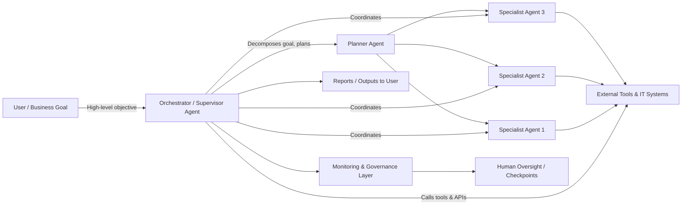

# Defining and Describing Agentic System Intelligence

_Agentic System Intelligence is the idea of AI systems that not only “think” but also coordinate tools, data, and multiple agents to reliably get things done in the real world with minimal supervision.[1][2][4][5][6][7][8]_

“Agentic” AI is generally defined as AI that can “autonomously plan and execute multi-step tasks to achieve a goal” rather than just generating content or answers.[3][5][6][7][8]  Several regulators and practitioners describe agentic AI systems as those that act “autonomously with limited human interactions … to fulfil goals rather than isolated tasks,” reasoning and planning which tasks to set and in what order in changing environments.[2][3][6][7][8]  In this emerging landscape, **Agentic System Intelligence** is best understood as a *system-level* capability: orchestrating one or more AI agents, tools, and data sources so the whole socio-technical system behaves in a goal-directed, adaptive, and auditable way.[2][4][5][6][7]  It matters because moving from passive assistants to active, tool-using, multi-agent systems enables end‑to‑end automation in domains like operations, cybersecurity, and edge computing, but also raises new governance and safety demands.[1][2][3][5][7]

In this diagram, Agentic System Intelligence is the *overall behavior* of the orchestrated network of agents, tools, and governance components, not just any single agent.[2][3][4][5]

---

# Uses in Context

- **Autonomous, goal-driven systems in infrastructure and edge computing**  
  Edge-computing vendors describe agentic AI as “intelligent systems capable of autonomous, goal-driven behavior … designed to think, adapt, and act,” emphasizing local perception, planning, and execution even when disconnected from the cloud.[1]  In this usage, Agentic System Intelligence refers to whole edge stacks that can sense conditions, formulate plans, and act on operational goals like uptime or energy efficiency.[1]

- **Regulatory and governance discussions of autonomous AI systems**  
  The European Data Protection Supervisor (EDPS) uses “agentic AI systems” to mean systems that act autonomously with limited human interaction “to fulfil goals rather than isolated tasks,” capable of reasoning, planning, prioritizing, and coordinating multiple activities while using tools, databases, APIs, and limited programming.[2]  In this context, Agentic System Intelligence is framed as a system-level property that demands specific safeguards around tool-use, environment sensing, and multi-agent coordination.[2][3]

- **Enterprise risk and compliance frameworks**  
  Legal and policy analyses describe an “agentic AI system” as one that “can autonomously plan and execute multi-step tasks to achieve a goal” and “take action on the company’s behalf,” prompting organizations to extend AI governance to cover agent behavior, multi-step workflows, and human checkpoints.[3]  Agentic System Intelligence here highlights the need for oversight, impact assessments, and technical controls across the entire system, not just the underlying model.[3]

- **Multi-agent orchestration in research and management thinking**  
  Management discussions around “agentic AI” emphasize systems made of “multiple, different agents that are orchestrating a task together — for example, a marketplace of agents,” rather than a single chatbot.[4]  This aligns Agentic System Intelligence with the design and control of multi-agent ecosystems that decompose complex tasks, delegate them, and recombine results.[2][4][5][6][7]

- **Software engineering patterns for agentic systems**  
  Engineering articles define agentic systems as AI systems that “can take actions on behalf of users, not just generate text or answer questions,” and outline best practices for planning, tool integration, guardrails, and monitoring.[5]  In this context, Agentic System Intelligence is an architectural goal: designing the system so that planning, tool‑use, feedback loops, and safety measures work together coherently.[5]

- **Security and operations automation**  
  Cybersecurity practitioners describe agentic AI as systems that “can autonomously plan and execute tasks to achieve a goal with minimal human supervision,” applied to tasks like threat detection, triage, and response.[7]  Agentic System Intelligence in this domain refers to security platforms whose combined agents, tools, and playbooks continuously adapt and act against evolving threats.[7]

---

# History of Use

## Origins

- The term **“agentic AI”** appears in regulatory and industry discourse as a refinement of “AI agents,” describing systems that reason, plan, and set their own tasks to fulfill goals with limited human input rather than executing single, pre-specified tasks.[2]  The EDPS explicitly contrasts “AI agents” (single systems that autonomously perform tasks) with “Agentic AI,” which goes further “by coordinating multiple agents, managing their communication, and distributing tasks to accomplish larger, more complex objectives.”[2]

- Early enterprise-focused explanations similarly define an “agentic AI system” as a type of AI system that can “autonomously plan and execute multi-step tasks to achieve a goal,” taking actions on behalf of organizations.[3]  This framing positions agentic systems as a distinct class of AI applications built on top of language or multimodal models but endowed with planning, tool‑use, and execution capabilities.[3]

- The more expansive label **“Agentic System Intelligence”** is not yet a widely standardized term in the literature; rather, it synthesizes how regulators, engineers, and infrastructure vendors talk about the *system-level* intelligence that emerges from orchestrating multiple agents, tools, and data flows around shared goals.[1][2][3][4][5][6][7][8]

## Evolution

- **2023–2024: From single agents to multi-agent orchestration**  
  Regulatory and expert commentary differentiates simple AI agents from Agentic AI systems that coordinate multiple agents, manage their communication, and distribute tasks for complex objectives, marking a shift toward multi-agent system design as a mainstream topic.[2][4]  This period sees increased emphasis on planning, prioritization, and coordination as core capabilities.[2][4][6]

- **2024–2025: System-level governance and risk framing**  
  Legal and compliance analyses highlight that agentic AI systems take actions on a company’s behalf and must be governed via impact assessments, risk identification, mitigation measures, human oversight checkpoints, and ongoing monitoring and logging.[3]  Regulators stress capabilities like tool-use, environment interaction via APIs, and limited programming as reasons to treat agentic systems as distinct risk objects.[2][3]

- **2025–2026: Domain-specific applications and architecture guidance**  
  Sectoral articles in edge computing, cybersecurity, and data platforms describe agentic AI as autonomous, goal‑directed systems operating at the edge, defending networks, or orchestrating data workflows.[1][6][7]  Engineering-focused guidance on “building agentic systems” lays out architectural patterns and best practices, reinforcing a system-level understanding of Agentic System Intelligence as an engineering target rather than a single model feature.[5][6]

---

# Best Real-World Examples

- **[Scale Computing Edge Platform](https://www.scalecomputing.com/resources/what-is-agentic-ai)** – Applies agentic AI concepts to edge infrastructure, emphasizing systems that can “perceive their environment, make decisions, and take autonomous actions to achieve defined goals” locally, even when disconnected.[1]

- **[EDPS TechSonar: Agentic AI](https://www.edps.europa.eu/data-protection/technology-monitoring/techsonar/agentic-ai)** – A regulatory analysis that treats agentic AI as systems capable of reasoning, planning, prioritizing, coordinating activities, and using tools and APIs to achieve goals, illustrating a governance-oriented view of system intelligence.[2]

- **[Mayer Brown – Governance of Agentic AI Systems](https://www.mayerbrown.com/en/insights/publications/2026/02/governance-of-agentic-artificial-intelligence-systems)** – A legal framework for organizations deploying agentic AI systems that autonomously plan and execute multi-step tasks, offering concrete examples of human oversight, technical controls, and monitoring.[3]

- **[InfoWorld – Best Practices for Building Agentic Systems](https://www.infoworld.com/article/4154570/best-practices-for-building-agentic-systems.html)** – An engineering article that defines agentic systems as AI that can “take actions on behalf of users, not just generate text,” and details architectural practices for planning, tool‑use, and safety, exemplifying applied Agentic System Intelligence.[5]

- **[ReliaQuest Agentic AI in Cybersecurity](https://reliaquest.com/cyber-knowledge/what-is-agentic-ai-and-how-does-it-work/)** – Describes cybersecurity platforms that use agentic AI to autonomously plan and execute threat-hunting and response tasks with minimal human supervision.[7]

- **[TileDB “What is agentic AI” guide](https://www.tiledb.com/blog/what-is-agentic-ai)** – Positions agentic AI as autonomous systems that “plan, decide and perform goal-directed action with minimal human help,” tying the concept to data-intensive workflows and tool orchestration.[6]

- **[AWS “What is Agentic AI?”](https://aws.amazon.com/what-is/agentic-ai/)** – A cloud provider’s explanation of agentic AI as autonomous AI systems that act independently to achieve predetermined goals, illustrating how large platforms adopt and popularize the concept for application builders.[8]

---

# Case Studies

## 1. Regulatory Framing: EDPS’s System-Level View of Agentic AI

The European Data Protection Supervisor (EDPS) has published a TechSonar note on Agentic AI that serves as an influential case study in how regulators conceptualize Agentic System Intelligence.[2]  The EDPS defines agentic AI systems as acting autonomously with limited human interactions “to fulfil goals rather than isolated tasks,” emphasizing that they reason about how to achieve goals, plan and coordinate actions in changing environments, and prioritize based on importance and urgency.[2]  Crucially, the EDPS stresses the ability of such systems to use tools, consult databases, perform limited programming, call other IT systems via APIs, and sense the environment without human involvement, enabling them to gather information, adapt, and accomplish goals.[2]  This framing shows Agentic System Intelligence as inherently *systemic*: it is the combination of autonomous decision-making, tool-use, and multi-activity coordination that triggers regulatory concern and demands governance beyond model-level controls.[2][3]

## 2. Enterprise Governance: Mayer Brown’s Guidance on Agentic AI Systems

A legal analysis by Mayer Brown examines “agentic AI systems” specifically as systems that “can autonomously plan and execute multi-step tasks to achieve a goal” and that “are autonomously taking action on the company’s behalf.”[3]  The authors note that these systems can be built atop small, large, or multimodal language models but add layers that enable decisions and task execution, transforming a predictive model into an operational actor.[3]  To govern such systems, they recommend extending existing AI governance frameworks to include establishing dedicated AI governance teams, data governance, compliance checks, AI impact assessments, risk mitigation, and documentation of policies and procedures.[3]  They further stress human oversight (defining checkpoints and action boundaries requiring human approval), transparency to users about the agent’s capabilities and limits, and technical controls like least-privilege tool access, strict input formats, and pre-deployment testing of workflows and tool calls.[3]  This case illustrates Agentic System Intelligence as something that must be *engineered and managed* across planning logic, tool integrations, oversight mechanisms, and logging, not simply inherited from an underlying AI model.[3]

## 3. Edge and Security Operations: Autonomy at the System Boundary

In edge computing, vendors describe agentic AI as “intelligent systems capable of autonomous, goal-driven behavior” that “sense their environment, analyze conditions in real time, formulate plans, and take actions to fulfill predefined objectives,” and note that such systems are designed to function locally, including when disconnected from the cloud.[1]  This shows Agentic System Intelligence as a property of distributed edge stacks where autonomy, context awareness, and operational independence are central.[1]  In parallel, cybersecurity practitioners explain that agentic AI systems in security can “autonomously plan and execute tasks to achieve a goal with minimal human supervision,” using these capabilities for threat detection, triage, and response.[7]  Combined, these examples suggest that Agentic System Intelligence is particularly valuable at system boundaries—like edge sites and security perimeters—where real-time, autonomous decision-making and coordinated actions across tools, sensors, and playbooks materially improve resilience and responsiveness.[1][7]

***

# Sources

[1]: [What Is Agentic AI and Why Does It Matter for Edge Infrastructure?](https://www.scalecomputing.com/resources/what-is-agentic-ai)
[2]: [Agentic AI | European Data Protection Supervisor](https://www.edps.europa.eu/data-protection/technology-monitoring/techsonar/agentic-ai)
[3]: [Governance of Agentic Artificial Intelligence Systems | Insights](https://www.mayerbrown.com/en/insights/publications/2026/02/governance-of-agentic-artificial-intelligence-systems)
[4]: [Agentic AI, explained | MIT Sloan](https://mitsloan.mit.edu/ideas-made-to-matter/agentic-ai-explained)
[5]: [Best practices for building agentic systems | InfoWorld](https://www.infoworld.com/article/4154570/best-practices-for-building-agentic-systems.html)
[6]: [What is agentic AI: A comprehensive 2026 guide - TileDB](https://www.tiledb.com/blog/what-is-agentic-ai)
[7]: [What Is Agentic AI? How It Works in Cybersecurity | ReliaQuest](https://reliaquest.com/cyber-knowledge/what-is-agentic-ai-and-how-does-it-work/)
[8]: [What is Agentic AI? - AWS](https://aws.amazon.com/what-is/agentic-ai/)
