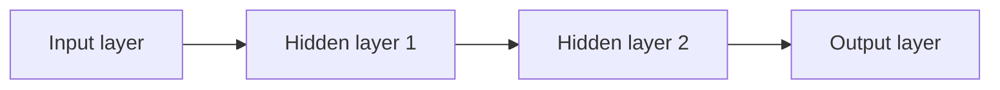

---
aliases:
  - artificial neural networks
  - ANNs
date_created: 2024-09-02
date_modified: 2026-06-02
site_uuid: 8f77efb8-8bab-4295-85c8-5a371f33e8b2
publish: true
title: Artificial Neural Networks
slug: artificial-neural-networks
at_semantic_version: 0.0.0.1
cf_last_run: 2026-06-02T04:30:26.657Z
cf_last_run_model: Perplexity sonar-pro
---
[[concepts/Explainers for AI/Neural Networks|Neural Networks]]

_Artificial neural networks are flexible mathematical structures that learn complex patterns from data by loosely imitating how biological neurons connect and adapt._

Artificial neural networks (ANNs) are **computing systems composed of layers of interconnected artificial “neurons” that transform input data through learned weights, biases, and activation functions to produce outputs**. [^w63waa] [^1jv7qk] [^tzu0vb] They are used whenever there is a need to automatically discover patterns or predictive relationships in data—such as vision, language, recommendation, or forecasting—without explicitly hand‑coding decision rules. [^w63waa] [^vtnr39] [^y2z7v2] ANNs matter because they provide the core machinery behind modern deep learning systems, enabling high performance on tasks like image recognition, speech recognition, machine translation, and game playing that were previously thought to require human intelligence. [^1jv7qk] [^y2z7v2] [^qh4mck]  

# Defining and Describing Artificial Neural Networks

Artificial neural networks (ANNs) are **computing systems designed to mimic how the human brain processes information** by using layers of interconnected artificial neurons that “analyze data, identify patterns and make predictions.”[^w63waa] [^vtnr39] [^tzu0vb] ANNs are a **family of machine learning model architectures** that learn **nonlinear mappings from input vectors to outputs** by adjusting internal parameters (weights and biases) during training. [^1jv7qk] [^tzu0vb] [^qh4mck] Each neuron receives one or more inputs, multiplies them by learned weights, adds a bias, and passes the result through an **activation function**, allowing the network to approximate complex, nonlinear functions. [^1jv7qk] [^tzu0vb] [^y2z7v2]  

Typical feedforward ANNs are organized into **three kinds of layers**: an **input layer** that receives raw features, one or more **hidden layers** that perform intermediate computations and feature extraction, and an **output layer** that produces the final prediction or decision. [^w63waa] [^vtnr39] [^tzu0vb] [^y2z7v2] [^y0cw88] During **training**, data is propagated forward through the network (forward propagation) to produce outputs, the error between predictions and targets is computed, and then **backpropagation** combined with an optimization algorithm such as gradient descent adjusts the weights and biases to reduce that error iteratively over many epochs. [^w63waa] [^tzu0vb] [^y0cw88] Neural networks can be **shallow** (one hidden layer) or **deep** (many hidden layers), with deep neural networks forming the basis of modern deep learning. [^1jv7qk] [^y2z7v2] [^qh4mck]  

Key conceptual points:  

- ANNs are **inspired by, but not identical to, biological neural networks** in the brain; they borrow the idea of neurons and synaptic strengths but implement them as mathematical functions and parameters. [^w63waa] [^1jv7qk] [^y2z7v2] [^y0cw88]  
- A trained ANN effectively represents a **learned function** $f_\theta(x)$, where $\theta$ denotes all weights and biases, mapping inputs $x$ to outputs such as class probabilities, numeric forecasts, or control signals. [^1jv7qk] [^tzu0vb] [^qh4mck]  
- Because ANNs can automatically learn **hierarchical feature representations** (low‑level to high‑level abstraction) in their hidden layers, they are particularly powerful for perception tasks like vision and speech. [^1jv7qk] [^y2z7v2] [^qh4mck] [^3mlmkh]  

# Uses in Context

- In AI and machine learning overviews, ANNs are described as “**the foundational engines behind many modern AI systems** that power pattern recognition across vision, language, forecasting, and automation.”[^y2z7v2]  
- Educational materials explain that neural networks are model architectures “**designed to find nonlinear patterns in data**,” eliminating much manual feature engineering in traditional ML. [^qh4mck]  
- Practical guides note that ANNs “**process data to identify patterns and relationships**” and are used for “**prediction, classification and decision making**” in domains such as finance, healthcare, and marketing. [^w63waa] [^vtnr39]  
- Industry blogs describe a neural network as “**a group of algorithms that certify the underlying relationship in a set of data similar to the human brain**,” emphasizing their role in uncovering complex dependencies in large datasets. [^3mlmkh]  
- Introductory articles highlight that ANNs “**can ‘learn’ from the data they process, just as our brain learns from experience**,” framing them as adaptive systems rather than static programs. [^vtnr39]  

# History of Use

## Origins

- The conceptual precursor to artificial neural networks is the **McCulloch–Pitts neuron**, a 1943 mathematical model of a neuron introduced by Warren McCulloch and Walter Pitts, which showed how simplified neuron-like units could compute logical functions. [^tzu0vb]  
- The first widely recognized **learning** neural model was the **perceptron**, introduced by psychologist **Frank Rosenblatt** in 1957; it was implemented in hardware and described as a system that could learn to classify input patterns via weight adjustments. [^tzu0vb]  
- The term **“artificial neural network”** gained traction in the mid‑20th‑century cybernetics and early AI literature as researchers extended single-layer perceptrons into multi-layer architectures and began emphasizing their analogy to biological neural networks. [^tzu0vb] [^y2z7v2]  

## Evolution

- **1969 – Perceptron critique and winter:** Marvin Minsky and Seymour Papert’s 1969 book *Perceptrons* rigorously analyzed the limitations of single-layer perceptrons (for example, their inability to learn the XOR function), contributing to a decline in neural network research funding during the 1970s. [^tzu0vb]  
- **1986 – Backpropagation and multi-layer networks:** In 1986, David Rumelhart, Geoffrey Hinton, and Ronald Williams popularized the **backpropagation** learning algorithm for training multi-layer neural networks, demonstrating that ANNs could learn complex internal representations and reviving interest in the field. [^tzu0vb] [^y2z7v2]  
- **Mid‑2000s–2010s – Deep learning resurgence:** In the mid‑2000s, work by Hinton and colleagues on deep belief networks, followed by the 2012 ImageNet breakthrough with a deep convolutional neural network (AlexNet), showed that **deep neural networks** trained on large datasets with GPU acceleration could dramatically outperform previous methods in image recognition, speech recognition, and other tasks, firmly establishing ANNs at the core of modern deep learning. [^1jv7qk] [^y2z7v2] [^qh4mck]  

# Best Real-World Examples

- [TensorFlow](https://www.tensorflow.org) — [[Tooling/AI-Toolkit/AI Programming Frameworks/TensorFlow|TensorFlow]] — an open‑source framework that provides high‑level and low‑level tools for building, training, and deploying artificial neural networks, widely used in research and production for deep learning. [^tzu0vb] [^y2z7v2]  
- [PyTorch](https://pytorch.org) — [[Tooling/AI-Toolkit/AI Programming Frameworks/PyTorch|PyTorch]] — an open‑source deep learning library that makes it easy to define dynamic neural network architectures and train them efficiently on GPUs, popular among researchers and startups for rapid experimentation. [^tzu0vb] [^y2z7v2]  
- [OpenAI GPT models](https://openai.com) — [[Tooling/AI-Toolkit/Models/GPT-Series Models|GPT]] — large‑scale transformer neural networks trained on massive text corpora to perform language modeling, demonstrating how ANNs can learn complex linguistic structure and support tasks such as question answering and code generation. [^1jv7qk] [^y2z7v2] [^qh4mck]  
- [DeepMind AlphaGo](https://deepmind.google) — [[AlphaGo]] — a system that combines deep neural networks with tree search to play the board game Go at superhuman level, illustrating how ANNs can approximate value functions and policies in complex decision spaces. [^1jv7qk] [^y2z7v2]  
- [YOLO object detection](https://pjreddie.com/darknet/yolo) — an open‑source real‑time object detection system based on convolutional neural networks, widely used in robotics, surveillance, and autonomous systems to locate and classify objects in images and video. [^1jv7qk] [^y2z7v2] [^3mlmkh]  
- [U-Net for medical image segmentation](https://arxiv.org/abs/1505.04597) — [[U-Net]] — a convolutional neural network architecture developed for biomedical image segmentation, now widely adopted in medical imaging to delineate organs, tumors, and other structures from scans. [^1jv7qk] [^3mlmkh]  

# Case Studies

**1. Deep convolutional networks and the ImageNet breakthrough**  
In 2012, a small research team led by **Alex Krizhevsky**, working with **Ilya Sutskever** and **Geoffrey Hinton**, trained a deep convolutional neural network (later known as **AlexNet**) on the large‑scale ImageNet dataset using GPUs. [^1jv7qk] [^y2z7v2] Their network, composed of multiple convolutional and fully connected layers with nonlinear activations, achieved a **top‑5 error rate of 15.3%**, dramatically outperforming the closest traditional computer vision competitor at 26.2%. [^1jv7qk] This result showed that **deep artificial neural networks could automatically learn hierarchical visual features** from raw pixels, obviating much hand‑engineered feature design. [^1jv7qk] [^y2z7v2] [^qh4mck] The success of AlexNet catalyzed widespread adoption of neural networks in vision startups and research labs, and it is often cited as a pivotal moment that moved ANNs from an academic niche to the dominant paradigm in computer vision and deep learning. [^1jv7qk] [^y2z7v2]  

**2. Sequence‑to‑sequence neural networks for machine translation**  
Around 2014, researchers at smaller and larger labs independently developed **sequence‑to‑sequence (seq2seq)** models that used recurrent neural networks (RNNs) with an encoder–decoder architecture to perform machine translation. [^1jv7qk] [^y2z7v2] [^qh4mck] In this setup, one neural network (the encoder) reads a source sentence token by token and compresses it into a vector representation, while a second network (the decoder) generates the target sentence, one token at a time, conditioned on this representation. [^1jv7qk] [^qh4mck] These ANN‑based systems significantly improved translation quality over phrase‑based statistical methods and allowed end‑to‑end training directly from bilingual sentence pairs, reducing the need for handcrafted linguistic features. [^1jv7qk] [^y2z7v2] The case illustrates how artificial neural networks can model variable‑length sequences and learn complex conditional distributions, enabling applications in translation, summarization, and dialogue for startups and open‑source projects as well as large adopters. [^1jv7qk] [^y2z7v2] [^qh4mck]  

**3. Neural networks in medical imaging startups**  
In the mid‑2010s and beyond, numerous medical imaging startups adopted **convolutional neural networks and specialized architectures like U‑Net** to assist radiologists in detecting anomalies in X‑rays, CT, and MRI scans. [^1jv7qk] [^3mlmkh] These systems are trained on labeled medical images so that the ANN learns to segment structures (such as organs or tumors) and classify regions as healthy or pathological. [^1jv7qk] [^3mlmkh] Studies showed that, when properly trained and validated, such neural network–based tools could reach or approach expert‑level performance on specific tasks like lung nodule detection or retinal disease screening. [^1jv7qk] [^3mlmkh] This case demonstrates how artificial neural networks enable smaller companies and research groups, leveraging open‑source frameworks and public datasets, to build high‑impact diagnostic support tools that augment clinical workflows traditionally dominated by large incumbents. [^1jv7qk] [^y2z7v2] [^3mlmkh]

***

# Sources

[^w63waa]: [Introduction to Artificial Neural Networks (ANNs) - GeeksforGeeks](https://www.geeksforgeeks.org/deep-learning/introduction-to-artificial-neutral-networks/)
[^vtnr39]: [Artificial Neural Networks and its Applications - GeeksforGeeks](https://www.geeksforgeeks.org/deep-learning/artificial-neural-networks-and-its-applications/)
[^1jv7qk]: [What Is a Neural Network? | IBM](https://www.ibm.com/think/topics/neural-networks)
[^tzu0vb]: [Introduction To Neural Networks - GeeksforGeeks](https://www.geeksforgeeks.org/deep-learning/neural-networks-a-beginners-guide/)
[^y2z7v2]: [Neural Networks 101: How They Work and Why They Matter](https://online.nyit.edu/blog/neural-networks-101-understanding-the-basics-of-key-ai-technology)
[^y0cw88]: [What is an Artificial Neural Network? (ANN Explained Simply for ...](https://www.youtube.com/watch?v=qWnC8jzwi-0)
[^qh4mck]: [Neural networks | Machine Learning - Google for Developers](https://developers.google.com/machine-learning/crash-course/neural-networks)
[^3mlmkh]: [Artificial Neural Network Applications and Algorithms - XenonStack](https://www.xenonstack.com/blog/artificial-neural-network-applications)
