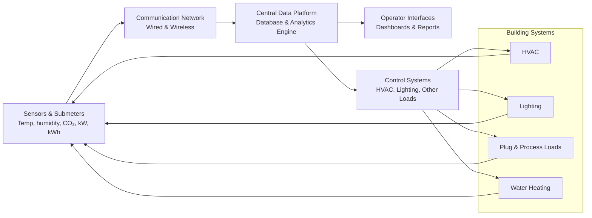

# Defining and Describing Building Energy Management Systems

_A building energy management system is essentially a digital “brain” that watches how a building uses energy and continuously tweaks systems to cut waste while keeping people comfortable._[^wmw16c] [^670bol] [^cmdx42]

A **Building Energy Management System (BEMS)** is a combination of hardware (sensors, meters, controllers) and software that *monitors, analyzes, and optimizes* energy use across building systems such as HVAC, lighting, and other major loads. [^wmw16c] [^670bol] [^cmdx42] It operates as a centralized, software‑driven platform providing real‑time monitoring and integrated control of energy‑consuming systems to reduce power use while maintaining occupant comfort and safety. [^wmw16c] [^670bol] BEMS are most often deployed in commercial buildings and campuses but are increasingly applied to small and medium buildings as costs fall and connectivity improves. [^670bol] [^cmdx42] [^7v81nb] They matter because they turn raw building data into actionable insights and automated control actions that lower energy costs, improve sustainability performance, and support regulatory compliance and grid interaction. [^wmw16c] [^670bol] [^cmdx42] [^8t325k]

# Uses in Context

- Vendors and practitioners use “building energy management system” to describe a **centralized, software‑driven platform that provides real‑time monitoring and integrated control of lighting, power, hot water, HVAC, and other energy‑consuming systems** in order to “reduce power use while maintaining occupant comfort and safety.”[^wmw16c]

- Facilities and energy teams use the term to mean **“a set of software and hardware tools that help organizations monitor, control, and optimize energy consumption in buildings,”** connecting to HVAC, lighting, and other major loads. [^670bol]

- In smart‑building and IoT discussions, BEMS is invoked as the **modern evolution of traditional building management systems**, integrating IoT sensors, AI, and real‑time analytics so the system “learns from building and occupants’ behavior, predicts needs, and reacts in real time.”[^45713j] [^cmdx42]

- Policy and efficiency organizations refer to “building energy management control systems” as tools commonly used to “monitor and control many building systems, particularly energy‑using systems such as cooling, heating, ventilation, and lighting,” highlighting their role in commercial energy efficiency programs. [^7v81nb]

- In energy‑management literature, BEMS are framed as enabling “real‑time monitoring and control of energy usage,” improving occupant comfort and supporting sustainability goals by integrating with advanced technologies such as IoT and renewables. [^cmdx42]

- Grid‑integration research uses “home and building energy management systems” to describe systems that coordinate appliances and distributed energy resources (like rooftop PV) so that building energy use can provide value to the electric grid. [^8t325k]

# History of Use

## Origins

- Early **energy management systems for buildings** emerged alongside digital building automation in the late 1970s–1980s, as microprocessor‑based controls began to monitor and optimize HVAC and lighting in large commercial buildings; this laid the technical foundation for what is now called BEMS. [^7v81nb] [^9x07bo] (Historical framing inferred from energy‑management and control‑system literature; the specific acronym BEMS gained currency later.)

- Academic and technical use of the specific phrase **“Building Energy Management Systems (BEMS)”** was established by the 2000s; literature reviews describe BEMS as systems that “allow for real‑time monitoring and control of energy usage” and consolidate various applications under one framework. [^cmdx42]

- The term has been widely adopted in building‑performance practice and vendor offerings to distinguish **energy‑focused analytics and optimization** from broader building management/control systems, which primarily handle operational control and life‑safety functions. [^670bol] [^jrrns3] [^cmdx42]

## Evolution

- **2000s–early 2010s – From controls to analytics‑oriented BEMS**  
  As sensor, metering, and networking costs fell, BEMS evolved from simple scheduling and set‑point control to platforms that “monitor, analyze, and optimize a building’s energy use,” using data from sensors and meters for deeper analytics. [^670bol] [^cmdx42]

- **Mid‑2010s – Integration with IoT and cloud platforms**  
  Research and vendors began explicitly describing **smart building energy management systems** that integrate IoT sensors, cloud computing, and real‑time analytics, moving from static rule‑based logic to adaptive, data‑driven optimization. [^45713j] [^cmdx42]

- **Late 2010s–2020s – Portfolio‑scale and grid‑interactive BEMS**  
  Modern BEMS architectures can “scale to integrate data from multiple facilities or even the entire real estate portfolio” and are being researched as **home and building energy management systems** that coordinate distributed energy resources and provide services to the grid. [^45713j] [^8t325k]

# Best Real-World Examples

- **[Facilio BEMS](https://facilio.com/learn/building-energy-management-system/)** – A cloud‑based platform that “sits on top of your building systems and continuously analyzes how energy is being used,” adding real‑time monitoring, fault detection, optimization, and analytics. [^670bol]

- **[CoolAutomation Building Energy Management Systems](https://coolautomation.com/blog/building-energy-management-systems/)** – Vendor solution emphasizing centralized, software‑driven control of HVAC, lighting, and other systems to enhance energy efficiency while maintaining comfort and safety. [^wmw16c]

- **[EnergyCAP BEMS / building energy monitoring](https://www.energycap.com/blog/building-energy-monitoring/)** – Energy‑monitoring software positioned as a “complete BEMS guide,” focusing on tracking electricity, gas, steam, and water use across facilities to spot waste and reduce costs. [^a0ae5k]

- **[OPInno Smart BEMS](https://op-int.com/smart-building-energy-management-system/)** – A “smart building energy management system” that integrates IoT sensors, AI, and real‑time analytics to dynamically manage HVAC, lighting, power grids, and water systems, offering centralized control with granular, real‑time insights. [^45713j]

- **[NREL / NLR Home and Building Energy Management Systems research](https://www.nlr.gov/grid/energy-management)** – Research initiative developing tools to understand how smart homes and buildings, including appliances and distributed energy resources, can be coordinated through energy management systems to provide value to the grid. [^8t325k]

- **[ACEEE work on building energy management control systems](https://www.aceee.org/topic-brief/2025/11/building-energy-management-control-systems-small-and-medium-commercial)** – Programmatic and policy‑oriented example analyzing how building energy management control systems are used in large buildings and how to extend them to small and medium commercial buildings. [^7v81nb]

# Case Studies

**Case Study 1 – Cloud BEMS as an overlay on existing controls (Facilio)**  
Facilio describes its Building Energy Management System as a **software‑driven overlay** that connects to existing building systems—HVAC, lighting, and other major loads—to monitor, analyze, and optimize energy use without replacing underlying building management systems. [^670bol] The platform “sits on top of your building systems and continuously analyzes how energy is being used,” turning raw operational data into insights and automated optimization, including real‑time monitoring, fault detection, and analytics. [^670bol] In practice, this allows building operators to identify inefficiencies, such as simultaneous heating and cooling or poorly tuned schedules, and then implement automated or guided changes that reduce waste, cut energy costs, and improve building performance while preserving occupant comfort. [^670bol] [^cmdx42] This case illustrates how modern BEMS are increasingly decoupled from hardware, leveraging cloud analytics and integration with existing BMS/controls to deliver energy savings as a service layer. [^670bol] [^jrrns3] [^cmdx42]

**Case Study 2 – Smart BEMS with IoT and AI for adaptive control (OPInno)**  
OPInno frames a **smart building energy management system** as the “modern evolution of BMS” that integrates intelligence, adaptability, and automation. [^45713j] In their model, IoT sensors continuously collect data on occupancy and environmental conditions; this data is transmitted to a central processing hub where “all the big calculations happen,” and the system then forwards instructions to control systems managing HVAC, lighting, power grids, and water systems. [^45713j] By leveraging AI and real‑time analytics, the system “learns from building and occupants’ behavior, predicts needs, and reacts in real time,” and can scale to integrate data from multiple facilities or an entire real estate portfolio. [^45713j] Such deployments demonstrate how BEMS have evolved from static schedules to predictive, portfolio‑wide optimization, enabling operators to move from reactive control to proactive, data‑driven decision‑making that simultaneously cuts costs, boosts sustainability, and enhances tenant experiences. [^45713j] [^cmdx42]

**Case Study 3 – Extending BEMS concepts to small and medium commercial buildings (ACEEE)**  
The American Council for an Energy‑Efficient Economy (ACEEE) notes that **building energy management control systems** are common in large commercial buildings over 100,000 square feet but remain “much rarer in small and medium sized buildings.”[^7v81nb] Its topic brief examines how these systems are used to monitor and control cooling, heating, ventilation, and lighting and identifies barriers to adoption in smaller buildings, such as cost, lack of technical expertise, and split incentives between owners and tenants. [^7v81nb] The paper also discusses program and policy approaches to increasing use—such as incentives, simplified system offerings, and technical assistance—highlighting the potential for BEMS‑style capabilities to deliver significant energy savings if they can be made accessible to this underserved segment. [^7v81nb] [^cmdx42] This case underscores that the core BEMS concept is proven in large facilities but that realizing its full societal impact depends on overcoming deployment barriers in smaller commercial buildings.

***

# Sources

[^wmw16c]: [Understanding Building Energy Management Systems](https://coolautomation.com/blog/building-energy-management-systems/)
[^670bol]: [What is a Building Energy Management System (BEMS)? - Facilio](https://facilio.com/learn/building-energy-management-system/)
[^45713j]: [Smart Building Energy Management System: The Future of Efficient ...](https://op-int.com/smart-building-energy-management-system/)
[^jrrns3]: [EMS vs BMS: Key differences between building and energy ...](https://www.mrisoftware.com/ae/blog/ems-vs-bms-key-differences-building-energy-management-systems/)
[^cmdx42]: [A Review of Smart Building Energy Management Systems (BEMS ...](https://easychair.org/publications/paper/1qDQ)
[^7v81nb]: [Building Energy Management Control Systems for Small and ...](https://www.aceee.org/topic-brief/2025/11/building-energy-management-control-systems-small-and-medium-commercial)
[^8t325k]: [Home and Building Energy Management Systems](https://www.nlr.gov/grid/energy-management)
[^9x07bo]: [What is…Energy Management? | Building Geniuses - KMC Controls](https://www.kmccontrols.com/blog/what-is-energy-management/)
[^a0ae5k]: [What is building energy monitoring? A complete BEMS guide](https://www.energycap.com/blog/building-energy-monitoring/)
