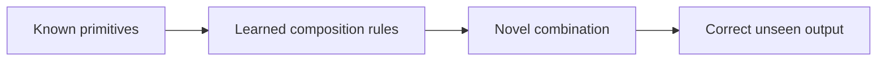

When [[AI Models]] begin to goes beyond [[Next Word Prediction]] to make new combinations of skill mixes, simulating creativity.

# Defining and Describing Compositional Generalization

- 
  
_Compositional generalization is the ability to build correct interpretations of novel combinations from familiar parts._

Compositional generalization refers to a model’s ability to recombine known primitives—such as words, operations, or syntactic structures—into novel configurations that were absent from training. [^1w21a6] [^jjyf9g] It applies when a system must interpret or generate an unfamiliar compound while preserving the rules governing its components, rather than memorizing complete examples. [^1w21a6] [^dyf36g] The concept matters because standard in-distribution performance can remain high even when models fail on systematically withheld combinations. [^jjyf9g]

# Uses in Context

- In **natural-language processing**, the term describes whether a model can interpret a sentence whose familiar words appear in a new syntactic or semantic arrangement. [^1w21a6] [^dyf36g]
- In **semantic parsing**, it describes mapping novel natural-language compositions to logical forms or executable representations, such as SPARQL queries. [^exvk4p] [^1zyfsb]
- In **instruction following**, it is invoked when a model must translate combinations of commands into action sequences that were not present in training. [^1w21a6] [^jjyf9g]
- In **benchmark design**, researchers use controlled train–test distribution shifts to keep primitive elements familiar while changing their combinations. [^exvk4p] [^g43hrf]
- In **large-language-model evaluation**, it distinguishes systematic recombination from surface-level pattern matching or memorization. [^ncnye8] [^3gkx29]

# History of Use

## Origins

- The modern benchmark-driven use of the concept is closely associated with Brenden Lake and Marco Baroni’s **SCAN** work, introduced in 2018 to test systematic generalization using synthetic navigation commands. [^1w21a6] [^7bmuvc]
- SCAN framed the problem as mapping simple imperative language to action sequences while withholding particular compositions from training. [^exvk4p] [^1w21a6]
- The underlying idea is older than SCAN: compositionality in language concerns constructing the meaning of a complex expression from its parts and the way those parts are combined. [^ncnye8]

## Evolution

- **2018 — SCAN:** Lake and Baroni operationalized systematic compositional generalization with synthetic commands such as combinations of navigation actions and modifiers. [^1w21a6] [^7bmuvc]
- **2020 — COGS and CFQ:** Researchers expanded evaluation beyond synthetic commands. COGS tested generalization from English sentences to logical forms, while CFQ tested semantic parsing from questions to SPARQL queries. [^1w21a6] [^1zyfsb]
- **2020s — distribution-controlled evaluation:** The DBCA framework and related work sought to construct splits in which primitive distributions remain similar while compound structures differ substantially, producing a more explicit measure of compositional difficulty. [^exvk4p] [^g43hrf]

# Best Real-World Examples

- [SCAN benchmark](https://github.com/suehuynh/scan-compositional-generalization) — tests whether models can recombine familiar command primitives into unseen action sequences. [^1w21a6] [^7bmuvc]
- [COGS benchmark](https://github.com/sciknoworg/awesome-neurosymbolic-ai) — evaluates compositional generalization from English sentences to logical forms. [^1w21a6] [^1zyfsb]
- [CFQ benchmark](https://github.com/sciknoworg/awesome-neurosymbolic-ai) — evaluates novel compositions in natural-language question answering over Freebase-style SPARQL queries. [^exvk4p] [^1zyfsb]
- [Compositional Program Generator](https://www.frontiersin.org/journals/artificial-intelligence/articles/10.3389/frai.2026.1797587/full) — uses program-like compositional structure to achieve strong performance on SCAN and related tasks. [^jjyf9g]
- [Least-to-most prompting](https://www.alphaxiv.org/@nathanael-scharli) — demonstrates that decomposing a problem into progressively larger subproblems can substantially improve SCAN performance for a language model. [^3gkx29]
- [Neuro-symbolic systems](https://www.frontiersin.org/journals/artificial-intelligence/articles/10.3389/frai.2026.1797587/full) — combine learned language representations with explicit structure to target systematic recombination. [^jjyf9g]
- [Open compositional-generalization repositories](https://github.com/sciknoworg/awesome-neurosymbolic-ai) — provide implementations and collections of SCAN, COGS, CFQ, and related evaluation resources. [^1zyfsb]

# Case Studies

**SCAN and systematic command following.** Lake and Baroni introduced SCAN in 2018 as a controlled test of whether a model could translate imperative commands into action sequences when familiar primitives were combined in unfamiliar ways. [^1w21a6] [^7bmuvc] The benchmark includes splits that withhold particular compositions or lengths from training, so success requires more than reproducing common input–output associations. [^exvk4p] [^1w21a6] Later analyses reported that conventional sequence-to-sequence models could perform very well on in-distribution examples while failing sharply on difficult out-of-distribution splits. [^exvk4p] [^jjyf9g] SCAN therefore became a compact demonstration of the gap between ordinary generalization and systematic compositional generalization. [^1w21a6] [^jjyf9g]

**COGS and compositional semantic parsing.** COGS extended the problem from synthetic navigation commands to English sentences paired with logical forms. [^1w21a6] [^1zyfsb] Its splits intentionally withhold structural configurations, including combinations of familiar vocabulary and argument roles, requiring a model to transfer learned rules to new sentence structures. [^1w21a6] [^dyf36g] Reported results show a pronounced contrast between high in-distribution accuracy and much lower generalization accuracy for standard sequence-to-sequence systems. [^jjyf9g] The case illustrates that compositionality is not limited to short commands: it also concerns systematic transfer across grammatical and semantic structures.

**CFQ and controlled compound divergence.** CFQ applies compositional-generalization testing to natural-language questions and their corresponding SPARQL queries. [^exvk4p] [^1w21a6] [^1zyfsb] The associated distribution-based methodology separates familiar primitive rules from novel compound structures and attempts to maximize the difference between training and test compositions while controlling the difference among atomic components. [^exvk4p] [^g43hrf] This design makes it possible to ask whether a model has learned reusable query-construction rules rather than memorized recurring question templates. [^exvk4p] [^g43hrf] CFQ consequently broadened the evaluation target from toy command following to structured question answering and semantic parsing. [^1w21a6] [^1zyfsb]

***

# Sources

[^exvk4p]: [Neuro-Symbolic pathways to AGI: compositional reasoning ...](https://link.springer.com/article/10.1007/s13748-026-00463-7?error=cookies_not_supported&code=0d1147fa-98e0-4681-b881-358daf0904ab)
[2]: [Neuro-Symbolic pathways to AGI: compositional reasoning and ...](https://link.springer.com/article/10.1007/s13748-026-00463-7?error=cookies_not_supported&code=262e384d-2c8d-4a63-9035-be94a850f8f2)
[^1w21a6]: [Compositional Generalization in NLP: Can LLMs Reason ...](https://rioworld.org/compositional-generalization-in-nlp-can-llms-reason-systematically)
[^jjyf9g]: [Neuro-symbolic NLP: taxonomy, assessment, and directions](https://www.frontiersin.org/journals/artificial-intelligence/articles/10.3389/frai.2026.1797587/full)
[^dyf36g]: [A Diagnostic Framework for Compositional Generalization via NL-to ...](https://link.springer.com/article/10.1007/s10849-026-09480-0?error=cookies_not_supported&code=a3e12e05-0548-434e-a8bc-f1b4e2052a89)
[^g43hrf]: [Measuring Compositional Generalization: A Comprehensive Method on Realistic Data](https://hypepaper.app/papers/8f678780-44f6-49dc-a8d7-22effc06ddbf)
[7]: [github.com › superuserkalianon › cogs-benchmarkGitHub - superuserkalianon/cogs-benchmark: COGS ...](https://github.com/superuserkalianon/cogs-benchmark)
[^ncnye8]: [Mathematical Foundations of Compositional Language ...](https://www.jstage.jst.go.jp/article/tjsai/41/4/41_41-4_AN40-A/_article/-char/en)
[^3gkx29]: [Nathanael Schärli](https://www.alphaxiv.org/@nathanael-scharli)
[10]: [Towards Compositional Generalization of LLMs via Skill Taxonomy ...](https://www.alphaxiv.org/abs/2601.03676)
[^1zyfsb]: [GitHub - sciknoworg/awesome-neurosymbolic-ai: 🕸️ A curated ...](https://github.com/sciknoworg/awesome-neurosymbolic-ai)
[^7bmuvc]: [scan-compositional-generalization/README.md at main ... - GitHub](https://github.com/suehuynh/scan-compositional-generalization/blob/main/README.md)
[13]: [suehuynh/scan-compositional-generalization: A research project on ...](https://github.com/suehuynh/scan-compositional-generalization)
[14]: [Compositionality and Systematic Generalization - Interactive](https://mbrenndoerfer.com/writing/compositionality-systematic-generalization-world-models)
[15]: [66121 | PDF | Artificial Intelligence](https://www.scribd.com/document/938358385/66121)
