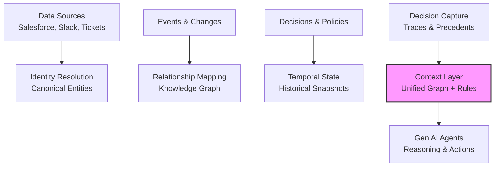

 

_Source: https://enterprise-knowledge.com/what-is-the-difference-between-a-semantic-layer-and-a-context-layer/_

# Defining and Describing Context Layer in Gen AI and Agentic Engineering

_The context layer is the connective tissue that transforms fragmented enterprise data into meaningful, temporal, and decision-aware knowledge for AI agents to reason like humans.[^cg61t4]

In Gen AI and agentic engineering, the context layer acts as foundational infrastructure—a domain knowledge graph or semantic model that unifies identities, relationships, temporal states, and decision logic across systems, enabling AI to move from pattern matching to contextual reasoning. [^cg61t4] [^xqng9s] [^lc29xb] It applies in enterprise AI deployments where agents must handle complex, real-world scenarios involving customer histories, policy constraints, and historical precedents, preventing hallucinations and ensuring trustworthy outputs. [^xqng9s] [^jsxy4b] This matters because without it, AI operates on raw data fragments; with it, agents gain a "source of truth for 'what does this mean'" while data warehouses remain the "source of truth for 'what happened'". [^cg61t4]

# Uses in Context
- In enterprise AI, the context layer serves as "the connective tissue between your data and your AI," storing meaning like "who did what, how things relate, what changed over time, and why certain decisions were made."[^cg61t4]
- For trustworthy data agents, it defines "canonical entities (such as Customer, Account or Incident) and the typed relationships between them, plus bindings into the data world," including identity resolution and ontology for cross-domain integration. [^xqng9s]
- As foundational AI architecture, it is a "domain knowledge graph: a structured, industry-specific model of how a business works," encoding entities, relationships, state, and constraints like "what’s normal versus exceptional."[^lc29xb]
- It extends semantic layers by integrating "dynamic contextual information (through a context graph), capturing changing, temporal relationships, user interactions, operational patterns, and agentic behaviors."[^ik86aa]
- In knowledge engineering, it provides "operational context: governance rules, data lineage, temporal awareness, access controls, and business policies," acting as the "engine room for knowledge engineering and reliable AI."[^jsxy4b]
- Across tiers, it combines "structural context (definitions, relationships), operational context (rules, procedures), and behavioral context (patterns, preferences, historical lessons)" for agentic decision-making. [^r6zyzp]

> [!EXCERPT] A note from [[ChromaDB]]  cofounder and CEO, Jeff Huber
> 
> In 1913, Henry Ford introduced the moving assembly line at his Highland Park plant. The innovation was not the assembly line itself (interchangeable parts and division of labor predated Ford by decades). It was speed. The chassis assembly time fell from twelve and a half hours to ninety-three minutes. The Model T's price collapsed from $850 in 1908 to $260 by 1925, even as Ford raised wages to $5 a day, double the industry standard. Competitors who could not match the velocity could not match the price, could not match the wages, and could not, ultimately, survive in the form they had previously taken.
> 
> The same change is coming for knowledge work. AI is already radically accelerating the productivity of individual software engineers. Soon, AI itself will be the substrate the entire business runs on. All information about the business will flow into the AI, all information will be routed by AI, all decisions will be made in and through AI, the business will become mostly AI. Humans still have an important role to play. The T-shape of human capability exists. Strong generalists with great taste will continue to drive meaningfully better decisions than AI alone. Deep specialists can as well. Everything else will fall away - because the competitive forces of the market will demand it. 
> 
> What is the “production line” of knowledge work? What technology will be the engine of this future? 
> 
> The models have an important role to play. Frontier models (the latest and greatest models) will play a decreasing role in the future. You will pull in super intelligence when you need to - but most tasks inside a business do not need superintelligence. The model layer will democratize and open-source models will serve 90%+ of the workload for enterprise automation. This is already happening and Deepseek, Kimi, and Qwen are used extensively in large organizations (more than 50% of tokens on OpenRouter are open source models and this is increasing). If the models will commoditize - then firms must not engage in the existential risk of vendor concentration by shipping all their data to the closed-gardens of the labs. Firms must remain fiercely independent.
> 
> For a long time - the bottleneck in AI was intelligence, but now the latest generation of closed and open source models have cleared that bar for most work. The bottleneck is great knowledge, great context.
> 
> The most competitive firm will have the best intelligence. They will know what they know, and they will be ravenous learning machines. In human-coordinated organizations, barely anything gets written down. All tacit knowledge is in the heads of the team - but scattered and disparate. In the future, everything the organization knows will live in the “mind of the AI”. And because the AI knows everything, it will be able to compound - gathering information and fitting it its existing understanding.
> 
> But the models themselves are stateless. So where will this all be written down, organized, and utilized? 
> 
> The current clear line of sight here I call the context layer. The context layer is a human-legible corpus of everything the organization knows about. It is versioned, it has strong lineage, it implements strong access control and privacy and knows about all teams. It looks a lot like an “internet”. A set of authoritative pages that are deeply interlinked. All information in the organization flows into it - and the AI continually updates it. This is the AI organizational memory. 
> 
> The context layer has 9 requirements. 
> 
>     •    It must store unstructured and multimodal data, which means rigid schemas are off the table. That eliminates the relational stack — Postgres with pgvector bolted on is a tactical patch, not a substrate. 
>     •    It must operate at massive scale, holding both distilled memory and the raw underlying data, which eliminates boutique vector databases that were architected for a smaller era of the problem. 
>     •    It must find the right information for any task with high accuracy across a giant corpus, which means retrieval is the product, not a feature — and the companies treating retrieval as a feature will lose to companies treating it as the entire system. 
>     •    It must be driven by purpose-built models for updating and finding information, because frontier-model-in-a-loop is too slow and too expensive at the access patterns agents actually generate; this is a capability that requires both model training and infrastructure under one roof, which almost no one has. 
>     •    It must scale up for bursty agentic workloads and scale to zero, which the legacy data infrastructure — built for analytics and apps, not for agents — cannot do without being rebuilt. 
>     •    It must run in the customer's VPC and be open-source, because the context layer holds the keys to the kingdom and no large enterprise will hand that to a closed SaaS vendor; this eliminates the hyperscaler and closed-source offerings.
>     •    It must support versioning, lineage, and auditing as first-class primitives, not afterthoughts. 
>     •    It must have strong access control and governance, because the same data has different visibility for different agents and different humans.
>     •    It must be continually self-optimizing by taking feedback from the environment.
> No incumbent satisfies all of these. Many satisfy two or three. The architectural decisions required to satisfy all eight have to be made at the beginning, not retrofitted.
> Chroma's mistake so far is that we were early. In January 2023 we saw how this was going to play out, and we chose the ambitious, capital-intensive path: build the infrastructure primitives that the future needs.
> 
> We've done it. We are running context layer workloads for the largest enterprises and the fastest-growing startups in the world. We've built one of the most recognized brands in developer AI — familiar to tens of millions of developers, taught by countless YouTubers and professors. Our downloads curve continues to hockey-stick, now past 15 million per month. We've built the core database, and we've trained a state-of-the-art model for agentic search — the first of its kind. The combination of infrastructure and purpose-built models, under one roof, is the moat. No one else is positioned to do both.
> 
> Are we still early? yes. But are we right? Also yes. 
> 
> Where will value accrue in AI over a 5 year time horizon? It will accrue to the organization that can unlock this AI business transformation through technology and forward-deployed engineering. Chroma is building the context layer for AI-native companies: the open, governed, self-improving memory system that every agent, employee, workflow, and model uses to understand the business. This is the case for Chroma.
> 
> By investing in Chroma now - you are making a few following bets:
>     •    That AI will transform how businesses operate, and the market will demand it.
>     •    That the context layer will enable that transformation, and that its workload demands cannot be served by legacy infrastructure.
>     •    That Chroma can execute on the technology and product roadmap.
>     •    That Chroma can capture the market's attention.
>     •    That Chroma can build a high-powered sales org and a high-powered FDE practice and install this into every leading startup and every Fortune 2000.
> 2026 is the year of context. The future belongs to Chroma.
> 

# History of Use

## Origins
The term "context layer" emerged in enterprise AI discussions around 2024–2025, pioneered by indie practitioners and startups like Trackmind, which described it as essential for connecting data warehouses to AI via identity resolution, relationship mapping, temporal state, and decision capture. [^cg61t4] Chris Tabb, an indie voice on LinkedIn, formalized it as comprising "meta-model management, glossary and ontology connectors, lineage and provenance services, policy and rules execution, and metadata activation," positioning it as infrastructure for reliable AI. [^jsxy4b]

## Evolution
- **2024:** Snowflake adapted the concept for data agents, defining it as a "relationship and identity layer (often called 'ontology')" with canonical entities, typed relationships, and bindings to physical data for safe cross-domain queries. [^xqng9s]
- **2025:** SymphonyAI expanded it to "foundational AI architecture" as a domain knowledge graph capturing business state, constraints, and propagation rules, moving AI "from insight to infrastructure."[^lc29xb]
- **2025–2026:** Distinctions from semantic layers solidified, with context layers adding "multidimensional operational map" via context graphs for temporal, behavioral, and agentic elements, as articulated by Enterprise Knowledge. [^ik86aa]

# Best Real-World Examples
- [Trackmind Context Layer](https://www.trackmind.com/context-layer-enterprise-ai) builds identity resolution, relationship graphs, temporal state, and decision traces for enterprise AI reasoning. [^cg61t4]
- [Snowflake Agent Context Layer](https://www.snowflake.com/en/blog/agent-context-layer-trustworthy-data-agents/) provides ontology with entity bindings and identity mappings across CRM, support, and analytics. [^xqng9s]
- [SymphonyAI Context Layer](https://www.symphonyai.com/resources/blog/ai/context-layer-ai-domain-knowledge-graph/) encodes industry-specific knowledge graphs for entities like customers, SKUs, and regulatory constraints. [^lc29xb]
- [DataHub Context Layer](https://datahub.com/blog/context-layer-vs-semantic-layer/) unifies metadata from 100+ sources into event-driven graphs with lineage, policies, and temporal awareness. [^jsxy4b]
- [Roadie Context Engineering](https://roadie.io/blog/context-engineering-for-developers-ai-infrastructure/) offers entity graphs for service metadata, dependencies, and SLOs queryable by AI agents via API. [^vjeo6n]
- [Metadata Weekly Context Product](https://metadataweekly.substack.com/p/just-as-the-data-warehouse-defined) creates verified units of organizational understanding with data assets, queries, and human-in-the-loop seeding. [^r6zyzp]

# Case Studies

Trackmind, an enterprise AI startup, introduced a practical context layer in 2025 to address AI's inability to reason about fragmented data, ingesting from APIs, event streams, and change data capture to build a knowledge graph with unified identities (e.g., resolving "Sarah Chen" across Salesforce, Slack, and tickets). [^cg61t4] They captured temporal states—like policy versions or account health at decision time—and decision traces as searchable precedents, enabling AI to recommend exceptions based on similar past cases (e.g., customer outages with VP promises). [^cg61t4] This shifted AI from "pattern matching on fragments" to human-like situational reasoning, establishing the context layer as the "source of truth for 'what does this mean'" in agentic systems. [^cg61t4] It demonstrates how indie practitioners pioneer infrastructure that big tech later adopts, countering data silos in Gen AI.

In 2025, [[Tooling/Software Development/Cloud Infrastructure/Snowflake|Snowflake]] launched its Agent Context Layer as an evolution of semantic models, targeting trustworthy data agents by defining a "relationship and identity layer" with canonical entities (Customer, Account, Incident) and mappings across systems (e.g., CRM vs. support IDs). [^xqng9s] Integrated with analytic semantic models, it enabled cross-domain queries without SQL knowledge, using ontologies (OWL/RDF or curated graphs) for synonym handling and constraints. [^xqng9s] Post-launch, it powered agentic workflows in governed data products, reducing integration risks and hallucinations. This case shows the context layer's role in scaling agentic engineering at data platforms, bridging raw data to AI action while adopters like Snowflake popularize startup-originated patterns. [^xqng9s]

DataHub's 2025 context layer implementation unified metadata from Snowflake, Databricks, dbt, Looker, Notion, and Confluence into an event-driven "unified context graph," extending semantic definitions with governance, lineage, temporal awareness, and policies. [^jsxy4b] Drawing from Chris Tabb's blueprint, it activated metadata for AI via real-time updates, ensuring agents reasoned from current states. [^jsxy4b] Organizations using it reported reliable AI outputs in dynamic environments, with "context layering" transforming data into agentic intelligence. This indie/open-source evolution highlights how context layers enable smaller teams to outpace incumbents in knowledge engineering for Gen AI. [^jsxy4b]

# Images

_Source: https://atlan.com/know/context-layer-for-ai-agents/_

_Source: https://dotnettutorialweb.wordpress.com/basic-entity-framework-concept/_

_Source: https://metadataweekly.substack.com/p/gartner-d-and-a-2026-where-the-context_

_Source: https://metadataweekly.substack.com/p/ontologies-context-graphs-and-semantic_

***

# Sources

[^cg61t4]: [How to Build a Context Layer for Enterprise AI | Trackmind](https://www.trackmind.com/context-layer-enterprise-ai)
[^xqng9s]: [The Agent Context Layer for Trustworthy Data Agents - Snowflake](https://www.snowflake.com/en/blog/agent-context-layer-trustworthy-data-agents/)
[^lc29xb]: [The Context Layer: How AI moves from insight to infrastructure](https://www.symphonyai.com/resources/blog/ai/context-layer-ai-domain-knowledge-graph/)
[^ik86aa]: [What is the Difference Between a Semantic Layer and a Context ...](https://enterprise-knowledge.com/what-is-the-difference-between-a-semantic-layer-and-a-context-layer/)
[^jsxy4b]: [Context Layer vs Semantic Layer Explained | DataHub](https://datahub.com/blog/context-layer-vs-semantic-layer/)
[^r6zyzp]: [Just as the Data Warehouse Defined BI, the Context Layer Will ...](https://metadataweekly.substack.com/p/just-as-the-data-warehouse-defined)
[^vjeo6n]: [Context Engineering for Developers: The Infrastructure Layer That ...](https://roadie.io/blog/context-engineering-for-developers-ai-infrastructure/)
[8]: [The Context Layer (Semantic Layer) In Enterprise AI (And Where ...](https://joshbersin.com/podcast/the-context-layer-semantic-layer-in-enterprise-ai-and-where-business-rules-go/)
