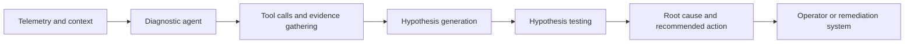

[[concepts/Market-Categories/Digital Twins for Critical Infrastructure|Digital Twins for Critical Infrastructure]]
[[content-areas/AI-Factories-Datacenters/Concepts/Building Energy Management Systems|Building Energy Management Systems]]
[[Physical AI]]
[[Real-World Telemetry]]
[[concepts/Market-Categories/Data Center Infrastructure Management Systems|Data Center Infrastructure Management Systems]]

[[content-areas/AI-Factories-Datacenters/Organizations/Virtana|Virtana]]

# Defining and Describing Diagnostic AI Agents

_Diagnostic AI agents turn system telemetry into an evidence-backed explanation of what went wrong and what to do next._

A **diagnostic AI agent** is an AI system that continuously or interactively gathers evidence from logs, metrics, traces, topology data, tickets, and other operational sources; forms and tests hypotheses; and identifies the most likely cause of an incident. In observability, the paradigm extends beyond alerting: agents may “diagnose, localize, and may even remediate issues automatically.”[14] In datacenter and AI-factory operations, the concept applies when infrastructure complexity exceeds what operators can efficiently inspect manually, particularly across interdependent services, hardware, networks, clusters, and workloads.[13][14]

A diagnostic agent differs from a conventional analytics dashboard or anomaly detector because it chooses investigative steps, retrieves additional evidence, compares competing explanations, and produces a causal account rather than merely reporting that a signal is abnormal.[1][6][11]

# Uses in Context

- **Incident response:** An agent investigates an outage by correlating logs, metrics, traces, and service dependencies, then ranks likely causes instead of sending an undifferentiated alert.[13][14]
- **[[concepts/Explainers for AI/Root-Cause Analysis in Agentic DCIMs]]:** Research systems describe the task as reconstructing a chain of effects, not simply naming the service that appears abnormal.[1]
- **Cloud and microservice operations:** LLM-based RCA agents are being studied as interactive systems for diagnosing failures across application services and Kubernetes layers.[2][4]
- **AI-workload operations:** [[Vocabulary/Multi-Agent Automation|Multi-Agent Systems]] tems can consolidate historical incidents and iteratively test hypotheses against live evidence, emulating expert diagnostics.[5]
- **Industrial and physical-process monitoring:** Evidence-grounded agents can combine a digital twin with tool-augmented reasoning to evaluate competing hypotheses and identify physical faults.[11]
- **Autonomous observability:** A common invocation describes agents that continuously consume telemetry and logs, diagnose incidents, and sometimes execute remediation without waiting for a human operator.[14]

# History of Use

## Origins

The exact first use of the phrase **“diagnostic AI agents”** is not established by the available search results. The underlying concept emerged from the convergence of automated root-cause analysis, observability, tool-using language-model agents, and multi-agent systems. Recent research frames RCA as an “observable diagnostic process,” emphasizing the agent’s investigative trajectory and evidence use rather than only the correctness of its final label.[1] Other work formalizes agentic RCA as iterative evidence gathering, hypothesis evaluation, and fault identification, including settings where the agent does not rely on fault-specific training.[11]

## Evolution

- **2025 — From anomaly detection to autonomous observability:** The autonomous-observability framing expanded monitoring agents from metric analysis into root-cause localization and possible remediation; one described deployment used separate metric and root-cause agents connected to telemetry, traces, and dependency knowledge.[14]
- **2025–2026 — Tool-using and multi-agent RCA:** Research increasingly decomposed diagnosis into specialized activities such as runtime data collection, data analysis, hypothesis generation, validation, and report writing.[10][12]
- **2026 — Evaluation of investigative process:** New benchmarks began measuring not only whether agents reached the correct diagnosis but also whether they gathered sufficient evidence and followed a plausible investigative path. [[Sources/Standards-and-Specs/Cloud-OpsBench]] reported a gap between joint RCA accuracy and evidence-closure rates, indicating that a correct final answer can overstate the quality of an agent’s reasoning process.[4]

# Best Real-World Examples

- [AgentRCA](https://arxiv.org/abs/2607.22385) — a zero-shot, evidence-grounded agent that combines a digital twin with tool-augmented reasoning and tests competing hypotheses in industrial systems.[11]
- [TSGuard](https://arxiv.org/html/2506.01481) — a multi-agent system for user-centric diagnosis of incidents in AI workloads, using historical knowledge and real-time hypothesis testing.[5]
- [GALA+](https://arxiv.org/html/2608.08968v1) — a graph-augmented LLM framework that uses service dependencies to constrain investigation and produce ranked diagnoses and action recommendations.[7]
- [MA-RCA](https://link.springer.com/article/10.1007/s40747-025-02096-0) — a multi-agent RCA design assigning separate agents to data collection, analysis, hypothesis generation, validation, and reporting.[10]
- [Cloud-OpsBench](https://www.alphaxiv.org/abs/2603.00468) — a reproducible benchmark containing 754 runtime-verified cloud-failure cases across 57 fault types and two microservice workloads.[4]
- [Autonomous observability agents](https://www.computer.org/publications/tech-news/community-voices/autonomous-observability-ai-agents) — an architecture in which metric and root-cause agents correlate telemetry, distributed traces, causal signals, and knowledge graphs.[14]
- [AWS Autonomous Operations Solution](https://aws.amazon.com/solutions/case-studies/c-spire-case-study/) — an adopter deployment described as an always-on expert for network operations, automating repetitive diagnostics and collecting data to guide technicians.[3]

# Case Studies

**AgentRCA and industrial fault diagnosis.** In 2026, researchers described AgentRCA as a zero-shot framework for evidence-grounded root-cause analysis in a multiphase-flow facility and a large-scale chemical plant.[11] The system combined a data-driven digital twin representing normal system dynamics with a tool-augmented language model.[11] Rather than mapping a known symptom directly to a predefined fault, it gathered statistical evidence, evaluated competing hypotheses, and selected the physical fault that best explained the observed behavior.[11] The case shows how diagnostic agents can extend beyond software observability into industrial processes, provided they have a reliable system model and access to inspectable evidence.[11]

**TSGuard and AI-workload incidents.** TSGuard was proposed as a two-phase multi-agent system for automated diagnosis of incidents affecting AI workloads.[5] Its offline phase consolidated internal knowledge from historical incidents, while its online phase iteratively tested hypotheses in real time until it confirmed a root cause.[5] The design illustrates an important operational pattern: historical postmortems and incident records are not merely documentation but can become structured diagnostic knowledge used during future investigations.[5]

**Autonomous observability in production analytics.** A documented Fortune 100 manufacturing example deployed observability agents across microservices and ETL nodes in a multi-cloud AI platform.[14] The account reports that mean time to detect fell from 20 minutes to under two minutes, 60% of routine incidents were resolved autonomously, false-positive alerts dropped by 50% after six months, and uptime improved by 3%.[14] The same account describes a root-cause agent tracing a Black Friday latency spike to a misconfigured partition in a Spark job that manifested only at scale.[14] This case demonstrates both the promise and the operational boundary of diagnostic agents: they can compress detection and investigation time, but their value depends on broad telemetry coverage, dependency context, and feedback from incident outcomes.[14]

***

# Sources

[1]: [Beyond Fault Localization: A Trajectory-Level Study of LLM ...](https://www.alphaxiv.org/abs/2608.21310)
[2]: [A Stage-attributed Triage and Repair framework for RCA Agents in ...](https://arxiv.org/abs/2605.15581)
[3]: [C Spire Success Story](https://aws.amazon.com/solutions/case-studies/c-spire-case-study/)
[4]: [Cloud-OpsBench: A Reproducible Benchmark for Agentic Root ...](https://www.alphaxiv.org/abs/2603.00468)
[5]: [TSGuard: Automated User-Centric Incident Diagnosis for AI ...](https://arxiv.org/html/2506.01481)
[6]: [AI Root Cause Analysis Shifts from Model Reasoning to ...](https://www.infoq.com/news/2026/07/ai-rca-context-engineering/)
[7]: [GALA: Graph-Augmented LLM Agents for Root Cause Analysis and ...](https://arxiv.org/html/2608.08968v1)
[8]: [Why Do AI Agents Systematically Fail at Cloud Root Cause Analysis ...](https://www.alphaxiv.org/abs/2602.09937v1)
[9]: [AgentRx: Diagnosing AI Agent Failures from Execution ...](https://www.alphaxiv.org/abs/2602.02475)
[10]: [Leveraging multi-agent framework for root cause analysis](https://link.springer.com/article/10.1007/s40747-025-02096-0?error=cookies_not_supported&code=1733a664-d140-42f4-87ef-a2a1b915687d)
[11]: [Agentic Root Cause Analysis through Evidence-Grounded ...](https://arxiv.org/abs/2607.22385)
[12]: [Leveraging multi-agent framework for root cause analysis - Complex & Intelligent Systems](https://link.springer.com/article/10.1007/s40747-025-02096-0?error=cookies_not_supported&code=b70c94b3-4470-4c64-8acf-29b8690979a1)
[13]: [CMC | Free Full-Text | Graph-Augmented Multi-Agent Robust ...](https://www.techscience.com/cmc/v88n1/67280/html)
[14]: [Autonomous Observability: AI Agents That Debug AI](https://www.computer.org/publications/tech-news/community-voices/autonomous-observability-ai-agents)
[15]: [Uncovering Reasoning Failures in LLMs for Cloud-Based ...](https://www.alphaxiv.org/abs/2601.22208)
