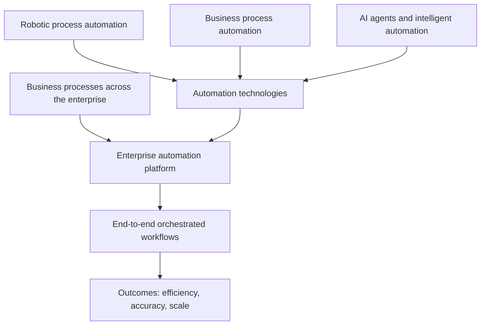

# Defining and Describing Enterprise Automation

_Enterprise automation is the practice of using technology—especially software, AI, and orchestration systems—to execute, coordinate, and continuously improve business and IT processes across an entire organization, not just isolated tasks. [^0av8i8] [^fn51b9] [^z1vwou] [^j71dc3] [^ly7e91]_

Across recent sources, **enterprise automation** is described as the *strategic use of technology to integrate, streamline, and automate business processes across an organization* and to create a *unified operational architecture built for speed, accuracy, and scale*. [^fn51b9] [^z1vwou] [^j71dc3] [^ly7e91] It goes *well beyond task-level tools like robotic process automation* by weaving automation into multiple departments, systems, and data operations at scale. [^0av8i8] [^z1vwou] [^ly7e91] [^zo5kv8] This concept is increasingly tied to **agentic AI**, where AI agents orchestrate workflows, connect siloed systems, and enable end-to-end, event‑driven operations across large enterprises. [^0av8i8] [^z1vwou] [^0l86wp] [^fzxm5y] [^h9n4om]

## Uses in Context

- Enterprise automation is invoked to describe *“the practice of using technology to execute, orchestrate, and continuously improve processes across business functions, IT systems, and data operations at scale”*, emphasizing orchestration and continuous optimization rather than one‑off scripts. [^0av8i8]

- Strategy articles use the phrase to mean *“the strategic use of technology to integrate, streamline, and automate business processes across an organization”*, stressing that it is *“a shift in mindset – from scattered, tool-specific automations to a unified operational architecture”*. [^fn51b9]

- Vendors describe enterprise automation as *“the holistic integration of software, artificial intelligence, and robotic process automation (RPA) to execute end-to-end business processes across an organization”*, contrasting it with *“isolated task automation”*. [^z1vwou]

- Guides for large organizations define it as *“the coordinated use of technology to streamline, manage, and optimize complex business processes across an entire organization,”* explicitly highlighting the connection of systems, departments, and workflows so multi-person tasks become automated flows. [^j71dc3]

- Implementation-focused content frames enterprise automation as *“the coordinated deployment of technology to automate complex business processes across departments and functions within large organizations,”* integrating BPA, RPA, and intelligent automation to build *“seamless, end-to-end systems.”* [^ly7e91]

- AI‑centric sources in 2026 summarize it simply as technology that *“takes on repetitive business tasks so people don't have to do them manually,”* then expand the meaning to *“adding an AI agent orchestration layer on top of your current systems, not tearing them out and starting over.”* [^fzxm5y]

## History of Use

### Origins

- Workflow and process automation in enterprises date back decades, with accounts of *“enterprise workflow in its truest sense—complex, powerful, and extraordinarily expensive”* describing early large-scale workflow systems built for paper-based and mainframe-era business processes. [^p5h4wl] [^0419us]

- The more specific term **enterprise automation** emerges in industry writing as large organizations sought to unify scattered automation efforts; recent glossaries and strategy pieces define the term as a distinct concept that *goes beyond task-level tools like robotic process automation* and covers orchestration across “business functions, IT systems, and data operations.” [^0av8i8] [^fn51b9] [^z1vwou]

- Contemporary usage is anchored in mid‑2020s practitioner and vendor literature rather than classic academic papers, with blogs, glossaries, and implementation guides framing enterprise automation as a response to fragmented RPA and workflow tools and as part of broader “intelligent automation” and “enterprise AI” discussions. [^0av8i8] [^fn51b9] [^z1vwou] [^ly7e91] [^zo5kv8] [^fzxm5y]

### Evolution

- **Pre-2000s–2010s: Enterprise workflow and scheduling systems**  
  Accounts of “enterprise workflow in its truest sense—complex, powerful, and extraordinarily expensive” describe early workflow and job scheduling platforms in large organizations, focused on managing complex, cross-system processes but without the AI‑centric framing of automation seen later. [^p5h4wl] [^0419us]

- **2010s–early 2020s: From RPA and BPA to unified enterprise automation**  
  As robotic process automation (RPA), business process automation (BPA), and workflow tools proliferated, industry sources began contrasting *basic task automation* with *enterprise automation built to scale across all departments and systems*, emphasizing integration, SLA management, and cross-system dependencies. [^z1vwou] [^ly7e91] [^zo5kv8] [^dm9m02]

- **Mid‑2020s: AI agents and orchestration‑led enterprise automation**  
  By 2025–2026, articles define enterprise automation as *“the holistic integration of software, artificial intelligence, and robotic process automation (RPA) to execute end-to-end business processes”* and, in AI-focused hubs, as *“adding an AI agent orchestration layer on top of your current systems.”* [^z1vwou] [^fzxm5y] [^h9n4om] This marks a shift toward agentic AI, autonomous decision-making, and multi‑system orchestration as core features of enterprise automation platforms. [^0av8i8] [^z1vwou] [^0l86wp] [^fzxm5y] [^h9n4om]

## Best Real-World Examples

- [Beta Systems ANOW! Suite](url) — Presented as an “Intelligent SOAP (Service Orchestration Automation Platform)” with “500+ integrations, cloud-native, data sovereignty,” positioned to orchestrate and schedule complex IT and business workflows across hybrid environments. [^dm9m02]

- [Redwood RunMyJobs](url) — Described as an enterprise automation platform for SAP-centric enterprises, offering “SAP-endorsed, 99.95% uptime SLA” and end‑to‑end batch and cloud job automation for large organizations. [^dm9m02]

- [Turbotic](url) — [[Turbotic]] — Listed among “leading enterprise automation platforms,” focusing on scalable automation portfolios, AI orchestration, and governance across multiple tools and departments in large enterprises. [^h9n4om]

- [UiPath](url) — [[Tooling/Enterprise Jobs-to-be-Done/Integration Platforms/Workato|Workato]] — Cited as a top enterprise automation software that “automates repetitive business processes using AI-powered robotic process automation,” combining RPA with process mining and document understanding to streamline operations at enterprise scale. [^dm9m02] [^dchg6q] [^h9n4om]

- [Workato](url) — [[Tooling/Enterprise Jobs-to-be-Done/Integration Platforms/Workato|Workato]] — Characterized as a platform that “combines enterprise integration with intelligent automation,” using recipe-based designs to automate complex workflows, synchronize data, and support digital transformation initiatives. [^dchg6q] [^h9n4om] [^xj2yzm]

- [Microsoft Power Automate](url) — Named as a tool that “connects apps and services to automate workflows” such as approvals and notifications across organizations with minimal coding, often adopted as a backbone for automation in Microsoft-centric enterprises. [^dchg6q] [^h9n4om] [^xj2yzm]

- [ServiceNow](url) — [[Tooling/Enterprise Jobs-to-be-Done/ServiceNow|ServiceNow]] — Described as automating IT, HR, finance, and customer service workflows through a unified platform with strong governance, widely deployed for cross-department workflow standardization in large organizations. [^dchg6q] [^h9n4om] [^xj2yzm]

## Case Studies

### Case Study 1: A mid-size vendor orchestration platform outgrows traditional schedulers

Beta Systems’ description of its **ANOW! Suite** illustrates how a specialized provider expands beyond traditional batch schedulers into a full enterprise automation platform. [^dm9m02] The suite is promoted as an “Intelligent SOAP (Service Orchestration Automation Platform)” designed to “orchestrate, schedule, and manage complex IT and business workflows across on-premises, cloud, and hybrid environments,” explicitly differentiating itself from “basic task schedulers, robotic process automation tools, or no-code business tools.” [^dm9m02] By supporting “event-driven workloads, cross-system dependencies, SLA compliance, and large-scale job execution across distributed infrastructure,” the platform shows how enterprise automation in practice depends on cross-system orchestration and governance, not just task robotics. [^dm9m02] This case exemplifies the move from siloed automation tools toward a unified orchestration layer that can coordinate IT and business processes while maintaining reliability and regulatory compliance. [^dm9m02]

### Case Study 2: SAP-centric enterprises standardizing automation with RunMyJobs

Redwood’s **RunMyJobs** platform is presented as an archetype for automation in SAP-heavy organizations, where legacy ERP systems and modern cloud services must operate in concert. [^dm9m02] Sources describe RunMyJobs as best suited for “SAP-centric enterprises,” emphasizing its “SAP-endorsed, 99.95% uptime SLA” and positioning it to manage end‑to‑end batch and cloud job automation. [^dm9m02] In this scenario, large enterprises use RunMyJobs to centralize scheduling and automation for complex, time-sensitive processes such as financial closes, supply chain updates, and data warehousing loads, many of which span multiple SAP modules and external systems. [^dm9m02] The high uptime guarantees and SAP alignment illustrate how enterprise automation must blend deep system expertise with robust operational assurances when deployed in mission-critical environments. [^dm9m02]

### Case Study 3: AI-led orchestration layers on top of existing systems

AI-focused commentary in 2026 argues that “enterprise automation is technology that takes on repetitive business tasks so people don't have to do them manually,” but then clarifies that in practice “enterprise automation means in 2026: adding an AI agent orchestration layer on top of your current systems, not tearing them out and starting over.” [^fzxm5y] In such implementations, organizations keep their CRM, ERP, data warehouse, and ticketing tools, while AI agents orchestrate workflows such as customer onboarding, invoice processing, or incident resolution by calling APIs, triggering RPA bots, and updating records automatically. [^0av8i8] [^z1vwou] [^0l86wp] [^fzxm5y] [^h9n4om] This case pattern highlights the contemporary evolution of enterprise automation: instead of replacing existing stacks, enterprises overlay intelligent, agentic coordination that can adapt, monitor, and optimize workflows across many tools, aligning with the mid‑2020s framing of enterprise automation as holistic integration of AI, software, and RPA for end‑to‑end processes. [^z1vwou] [^fzxm5y] [^h9n4om]

***

# Sources

[^0av8i8]: [Ai-Powered And Agentic...](https://www.griddynamics.com/glossary/enterprise-automation)
[^fn51b9]: [Enterprise Automation: Strategy, Solutions, and Real-World Impact](https://binariks.com/blog/enterprise-automation/)
[^z1vwou]: [Enterprise Automation: How Orchestration Transforms Work](https://www.automationanywhere.com/company/blog/automation-ai/enterprise-automation-how-orchestration-transforms-work)
[^0l86wp]: [Enterprise Automation: Types & Business Impact](https://coworker.ai/blog/enterprise-automation)
[^j71dc3]: [A Guide to Enterprise Automation - Roketto](https://www.helloroketto.com/articles/enterprise-automation)
[6]: [What is Enterprise Automation?](https://latenode.com/blog/enterprise-automation)
[^ly7e91]: [How to Succeed with Enterprise Automation in 2026 - Riseup Labs](https://riseuplabs.com/how-to-succeed-with-enterprise-automation/)
[^p5h4wl]: [From Paper to Power Platform: The Revolutionary History of ...](https://jonbeckett.com/2026/01/11/business-automation-workflow-evolution/)
[^zo5kv8]: [What Is Enterprise Automation? Components, Benefits & Strategies](https://hexaware.com/blogs/the-imperative-of-enterprise-automation-your-businesss-next-big-leap/)
[^0419us]: [History of Workflow Automation (2026): IFTTT to AI Agents](https://www.taskade.com/blog/automation-history)
[^dm9m02]: [5 Best Enterprise Automation Platforms in 2026 - Beta Systems](https://www.betasystems.com/resources/blog/best-enterprise-automation-platforms)
[^dchg6q]: [Top Enterprise Automation Software - Analytics Insight](https://www.analyticsinsight.net/ampstories/automation/top-enterprise-automation-software)
[^fzxm5y]: [Enterprise Automation Solutions, Systems & Services (2026)](https://www.happyrobot.ai/hub/enterprise-automation)
[^h9n4om]: [10 Scalable Enterprise Automation Platforms in 2026 - Turbotic](https://turbotic.com/resources/blog/scalable-enterprise-automation-platforms-2026)
[^xj2yzm]: [7 Pro Automation Platforms for Smarter Enterprise Workflows](https://viasocket.com/discovery/blog/vl5gl0/7-pro-automation-platforms-for-smarter-enterprise-workflows)
