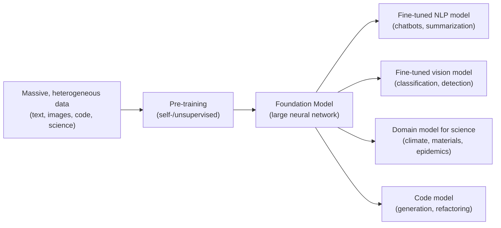

:::toolkit
- [[Tooling/AI-Toolkit/Model Producers/OpenAI|OpenAI]]
- [[Tooling/AI-Toolkit/Model Producers/Anthropic|Anthropic]]
- [[Tooling/AI-Toolkit/Model Producers/Mistral|Mistral]]
- [[Tooling/AI-Toolkit/AI Interfaces/OLlama|OLlama]]
- [[organizations/Google Labs|Google Labs]]
- [[organizations/DeepMind|DeepMind]]
- [[Tooling/AI-Toolkit/Models/Gemini|Gemini]]
- [[Tooling/AI-Toolkit/Models/Gemma|Gemma]]
- [[Tooling/AI-Toolkit/Models/Claude|Claude]]
:::

# Defining and Describing Foundation Models in AI

_Think of a foundation model as a single, massive AI brain pre‑trained on the world’s data that you can specialize for countless downstream tasks._

Foundation models are **large-scale AI or machine learning models pre‑trained on massive, diverse datasets**—often using self‑supervised or unsupervised learning—that can later be adapted or fine‑tuned for many different applications. [^wnzh6f] [^1e8fay] [^5uth46] The term reflects the idea that one general model serves as a **“foundation”** or base for building specialized systems, rather than training a separate model from scratch for each use case. [^wnzh6f] [^1e8fay] [^5uth46] They are typically implemented as deep neural networks and exhibit **emergent capabilities**, performing tasks they were not explicitly trained to do, which makes them central to modern generative AI and broader AI ecosystems. [^1e8fay] [^q4dyb7] [^0zodgv] Their importance lies in dramatically lowering the cost and time to deploy powerful AI, enabling reuse of a single pre‑trained model across domains such as language, vision, code, and scientific discovery. [^wnzh6f] [^1e8fay] [^q4dyb7] [^0zodgv]

# Uses in Context

- In **generative AI**, foundation models are described as *“artificial intelligence models trained on vast amounts of data, often using unsupervised or self‑supervised learning methods, to develop a deep, broad understanding of the world”* that can then be adapted to many tasks. [^wnzh6f]  
- Industry and cloud vendors invoke the term to describe **general-purpose base models** that *“are trained on a massive amount of data and can be adapted to a wide range of tasks”*, sometimes called **“base models”** in platform documentation. [^1e8fay] [^f8ikqu]  
- Educational and practitioner materials use the term for models that let organizations *“utilize the same pre‑trained foundation model and just do some fine‑tuning along the way”* instead of building bespoke models for every application. [^5uth46]  
- Policy and science bodies adopt “AI-based foundation models” to describe **large neural networks pre‑trained on trillions of data points** that, after fine‑tuning, can perform a range of scientific tasks and *“learn new ways of modeling information”* for discovery. [^q4dyb7] [^0zodgv]  
- Open-source and enterprise AI communities talk about **foundation models as a new paradigm** where pre‑training at scale plus transfer learning provide a general substrate, with one report noting that their *“ability to work across different kinds of tasks”* and self‑supervised training are key characteristics. [^q4dyb7]  

# History of Use

## Origins

- The term **“foundation model”** in its modern AI sense was **coined by the Stanford Institute for [[concepts/Explainers for AI/Human-Centered Artificial Intelligence]] (HAI) in 2021** to describe a new class of large pre‑trained models that serve as a base for many tasks. [^1e8fay]  
- Stanford’s influential report (Bommasani et al., 2021, *“On the Opportunities and Risks of Foundation Models”*) introduced the term in an academic context to capture models like large language models and vision transformers that share a common pre‑training‑plus‑adaptation pattern across modalities. [^1e8fay] [^0zodgv]  

## Evolution

- **2021–2022 – Concept formalization and early analysis.** The [[organizations/Stanford Institute for Human-Centered Artificial Intelligence|Stanford Institute for Human-Centered Artificial Intelligence]] report and follow‑on academic work framed foundation models as *“large AI systems pretrained on broad, heterogeneous data”* that transform how AI is built, highlighting both capabilities and systemic risks. [^1e8fay] [^0zodgv]  
- **2022–2023 – Adoption in industry and cloud platforms.** Major cloud providers and enterprise vendors adopted the term to market their pre‑trained generative models, describing them as models *“trained on massive datasets to perform a wide range of tasks with minimal fine‑tuning”* and embedding them in platform offerings. [^1e8fay] [^r3e8ap] [^f8ikqu]  
- **2023–present – Expansion into domain science and policy.** Bodies like the U.S. National Academies and domain researchers began advocating **foundation models for science**, e.g., for *“scientific discovery”* and epidemics modeling, arguing that fusing them with traditional computational methods could bring a *“paradigm shift to scientific discovery.”*[^q4dyb7] [^0zodgv]  

# Best Real-World Examples

- [GPT‑class large language models (OpenAI)](https://www.pnas.org/doi/10.1073/pnas.2526192123) – Cited as canonical examples of **foundation models** that are pre‑trained on broad text corpora and adapted for diverse language tasks. [^0zodgv]  
- [GenCast](https://www.pnas.org/doi/10.1073/pnas.2526192123) – A scientific foundation model mentioned alongside GPT as an example of a **large AI system pretrained on broad, heterogeneous data** for forecasting. [^0zodgv]  
- [IBM Granite](https://www.redhat.com/en/topics/ai/what-are-foundation-models) – [[Tooling/AI-Toolkit/Models/Granite|Granite]] A family of enterprise foundation models described as having a *“general contextual understanding of patterns, structures, and representations”* that can be fine‑tuned for domain‑specific tasks. [^r3e8ap]  
- [Apple Foundation Models framework](https://developer.apple.com/documentation/FoundationModels) – Provides access to Apple’s **on-device large language model** that powers “Apple Intelligence,” enabling tasks like summarization, entity extraction, and tool calling as a reusable foundation within apps. [^s4qwu9]  
- [DOE scientific foundation models initiative](https://www.nationalacademies.org/news/doe-should-develop-ai-based-foundation-models-fused-with-traditional-computational-methods-to-bring-paradigm-shift-to-scientific-discovery) – U.S. Department of Energy–backed efforts to build foundation models fused with traditional computational methods for areas like climate, materials, and fusion. [^q4dyb7]  
- [Epidemic AI foundation models](https://www.pnas.org/doi/10.1073/pnas.2526192123) – Research agenda for **epidemic modeling** using large pretrained models that integrate diverse epidemiological and environmental data. [^0zodgv]  

# Case Studies

## 1. Scientific Discovery with DOE-Backed Foundation Models

A National Academies report outlines how the **[[organizations/U.S. Department of Energy]] (DOE)** can leverage AI-based foundation models to transform scientific research, particularly in data‑rich fields like climate, fusion, and materials science. [^q4dyb7] The report defines foundation models as **“large-scale AI neural networks that are trained on vast amounts of data — often trillions of individual data points — and after fine-tuning, they are capable of learning new ways of modeling information and performing a range of tasks.”**[^q4dyb7] In this vision, DOE would pre‑train models on heterogeneous experimental, simulation, and observational data, then fine‑tune them for specific scientific tasks such as turbulence prediction or materials design. [^q4dyb7]

What changes is the **research workflow**: instead of building narrow, single‑purpose models, scientists would reuse shared foundation models that can *“handle huge volumes of heterogeneous data”* and *“work across different kinds of tasks.”*[^q4dyb7] The report argues that integrating these models with traditional computational physics and simulation could bridge *“the gap between predictive modeling and interpretive reasoning,”* yielding systems that not only predict but also help explain complex phenomena. [^q4dyb7] This case shows how the foundation‑model paradigm extends beyond consumer chatbots into high‑stakes scientific domains, emphasizing model reuse, cross‑task generality, and hybrid AI‑plus‑physics approaches. [^q4dyb7]

## 2. Epidemics as a Testbed for AI Foundation Models

In a Proceedings of the National Academy of Sciences article on **AI foundation models for epidemics**, researchers describe how large pretrained models can transform epidemic forecasting and response. [^0zodgv] They define foundation models as *“large AI systems pretrained on broad, heterogeneous data”* and explicitly list models like GPT and GenCast as examples of this class. [^0zodgv] For epidemics, the idea is to pre‑train on diverse data sources—case counts, mobility, climate variables, genomic sequences, and text reports—then adapt the model for specific tasks such as outbreak prediction, policy evaluation, or scenario planning. [^0zodgv]

The authors argue that such models could provide **flexible, rapidly adaptable tools** in emerging outbreaks, because a single foundation model could be fine‑tuned or prompted for new pathogens or regions without full retraining. [^0zodgv] This demonstrates a core feature of foundation models: by capturing general patterns across broad data, they can be repurposed to novel but related tasks, delivering capabilities that are difficult to achieve with narrowly trained epidemiological models. [^0zodgv] It also illustrates how the concept travels from generic AI infrastructure into specialized scientific subfields, where domain constraints and data heterogeneity make the foundation‑model approach particularly attractive. [^0zodgv]

## 3. Enterprise Adaptation with IBM’s Granite Foundation Models

In the enterprise context, IBM’s **Granite** models are presented as a concrete instantiation of foundation models tailored for business applications. [^r3e8ap] Documentation describes Granite as a set of models that *“have been programmed to function with a general contextual understanding of patterns, structures, and representations,”* providing a **baseline of knowledge** that can then be *“further modified, or fine tuned, to perform domain specific tasks for just about any industry.”*[^r3e8ap] Organizations start from these pre‑trained models and fine‑tune on proprietary data for use cases like customer support, document understanding, or code assistance. [^r3e8ap]

What changes for enterprises is the **development and deployment economics**: instead of collecting large labeled datasets and training bespoke models, teams adapt Granite models via relatively small, task‑specific datasets or prompt engineering. [^r3e8ap] [^f8ikqu] This case exemplifies how foundation models have *“revolutionized how enterprises develop generative AI applications, offering unprecedented capabilities in understanding and generating content”* while reducing time‑to‑value. [^f8ikqu] It shows the core foundation‑model pattern—pre‑train once at great scale, adapt many times—being operationalized in a corporate environment, influencing platform strategy, tooling, and governance. [^r3e8ap] [^f8ikqu]

***

# Sources

[^wnzh6f]: [Foundation Models in Generative AI - GeeksforGeeks](https://www.geeksforgeeks.org/artificial-intelligence/foundation-models-in-generative-ai/)
[^1e8fay]: [What are foundation models? | Google Cloud](https://cloud.google.com/discover/what-are-foundation-models)
[^5uth46]: [Foundation Models Explained: How They're Shaping the Future of AI](https://www.coursera.org/articles/foundation-model)
[^r3e8ap]: [What are foundation models for AI? - Red Hat](https://www.redhat.com/en/topics/ai/what-are-foundation-models)
[^q4dyb7]: [DOE Should Develop AI-Based Foundation Models Fused with ...](https://www.nationalacademies.org/news/doe-should-develop-ai-based-foundation-models-fused-with-traditional-computational-methods-to-bring-paradigm-shift-to-scientific-discovery)
[^s4qwu9]: [Foundation Models | Apple Developer Documentation](https://developer.apple.com/documentation/FoundationModels)
[^0zodgv]: [Toward AI foundation models for epidemics - PNAS](https://www.pnas.org/doi/10.1073/pnas.2526192123)
[^f8ikqu]: [Beyond the basics: A comprehensive foundation model selection ...](https://aws.amazon.com/blogs/machine-learning/beyond-the-basics-a-comprehensive-foundation-model-selection-framework-for-generative-ai/)
