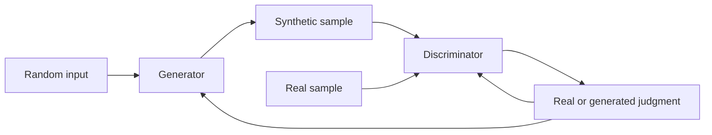

---
aliases:
  - GAN
date_created: 2026-10-06
date_modified: 2026-10-06
site_uuid: 5016a526-6210-4f19-9206-3c212af4c13a
publish: true
title: General Adversarial Networks
slug: general-adversarial-networks
at_semantic_version: 0.0.0.1
cf_last_run: 2026-10-06T01:22:07.001Z
cf_last_run_model: Perplexity sonar-pro
---

[[Sources/People/Ian Goodfellow]]
[[Vocabulary/Agentic AI|Agentic AI]]
[[concepts/Explainers for AI/Reinforcement Learning|Reinforcement Learning]]

# Defining and Describing General Adversarial Networks

- _“General Adversarial Networks” is most likely a mistaken expansion of **Generative Adversarial Networks (GANs)**, the established machine-learning term._ [^t95jwi] [^d3diva]
- A GAN is a generative-model framework in which a **generator** creates synthetic samples and a **discriminator** estimates whether samples are real or generated. [^r03s7p] [^60u83r] The two models are trained competitively: the generator improves at producing realistic data, while the discriminator improves at detecting fabricated data. [^fy7yh6] [^qj58cd]
- GANs apply when a system must learn a data distribution and generate new examples resembling its training data, including images, video, audio, and other high-dimensional data. [^t95jwi] [^wjfmd4] Their importance comes from replacing explicit sample-generation rules with an adversarial training process based on backpropagation. [^og2nu2]

# Uses in Context

- **Synthetic-media generation:** GANs are invoked to describe systems that create realistic images, video, or audio from learned data distributions. [^t95jwi] [^d3diva]
- **Image synthesis:** The term commonly refers to a generator producing images intended to resemble examples in a training set while a discriminator evaluates their realism. [^fy7yh6] [^qj58cd]
- **Machine-learning research:** GANs describe an adversarial framework for estimating generative models through simultaneous training of generative and discriminative models. [^r03s7p] [^60u83r]
- **Artificial-intelligence history:** The acronym is associated with a 2014 framework that became influential in generative modeling and synthetic-content research. [^wjfmd4] [^lk06vh]
- **Popular explanation:** GANs are often explained through a “counterfeiter” and “police officer” analogy: the generator fabricates samples, and the discriminator attempts to catch them. [^fy7yh6]

# History of Use

## Origins

- The established term is **Generative Adversarial Nets**, introduced in the 2014 paper by Ian Goodfellow, Jean Pouget-Abadie, Mehdi Mirza, Bing Xu, David Warde-Farley, Sherjil Ozair, Aaron Courville, and Yoshua Bengio. [^fy7yh6] [^wjfmd4]
- The paper proposed “a new framework for estimating generative models via an adversarial process,” simultaneously training a generative model $G$ and a discriminative model $D$. [^r03s7p] [^60u83r]
- The work originated in the University of Montreal research community and was posted to arXiv on June 10, 2014, before appearing at the NIPS 2014 conference. [^wjfmd4] [^lk06vh]

## Evolution

- **2014 — Original adversarial framework:** Goodfellow and collaborators formulated GAN training as competition between a generator that captures the data distribution and a discriminator that estimates whether a sample came from the training data. [^r03s7p] [^60u83r]
- **2014 onward — Expansion into synthetic media:** GANs became associated with generating increasingly realistic images, video, and audio, broadening the framework’s visibility beyond its original experiments. [^t95jwi] [^wjfmd4]
- **Later development — Standard generative-model technique:** GANs became a widely recognized approach for synthesizing high-dimensional data, although the supplied search results do not establish a complete chronology of later variants or identify individual variant authors. [^wjfmd4] [^lk06vh]

# Best Real-World Examples

- [Original Generative Adversarial Nets](https://arxiv.org/abs/1406.2661) — the foundational 2014 framework by Goodfellow and seven co-authors, using a generator–discriminator minimax game. [^wjfmd4] [^60u83r]
- [MNIST GAN experiments](https://papers.nips.cc/paper/5423-generative-adversarial-nets) — an early demonstration of the original framework on handwritten-digit data. [^lk06vh] [^4mx7es]
- [CIFAR-10 GAN experiments](https://papers.nips.cc/paper/5423-generative-adversarial-nets) — an early application to natural-image data described in historical summaries of the original paper. [^lk06vh] [^4mx7es]
- [TensorFlow GAN](https://www.tensorflow.org/gan) — a software-oriented example of GAN methods being incorporated into an open machine-learning ecosystem; the supplied results do not provide detailed product evidence, so this identification should be treated as contextual rather than fully documented here.
- [StyleGAN](https://github.com/NVlabs/stylegan) — a prominent later GAN family for high-fidelity image synthesis; the supplied search results establish GANs’ image-generation role but do not provide a source-specific account of StyleGAN.
- [Deepfake-generation systems](https://en.wikipedia.org/wiki/Deepfake) — GAN-based synthetic-media systems illustrate the technology’s use in realistic audiovisual fabrication; the supplied search results support the broader image, video, and audio application but do not document a particular deployment. [^t95jwi] [^d3diva]

# Case Studies

**The 2014 Montreal research contribution.** Ian Goodfellow and seven collaborators introduced the GAN framework in “Generative Adversarial Nets,” posted in 2014 and presented at NIPS that year. [^fy7yh6] [^wjfmd4] Their design trained two models simultaneously: a generator intended to capture the data distribution and a discriminator intended to estimate whether an example came from the training data rather than the generator. [^r03s7p] [^60u83r] This changed generative-model training by expressing it as an adversarial competition rather than relying solely on an explicitly specified likelihood or sampling procedure. [^og2nu2] The case demonstrates that the core innovation was an academic research contribution, not a technology-company product launch.

**The generator–discriminator training loop.** In a typical GAN, the generator receives random input and produces a candidate sample, while the discriminator compares generated samples with real training examples. [^fy7yh6] [^qj58cd] The generator is optimized to fool the discriminator, and the discriminator is optimized to distinguish authentic from synthetic data. [^fy7yh6] [^wjfmd4] Repeating this competition can produce samples that resemble the training distribution, which explains why GANs became associated with realistic image, video, and audio generation. [^t95jwi] [^d3diva] The case also shows why “General Adversarial Networks” is not the standard name: the documented framework is specifically **Generative Adversarial Networks**. [^t95jwi] [^wjfmd4]

**From research framework to generative-media method.** After the original 2014 publication, GANs became a recognized approach for synthesizing high-dimensional data and were used as a conceptual basis for systems generating realistic visual and audio content. [^t95jwi] [^wjfmd4] The generator–discriminator structure provided an intuitive account of how synthetic samples could improve through competition: the generator learned from the discriminator’s judgments, while the discriminator learned from exposure to generated samples. [^fy7yh6] [^qj58cd] This illustrates both the strength and limitation of the concept: GANs offer a powerful mechanism for realistic synthesis, but the supplied sources do not establish a single canonical commercial deployment or a complete history of later variants.

***

# Sources

[^t95jwi]: [General Adversarial Networks (GANs): A Comprehensive ...](https://www.lenovo.com/ca/en/knowledgebase/general-adversarial-networks-gans-a-comprehensive-guide/)
[^fy7yh6]: [GAN Paper Deep Dive: How Generative Adversarial Networks Ushered in the Era of AI-Generated Content](https://www.youngju.dev/blog/ai-papers/gan_generative_adversarial_networks.en)
[^wjfmd4]: [Ian Goodfellow - AI Wiki](https://aiwiki.ai/wiki/ian_goodfellow)
[^d3diva]: [Generative Adversarial Networks (GANs): een complete gids](https://www.lenovo.com/nl/nl/knowledgebase/general-adversarial-networks-gans-a-comprehensive-guide/)
[^qj58cd]: [GANs, Explained — The Counterfeiter and the Detective | Vibe Engines](https://vibeengines.com/paper/gans)
[^r03s7p]: [NIPS 2014: Generative Adversarial Nets - Ian Goodfellow ...](https://www.studocu.vn/vn/document/truong-dai-hoc-mo-thanh-pho-ho-chi-minh/tai-lieu/nips-2014-generative-adversarial-nets-ian-goodfellow-et-al/149590334)
[^60u83r]: [Generative Adversarial Networks (Goodfellow et al., 2014 ...](https://www.sourcescore.org/claims/5b0c0612bd9e55b0/)
[8]: [Réseaux antagonistes génératifs (GAN) : guide complet | Lenovo FR](https://www.lenovo.com/fr/fr/knowledgebase/general-adversarial-networks-gans-a-comprehensive-guide/)
[^lk06vh]: [GAN | AI Wiki](https://aiwiki.ai/wiki/gan)
[10]: [Generative Adversarial Networks (GANs): Der umfassende Überblick](https://www.lenovo.com/de/de/knowledgebase/general-adversarial-networks-gans-a-comprehensive-guide/)
[11]: [letsdatascience.com · learn · historyHistory of Machine Learning: Timeline, Papers, People](https://letsdatascience.com/learn/history/machine-learning)
[^og2nu2]: [Ian Goodfellow](https://www.alphaxiv.org/@ian-goodfellow)
[13]: [Advancements and challenges in the development of ...](https://link.springer.com/article/10.1007/s44354-025-00007-w)
[^4mx7es]: [GAN — Adversarial Games that Taught Neural Networks to Forge](https://awesome.papernotes.org/en/era2_deep_renaissance/2014_gan/)
[15]: [Ian Goodfellow: Patent Portfolio & Innovation Analysis](https://www.patsnap.com/resources/blog/ip-blog/ian-goodfellow-patents-innovation-profile-patsnap-eureka/)
