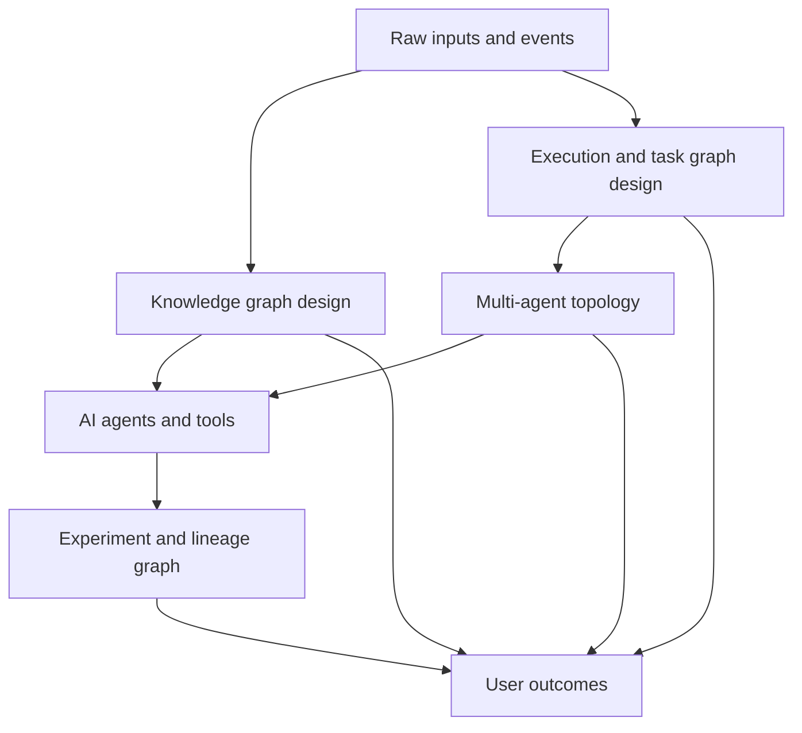

---
aliases:
  - graph engineering
tags:
  - Agentic-Engineering
  - Knowledge-AI
  - Context-Engineering
  - Context-Engineering-Kits
  - Graph-RAG
  - Graph-Engineering
date_created: 2026-08-21
date_modified: 2026-08-21
for_clients:
  - Param
  - Laerdal
site_uuid: d5702a0e-3df2-4ddd-8afe-7ab4faaaa659
publish: true
title: Graph Engineering
slug: graph-engineering
at_semantic_version: 0.0.0.1
cf_last_run: 2026-08-21T17:35:24.797Z
cf_last_run_model: Perplexity sonar-pro
---

[[concepts/Explainers for AI/Loop Engineering|Loop Engineering]]
[[concepts/Explainers for AI/Software Factories|Software Factories]]
[[concepts/Explainers for AI/Knowledge Graphs|Knowledge Graphs]]
[[concepts/Explainers for AI/Semantic AI|Semantic AI]]

# Defining and Describing Graph Engineering

_**Graph engineering** is the discipline of designing AI systems as explicit graphs of nodes and edges so that work, memory, and state become queryable structures rather than opaque loops._ [^0kpt2f] [^0s5n9j] [^j8e3zv] [^9tsnid]  

In contemporary AI practice, graph engineering refers to designing **knowledge graphs**, **task/execution graphs**, and broader **multi-agent topologies** around which large language models and agents operate, instead of relying solely on flat documents and linear tool chains. [^0kpt2f] [^0s5n9j] [^j8e3zv] [^iuwn1a] [^9tsnid] [^2hgwjl] It applies whenever builders need AI systems to reason over relationships (entities, tasks, agents, experiments) and to coordinate complex workflows or memories in a transparent, inspectable way. [^0kpt2f] [^0s5n9j] [^7opot0] [^j8e3zv] [^9tsnid] [^viwla1] It matters because graph-structured systems support deeper queries (“what is this connected to, and what is that connected to?”), richer multi-step workflows, and more controllable, debuggable agent behavior than traditional, prompt-centric designs. [^0kpt2f] [^7opot0] [^j8e3zv] [^9tsnid] [^viwla1] [^2hgwjl]

## Uses in Context

- Builders describe **graph engineering** as “designing AI systems around explicit graphs: knowledge stored as nodes (entities) and typed edges (relationships) that an agent can traverse, instead of flat documents searched by similarity.” [^0kpt2f]  

- Practitioners frame it as “the discipline of designing the structures AI agents work through — not the prompts,” with “knowledge graphs — what agents remember” and “task graphs — how agents work.” [^0s5n9j]  

- Multi-agent system designers define graph engineering as “the design and operation of a multi-agent system as an explicit graph of heterogeneous nodes — agents, deterministic functions, routers, joins, tools, human checkpoints — with communication and delegation as edges.” [^j8e3zv]  

- Some guides emphasize that “graph engineering is the practice of making an AI system’s agents, tasks, dependencies, state or knowledge explicit as nodes and relationships,” where “execution graphs coordinate work, experiment DAGs preserve lineage, and knowledge graphs store typed facts for connected queries and reuse across sessions.” [^9tsnid]  

- Others position it as “the practice of designing the graph your agents run in: which specialized nodes exist, which edges route work between them, and what shared state travels along those edges,” explicitly distinguishing it from knowledge-graph or GraphRAG work that “model data as entities and relations for retrieval” rather than execution flows. [^2hgwjl]  

- A critical commentary notes that “graph engineering is not a new technique. It is a new name for something you have already been doing in [[Tooling/AI-Toolkit/AI Programming Frameworks/LangGraph|LangGraph]], Google [[Tooling/AI-Toolkit/Agentic AI/Agent Development Kit|ADK]] and [[Tooling/AI-Toolkit/Agentic AI/AutoGen|AutoGen]],” highlighting the rebranding of existing graph-based orchestration practices. [^1ff1j4]  

## History of Use

### Origins

- A field guide for builders explains that “the term went viral in July 2026, but the underlying discipline (knowledge graphs, [[Tooling/AI-Toolkit/Models/GraphRAG|GraphRAG]], graph-based agent memory) predates the name by years,” indicating that the label *graph engineering* is recent while its techniques are older. [^0kpt2f]  

- A video analysis traces the phrase’s visible origin to “July 4, 2026, [when] Josh Simmons used the phrase graph engineering in a blog post and almost nobody noticed,” suggesting an early online mention by an individual practitioner rather than a large incumbent. [^kvl1ie]  

- Another essay emphasizes that the word “graph” in graph engineering derives from **graph theory** dating back to Leonhard Euler’s 1736 work on the bridges of Königsberg, underscoring a lineage from mathematical graph theory to modern AI system design. [^e7ikhr] [^rgrtk1]  

- A reflective article titled “Graph Engineering Is Thirty-Nine Years Old” argues that graph engineering is “a smaller version of the software process work starting in 1987: the process model reduced to nodes and edges, the specification reduced to prose in headed sections,” linking today’s term to earlier process-modeling research rather than corporate marketing. [^lhw3gu]  

### Evolution

- **1987–2000s – Process modeling roots:** The 2026 essay situates graph engineering within software process research starting in 1987, where workflows and specifications were modeled as nodes and edges, anticipating modern task and agent graphs. [^lhw3gu]  

- **2010s–early 2020s – [[concepts/Explainers for AI/Knowledge Graphs|Knowledge Graph]] engineering:** Prior to the new label, practitioners developed **knowledge graph engineering** as the discipline of “designing, building, and maintaining structured representations of entities and their relationships so that machines, and increasingly large language models, can interpret meaning, context, and authority at scale.” [^viwla1] [^7opot0] This work established ontologies, extraction pipelines, storage, and querying foundations that later fed into graph engineering for AI agents. [^0s5n9j] [^7opot0] [^viwla1]  

- **Mid‑2020s – Graph engineering as AI execution topology (2026):** Around July–August 2026, multiple independent authors and small companies published guides and talks defining graph engineering for AI agents, multi-agent systems, and agentic workflows, distinguishing execution graphs from knowledge graphs and GraphRAG. [^0kpt2f] [^0s5n9j] [^j8e3zv] [^iuwn1a] [^9tsnid] [^2hgwjl] These sources emphasize explicit topologies of agents, tasks, and experiments, and collectively popularize the term across builder communities rather than through big-tech marketing. [^0kpt2f] [^j8e3zv] [^iuwn1a] [^9tsnid] [^2hgwjl]  

## Best Real-World Examples

- [TheAIOperator Field Guide](url) — article “What Is Graph Engineering? A Field Guide for Builders” that defines graph engineering around explicit knowledge and task graphs for AI systems. [^0kpt2f]  

- [Graph Engineering for AI Agents: 9-stage Guide](url) — open-source repository that lays out a nine-stage discipline for designing knowledge graphs and task graphs that agents work through. [^0s5n9j]  

- [TrueFoundry Graph Engineering for Multi-Agent Systems](url) — startup guide that treats multi-agent architectures as programmable graphs of heterogeneous nodes and communication edges. [^j8e3zv]  

- [Wavect Graph Engineering for AI Agents](url) — boutique consultancy blog explaining how execution graphs, experiment DAGs, and knowledge graphs jointly constitute graph engineering in real AI products. [^9tsnid]  

- [AI Builder Club Graph Engineering Guide (2026)](url) — independent builder community resource that focuses on designing the graphs that agents run in, emphasizing execution over data modeling. [^2hgwjl]  

- [CareerStack Knowledge Graph Engineering](url) — tutorial on building, storing, and querying knowledge graphs as “maps of relationships,” providing the data-graph foundation for many graph engineering systems. [^7opot0]  

- [Asky Knowledge Graph Engineering Strategies](url) — applied SEO and brand-context guide showing how knowledge graph engineering shapes machine interpretation of entities and relationships at scale. [^viwla1]  

## Case Studies

### Case Study 1 — A builder community codifies graph engineering for agent workflows

In July 2026, an independent builder-focused publication released “What Is Graph Engineering? A Field Guide for Builders,” defining graph engineering as “designing AI systems around explicit graphs: knowledge stored as nodes (entities) and typed edges (relationships) that an agent can traverse, instead of flat documents searched by similarity.” [^0kpt2f] This guide synthesizes practices from knowledge graphs, GraphRAG, and graph-based agent memory into a single named discipline, emphasizing that the term “went viral in July 2026” even though the underlying techniques had been in use for years. [^0kpt2f] By articulating knowledge graphs (what agents remember) and task graphs (how agents work) as two halves of the same discipline, it offers a coherent framework for independent builders and startups to design AI systems as inspectable graphs rather than opaque prompt chains. [^0kpt2f] [^0s5n9j] This case illustrates how terminology and structure often emerge from practitioner communities first, before being adopted or popularized by larger platforms.

### Case Study 2 — A startup formalizes multi-agent topologies as explicit graphs

TrueFoundry, a younger company focused on AI infrastructure, published “Graph Engineering for Multi-Agent Systems,” defining graph engineering as “the design and operation of a multi-agent system as an explicit graph of heterogeneous nodes — agents, deterministic functions, routers, joins, tools, human checkpoints — with communication and delegation as edges.” [^j8e3zv] The guide explicitly disambiguates this from “knowledge-graph engineering — the established discipline of building graph-structured data (entities, relationships, triple stores) for retrieval and reasoning,” arguing that knowledge graphs structure what a system *knows* while graph engineering structures who the system *is* — its members, mandates, and message paths. [^j8e3zv] In practice, the startup’s approach treats the topology — “who exists, what each owns, who may talk to whom, how work routes” — as a programmable, versioned artifact rather than an emergent accident. [^j8e3zv] This case shows how a smaller innovator advances graph engineering by applying graph thinking not just to data, but to the runtime architecture of agents and tools.

### Case Study 3 — Graph engineering across execution, experiments, and memory

A technical blog from Wavect, a small firm working on AI agents, describes “Graph Engineering for AI Agents” as “the design of explicit nodes, relationships and state transitions that make an AI system’s work or knowledge queryable.” [^9tsnid] Their architecture distinguishes **execution graphs** that control “which agent acts next,” **experiment graphs** (DAGs) that “record lineage,” and **knowledge graphs** that store “typed entities and relations so several agents and sessions can reuse the same facts.” [^9tsnid] By integrating these three graph types, Wavect’s approach enables developers to query not just what the system knows, but how it worked and how experiments evolved over time, using the same conceptual language of nodes, edges, and state transitions. [^9tsnid] This case demonstrates graph engineering as a unifying design discipline across workflow orchestration, experimentation, and long-term memory, developed and articulated by a smaller practitioner rather than a large incumbent.

***

# Sources

[^0kpt2f]: [What Is Graph Engineering? A Field Guide for Builders](https://theaioperator.io/p/what-is-graph-engineering-a-field)
[^0s5n9j]: [Graph engineering for AI agents: the 9-stage ...](https://github.com/codejunkie99/graph-engineering)
[3]: [Why Graph Engineering will 10x your Claude/Codex](https://www.youtube.com/watch?v=JWhICz1QR8M)
[^7opot0]: [Knowledge Graph Engineering: Building, Storing & Querying Graphs](https://careerstack.dev/knowledge-graph-engineering)
[^j8e3zv]: [Graph Engineering for Multi-Agent Systems](https://www.truefoundry.com/blog/graph-engineering-enterprise-guide)
[^iuwn1a]: [What Is Graph Engineering? AI's Shift From Loops to Multi-Agent Maps — Xplaination](https://xplaination.com/articles/graph-engineering)
[^9tsnid]: [Graph Engineering for AI Agents: When It Pays | Wavect](https://wavect.io/blog/graph-engineering-ai-agents/)
[^e7ikhr]: [Graph Engineering Explained: Why Claude Code Spawns 100+ Agents Per Task](https://www.youtube.com/watch?v=m5Pts-3LPhY)
[^kvl1ie]: [They Renamed an Old AI Idea - and the Internet Lost Its Mind ...](https://www.youtube.com/watch?v=FUMn0Ciu6yE)
[^1ff1j4]: [What is Graph Engineering? Agentic AI Engineering Explained (2026)](https://www.youtube.com/watch?v=S1vqM0aTRFc)
[^viwla1]: [Building effective knowledge graphs: tools and strategies | Asky](https://askylabs.com/learn/technical-website-optimization/building-effective-knowledge-graphs-tools-strategies)
[^rgrtk1]: [Graph Engineering explained in 8min..](https://www.youtube.com/watch?v=mBePcvqLX88)
[^2hgwjl]: [Graph Engineering Guide (2026)](https://www.aibuilderclub.com/blog/graph-engineering-guide-2026)
[^lhw3gu]: [Graph Engineering Is Thirty-Nine Years Old](https://www.abassavoce.it/p/graph-engineering-is-thirty-nine)
[15]: [Graph Engineering vs RAG: The New Standard for AI ...](https://youmind.com/uk-UA/landing/x-viral-articles/graph-engineering-vs-rag-guide)
