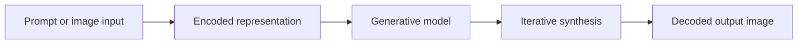
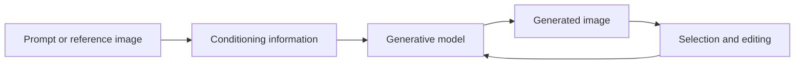

:::tool-showcase
- [[Tooling/AI-Toolkit/Model Producers/Midjourney|Midjourney]]
- [[Tooling/AI-Toolkit/Generative AI/Runway|Runway]]
- [[Tooling/AI-Toolkit/AI Interfaces/AI Workspaces/Ideogram|Ideogram]]
- [[Tooling/AI-Toolkit/Generative AI/Recraft|Recraft]]
- [[Tooling/AI-Toolkit/Generative AI/Flix AI|Flix AI]]
- [[Tooling/AI-Toolkit/Generative AI/Krea AI|Krea AI]]
:::

https://youtu.be/275L653HXS0?si=-enGG-4YhMehTd7g

# Defining and Describing Image Generators

- 
- _Image generators are systems that learn the visual structure of images and produce new images from noise, text, or other inputs._
- Image generators are a class of generative-AI systems that synthesize visual content rather than merely classify or retrieve it. Common approaches include generative adversarial networks, autoregressive transformers, and diffusion models.[1][6][10]
- In a typical text-to-image workflow, a text encoder represents the prompt, a generative model constructs an image representation, and a decoder or upsampler produces the final image. DALL·E 2 used CLIP-related representations and a hierarchical diffusion pipeline, while Imagen used a large pretrained T5 text encoder with cascaded diffusion.[10][13]
- Diffusion-based generators begin with random noise and iteratively remove it, learning to reverse a process that gradually corrupts an image with Gaussian noise.[1][10][14]
- The concept applies to creative production, design exploration, visual prototyping, advertising, entertainment, education, and research. Its importance comes from reducing the time and cost required to create or iterate visual material, while introducing concerns about provenance, bias, copyright, and misuse.[2][9]

# Uses in Context

- **Creative ideation:** Designers invoke image generators to explore multiple visual directions from a short description or reference image. Krea.ai, for example, is described as offering real-time image and video generation for artists and marketers.[9]
- **Text-to-image production:** The term commonly refers to systems that convert natural-language prompts into images, including DALL·E, Imagen, and Stable Diffusion.[2][3]
- **Image variation and editing:** Generators can create variations, extend compositions, or modify selected regions rather than producing an image entirely from scratch. The broader development of text-to-image systems has expanded image generation beyond unconditional synthesis.[3][13]
- **Commercial content creation:** Businesses use generators for marketing imagery, product concepts, campaign exploration, and other visual assets; startup and digital-native use cases include personalized model training and real-time creative tools.[9]
- **Technical research:** In machine learning, “image generation” describes experiments in modeling image distributions, comparing fidelity, diversity, controllability, and sampling efficiency.[1][6][14]

# History of Use

## Origins

- The modern technical lineage includes variational autoencoders, generative adversarial networks, and diffusion models. The GAN framework was introduced by Ian Goodfellow and collaborators in the 2014 paper *Generative Adversarial Nets*, which defined a generator that creates samples and a discriminator that distinguishes generated samples from real data.[6][11]
- Diffusion-based generation traces to Sohl-Dickstein and collaborators’ 2015 formulation, which framed generation as reversing a fixed Gaussian noising process.[1]
- Ho, Jain, and Abbeel formalized denoising diffusion probabilistic models in 2020 by training a network to predict noise and sampling through iterative denoising.[6]
- Text-to-image generation became a distinct mainstream research direction with OpenAI’s *Zero-Shot Text-to-Image Generation*, which described DALL·E as a 12-billion-parameter autoregressive transformer modeling text and discrete image tokens in a single sequence.[13]

## Evolution

- **2014 — Adversarial generation:** GANs introduced a generator–discriminator competition that produced sharp synthetic images, especially in relatively narrow domains such as faces.[6][13]
- **2020–2021 — Diffusion overtakes GAN-based synthesis:** Diffusion models offered a comparatively stable training objective and strong image quality, although their iterative sampling initially made them slower.[4][14]
- **2021–2022 — Latent and language-conditioned systems:** Latent diffusion moved denoising into a compressed representation, reducing computational requirements; DALL·E 2, Imagen, and related systems demonstrated high-quality text-conditioned generation.[3][10][13]
- **2022 onward — Accessible and open generation:** Stable Diffusion helped bring high-quality generation to consumer hardware through latent diffusion, while diffusion systems such as DALL·E 2 and Imagen became prominent research and product reference points.[7][13]

# Best Real-World Examples

- [Generative Adversarial Networks](https://arxiv.org/abs/1406.2661) — The foundational adversarial framework introduced by Goodfellow and collaborators in 2014.[6][11]
- [Denoising Diffusion Probabilistic Models](https://arxiv.org/abs/2006.11239) — A diffusion formulation that generates images through repeated denoising steps.[6][14]
- [DALL·E](https://arxiv.org/abs/2102.12092) — An autoregressive text-to-image model that represented text and discrete image tokens in one sequence.[13]
- [DALL·E 2](https://openai.com/index/dall-e-2/) — A text-to-image system using CLIP-related representations and a hierarchical diffusion pipeline.[10]
- [Imagen](https://arxiv.org/abs/2205.11487) — A text-to-image system combining a large T5 text encoder with cascaded diffusion upsampling.[10][13]
- [Stable Diffusion](https://arxiv.org/abs/2112.10752) — A latent-diffusion approach designed to make high-resolution synthesis more computationally accessible.[13]
- [Krea.ai](https://www.krea.ai/) — A creative suite offering real-time image and video generation and personalized model training for artists and marketers.[9]

# Case Studies

**[[Sources/People/Ian Goodfellow]]’s GAN framework, 2014.** Ian Goodfellow and collaborators introduced a two-network training setup in which a generator produced synthetic samples while a discriminator attempted to identify them as fake.[6][11] The adversarial objective made it possible to learn sharp image distributions without directly specifying a pixel-by-pixel reconstruction target. GANs subsequently became a major approach for realistic image synthesis, particularly in constrained domains such as faces, although later diffusion methods addressed important limitations in training stability and distribution coverage.[4][13] The case shows that a foundational image-generation innovation originated in an academic research collaboration rather than as a product announcement from a large platform company.

**Latent diffusion and [[Tooling/AI-Toolkit/Models/Stable Diffusion|Stable Diffusion]], 2021–2022.** Rombach and collaborators’ latent-diffusion approach moved the diffusion process from raw pixels into a compressed latent space, lowering the computational burden of image synthesis.[13] Stable Diffusion became a prominent example of this approach and helped make high-quality text-to-image generation practical on consumer hardware.[13] Its significance was not only image quality but also accessibility: the underlying method demonstrated how representation compression could broaden participation in image-generation development beyond organizations with the largest compute budgets. The case illustrates how an academic method and an openly distributed implementation can accelerate adoption across creative and technical communities.

**[[Tooling/AI-Toolkit/Generative AI/Krea AI|Krea AI]] and real-time creative tooling.** Krea.ai represents a later application-oriented direction in which image generation is integrated into a broader creative suite rather than presented only as a standalone research model.[9] The service is described as supporting real-time image and video generation and personalized model training for artists and marketers.[9] This shifts the practical meaning of “image generator” from a prompt-to-picture tool toward an interactive workflow for exploration, iteration, and brand-specific production. The case demonstrates how smaller creative-tool companies can adapt underlying generative research into specialized interfaces and workflows for professional users.[9]

***

# Sources

[1]: [Unconditional Image Generation Models | AI Wiki](https://aiwiki.ai/wiki/unconditional_image_generation_models)
[2]: [An Analysis of Text-to-image Models of OpenAI, Stability AI, and Google](https://drpress.org/ojs/index.php/mmaa/article/view/33768)
[3]: [2302/2302.13153.md · huggingchat/papers-content](https://huggingface.co/buckets/huggingchat/papers-content/tree/2302/2302.13153.md)
[4]: [GANs, Explained — The Counterfeiter and the Detective | Vibe Engines](https://vibeengines.com/paper/gans)
[5]: [Understanding Multimodal Learning Models | PDF - Scribd](https://www.scribd.com/document/967476253/Multi-Models)
[6]: [GAN | AI Wiki](https://aiwiki.ai/wiki/gan)
[7]: [Exploring the evolution of generative adversarial network ...](https://link.springer.com/article/10.1007/s44163-026-01991-w?error=cookies_not_supported&code=d6645b2e-e659-4f20-8f4e-4a4a71178e7e)
[8]: [nielsr/arxiv-chandra-ocr-full-markdown-20260406](https://huggingface.co/buckets/nielsr/arxiv-chandra-ocr-full-markdown-20260406/tree/2408/2408.07009.md)
[9]: [150 AI use cases from leading startups and digital natives](https://cloud.google.com/blog/topics/startups/150-ai-use-cases-leading-startups-and-digital-natives)
[10]: [Image Generation Models: A Technical History | Home](https://rozbeh.github.io/myposts/2026/03/08/image-generation-models.html)
[11]: [Generative adversarial network | AI Wiki](https://www.aiwiki.ai/wiki/generative_adversarial_network)
[12]: [The Principles of Diffusion Models | alphaXiv](https://www.alphaxiv.org/abs/2510.21890)
[13]: [Text-to-Image Generation Explained | MemX](https://memx.app/glossary/text-to-image/)
[14]: [Beyond image generation: visual data analysis with diffusion models ...](https://link.springer.com/article/10.1007/s10462-026-11615-5?error=cookies_not_supported&code=5895c3e9-244b-4754-aebb-8486b46134a2)
[15]: [PatrickWiloak/genai-research-papers-summarized - GitHub](https://github.com/PatrickWiloak/genai-research-papers-summarized)

# Defining and Describing Image Generators

- 

_Image generators are systems that turn learned visual patterns into new images, often from text, reference images, sketches, or other controls._

Image generators are machine-learning models or applications that synthesize visual content rather than merely retrieve existing pictures. Modern systems commonly use diffusion, generative adversarial, autoregressive, or related architectures; text-to-image systems additionally align language with visual concepts.[1][2] They apply when users need novel imagery, variations, edits, mockups, illustrations, or synthetic training data, and they matter because they move parts of visual production from manual construction toward prompt-based generation and iterative selection.[1][14]

# Uses in Context

- In **creative production**, “text-to-image” describes systems that convert natural-language prompts into visual outputs, including DALL-E 2, Stable Diffusion, and Imagen.[3]
- In **design**, image generators are used for ideation, visual exploration, concept art, and rapid variations before a final human-directed design is produced.[14]
- In **image editing**, the same model family can support controlled modification, inpainting, outpainting, and composition changes rather than only generating an image from nothing.[1]
- In **research**, image generators are evaluated as generative models that learn a data distribution and sample new images from it; GANs do this through competition between a generator and discriminator.[2][12]
- In **synthetic-data production**, generated images can provide additional visual examples for computer-vision systems and experiments, although their usefulness depends on fidelity, diversity, and licensing.[1]
- In **popular culture**, “AI-generated art” commonly refers to images made with systems such as Midjourney, Stable Diffusion, and other prompt-driven tools that became broadly visible in 2022.[7]

# History of Use

## Origins

- The modern technical lineage includes variational autoencoders, generative adversarial networks, normalizing flows, autoregressive models, transformers, and diffusion methods.[1]
- Ian Goodfellow and collaborators introduced **generative adversarial networks** in the 2014 paper *Generative Adversarial Nets*. The approach uses a generator that creates samples and a discriminator that attempts to distinguish generated samples from real data.[3][12]
- Diffusion-based generation was introduced in foundational form by Sohl-Dickstein and collaborators in 2015, while denoising diffusion probabilistic models later provided a practical route to high-quality image synthesis.[10][14]
- Early AI visual-art work also predates contemporary neural image generators: Harold Cohen began developing the AARON system in the late 1960s.[7]

## Evolution

- **2014 — Adversarial generation:** GANs made it possible to generate visually convincing images by training a generator and discriminator in competition, though training could be unstable and prone to mode collapse.[3][9]
- **2020–2021 — Diffusion and language–vision alignment:** DDPM-style denoising and language–image representation methods established the technical basis for later high-quality text-to-image systems.[9][14]
- **2022 — Consumer-scale text-to-image generation:** DALL-E 2, Imagen, Midjourney, and Stable Diffusion brought prompt-driven image synthesis into widespread public use; Stable Diffusion’s latent-diffusion approach was released through work involving Stability AI, CompVis, and Runway.[7][14]

# Best Real-World Examples

- [Stable Diffusion](https://stability.ai/) — a source-available latent-diffusion image generator associated with Stability AI, CompVis, and Runway.[7]
- [Midjourney](https://www.midjourney.com/) — a 2022 text-to-image service that helped popularize prompt-driven visual creation.[7]
- [DALL-E](https://openai.com/dall-e-3) — an autoregressive and later diffusion-based family demonstrating controlled text-to-image generation.[6][14]
- [Imagen](https://imagen.research.google/) — a text-to-image diffusion system reported by Google researchers in 2022.[2][3]
- [VQGAN-CLIP](https://github.com/nerdyrodent/VQGAN-CLIP) — an open-source approach that combined a visual generator with CLIP-based text guidance and influenced early creator experimentation.[7]
- [GANs](https://papers.nips.cc/paper/5423-generative-adversarial-nets) — the generator–discriminator framework that shaped image synthesis research during the 2010s.[12]
- [DreamFusion](https://dreamfusion3d.github.io/) — a research finding showing how a pretrained text-to-image model could guide optimization of 3D representations from text.[10]

# Case Studies

**Stable Diffusion and the shift from laboratory research to accessible tooling.** In 2022, Stable Diffusion emerged from latent-diffusion research associated with the CompVis group, Stability AI, and Runway.[7] Latent diffusion reduces the computational burden by performing the denoising process in a compressed representation rather than directly in full-resolution pixel space, while retaining text conditioning through language–image representations.[6][14] Its source-available distribution enabled broader experimentation, customization, and fine-tuning than a purely closed hosted service, including later use of techniques such as LoRA for adaptation.[15] The case shows how an open or source-available release can change an image generator from a specialist research artifact into a general-purpose creative platform.

**GANs and the first major neural image-generation paradigm.** Goodfellow and collaborators’ 2014 work framed image synthesis as a minimax game: the generator sought to produce convincing samples while the discriminator sought to identify generated ones.[2][12] This design produced strikingly realistic outputs, particularly in constrained domains such as human faces, but adversarial training could be unstable and susceptible to mode collapse.[3][9] Diffusion models later displaced GANs as the dominant approach for many high-quality image-generation tasks because iterative denoising offered a more stable and scalable training path.[8][9] The case illustrates that “image generator” names a changing family of methods rather than one permanent architecture.

**Text-to-image systems and mass adoption in 2022.** DALL-E 2, Imagen, Midjourney, and Stable Diffusion appeared or gained major visibility during the same period, combining language conditioning with generative image synthesis.[3][7][14] Their significance was not only technical performance: natural-language prompting made visual generation accessible to people without conventional illustration or 3D-production skills. The resulting transition expanded image generators from research benchmarks into design ideation, entertainment, marketing, and everyday creative experimentation, while also raising questions about training data, authorship, resemblance, and the boundary between generation and editing.

***

# Sources

[1]: [[2603.07455] Image Generation Models: A Technical History - arXiv](https://arxiv.org/abs/2603.07455)
[2]: [Exploring the evolution of generative adversarial network architectures for text to image synthesis a comprehensive review - Discover Artificial Intelligence](https://link.springer.com/article/10.1007/s44163-026-01991-w?error=cookies_not_supported&code=e72b8566-b015-4802-a452-7a07db90976d)
[3]: [www.frontiersin.org › journals › artificial-intelligenceWhat you see is not what you get anymore: a mixed-methods ... -...](https://www.frontiersin.org/journals/artificial-intelligence/articles/10.3389/frai.2025.1707336/full)
[4]: [IJEM V14 N1 - Generation of Images from Text Using AI: A Study on GANs](https://www.studocu.com/in/document/srm-university/btech/ijem-v14-n1-generation-of-images-from-text-using-ai-a-study-on-gans/144866534?origin=related-document)
[5]: [Exploring the evolution of generative adversarial network ...](https://link.springer.com/article/10.1007/s44163-026-01991-w?error=cookies_not_supported&code=56d2c1e1-d8f3-4bd0-b16e-73b761645c2a)
[6]: [Image Generation Models: A Technical History | alphaXiv](https://www.alphaxiv.org/abs/2603.07455)
[7]: [Artificial intelligence visual art](https://www.dl1.en-us.nina.az/Artificial_intelligence_art.html)
[8]: [A Comparative Analysis of Text-to-Image Generation Models](https://www.ijraset.com/research-paper/comparative-analysis-of-text-to-image-generation-models)
[9]: [An Evolution from Atomic Mapping to Agentic World Modeling](https://arxiv.org/html/2604.28185v2)
[10]: [A survey of generation, segmentation and editing by artificial ...](https://academic.oup.com/jcde/article/13/1/1/8340357)
[11]: [AI-Driven Visual Generation: Generative Adversarial Neural Network ...](https://portalinvestigacion.udc.gal/documentos/69679e649e41074a91301748)
[12]: [GAN Paper Deep Dive: How Generative Adversarial Networks Ushered in the Era of AI-Generated Content](https://www.youngju.dev/blog/ai-papers/gan_generative_adversarial_networks.en)
[13]: [画像生成モデルの歴史｜DopingConsomme - note](https://note.com/dopingconsomme/n/n5a8f875e541c)
[14]: [3. Autoregressive Models](https://www.tapflare.com/articles/ai-image-generation-models)
[15]: [Images: Our selection of the best generative AI tools of 2025](https://aivancity.ai/en/blog/images-notre-selection-des-meilleurs-outils-ia-generatives-de-2025/?amp=1)
