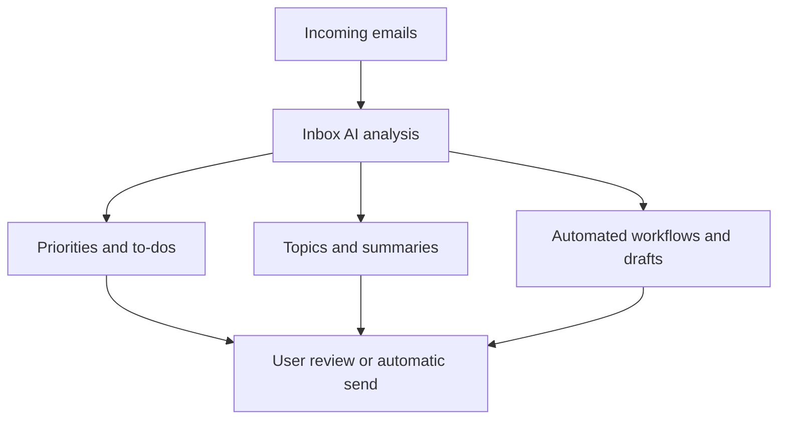

---
aliases:
  - Email Assistants
  - Email Agents
date_created: 2026-08-10
date_modified: 2026-08-23
tags:
  - Personal-Productivity
  - AI-Native
  - Agent-Native
  - Agentic-AI
  - AI-Toolkit
  - Lossless-Toolkit
  - State-Of-The-Art-Practices
  - State-of-the-Art
site_uuid: b5d7d554-ceec-4fca-ab89-b1cf54bdac61
publish: true
title: Inbox AI
slug: inbox-ai
at_semantic_version: 0.0.0.1
cf_last_run: 2026-08-23T07:17:59.336Z
cf_last_run_model: Perplexity sonar-pro
---
[[concepts/Drag (on Productivity)|Drag (on Productivity)]]
[[Vocabulary/Agentic AI|Agentic AI]]
[[Tooling/Productivity/Personal Cloud/Jace Email|Jace Email]]
[[Slashy]]

_Inbox AI refers both to Gmail’s new AI-powered inbox view and, more broadly, to the growing role of machine intelligence as the “first reader” of email—summarizing, filtering, and acting on messages before humans ever see them. [^v769my] [^iso6i3] [^p2vxu7]_

In its narrow sense, Inbox AI is Google’s Gemini-powered **AI Inbox** feature in Gmail that replaces the traditional chronological message list with a synthesized briefing of to-dos and topics extracted from your mail. [^v769my] [^6pndtl] [^631d47] [^iso6i3] [^w5i0bq] [^o5srvz] [^g4svtn] More generally, marketers and productivity practitioners now use “inbox AI” as a shorthand for AI systems that interpret, score, route, and sometimes even respond to email at scale—both on the provider side (e.g., [[Gmail]], [[Outlook]]) and on the sender side (e.g., AI-driven email marketing platforms like InboxAI). [^q2o7k4] [^t4lss3] [^p2vxu7] This matters because it shifts email from a manual, message-by-message workflow to an automated, intent- and task-centric environment where AI becomes a gatekeeper and co-pilot for everyday communication. [^8wxxdy] [^q2o7k4] [^g4svtn] [^p2vxu7]

# Defining and Describing Inbox AI

At a concrete product level, **Inbox AI** is the name Google uses for a new Gmail view that “filters out the clutter so you can focus on what’s most important,” acting “like having a personalized briefing, highlighting to-dos and catching you up on what matters.” [^v769my] According to Google’s support documentation, AI Inbox is a separate view that “helps surface what matters most, all in one place,” organizing content into sections such as **Suggested to-dos** and **Topics to catch up on** (or similarly “Priorities” and “Catch Me Up” in some rollouts), each containing summaries and extracted action items from recent emails. [^6pndtl] [^iso6i3] [^3qkt90] [^w5i0bq] [^o5srvz] [^g4svtn] The feature is initially limited to “select trusted testers in the US,” and it analyzes inbox contents using Gemini-powered models with Google emphasizing that analysis is done “securely with the privacy safeguards you expect from Google.” [^v769my] [^631d47] [^iso6i3] [^shavm3] [^w5i0bq] [^g4svtn]

Beyond Google’s naming, practitioners and commentators use **“inbox AI”** more generically to describe AI layers that read, classify, summarize, and sometimes respond to email before the human recipient engages with it. [^8wxxdy] [^q2o7k4] [^b2a4wi] [^p2vxu7] For example, a marketing-technology analysis notes that “inbox AI now interprets, summarizes, and filters marketing emails before subscribers see them,” framing AI as a new gatekeeper between senders and subscribers. [^p2vxu7] Email workflow specialists describe “AI inbox agents” for Gmail as software that drafts responses, triages incoming mail, automates repetitive workflows, and uses context from threads and connected systems to generate “context-aware drafts and automated responses.” [^8wxxdy] [^q2o7k4] On the sender side, a startup called **InboxAI** positions itself as an “AI-powered bulk email marketing platform” that brings “campaign management, contact organization, sender health, email design, and performance insights together into one desktop-first workspace,” using AI “to streamline repetitive marketing workflows.” [^t4lss3]

In practice, Inbox AI systems perform several tightly related functions:

- **Prioritization and surfacing:** AI Inbox in Gmail identifies “priority emails” and highlights items that “may need prompt attention,” such as bills with due dates, appointments to confirm, or urgent follow-ups. [^6pndtl] [^iso6i3] [^8yfhnh] [^w5i0bq] [^o5srvz] [^g4svtn]
- **Summarization and topic clustering:** Instead of forcing users to open each message, AI Inbox “summarises your whole inbox with a single click,” providing “topics to catch up on” or “Catch Me Up” sections that summarize travel itineraries, reservations, order confirmations, and other non-urgent updates. [^6pndtl] [^iso6i3] [^3qkt90] [^w5i0bq] [^o5srvz] [^g4svtn]
- **Task extraction and to‑do generation:** The feature curates a “Suggested to-dos” section with bolded directives—e.g., pay a bill, confirm an address—effectively turning email content into an actionable task list. [^6pndtl] [^iso6i3] [^8yfhnh] [^w5i0bq] [^o5srvz]
- **Autonomous or semi-autonomous action:** Inbox agents described by workflow vendors can “draft responses, triage incoming emails, and automate routine email workflows,” with some tools acting as agents that can “act autonomously under predefined rules and APIs” instead of merely suggesting content. [^8wxxdy] [^q2o7k4]
- **Analytics and campaign optimization (sender-side inbox AI):** The InboxAI marketing platform promises to let senders “monitor sender health” and “track campaign performance,” using AI to manage large-scale outreach while keeping deliverability and engagement in view. [^t4lss3]

# Uses in Context

- Commentators covering Gmail’s Gemini rollout describe AI Inbox as “a personalized overview of your tasks” and a way to “keep you informed about important updates,” emphasizing its role as a briefing layer over traditional message lists. [^v769my] [^6pndtl] [^631d47] [^g4svtn]
- A support article explains that “AI Inbox is a new view in Gmail that helps surface what matters most, all in one place,” and that it does so via sections like “Suggested to-dos” and “Topics to catch up on,” illustrating how the term is used in product UX language. [^iso6i3]
- An industry news piece frames the feature as Google “adding an ‘AI Inbox’ to Gmail” that “scans your emails to recommend tasks needing follow-up,” showing its use as shorthand for AI-powered triage and follow-up detection. [^8yfhnh] [^shavm3]
- A marketing technology blog uses the phrase “inbox AI now interprets, summarizes, and filters marketing emails before subscribers see them,” highlighting a broader, ecosystem-level use of the term to describe how mailbox providers deploy AI gatekeeping. [^p2vxu7]
- Workflow and automation vendors talk about “AI inbox agents” that “transform how people interact with email” by automatically sorting, tagging, summarizing, and drafting replies, using “AI inbox agent” and “inbox AI” as practical labels for deployable systems. [^8wxxdy] [^q2o7k4]
- The InboxAI startup introduces itself as “an AI-powered bulk email marketing platform,” taking the term into the sender’s toolchain where AI helps manage campaigns, contacts, sender accounts, and deliverability from a “desktop-first workspace.” [^t4lss3]

# History of Use

## Origins

The phrase **“AI Inbox”** in a productized, capitalized sense appears prominently in Google’s January 2026 announcement that “Gmail is entering the Gemini era,” where the company introduces “AI Inbox” as a new view that “filters out the clutter” and acts as a “personalized briefing.” [^v769my] On the same day, Google’s support documentation published a dedicated article titled “Learn about AI Inbox in Gmail,” defining AI Inbox as “a new view in Gmail that helps surface what matters most, all in one place,” with clear structure and behavior, indicating an internal product codename turned public feature name. [^iso6i3] Tech press coverage from outlets such as TechCrunch, Axios, The Verge, and CNET picked up the term immediately, referring to “a new AI Inbox for Gmail” that reorganizes email around tasks and summarized topics, cementing AI Inbox as a widely recognized label for Gmail’s Gemini-driven inbox interface. [^6pndtl] [^8yfhnh] [^shavm3] [^w5i0bq] [^g4svtn] 

In parallel, marketing and deliverability literature began to use **“inbox AI”** in a more generic sense: a May 2026 article on email marketing optimization explains “how inbox AI now interprets, summarizes, and filters marketing emails before subscribers see them,” treating inbox AI as an emergent property of mailbox providers’ machine-learning layers rather than a single branded feature. [^p2vxu7] This suggests that while Google popularized **AI Inbox** as a user-facing brand, practitioners had already started talking about **inbox AI** as a concept capturing the growing influence of AI systems in email delivery and engagement. [^q2o7k4] [^b2a4wi] [^p2vxu7]

## Evolution

- **January 2026 – Gmail’s AI Inbox announced and limited rollout begins:** Google announces that “Gmail is entering the Gemini era” and introduces AI Inbox as a new view, initially “available to select trusted testers in the US,” focused on highlighting to-dos and catching users up on what matters. [^v769my] [^iso6i3] [^shavm3] [^w5i0bq] [^g4svtn]
- **Early 2026 – Media and reviewers translate AI Inbox into user expectations:** [[Sources/Media/TechCrunch|TechCrunch]], Axios, The Verge, CNET, and Android Authority publish hands-on reports describing AI Inbox as an AI-powered reimagining of the inbox that surfaces “Suggested to-dos,” “Topics to catch up on,” and personalized summaries, shifting user understanding from simple smart labels to AI-driven task dashboards. [^6pndtl] [^631d47] [^8yfhnh] [^w5i0bq] [^o5srvz] [^g4svtn]
- **Mid-2026 – “Inbox AI” becomes a marketing and strategy concept:** Email marketing and deliverability experts discuss how “inbox AI” at mailbox providers interprets and filters emails, re-framing email strategy around AI gatekeepers and advocating content and reputation practices tuned to AI-driven prioritization algorithms. [^q2o7k4] [^b2a4wi] [^p2vxu7]
- **2026 – Sender-side tools adopt the branding:** The InboxAI startup launches an “AI-powered bulk email marketing platform,” positioning AI not only in reading and filtering received email but also in generating, targeting, and analyzing outbound campaigns from a unified workspace. [^t4lss3]

# Best Real-World Examples

- **[Gmail AI Inbox](https://blog.google/products-and-platforms/products/gmail/gmail-is-entering-the-gemini-era/)** – Google’s Gemini-powered AI Inbox view that surfaces a personalized briefing, “Suggested to-dos,” and “Topics to catch up on,” initially for trusted testers in the US. [^v769my] [^6pndtl] [^iso6i3] [^w5i0bq] [^g4svtn]
- **[Gmail AI Inbox trusted tester rollout](https://support.google.com/mail/answer/16845247?hl=ta-US)** – The early-access program where AI Inbox is exposed as “a new view in Gmail” with clear sections for to-dos and catch-up topics, demonstrating how the concept is operationalized in a mainstream email client. [^iso6i3] [^shavm3] [^w5i0bq]
- **[InboxAI (email marketing platform)](https://www.linkedin.com/posts/inboxaiapp_ai-saas-emailmarketing-activity-7490365177209614336-sdKM)** – A startup building a desktop-first, AI-powered bulk email marketing platform that centralizes campaigns, contacts, sender accounts, and analytics while using AI to streamline repetitive workflows. [^t4lss3]
- **[AI inbox agents for Gmail](https://virtualworkforce.ai/ai-inbox-agent-for-gmail/)** – A category of tools described as “AI inbox agents” that draft responses, triage incoming emails, and automate routines, embodying the agentic side of inbox AI in everyday Gmail workflows. [^8wxxdy] [^q2o7k4]
- **[Gmail Gemini assistant and AI features](https://mailmeteor.com/blog/gmail-ai-assistant)** – A third-party overview of Gemini-based Gmail assistants that help users write, organize, and manage email, illustrating how inbox AI capabilities are framed by independent evaluators. [^b2a4wi]
- **[Inbox AI as deliverability gatekeeper](https://www.klaviyo.com/blog/ai-email-marketing-inbox-optimization)** – An analysis of how “inbox AI now interprets, summarizes, and filters marketing emails before subscribers see them,” showcasing the concept from the perspective of marketers adapting to AI-mediated inboxes. [^p2vxu7]
- **[Hands-on reviews of AI Inbox](https://www.androidauthority.com/gmail-ai-inbox-hands-on-3678753/)** – Independent reviews that detail how AI Inbox surfaces content as to-dos and topics and assess its practical impact on daily email management. [^631d47] [^o5srvz]

# Case Studies

## Gmail’s AI Inbox: From Chronological Lists to Task-Centric Briefings

In January 2026, Google announced that “Gmail is entering the Gemini era,” unveiling AI Inbox as part of a broader expansion of Gemini features across its email platform. [^v769my] [^g4svtn] AI Inbox reimagines the default inbox view: instead of presenting email as a chronological list, it generates a “personalized briefing” that highlights to-dos and summarizes topics, aiming to “filter out the clutter so you can focus on what’s most important.” [^v769my] [^6pndtl] [^631d47] [^w5i0bq] [^o5srvz] [^g4svtn] Google’s support documentation and early coverage describe two main sections—“Suggested to-dos” (or “Priorities”) and “Topics to catch up on” (or “Catch Me Up”)—which extract deadlines, bills, appointments, reservations, travel plans, and similar items from incoming mail. [^6pndtl] [^iso6i3] [^3qkt90] [^w5i0bq] [^o5srvz] [^g4svtn]

The feature initially rolled out to “select trusted testers in the US,” with availability limited to personal Gmail accounts and not yet extended to Workspace users, reinforcing Google’s pattern of testing consumer AI capabilities before broader enterprise deployment. [^iso6i3] [^8yfhnh] [^shavm3] [^w5i0bq] Reviewers noted that AI Inbox can summarize a day’s worth of unread messages “with a single click,” reducing the need to open each email individually and instead letting users scan AI-generated summaries and action prompts. [^6pndtl] [^8yfhnh] [^3qkt90] [^o5srvz] This case demonstrates how inbox AI can restructure the core mental model of email—from “a pile of messages” to “a stream of tasks and topics”—and how a large provider can popularize a terminology (AI Inbox) that quickly propagates into wider industry vocabulary. [^v769my] [^6pndtl] [^631d47] [^w5i0bq] [^o5srvz] [^g4svtn] [^p2vxu7]

## InboxAI: AI-Native Email Marketing Workflow

Around mid-2026, the InboxAI startup publicly launched an “AI-powered bulk email marketing platform” through a desktop-first interface aimed at businesses, agencies, founders, and sales teams needing greater control over outreach. [^t4lss3] In its launch description, the team explains that instead of “switching between multiple tools for campaigns, contacts, sender accounts, deliverability, and analytics, InboxAI brings everything together in a single AI-powered workspace,” enabling users to “manage email campaigns,” “organize contacts,” “connect multiple sender accounts,” “monitor sender health,” and “track campaign performance.” [^t4lss3] AI is presented as a cross-cutting capability used to “streamline repetitive marketing workflows,” such as drafting outbound campaigns, segmenting audiences, and monitoring sender reputation signals. [^t4lss3]

The platform reflects a sender-side application of inbox AI concepts: rather than only relying on provider-side AI to interpret incoming mail, InboxAI helps senders design messages and cadences that align with AI-mediated inboxes that interpret, summarize, and filter content. [^t4lss3] [^p2vxu7] By centralizing sender health and analytics in the same workspace, the product implicitly acknowledges that inbox AI at providers like Gmail will heavily influence deliverability and engagement, and therefore sender tooling must respond with AI-assisted optimization. [^t4lss3] [^p2vxu7] This case shows how a smaller, specialized startup can internalize the realities of AI-driven inboxes and build dedicated workflows around them, illustrating the bidirectional nature of inbox AI—both in reading and in writing email at scale. [^q2o7k4] [^t4lss3] [^p2vxu7]

## Inbox AI as Gatekeeper: Marketing and Deliverability Strategy

Email marketing practitioners have begun to talk about **“inbox AI”** as a critical gatekeeper that decides which messages subscribers see, how they are summarized, and whether they appear at all in primary inbox views. [^p2vxu7] A May 2026 industry article on email marketing optimization states that “AI is reading your emails first” and that “inbox AI now interprets, summarizes, and filters marketing emails before subscribers see them,” emphasizing that AI systems at mailbox providers score trustworthiness, relevance, and engagement potential. [^p2vxu7] The article describes AI “as gatekeeper,” explaining that providers use AI to mediate the sender–recipient relationship by identifying which emails are “trustworthy, relevant, and worth surfacing,” effectively placing inbox AI between marketers and their audiences. [^p2vxu7]

For marketers, this implies a strategic shift: campaigns must be designed not just for human readers but also for AI algorithms that interpret subject lines, content quality, and behavioral signals to decide whether an email is prioritized, summarized, or relegated to lower-visibility folders. [^q2o7k4] [^b2a4wi] [^p2vxu7] Tools like AI inbox agents and platforms such as InboxAI respond to this by offering AI-driven insights into sender health, performance, and best practices tuned to AI-mediated inbox behavior. [^q2o7k4] [^t4lss3] [^p2vxu7] This case study highlights how the concept of inbox AI has moved from a narrow product feature label to a strategic lens for both mailbox providers and marketers, reshaping best practices across email ecosystems. [^q2o7k4] [^b2a4wi] [^p2vxu7]

***

# Sources

[^v769my]: [Gmail is entering the Gemini era](https://blog.google/products-and-platforms/products/gmail/gmail-is-entering-the-gemini-era/)
[^6pndtl]: [Gmail debuts a personalized AI Inbox, AI Overviews in ...](https://techcrunch.com/2026/01/08/gmail-debuts-a-personalized-ai-inbox-ai-overviews-in-search-and-more/)
[^631d47]: [Gmail launches AI inbox and overviews with Gemini](https://mashable.com/article/gmail-launches-gemini-ai-inbox-overviews)
[^iso6i3]: [Learn about AI Inbox in Gmail](https://support.google.com/mail/answer/16845247?hl=ta-US)
[^8yfhnh]: [Google is adding an "AI Inbox" to Gmail](https://www.axios.com/2026/01/08/google-ai-gmail-proofreader)
[^8wxxdy]: [Ai Agent And Building Ai...](https://virtualworkforce.ai/ai-inbox-agent-for-gmail/)
[^3qkt90]: [Google adds AI Inbox and Help me write to Gmail: Here is how they work](https://www.hindustantimes.com/technology/google-adds-ai-inbox-and-help-me-write-to-gmail-here-is-how-they-work-101784092909998.html)
[^q2o7k4]: [9 best inbox agents for Gmail](https://virtualworkforce.ai/inbox-agents-for-gmail/)
[^shavm3]: [Google to add ‘AI Inbox’ feature to Gmail](https://www.inkl.com/news/google-to-add-ai-inbox-feature-to-gmail)
[^w5i0bq]: [Google is taking over your Gmail inbox with AI](https://www.theverge.com/news/857883/google-gmail-ai-inbox-overviews)
[^t4lss3]: [InboxAI Launches AI-Powered Email Marketing Platform](https://www.linkedin.com/posts/inboxaiapp_ai-saas-emailmarketing-activity-7490365177209614336-sdKM)
[^o5srvz]: [I thought I'd hate Gmail's new AI Inbox, but it's surprisingly great](https://www.androidauthority.com/gmail-ai-inbox-hands-on-3678753/)
[^g4svtn]: [Google Has a New AI Inbox for Gmail Users, and That's Not All](https://www.cnet.com/tech/google-gmail-ai-inbox-gemini-features/)
[^b2a4wi]: [The 7 Best Gmail AI Assistants in 2026 (Tested & Compared)](https://mailmeteor.com/blog/gmail-ai-assistant)
[^p2vxu7]: [AI Is Reading Your Emails First: What It Means ...](https://www.klaviyo.com/blog/ai-email-marketing-inbox-optimization)
