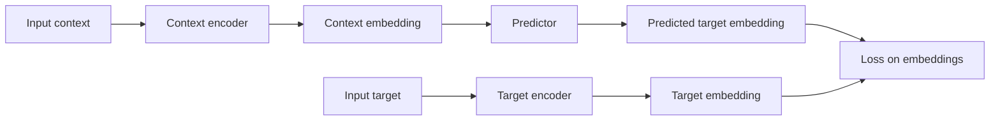

https://youtu.be/kYkIdXwW2AE?si=KBdjz4DLDf1PARkL 
[Welch Labs](https://www.youtube.com/@WelchLabs) on [[Sources/Media/YouTube|YouTube]]

[[concepts/Explainers for AI/Vector Embeddings|Vector Embeddings]]
[[Tooling/AI-Toolkit/AI Programming Frameworks/Sentence Transformers|Sentence Transformers]]

# Defining and Describing Joint Embedding Predictive Architechture

_“Joint Embedding Predictive Architecture” (JEPA) is a self-supervised learning framework that learns to predict in an abstract embedding space instead of reconstructing raw data like pixels or tokens._[^gc5ghv] [^lq95f2]

JEPA is a **representation-learning architecture** in which both the observed “context” and the “target” to be predicted are encoded into a shared latent space, and a predictor network forecasts the target embedding from the context embedding. [^gc5ghv] [^lq95f2] It is designed for **self-supervised learning** without labels, focusing on **high‑level, task‑relevant semantics** while discarding low‑level noise and surface details. [^gc5ghv] [^yg9tk9] This makes JEPA especially relevant as a foundation for **world models**, [[concepts/Explainers for AI/Multimodal Models|Multimodal Models]], and efficient large-model systems that “think” in vectors and only decode to language or pixels when needed. [^lq95f2] [^9nrrh4] [^z1v6kn]

A typical **JEPA** consists of four main components: [^gc5ghv] [^anm5j7]  

- **Context encoder** – processes the observed part of the data (e.g., past video frames, surrounding text) into a context embedding. [^gc5ghv]  
- **Target encoder** – encodes the portion to be predicted (e.g., masked region, future frame, missing text) into a target embedding. [^gc5ghv] [^anm5j7]  
- **Predictor (head)** – takes the context embedding and predicts the target embedding in the same latent space, effectively forecasting “what should be there” at an abstract level. [^gc5ghv] [^lq95f2]  
- **Loss function** – trains the system to minimize the distance (via regression or contrastive loss) between predicted and actual target embeddings, rather than reconstructing raw data. [^gc5ghv] [^anm5j7]  

Conceptually, JEPA differs from classical generative models: instead of generating or reconstructing detailed outputs, it **predicts how concepts evolve in latent space**, allowing the model to learn “common-sense” structure (e.g., object permanence, dynamics) without wasting capacity on irrelevant detail. [^lq95f2] [^9nrrh4]

# Uses in Context

- In introductory explanations, JEPA is described as “a **self-supervised learning framework designed to learn useful representations from data without relying on labeled examples**,” emphasizing its role as a general representation learner rather than a decoder-based generator. [^gc5ghv]  
- Meta AI’s world-model work introduces V‑JEPA as “**Video Joint Embedding Predictive Architecture**,” used to build a video world model that “**achieves state-of-the-art visual understanding and prediction, enabling zero-shot robot control in new environments**.”[^9nrrh4] [^z1v6kn]  
- In multimodal modeling, VL‑JEPA is presented as “a vision-language model built on a **Joint Embedding Predictive Architecture**” that “**predicts continuous embeddings of the target texts** instead of autoregressively generating tokens,” highlighting JEPA as an alternative to token-by-token generation. [^yg9tk9]  
- A recent tutorial describes JEPA as a “**comprehensive and systematic exposition of JEPA and its extensions, covering its theoretical foundations, architectural design, and applications**,” positioning it as a general conceptual framework rather than a single model. [^anm5j7]  
- In the LLM context, “LLM-JEPA: Large Language Models Meet Joint Embedding Predictive Architectures” explores how JEPA principles can be combined with large language models, framing JEPA as a way to let LLMs operate on **continuous latent predictions instead of next-token decoding**. [^2o3f0t]  
- Public talks and discussions (e.g., long-form interviews explaining the architecture) refer to JEPA as representing a “**fundamental philosophical shift**” away from “the era of the ‘next token’” toward predicting “**dense semantic vectors that capture the whole concept**” and enabling “selective decoding.”[^lq95f2]  

# History of Use

## Origins

- The **concept and term “Joint Embedding Predictive Architecture” (JEPA)** have been championed by **Yann LeCun** and collaborators in the context of energy-based models and world-model-style self-supervised learning. [^lq95f2] [^anm5j7] [^2o3f0t]  
- Early public articulation of JEPA’s philosophy appears in LeCun’s talks and manuscripts on “A Path Towards Autonomous Machine Intelligence,” where he proposed architectures that predict in latent space with separate encoders and a learned energy or compatibility function, anticipating the JEPA structure later formalized and popularized by Meta AI research. [^lq95f2] [^9nrrh4] [^anm5j7]  
- Subsequent research papers and tutorials, such as the **TechRxiv “Tutorial on Joint Embedding Predictive Architectures (JEPA)”** and works like **LLM‑JEPA** and **VL‑JEPA**, consolidate and formalize JEPA as a labeled architecture family (not just an idea), defining its components, loss formulations, and applications. [^yg9tk9] [^anm5j7] [^2o3f0t]  

## Evolution

- **2020–2022 – Latent-space prediction and energy-based framing.** LeCun’s work on energy-based models and world models sketched the idea of using separate encoders and an energy or score function in latent space, moving away from full reconstruction and toward compatibility-based prediction; this laid the conceptual groundwork for JEPA. [^lq95f2] [^anm5j7]  
- **2023–2024 – Video and world models (V‑JEPA, V‑JEPA 2).** Meta AI introduced **Video Joint Embedding Predictive Architecture (V‑JEPA)** and then **V‑JEPA 2**, demonstrating that a JEPA-style model trained on video can achieve state-of-the-art world-model performance, enabling zero-shot robot planning and control in unseen environments. [^9nrrh4] [^z1v6kn]  
- **2024–2025 – Multimodal and LLM integration (VL‑JEPA, LLM‑JEPA).** Research prototypes such as **VL‑JEPA** extend JEPA to vision–language, predicting continuous text embeddings rather than tokens, [^yg9tk9] while **LLM‑JEPA** explores combining large language models with JEPA-style prediction to let systems reason in continuous abstract spaces and only decode to language when necessary. [^2o3f0t]  
- **Ongoing – Theoretical consolidation and tutorials.** The TechRxiv tutorial codifies JEPA’s “theoretical foundations, architectural design, and applications,” helping shift the term from an informal label in talks and blogs to a more standardized architectural concept in the literature. [^anm5j7]  

# Best Real-World Examples

- **[V‑JEPA 2](https://ai.meta.com/research/vjepa/)** – Meta AI’s **Video Joint Embedding Predictive Architecture 2**, a world model trained on video that attains state-of-the-art visual understanding and prediction and supports zero-shot robot control in new environments. [^9nrrh4] [^z1v6kn]  
- **[V‑JEPA (first generation)](https://ai.meta.com/blog/v-jepa-2-world-model-benchmarks/)** – The earlier **Video JEPA** model demonstrating that a JEPA-based encoder–predictor operating on video embeddings can serve as a strong world model for forecasting and representation learning. [^9nrrh4]  
- **[VL‑JEPA](https://arxiv.org/abs/2512.10942)** – A **vision-language JEPA** that, instead of autoregressively generating text tokens, “predicts continuous embeddings of the target texts,” focusing on semantic content while abstracting away linguistic surface variation. [^yg9tk9]  
- **[LLM‑JEPA](https://arxiv.org/abs/2509.14252)** – A research effort combining **large language models with JEPA**, using JEPA-style latent predictions to augment or replace next-token prediction, aiming for more efficient and robust language understanding. [^2o3f0t]  
- **[JEPA Tutorial (TechRxiv)](https://www.techrxiv.org/doi/10.36227/techrxiv.176469421.19270944)** – A comprehensive tutorial that systematizes **JEPA and its extensions**, used by researchers and practitioners as a reference architecture for self-supervised world models and representation learning. [^anm5j7]  
- **[Educational overviews and explainers](https://www.geeksforgeeks.org/artificial-intelligence/jepa/)** – Pedagogical write‑ups and blog posts that distill JEPA into accessible terms (e.g., GeeksforGeeks’ explanation of JEPA’s context encoder, target encoder, predictor, and loss), helping the architecture diffuse beyond the originating research lab. [^gc5ghv]  

# Case Studies

## V‑JEPA 2 as a Video World Model for Robot Control

Meta AI’s **V‑JEPA 2** is presented as “**the first world model trained on video that achieves state-of-the-art visual understanding and prediction, enabling zero-shot robot control in new environments**.”[^9nrrh4] [^z1v6kn] Built using a **joint-embedding predictive architecture**, V‑JEPA 2 has an encoder that maps raw video into embeddings and a predictive component that forecasts future embeddings, all trained in a self-supervised manner without labeled data. [^9nrrh4] [^z1v6kn] By focusing on predicting in embedding space, the model can capture high-level physical dynamics—object motion, interactions, and plausible futures—without reconstructing each pixel. [^lq95f2] [^9nrrh4] Experiments show that the embeddings learned by V‑JEPA 2 can be used for **zero-shot planning**, where a robot uses the world model to plan interactions with unfamiliar objects in previously unseen environments, demonstrating JEPA’s value as a backbone for embodied intelligence and control. [^9nrrh4] [^z1v6kn] This case illustrates how JEPA enables **generalizable, label-efficient world models** that support downstream tasks such as robotics with minimal additional supervision. [^9nrrh4] [^z1v6kn]  

## VL‑JEPA: Rethinking Vision–Language Models Beyond Next-Token Generation

The **VL‑JEPA** model introduces a **vision–language system** built on JEPA principles: rather than autoregressively generating tokens, it “**predicts continuous embeddings of the target texts**.”[^yg9tk9] The architecture uses encoders to map visual inputs and associated text into a shared embedding space, and a predictor network learns to forecast the target text embedding from the visual context (and possibly partial text) embedding. [^yg9tk9] Because learning takes place in an abstract representation space, the model “**focuses on task-relevant semantics while abstracting away surface-level linguistic variability**,” which can improve robustness and transfer across tasks involving captions, retrieval, and grounding. [^yg9tk9] This case shows how JEPA’s core idea—**prediction in latent space rather than token space**—offers an alternative path to scaling multimodal models, potentially reducing reliance on massive supervised datasets while improving semantic focus. [^yg9tk9] [^anm5j7]  

## LLM‑JEPA: Integrating Latent Prediction with Large Language Models

In **LLM‑JEPA: Large Language Models Meet Joint Embedding Predictive Architectures**, Huang, LeCun, and Balestriero investigate how JEPA can be combined with large language models. [^2o3f0t] The work considers architectures where an LLM interacts with a JEPA-style module that predicts or refines **continuous latent representations** instead of directly generating the next token, aiming to exploit the efficiency and robustness of latent predictions while retaining the expressive power of LLMs. [^2o3f0t] This responds to a critique articulated in JEPA discussions: that next-token prediction forces models to model every “um” and “ah” in a transcript, whereas a JEPA can “**predict how the concept changes**” via dense semantic vectors and reserve decoding for when language output is needed. [^lq95f2] LLM‑JEPA exemplifies the broader trend of using JEPA not just as a vision world model but as a **general architectural pattern** for making large models think in embeddings and only decode selectively, with potential gains in efficiency and robustness. [^lq95f2] [^anm5j7] [^2o3f0t]  

***

# Sources

[^gc5ghv]: [JEPA - GeeksforGeeks](https://www.geeksforgeeks.org/artificial-intelligence/jepa/)
[^lq95f2]: [Joint Embedding Predictive Architectures (JEPA) - YouTube](https://www.youtube.com/watch?v=Y_9tAf3eN9s)
[^yg9tk9]: [VL-JEPA: Joint Embedding Predictive Architecture for Vision-language](https://arxiv.org/abs/2512.10942)
[^9nrrh4]: [Introducing the V-JEPA 2 world model and new benchmarks for ...](https://ai.meta.com/blog/v-jepa-2-world-model-benchmarks/)
[^z1v6kn]: [Introducing V-JEPA 2 - Meta AI](https://ai.meta.com/research/vjepa/)
[^anm5j7]: [Tutorial on Joint Embedding Predictive Architectures (JEPA)](https://www.techrxiv.org/doi/10.36227/techrxiv.176469421.19270944)
[^2o3f0t]: [[2509.14252] LLM-JEPA: Large Language Models Meet Joint ... - arXiv](https://arxiv.org/abs/2509.14252)
