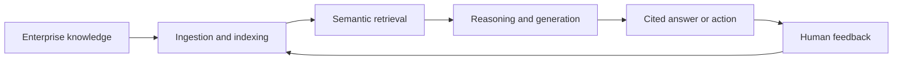

[[concepts/Explainers for AI/Company Brains|Company Brains]]
[[Sources/Books/Building a Second Brain|Building a Second Brain]]
[[client-content/Laerdal/Sources/Laerdal Entities/Knowledge Hub|Knowledge Hub]]
[[concepts/Explainers for AI/Knowledge Graphs|Knowledge Graph]]
[[Vocabulary/Knowledge Bases|Knowledge Bases]]

[[ChromaDB]]
[[Glen]]

# Defining and Describing Knowledge AI

_Knowledge AI turns an organization’s scattered knowledge into an answerable, actionable memory._

Knowledge AI is an emerging software layer that interprets user intent, retrieves relevant information from an enterprise corpus, generates natural-language answers, drafts content, or triggers actions. [^t5w5u7] It sits between traditional knowledge management—which organizes information for people—and systems such as [[Vocabulary/Retrieval-Augmented Generation|Retrieval-Augmented Generation]], [[concepts/Explainers for AI/Semantic AI|Semantic AI]] search, [[concepts/Explainers for AI/Knowledge Graphs|Knowledge Graphs]], and [[Vocabulary/Agentic AI|AI Agents]]. [^t5w5u7] [^54z8ad] The concept matters when knowledge is distributed across documents, systems, conversations, and expert practice, and when users need usable answers rather than a file repository. [^54z8ad] [^ei14ml]

# Uses in Context

- **[[concepts/Explainers for Tooling/Data Hubs|Enterprise Data Hubs]]:** Knowledge AI is described as connecting [[concepts/Explainers for AI/Conversational AI|Conversational AI]] with “cognitive search” across dispersed company information. [^54z8ad]
- **Customer support:** The term refers to using AI to improve support conversations by retrieving relevant information during service interactions. [^54z8ad]
- **Internal assistants:** Platforms present Knowledge AI as an assistant that understands natural-language questions and returns usable answers from collective organizational memory. [^ei14ml]
- **Knowledge graphs:** Implementations may create networks of related concepts to connect information across sources. [^54z8ad]
- **Agentic automation:** Knowledge AI can answer questions, draft briefs, and execute tasks using an enterprise corpus. [^t5w5u7]
- **Personal knowledge systems:** Practitioner discussions extend the idea to an “AI-native Second Brain” combining knowledge engineering, graph search, hybrid retrieval, long-term memory, and agent interfaces. [^remz55]

# History of Use

## Origins

The exact first use of the compound term **“Knowledge AI”** is not established by the available search results. The underlying technical lineage is older: AI knowledge representation encodes information about the world in machine-usable formats for reasoning and decision-making. [^1sdap4] [^0km280] Contemporary usage appears to have crystallized as a category for software that places conversational or agentic intelligence over organizational knowledge; one 2026 industry account explicitly calls it a “usage layer” and distinguishes it from the older discipline of knowledge management. [^t5w5u7]

## Evolution

- **Foundational AI period:** Knowledge representation developed as a way to encode facts, rules, and relationships so computational systems could solve problems and reason about the world. [^1sdap4] [^0km280]
- **Knowledge-management period:** Organizations accumulated wikis, intranets, support knowledge bases, and federated search systems intended to make internal information accessible to employees. [^t5w5u7]
- **2023–2026 category formation:** Knowledge AI increasingly came to mean an assistant or agent that interprets intent, retrieves enterprise knowledge, produces answers, and performs tasks; the category was described in 2026 as having emerged rapidly since 2023. [^t5w5u7]
- **Context and memory expansion:** Practitioner implementations broadened the concept from document retrieval toward graph relationships, persistent decisions, expert context, and interfaces for AI agents. [^remz55]

# Best Real-World Examples

- [Blockbrain](https://www.blockbrain.io/) — builds “digital knowledge twins” and no-code Knowledge Bots from expert input for research, onboarding, and regulated workflows. [^04pbvp]
- [Wissly](https://www.wissly.ai/) — frames Knowledge AI as an intelligent assistant that connects organizational memory through natural-language retrieval, contextual linking, and semantic search. [^ei14ml]
- [Sphere Knowledge AI](https://www.sphereinc.com/solution/knowledge-ai) — implements enterprise retrieval-augmented generation over internal documents with semantic search, citations, confidence scores, and inherited access controls. [^jacz3b]
- [AI-native Second Brain projects](https://dev.to/nishikantaray/building-an-ai-native-second-brain-with-multi-rag-knowledge-graphs-and-mcp-fmg) — combine knowledge engineering, knowledge graphs, hybrid retrieval, long-term memory, and the Model Context Protocol to make personal knowledge available to AI agents. [^remz55]
- [Stripe’s Knowledge AI Platform](https://stripe.com/) — an internal platform known as “Kai” that was reportedly adopted across much of Stripe shortly after its launch. [^fmeex6]
- [Bright Pattern Knowledge AI](https://www.brightpattern.com/knowledge-ai/) — applies conversational AI, intelligent search, and knowledge graphs to workforce and customer-service information. [^54z8ad]

# Case Studies

**Blockbrain and expert knowledge capture.** Blockbrain, a Stuttgart-based company, developed a platform that converts expert input into digital knowledge twins and AI agents called Knowledge Bots. [^04pbvp] The system is aimed at making tacit expertise available across teams while supporting research, onboarding, and regulated-industry workflows. [^04pbvp] The company describes its objective as turning structured and unstructured data into a competitive advantage and making internal knowledge a strategic asset. [^04pbvp] The case illustrates a central Knowledge AI proposition: the valuable input is not only stored documentation, but also the reasoning and expertise embedded in organizational work.

**Stripe’s internal Knowledge AI platform.** Stripe reportedly built an internal platform called Kai and, according to a discussion of the launch, achieved broad internal use within two weeks of its April release. [^fmeex6] The available result does not provide enough detail to independently verify the platform’s architecture, adoption figures, or measured business effects. Even so, the example demonstrates how Knowledge AI can be treated as an internal company capability rather than merely a customer-facing search product: a shared interface for finding and using institutional knowledge. [^fmeex6]

**The AI-native Second Brain pattern.** Independent practitioners describe an AI-native Second Brain as a system that captures information, structures entities and relationships, combines semantic, keyword, and graph retrieval, preserves decisions as long-term memory, and exposes that knowledge to assistants through agent protocols. [^remz55] This expands the traditional “second brain” metaphor from personal note-taking into an AI-readable context layer. The case shows how Knowledge AI can operate at individual, team, or company scale, provided that provenance, relationships, permissions, and retrieval quality are treated as first-class design concerns. [^remz55] [^jacz3b]

***

# Sources

[^1sdap4]: [AI-Module 1: Overview of Artificial Intelligence and Knowledge ...](https://www.studocu.com/in/document/university-of-kerala/computer-science/ai-module-1-overview-of-artificial-intelligence-and-knowledge-concepts/148544735)
[^t5w5u7]: [Knowledge AI vs. Knowledge Management vs. DKP: untangling ...](https://www.k-ai.ai/en/news/knowledge-ai-km-dkp-untangling-3-categories/)
[^54z8ad]: [What is Knowledge AI?](https://www.brightpattern.com/knowledge-ai/)
[4]: [What Is an AI Knowledge Engineer? — Designing Knowledge AI Can Reliably Use｜Jun Ikematsu / 池松潤](https://note.com/ikematsu/n/ne6c93d3e7ed7)
[^ei14ml]: [Key Challenges To Consider](https://www.wissly.ai/en/blog/knowledge-ai-platform-enterprise-activation)
[^jacz3b]: [Enterprise RAG Search That Respects Every Permission](https://www.sphereinc.com/solution/knowledge-ai)
[7]: [What is Knowledge AI?](https://www.umu.com/ask/q11122301573854196238)
[^fmeex6]: [Stripe's Knowledge AI Platform](https://news.ycombinator.com/item?id=49815982)
[9]: [KM Article Key Findings | PDF | Artificial Intelligence - Scribd](https://www.scribd.com/document/952613649/KM-Article-Key-Findings)
[^04pbvp]: [techfundingnews.com · blockbrain-raises-17-5m-series-aBlockbrain grabs €17.5M to make sure companies never lose their...](https://techfundingnews.com/blockbrain-raises-17-5m-series-a-knowledge-ai-agents/)
[11]: [Artificial Intelligence (AI): Knowledge & Resources - Psychepedia](https://psychepedia.arabpsychology.com/trm/artificial-intelligence-ai-knowledge-resources/)
[^0km280]: [Knowledge Representation in AI: Topic 3 Overview](https://www.studocu.com/row/document/mount-kenya-university/regression-modelling/knowledge-representation-in-ai-topic-3-overview/163517416?origin=related-document)
[^remz55]: [Building an AI-native Second Brain with Multi-RAG, Knowledge ...](https://dev.to/nishikantaray/building-an-ai-native-second-brain-with-multi-rag-knowledge-graphs-and-mcp-fmg)
[14]: [Second Brain สำหรับองค์กร 2026 — AI Knowledge ...](https://enersys.co.th/th/insights/second-brain-ai-knowledge-management-enterprise-2026)
[15]: [Knowledge Representation in AI | PDF](https://www.scribd.com/presentation/963112316/FOL-Ai)
