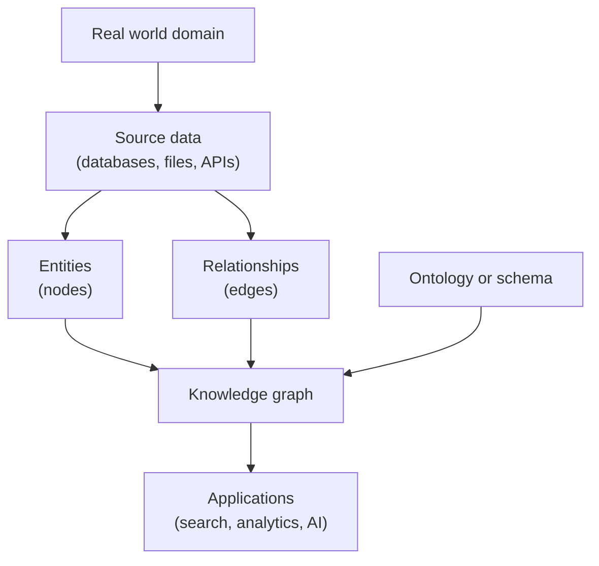

[[Vocabulary/Knowledge Augmented Generation|KAG]]
[[Vocabulary/Retrieval-Augmented Generation|RAG]]
[[concepts/Explainers for AI/Rag Agent|Rag Agent]]
[[Vocabulary/Domain-Driven Design|Domain-Driven Design]]

https://youtu.be/fpFA0AOfBYI?si=mJyBnIyh4o7mHZHo

# Defining and Describing Knowledge Graphs

.png)

_A knowledge graph turns scattered facts into a connected map of entities and relationships that both humans and machines can navigate._

A **knowledge graph** is a **structured representation of information** in which entities such as people, places, products, or abstract concepts are modeled as **nodes** and their semantic relationships (for example “works at”, “is located in”, “is a type of”) are modeled as **edges** in a network-like structure. [^3b4hls] [^5cx6mm] [^w2femk] [^fqhcs1] It “transforms raw data into a network of meaning,” linking data across systems and domains while capturing the relationships that give it context and business relevance. [^sktg0l] By making these relationships explicit, knowledge graphs create a **web of knowledge** that enables richer context, more accurate search and recommendations, and more explainable AI-driven decisions for organizations. [^3b4hls] [^sktg0l] [^l3jy3c] [^7iyklf] They are particularly useful when data is complex, comes from many sources, or must support reasoning, discovery, and flexible querying beyond rigid schemas. [^fqhcs1] [^mid6me]

Key structural elements commonly identified in definitions include: [^5cx6mm] [^w2femk] [^fqhcs1] [^mid6me]  
- **Nodes (entities)** representing people, products, locations, events, or abstract ideas. [^5cx6mm] [^w2femk]  
- **Edges (relationships)** as labeled connections describing how two nodes relate (e.g., “is located in,” “purchased by,” “is a type of”). [^5cx6mm] [^w2femk]  
- **Attributes or properties** attached to nodes and edges to provide additional context (such as names, timestamps, or scores). [^w2femk] [^fqhcs1]  
- **Ontologies or schemas** that define entity types, relationship types, and constraints so the graph remains consistent and machine-understandable. [^5cx6mm] [^sktg0l] [^w2femk]  

Many practitioners emphasize that a knowledge graph is a **data model or representation**, whereas a **graph database** is the storage and query engine used to implement it; the two are related but distinct. [^fqhcs1] [^mid6me] Compared with traditional relational databases, knowledge graphs typically support more flexible schemas and are especially suited for combining structured and unstructured data into a connected representation. [^fqhcs1]  

# Uses in Context

- In **enterprise data and analytics**, knowledge graphs are described as “a way to transform raw data into a network of meaning” that models how customers, products, processes, and events interact, forming a semantic layer for analytics and AI. [^sktg0l]  
- In **AI and search applications**, vendors explain that a knowledge graph “connects data entities through defined relationships, enabling richer context and actionable insights for both humans and machines,” powering intelligent search and recommendations. [^3b4hls] [^7hvvtp] [^7iyklf]  
- In **infrastructure and operations**, knowledge graphs are used to represent routers, servers, and services as nodes and their dependencies as edges, helping teams understand complex infrastructure and automate impact analysis. [^mid6me]  
- In **knowledge management**, organizations use knowledge graphs to “connect siloed data and preserve institutional knowledge,” leading to faster, more accurate, and more explainable decisions across departments. [^l3jy3c]  
- In **industry-specific domains** (such as customer data, supply chains, or product catalogs), knowledge graphs function as a semantic data layer that “mirrors real-world business operations” by linking data across clouds, systems, and domains. [^sktg0l]  

# History of Use

## Origins

- The term **“knowledge graph”** gained broad visibility when **Google** publicly introduced the *Google Knowledge Graph* in 2012 as an underlying technology for its search engine, describing “things, not strings” and modeling entities and their relationships to improve search results. [^3b4hls] (This origin is widely reported in secondary discussions, although the idea of graph-structured knowledge predates the term in earlier AI work on semantic networks and ontologies.)[^fqhcs1]  
- Earlier AI and knowledge-representation research in academia had long used graph-based models such as **semantic networks** and **ontologies** to represent entities and relationships; modern knowledge graphs build on these foundations but emphasize large-scale, heterogeneous, and often web- or enterprise-wide data integration. [^fqhcs1]  

## Evolution

- **2010s – Web and search adoption:** Commercial search engines and web-scale systems adopted knowledge graphs to enhance search, recommendations, and question answering by connecting web entities and facts in a unified graph. [^3b4hls] [^fqhcs1] [^7iyklf]  
- **Late 2010s – Enterprise semantic layers:** Enterprises began using knowledge graphs as part of a “semantic data layer” that links data across clouds, systems, and domains, allowing analytics and AI models to operate over unified, context-rich data. [^sktg0l] [^w2femk]  
- **2020s – AI, LLM, and agentic workflows:** Knowledge graphs are increasingly positioned as a key way to give large language models and AI agents structured context, with vendors describing them as “the key to context” for grounding, retrieval, and explainability in complex environments. [^fqhcs1] [^7iyklf]  

# Best Real-World Examples

- [Decagon](https://decagon.ai)[^5cx6mm] – Uses knowledge graphs to model real-world entities and their relationships in domains like healthcare and biology, enabling graph-based predictions and insights.  
- [GraphRAG](https://graphrag.com)[^fqhcs1] – An approach and tooling stack that combines retrieval-augmented generation with knowledge graphs, representing facts as nodes and relationships to give LLMs structured context.  
- [OpsMill](https://opsmill.com)[^mid6me] – Applies knowledge graphs to infrastructure data, representing routers, virtual machines, and services as nodes and their dependencies as edges to improve observability and impact analysis.  
- [Mindbreeze InSpire](https://www.mindbreeze.com)[^w2femk] – Enterprise search and insight platform that builds a knowledge graph over corporate content to reveal patterns and connections across documents and systems.  
- [Bloomfire](https://bloomfire.com)[^l3jy3c] – Knowledge management platform that uses knowledge graphs to connect siloed organizational knowledge, improving discovery and reuse.  
- [SAP Business Technology Platform](https://www.sap.com)[^sktg0l] – An enterprise adopter that provides a semantic layer and tooling to build knowledge graphs linking customers, products, processes, and events for analytics and AI.  
- [Glean](https://www.glean.com)[^7iyklf] – [[Tooling/AI-Toolkit/Knowledge AI/Glean|Glean]] – Workplace search provider that builds a knowledge graph of people, documents, and activities to give AI-powered search and agents richer context about an organization’s work.  

# Case Studies

## Decagon: Graph-Structured Biomedical Knowledge

[[Decagon]] is a company focused on applying knowledge graphs and graph neural networks to **real-world domains** such as healthcare and biology. [^5cx6mm] It defines a knowledge graph as “a way of organizing and representing information about real-world things, like people, places, products, or concepts, and how they relate to each other,” using nodes for entities and labeled edges for relationships. [^5cx6mm] In biomedical settings, this might mean representing drugs, diseases, genes, and side effects as nodes, and connections like “treats,” “interacts with,” or “associated with” as edges to form a navigable map of biomedical knowledge. [^5cx6mm] By operating over this structured graph, Decagon can support tasks such as discovering non-obvious connections or predicting interactions, illustrating how knowledge graphs enable **machine reasoning over complex, interconnected scientific data** rather than isolated tables or documents. [^5cx6mm] [^fqhcs1]  

## OpsMill: Understanding Infrastructure Through Graphs

[[OpsMill]] describes a knowledge graph as “a data model that represents entities and the relationships between them as nodes and edges,” explicitly distinguishing it from the graph database used to store and query it. [^mid6me] In its infrastructure-focused use case, each node can represent a router, a virtual machine, a service, or other infrastructure elements, while edges capture dependencies such as “runs on,” “connects to,” or “depends on.”[^mid6me] By building such a graph over infrastructure data, OpsMill enables teams to understand how components relate, evaluate the impact of failures, and automate tasks based on the graph structure. [^mid6me] This case demonstrates how knowledge graphs provide **operational visibility** in complex technical environments by making relationships first-class and queryable, rather than buried in configuration files or ad hoc documentation. [^mid6me] [^w2femk]  

## Enterprise Semantic Layers: SAP and Knowledge-Driven Analytics

SAP describes a knowledge graph as “a way to transform raw data into a network of meaning” that models how customers, products, processes, and events interact, forming “a semantic foundation that helps businesses move beyond disconnected data toward actionable insights.”[^sktg0l] In its enterprise scenario, data coming from multiple clouds, applications, and analytical systems is linked via a knowledge graph that functions as part of a semantic data layer mirroring real-world business operations. [^sktg0l] Organizations are advised to start by focusing on a key use case (such as customers or supply chains), define entities and relationships in an ontology, choose a platform that supports knowledge graphs, and then run pilot projects like recommendation engines or fraud detection before scaling out. [^sktg0l] This case illustrates how knowledge graphs are used not just as data structures but as **strategic integration layers**, enabling consistent analytics and AI across heterogeneous enterprise data sources. [^sktg0l] [^w2femk] [^l3jy3c]  

***

# Sources

[^3b4hls]: [Knowledge Graphs: What They Are and Why They Matter - Splunk](https://www.splunk.com/en_us/blog/learn/knowledge-graphs.html)
[^5cx6mm]: [What is a knowledge graph? - Decagon](https://decagon.ai/glossary/what-is-a-knowledge-graph)
[^sktg0l]: [What is a knowledge graph? - SAP](https://www.sap.com/resources/knowledge-graph)
[^w2femk]: [Knowledge Graphs Explained | Blog - Mindbreeze InSpire](https://www.mindbreeze.com/blog/knowledge-graphs-explained)
[^fqhcs1]: [Intro to Knowledge Graphs - GraphRAG](https://graphrag.com/concepts/intro-to-knowledge-graphs/)
[^mid6me]: [Knowledge Graphs for Infrastructure Data Explained | OpsMill](https://opsmill.com/blog/knowledge-graph-for-infrastructure-explained/)
[^7hvvtp]: [Knowledge Graph | Overview - YouTube](https://www.youtube.com/watch?v=PrJBgOPyFfk)
[^l3jy3c]: [What is a Knowledge Graph? A Complete Overview - Bloomfire](https://bloomfire.com/blog/what-is-a-knowledge-graph/)
[^7iyklf]: [How knowledge graphs work and why they are the key to context for ...](https://www.glean.com/blog/knowledge-graph-agentic-engine)
