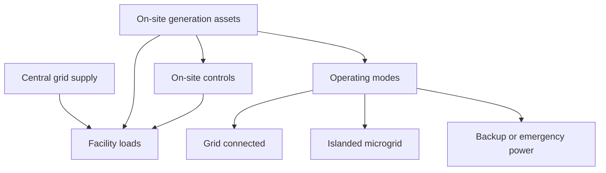

[[Vocabulary/Betavoltaic Batteries|Betavoltaic Batteries]]

[[client-content/Hypernova/Files/Portfolio/Aalo Atomics|Aalo Atomics]]
[[ExoWatt]]
[[Amperesand]]

# Defining and Describing On-Site Power Generation

_Using on-site power generation means making at least some of your own electricity where you use it, instead of depending entirely on the distant grid._

On-site power generation (often called **on-site power** or **onsite generation**) is the production of electricity at or near the point where it is consumed, rather than exclusively drawing power from central power plants via the transmission and distribution grid. [^qlml7x] [^fo37zc] Businesses, data centers, industrial facilities, and campuses install their own generation assets—such as solar PV, batteries, fuel cells, natural-gas engines, or microturbines—to supply some or all of their load for cost savings, resilience, emissions reduction, or using otherwise stranded fuels. [^qlml7x] [^n6cjp6] [^n8r4sn] [^3179n0] It is a core form of **distributed generation** or **distributed energy resources (DERs)** and is increasingly critical where grid capacity is constrained or reliability risks are high. [^fo37zc] [^a0385a]

At its core, on-site power generation usually involves:

- **Local generation assets** – e.g., rooftop or ground-mounted solar PV, combined heat and power (CHP) units, reciprocating engines, fuel cells, microturbines, or small wind turbines sized to the facility’s demand. [^qlml7x] [^fo37zc] [^n6cjp6] [^n8r4sn] [^ceoxr2]  
- **Interconnection with the grid** – most systems remain grid-tied, using on-site power to offset grid purchases, provide backup, or participate in demand response; some run as microgrids that can island during outages. [^fo37zc] [^n6cjp6] [^ceoxr2] [^a0385a]  
- **Control and optimization systems** – “intelligent onsite power generation systems” integrate forecasting, real-time controls, and sometimes energy storage to match generation to facility loads and market conditions. [^ceoxr2] [^n8r4sn]  

Because this is naturally hierarchical (assets → controls → operating modes), a diagram is useful:

# Uses in Context

- Energy advisors describe on-site power as “**the production of electricity at or near the point where it’s consumed**,” emphasizing that instead of relying entirely on grid power, businesses “use their own equipment to generate some or all of their energy needs locally.”[^qlml7x]  
- Engineering firms frame it as a **resilience strategy**, noting that on-site power “provides resilient, dependable capacity directly at the point of demand” and that distributed energy resources “improve power quality and reliability.”[^fo37zc]  
- Policy guides talk about **on-site renewable energy generation** as a climate tool, where local governments “meet some or all of their electricity needs through on-site renewable energy generation,” including solar, wind, biogas, and small hydro. [^n6cjp6]  
- Industrial project planners treat “designing reliable on-site power generation” as “a defining factor in the success of industrial projects,” focusing on modular generation, load forecasting, and scalability of capacity. [^n8r4sn]  
- Energy consultants highlight on-site generation as a monetization strategy for oil and gas producers: it is “compelling as a strategic fit for E&P companies, offering a path to monetize underutilized gas, reduce emissions, and deliver power to remote operations.”[^3179n0]  
- Data center analysts describe onsite power as an emerging **primary power model**, with surveys showing that “onsite power has emerged as an attractive solution to power large scale data centers” due to reliability, emissions benefits, and regulatory advantages. [^kmi7ga]  

# History of Use

## Origins

- The underlying idea of generating electricity at the point of use dates back to the earliest electric systems of the late 19th century, when many factories and commercial buildings had their own steam-driven generators before centralized utility grids became dominant. [^n6cjp6] [^a0385a] (This is widely documented in power-system histories; the sources here discuss the contrast between central-station and distributed/on-site models.)  
- The modern term **“on-site power generation”** gained prominence as part of the broader **distributed generation** and **distributed energy resources (DER)** concepts in utility and policy literature in the late 20th century, distinguishing smaller customer-sited plants from central-station plants connected at transmission level. [^n6cjp6] [^a0385a]  
- As environmental policy matured, U.S. EPA and others standardized the sub-term **“on-site renewable energy generation”** in guidance to state and local governments, defining it as on-premise renewable systems that directly serve the host’s load. [^n6cjp6]  

Because the phrase is descriptive and generic, it emerged across engineering, policy, and commercial documents rather than from a single “coining” paper; utility planning and DER policy communities are the main origin contexts. [^n6cjp6] [^a0385a]

## Evolution

- **1990s–2000s – From backup to distributed generation:** On-site power was historically associated with diesel backup generators, but as natural gas infrastructure expanded and DER technologies matured, it evolved into a broader category including CHP, microturbines, and early solar installations aimed at economic and efficiency gains, not just emergency power. [^fo37zc] [^n6cjp6]  
- **2010s – Integration with renewables and microgrids:** Policy pushes for renewables and resilience led to a focus on “on-site renewable energy generation,” especially solar PV paired with storage and controls, enabling campus and community microgrids that can “meet some or all” of local electricity needs and island during outages. [^n6cjp6] [^ceoxr2] [^a0385a]  
- **2020s – Strategic response to grid constraints and decarbonization:** Surging power demand from data centers and industrial electrification has outpaced grid capacity in several regions, and analysts now describe “on-site solutions” as offering “a faster path to power” than waiting for new grid infrastructure. [^a0385a] At the same time, surveys show a sharp rise in facilities planning to be “fully powered by onsite generation” within the decade, with data centers especially adopting fuel cells and gas-based systems as primary supply. [^fd6ebr] [^kmi7ga]  

# Best Real-World Examples

(Each bullet names an entity that exemplifies on-site power generation in practice.)

- [Diversegy](https://diversegy.com/on-site-power-generation/) – An energy advisory firm that helps commercial customers deploy on-site power to “generate some or all of their energy needs locally,” using technologies like CHP, solar, and generators to reduce costs and improve resilience. [^qlml7x]  
- [Burns & McDonnell On-Site Power Generation Services](https://www.burnsmcd.com/services/electric-power-generation/on-site-power-generation) – An engineering firm designing and building on-site generation and microgrids that provide “resilient, dependable capacity directly at the point of demand” for campuses, industrial sites, and critical facilities. [^fo37zc]  
- [U.S. EPA On-Site Renewable Energy Generation](https://www.epa.gov/statelocalenergy/site-renewable-energy-generation) – A federal guidance program describing how local governments can deploy on-site solar, wind, biomass, and other renewables on their facilities to meet climate and energy goals. [^n6cjp6]  
- [Bloom Energy fuel-cell data center deployments](https://www.bloomenergy.com/news/onsite-generation-expected-to-fully-power-27-percent-of-data-center-facilities-by-2030/) – Fuel-cell systems installed at or near data centers to serve as primary or significant on-site power sources, with industry surveys projecting that 27% of data center facilities expect to be fully powered by such onsite generation by 2030. [^fd6ebr] [^kmi7ga]  
- [Biz-Reps Intelligent Onsite Power Systems](https://biz-reps.com/onsite-power-generation/) – A provider emphasizing “intelligent onsite power generation systems” that integrate renewables, storage, and advanced controls to manage organizational and community energy needs. [^ceoxr2]  
- [AlixPartners E&P Onsite Power Strategies](https://www.alixpartners.com/insights/102kpuf/evaluating-the-opportunity-for-exploration-and-production-companies-around-onsite/) – Consulting work showing how exploration and production companies can turn underutilized natural gas into on-site power, cutting flaring, lowering emissions, and supplying remote operations. [^3179n0]  
- [Industrial modular gas-based on-site systems (Boereport case)](https://boereport.com/2025/12/03/power-demand-for-industrial-facilities-how-to-plan-reliable-scalable-onsite-power-generation-with-natural-gas/) – Natural-gas-fired on-site systems built around modular generator sets and load forecasting tools to create scalable power plants within industrial facilities. [^n8r4sn]  

# Case Studies

## 1. Data Centers Turning to On-Site Generation for Primary Power

Analysts tracking U.S. data center growth note that surging electricity demand from cloud and AI infrastructure is “outpacing grid capacity,” leading developers to explore **on-site solutions** as a “faster path to power” than waiting for utility upgrades. [^a0385a] In this context, a 2025 mid-year update to a data center power report released with Bloom Energy’s participation highlighted that data centers are adopting onsite power—especially fuel cells—as a **primary energy source**, not merely as backup. [^fd6ebr] A related survey found that **38% of data centers expect to incorporate onsite generation by 2030**, and, more strikingly, **27% plan to be fully powered by onsite generation by 2030**, up from just 1% the prior year. [^kmi7ga]

Fuel cells are emphasized because they can deliver reliable, 24/7 power with lower emissions and “fewer regulatory hurdles than combustion engines,” and their economics have become “cost competitive with gas turbines and reciprocating engines.”[^kmi7ga] This shift shows how on-site power generation has evolved from an emergency-only asset to a central pillar of data center power strategy, driven by grid bottlenecks, decarbonization pressures, and the need for highly reliable, controllable local supply. [^fd6ebr] [^kmi7ga] [^a0385a]

## 2. Industrial Facilities Planning Scalable On-Site Gas Power

Industrial facilities in North America increasingly see **reliable, scalable on-site power** as “a defining factor in the success of industrial projects,” particularly where grid connections are constrained or expansion is uncertain. [^n8r4sn] A planning framework highlighted in an industry report describes building on-site natural-gas-based generation around a strategy of **staggered power generation capacity**, which relies on modular generator sets that can be added or removed as production scales. [^n8r4sn] Facilities pair this modular architecture with **load forecasting tools** to align capital deployment with asset economics and ensure that power capacity keeps pace with evolving production, avoiding both stranded capacity and power shortages. [^n8r4sn]

The same guidance stresses the importance of fuel supply reliability, interconnection design, and redundancy to ensure that the on-site system can carry critical loads when the grid is unavailable. [^n8r4sn] This case illustrates how on-site power generation is used not only to reduce energy costs but also as a core design parameter for industrial expansion, supporting flexibility, growth, and resilience within the boundaries of the facility itself. [^n8r4sn]

## 3. Local Governments Deploying On-Site Renewable Power for Public Facilities

U.S. EPA’s **On-Site Renewable Energy Generation** guide profiles how local governments can meet “some or all of their electricity needs through on-site renewable energy generation” on public buildings and lands. [^n6cjp6] Examples include installing rooftop solar PV on schools and administrative buildings, developing ground-mounted solar at capped landfills, or using biogas from wastewater treatment plants to fuel generators or turbines that power the plant itself. [^n6cjp6] The guide emphasizes that these projects help advance climate goals, hedge against electricity price volatility, and demonstrate leadership in clean energy adoption, while often leveraging third-party financing structures such as power purchase agreements (PPAs) so municipalities avoid up-front capital outlays. [^n6cjp6]

By shifting a portion of public-sector demand to on-site renewables, cities and counties reduce grid purchases, lower greenhouse gas emissions, and improve resilience, particularly when systems are paired with storage or configured as microgrids that can keep critical services running during wider outages. [^n6cjp6] This case study shows how on-site power generation—especially when renewable—is not only a corporate or industrial strategy but also a public-policy tool for local governments to manage long-term energy costs and reliability while meeting climate commitments. [^n6cjp6]

***

# Sources

[^qlml7x]: [How Businesses Are Using On-Site Power to Lower Costs - Diversegy](https://diversegy.com/on-site-power-generation/)
[^fo37zc]: [On-Site Power Generation | Services - Burns & McDonnell](https://www.burnsmcd.com/services/electric-power-generation/on-site-power-generation)
[^n6cjp6]: [On-Site Renewable Energy Generation | US EPA](https://www.epa.gov/statelocalenergy/site-renewable-energy-generation)
[^fd6ebr]: [Onsite Generation Expected to Fully Power 27% of Data Center ...](https://www.bloomenergy.com/news/onsite-generation-expected-to-fully-power-27-percent-of-data-center-facilities-by-2030/)
[^n8r4sn]: [Power Demand for Industrial Facilities: How to Plan Reliable ...](https://boereport.com/2025/12/03/power-demand-for-industrial-facilities-how-to-plan-reliable-scalable-onsite-power-generation-with-natural-gas/)
[^kmi7ga]: [Survey: 27% of data centers are expected to run entirely on onsite ...](https://www.latitudemedia.com/news/survey-27-of-data-centers-are-expected-to-run-entirely-on-onsite-power-by-2030/)
[^ceoxr2]: [Onsite Power Generation | Renewable Energy Solutions Biz-Reps](https://biz-reps.com/onsite-power-generation/)
[^3179n0]: [Evaluating the opportunity for exploration and production companies ...](https://www.alixpartners.com/insights/102kpuf/evaluating-the-opportunity-for-exploration-and-production-companies-around-onsite/)
[^a0385a]: [Navigating the US data center power crunch: On-site solutions offer ...](https://www.spglobal.com/en/research-insights/special-reports/look-forward/data-center-frontiers/navigating-us-data-center-energy-demand)
