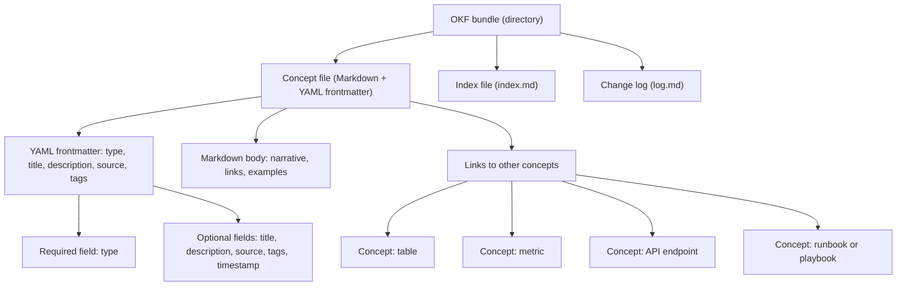

https://youtu.be/l46NJXUL4PM?is=gP0smxx585-LwhSx

[[Vocabulary/Retrieval-Augmented Generation|Retrieval-Augmented Generation]]

Some say an alternative to using [[concepts/Explainers for Tooling/Vector Databases|Vector Databases]]

_The Open Knowledge Format (OKF) is an open, vendor‑neutral way to turn what an organization knows into plain Markdown files with YAML frontmatter so both humans and AI agents can read, exchange, and trust it. [^9xlbr0] [^ry3qli] [^n4a6st] [^tyyup9] [^v3b1gg] [^owziw8] [^skazu9]_

OKF defines a **lightweight file‑system convention**—a directory tree of Markdown “concept” files, each with structured metadata at the top—that captures the metadata, context, and curated insight around data and systems in a portable form. [^9xlbr0] [^ry3qli] [^n4a6st] [^ff0p5v] [^tyyup9] [^awzf7s] [^cts5p2] [^8u8ali] [^v3b1gg] [^owziw8] [^skazu9] It applies wherever AI agents, analytics tools, or people need consistent, machine‑parseable knowledge about tables, metrics, APIs, products, or processes without relying on a proprietary catalog or platform. [^9xlbr0] [^n4a6st] [^awzf7s] [^v3b1gg] [^skazu9] It matters because it offers “just markdown, just files, just YAML frontmatter” as a common language for AI agent knowledge, reducing lock‑in and making knowledge bases easier to version, audit, and share across teams and organizations. [^n4a6st] [^tyyup9] [^v3b1gg] [^owziw8] [^skazu9] Google Cloud published OKF v0.1 on June 12, 2026, and subsequent community guides and tools have begun to standardize how agents and humans collaborate around these knowledge bundles. [^9xlbr0] [^ry3qli] [^n4a6st] [^ff0p5v] [^awzf7s] [^cts5p2] [^8u8ali] [^v32j4d] [^v3b1gg] [^owziw8] [^skazu9]

# Defining and Describing Open Knowledge Format

The Open Knowledge Format is described in its core specification as “an open, human‑ and agent‑friendly format for representing knowledge — the metadata, context, and curated insight that surrounds data and systems.”[^n4a6st] [^ff0p5v] [^owziw8] [^skazu9] The format is “intentionally minimal: a directory of markdown files with YAML frontmatter,” with no schema registry, no central authority, and no required tooling. [^n4a6st] [^skazu9] OKF v0.1 represents knowledge as a directory of Markdown files with YAML frontmatter and a small set of agreed‑upon conventions that let wikis written by different producers be consumed by different agents without translation. [^9xlbr0] [^ry3qli] [^bg2hh0] [^ff0p5v] [^awzf7s] [^v3b1gg] [^owziw8] [^skazu9] Each Markdown file in an OKF bundle corresponds to a single “concept”—for example a table, dataset, metric, product, process, runbook, API, or atomic claim—whose identity is given by its path in the folder tree. [^bg2hh0] [^awzf7s] [^cts5p2] [^8u8ali] [^v3b1gg] [^owziw8]

An OKF **bundle** is defined simply as “a directory of markdown files”; each `.md` file represents one concept, and the file path becomes the concept’s identity (e.g. `tables/orders.md` is the concept `tables/orders`). [^awzf7s] [^cts5p2] [^8u8ali] [^owziw8] The specification requires that every non‑reserved `.md` file contain a parsable YAML frontmatter block, and that every frontmatter block have a non‑empty `type` field; other fields such as title, description, source link, tags, and timestamp are optional but encouraged. [^n4a6st] [^bg2hh0] [^ff0p5v] [^awzf7s] [^owziw8] [^skazu9] Files reference each other with plain Markdown links, so the folder becomes a graph of linked concepts that agents can traverse. [^n4a6st] [^awzf7s] [^cts5p2] [^8u8ali] [^owziw8] [^skazu9] Optional reserved files like `index.md` provide a human‑oriented map of the bundle, while `log.md` records what changed over time, supporting versioning and audit trails. [^owziw8] [^skazu9]

Google Cloud’s announcement frames OKF as “a vendor‑neutral, agent‑ and human‑friendly standard for representing the metadata, context, and curated knowledge that modern AI systems need.”[^9xlbr0] [^ry3qli] [^n4a6st] [^tyyup9] The same announcement connects OKF to the “LLM‑wiki pattern”—authoring a wiki‑like knowledge base that large language models and agents can read directly—and explains that OKF formalizes this pattern into a portable, interoperable specification. [^9xlbr0] [^ry3qli] [^v3b1gg] Community explainers highlight that OKF is “just markdown, just files, just YAML frontmatter” with no SDK and no runtime required, making it accessible to small teams, open‑source projects, and indie practitioners as well as large enterprises. [^8u8ali] [^v3b1gg] [^owziw8] [^skazu9] Guides emphasize that the format is both human‑readable and agent‑parseable, aiming to eliminate platform lock‑in by representing organizational knowledge in plain files under version control systems like Git. [^8u8ali] [^v3b1gg] [^owziw8] [^skazu9]

# Uses in Context

- In discussions of AI infrastructure, OKF is invoked as a way to **“improve data sharing”** by giving agents a standard package of metadata and curated knowledge around data assets, rather than ad‑hoc prompts or proprietary catalogs. [^9xlbr0] [^n4a6st] [^v3b1gg] [^skazu9]

- Practitioner guides describe OKF as a format for “writing down what an organization knows so AI agents can read it,” positioning it as a core layer in AI‑driven analytics, observability, and operations workflows. [^owziw8] [^skazu9]

- Blog posts explain that OKF expresses everything one wants to capture—“tables, datasets, metrics, playbooks, runbooks, APIs, etc.—as ‘concepts,’ with each concept represented as a single Markdown file,” framing it as a universal knowledge representation across technical and business domains. [^bg2hh0] [^awzf7s] [^cts5p2] [^8u8ali] [^v3b1gg] [^owziw8]

- Commentaries on AI agent ecosystems call OKF “Google’s bet on a simple, slightly radical idea: the metadata and context your data (and your AI agents) depend on shouldn’t be locked inside a proprietary catalog,” using the term to argue for portable, open knowledge formats in place of platform‑specific solutions. [^v3b1gg] [^skazu9]

- Community explainers describe OKF as “a common language for AI agent ‘knowledge’,” emphasizing its role in enabling multiple agents and tools from different vendors to collaborate over the same knowledge base without translation. [^bg2hh0] [^tyyup9] [^5hhbli] [^8u8ali] [^v3b1gg]

# History of Use

## Origins

The term **Open Knowledge Format (OKF)** first appears as a formal specification published in the GoogleCloudPlatform `knowledge-catalog` repository, with the `SPEC.md` defining OKF v0.1. [^n4a6st] [^ff0p5v] [^tyyup9] [^skazu9] Google Cloud publicly introduced OKF on June 12, 2026 via a blog post titled “How the Open Knowledge Format can improve data sharing,” which announced the format as an open specification that formalizes the LLM‑wiki pattern into a portable, interoperable standard. [^9xlbr0] [^ry3qli] [^n4a6st] [^ff0p5v] [^v3b1gg] [^skazu9] That announcement describes OKF as “a universal, vendor‑neutral format for representing knowledge as plain markdown files with YAML frontmatter” and positions it as a way to share knowledge about data and systems across organizations and tools. [^9xlbr0] [^ry3qli] [^n4a6st] [^tyyup9] [^v3b1gg] Shortly thereafter, independent write‑ups and community guides—such as Grounding Page’s normative definition of the spec and unofficial guides at `openknowledgeformat.com` and `openknowledgeformat.io`—began using the term to explain and extend the concept for practitioners. [^ry3qli] [^awzf7s] [^cts5p2] [^8u8ali] [^owziw8] [^skazu9]

## Evolution

- **May–June 2026 — v0.1 specification published and announced.** The initial OKF spec in the `knowledge-catalog` repository sets out the minimal directory‑of‑Markdown‑files model and the required `type` field in YAML frontmatter, while the June 12, 2026 Google Cloud blog post publicly introduces OKF v0.1 as an open, vendor‑neutral format. [^9xlbr0] [^ry3qli] [^n4a6st] [^ff0p5v] [^tyyup9] [^v3b1gg] [^skazu9]

- **Mid‑June 2026 — community interpretations and explainers.** Within days of the announcement, independent blogs and technical notes in English and Japanese dissected the spec, reframing OKF as “Markdown + YAML frontmatter で組織の知識を表現するオープン仕様” and emphasizing its use for storing table definitions, metrics, runbooks, and join paths in a Git‑managed, agent‑readable form. [^ff0p5v] [^owziw8] [^skazu9]

- **July 24, 2026 — OKF v0.2 adds trust signals.** A subsequent Google Cloud blog post announces “OKF v0.2 adds trust signals,” indicating an evolution of the specification to include explicit fields or conventions for expressing trust, provenance, or quality in the knowledge graph. [^v32j4d] Community commentary around v0.2 highlights how these trust signals help agents reason about which concepts are reliable and how to prioritize or filter knowledge in complex bundles. [^v32j4d] [^8u8ali]

# Best Real-World Examples

- [GoogleCloudPlatform knowledge‑catalog](url) — The canonical implementation of OKF, providing the official specification and example bundles that represent organizational metadata, context, and curated insight as Markdown concept files with YAML frontmatter. [^n4a6st] [^ff0p5v] [^tyyup9] [^v3b1gg] [^skazu9]

- [Open Knowledge Format Guide](url) — An independent site offering OKF examples, a validator, and templates, showing how concepts, indexes, and logs can be structured in real projects that adopt the format. [^cts5p2] [^8u8ali] [^owziw8]

- [Open Knowledge Format – Unofficial Community Guide](url) — A community‑maintained guide that demonstrates OKF bundles for analytics, metrics, and operations, emphasizing human readability, agent parseability, and zero platform lock‑in. [^8u8ali] [^cts5p2] [^owziw8]

- [Aeoengine OKF pillar article](url) — A startup‑authored deep‑dive that uses concrete examples (e.g. `tables/orders.md` and `metrics/gmv.md`) to illustrate how AI agents traverse OKF bundles to discover tables, metrics, and related processes. [^awzf7s] [^8u8ali] [^v3b1gg] [^owziw8]

- [Marie Haynes Consulting OKF explainer](url) — An independent SEO‑ and AI‑focused consultancy’s write‑up showing how OKF can standardize how agents access organizational knowledge via simple directories of Markdown files, outside proprietary tools. [^vxnhe9] [^8u8ali] [^v3b1gg]

- [Qiita and Zenn technical articles on OKF](url) — Japanese practitioner posts that walk through building OKF bundles for internal data catalogs and runbooks, demonstrating early adoption by engineers in smaller teams and open‑source communities. [^ff0p5v] [^skazu9] [^owziw8]

- [YouTube “Open Knowledge Format (OKF) Explained under 12 mins”](url) — A community video that visually demonstrates OKF’s directory structure, frontmatter fields, and agent traversal, helping teams understand and adopt the format in practice. [^5hhbli] [^8u8ali] [^owziw8]

# Case Studies

## Startup and community implementation of OKF bundles for analytics and operations

Soon after OKF v0.1 was published, independent practitioners and small startups began using it to model the knowledge around their analytics stacks and operational runbooks. [^ff0p5v] [^awzf7s] [^cts5p2] [^8u8ali] [^owziw8] [^skazu9] Aeoengine’s pillar article walks through an example where each table (such as `tables/orders.md`) and each metric (such as `metrics/gmv.md`) becomes a concept file with YAML frontmatter specifying its `type`, descriptive fields, and source links. [^awzf7s] [^cts5p2] [^8u8ali] [^v3b1gg] [^owziw8] These concept files link to each other using Markdown links (for instance, a metric concept linking to the tables it depends on), turning the folder tree into a traversable graph of analytical knowledge that an AI agent can explore. [^awzf7s] [^cts5p2] [^8u8ali] [^v3b1gg] [^owziw8] [^skazu9] By keeping these bundles in Git, teams can review changes to table definitions, metrics, and processes, and agents can use the log and index files to understand evolution and navigation without relying on a proprietary data catalog. [^cts5p2] [^8u8ali] [^owziw8] [^skazu9]

This case shows how OKF enables small teams to **outpace incumbent catalog platforms** by adopting a simple, open format that fits naturally into their existing developer workflows. [^8u8ali] [^v3b1gg] [^owziw8] [^skazu9] Rather than integrating heavyweight tooling, they author Markdown files, maintain them alongside code, and let agents parse the frontmatter and links to discover and apply organizational knowledge. [^awzf7s] [^cts5p2] [^8u8ali] [^v3b1gg] [^owziw8] The practice illustrates OKF’s central promise: making organizational knowledge “just files” that are both human‑readable and machine‑traversable, reducing friction in connecting AI agents to real data and processes. [^n4a6st] [^tyyup9] [^awzf7s] [^8u8ali] [^v3b1gg] [^owziw8] [^skazu9]

## Community guides and validators as grassroots standardization

Independent sites such as the Open Knowledge Format Guide and the unofficial community guide at `openknowledgeformat.io` demonstrate how non‑incumbent practitioners are standardizing OKF usage through examples, validators, and templates. [^cts5p2] [^8u8ali] [^owziw8] [^skazu9] These guides present concrete bundles where each concept has well‑structured frontmatter (with `type`, title, description, tags, and source) and a narrative body that explains the concept and references related concepts via links. [^cts5p2] [^8u8ali] [^owziw8] They provide schema‑like conventions for commonly used types (e.g. table, metric, API, runbook) and offer validation tooling to check that all Markdown files have parsable frontmatter and required fields, ensuring conformance to the OKF spec without any official platform. [^cts5p2] [^8u8ali] [^owziw8] [^skazu9]

By doing so, these community efforts effectively teach larger organizations and tool vendors how to adopt OKF, acting as **pioneers and interpreters** of the specification rather than passive consumers of a big‑tech standard. [^cts5p2] [^8u8ali] [^owziw8] [^skazu9] Their examples highlight practical patterns—such as keeping an `index.md` at each directory level to orient humans and agents, and maintaining `log.md` files to record changes—that go beyond the minimal spec and help turn OKF from a format into a usable practice. [^cts5p2] [^8u8ali] [^owziw8] [^skazu9] This case demonstrates how open specifications like OKF are often operationalized first by startups and indie practitioners who build working examples and utilities, paving the way for later adoption and popularization by larger vendors. [^cts5p2] [^8u8ali] [^v3b1gg] [^owziw8] [^skazu9]

## Extension of the spec with trust signals in v0.2

The release of OKF v0.2, described in a Google Cloud blog post as adding “trust signals,” illustrates how the format is evolving to meet real‑world needs in AI agent ecosystems. [^v32j4d] [^n4a6st] [^tyyup9] [^v3b1gg] Trust signals refer to metadata fields or conventions that capture aspects such as provenance, validation status, or quality scores for concepts in an OKF bundle, helping agents decide which knowledge to rely on or prioritize. [^v32j4d] [^8u8ali] [^v3b1gg] Community commentary explains that these signals integrate with existing frontmatter fields, allowing organizations to mark certain tables, metrics, or runbooks as authoritative, deprecated, or experimental, and enabling agents to filter or rank concepts accordingly. [^v32j4d] [^8u8ali] [^owziw8] [^skazu9]

This evolution shows how OKF can adapt without abandoning its core simplicity: the format remains “just markdown, just files, just YAML frontmatter,” but the semantics of the frontmatter are enriched to support more sophisticated reasoning. [^n4a6st] [^v3b1gg] [^skazu9] It also underscores the role of open specifications in agent safety and reliability, as trust signals become a key mechanism for aligning AI behavior with organizational standards and governance. [^v32j4d] [^8u8ali] [^v3b1gg] [^skazu9]

***

# Sources

[^9xlbr0]: [How the Open Knowledge Format can improve data sharing](https://cloud.google.com/blog/products/data-analytics/how-the-open-knowledge-format-can-improve-data-sharing)
[^ry3qli]: [Open Knowledge Format | Definition, Scope and ...](https://groundingpage.com/facts/open-knowledge-format/)
[^n4a6st]: [knowledge-catalog/okf/SPEC.md at main - GitHub](https://github.com/GoogleCloudPlatform/knowledge-catalog/blob/main/okf/SPEC.md)
[^bg2hh0]: [Finally, a Common Language for AI Agent "Knowledge ...](https://note.com/ai_driven/n/n8e2726b98180?hl=en)
[^vxnhe9]: [The Open Knowledge Format (OKF) from Google is a new ...](https://www.mariehaynes.com/okf/)
[^ff0p5v]: [OKF（Open Knowledge Format）の仕様を整理してみた #AI](https://qiita.com/zumax/items/bda5528e85b9da17ad60)
[^tyyup9]: [knowledge-catalog/okf/README.md at main](https://github.com/GoogleCloudPlatform/knowledge-catalog/blob/main/okf/README.md)
[^awzf7s]: [Open Knowledge Format (OKF): What It Is, Why Google ...](https://aeoengine.ai/blog/pillar/open-knowledge-format-okf)
[^cts5p2]: [Open Knowledge Format Guide - OKF Examples, Validator & Templates](https://openknowledgeformat.com/)
[^5hhbli]: [Open Knowledge Format (OKF) Explained under 12 mins](https://www.youtube.com/watch?v=_BD2zq3R4lg)
[^8u8ali]: [Open Knowledge Format – Unofficial Community Guide ...](https://openknowledgeformat.io/)
[^v32j4d]: [OKF v0.2 adds trust signals | Google Cloud Blog](https://cloud.google.com/blog/products/data-analytics/okf-v0-2-adds-trust-signals)
[^v3b1gg]: [What is OKF? Google's open knowledge format, explained](https://www.owox.com/blog/articles/open-knowledge-format-okf)
[^owziw8]: [What Is the Open Knowledge Format (OKF)?](https://hjarni.com/blog/open-knowledge-format)
[^skazu9]: [技術調査 - OKF (Open Knowledge Format)](https://zenn.dev/suwash/articles/okf-open-knowledge-format_20260613)
