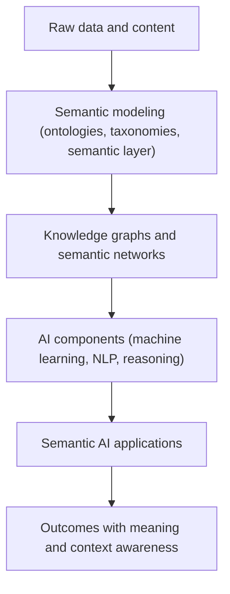

[[Knowledge AI]]

[[Tooling/AI-Toolkit/Knowledge AI/Stardog|Stardog]]

# Defining and Describing Semantic AI

_*Semantic AI is AI that cares about meaning: it fuses knowledge graphs, ontologies, and semantic models with machine learning so systems reason over what data represents, not just the patterns it contains.*_[^zqmxl0] [^s3fvtj] [^zs1eio]

Semantic AI is commonly defined as the **integration of semantic technologies—knowledge graphs, ontologies, taxonomies, and metadata—with artificial intelligence—to enable systems to understand the meaning and context behind data**. [^zqmxl0] [^s3fvtj] [^qq76zb] [^zs1eio] It is positioned as a “growing approach to artificial intelligence that leverages semantics – the meaning and context of data – rather than relying only on raw information,” focusing on relationships, intent, and business logic instead of simple keyword or pattern matching. [^zqmxl0] [^8je47y] [^x67vy6] [^0jsugv] [^1jmcvo] In practice, Semantic AI is used when organizations need AI that operates on *semantically enriched* information—entities with governance, relationships with provenance, and facts with authority—so that answers and actions remain consistent with institutional understanding and rules. [^x67vy6] [^ksxv42] [^qq76zb] This matters because it addresses well-known limitations of purely statistical AI by grounding models in explicit domain knowledge, improving accuracy, trust, and auditability in domains like enterprise analytics, search, and digital assistants. [^x67vy6] [^s3fvtj] [^ksxv42] [^qq76zb] [^zs1eio]

Semantic AI is often described as the **fusion or combination of symbolic AI methods (knowledge representation, logic, ontologies) with statistical AI (machine learning, NLP)**. [^s3fvtj] [^ksxv42] [^qq76zb] [^zs1eio] One vendor calls it “the fusion of machine learning and knowledge graphs for the next generation of AI assistants,” emphasizing that AI is *grounded in meaning* through formal, machine-readable structures that define what is true, permitted, and auditable in a domain. [^s3fvtj] [^qq76zb] Another glossary states that “semantic artificial intelligence (AI) is based on semantic models” and “combines natural language processing, knowledge graphs, machine learning, and semantic models to interpret information with precision,” highlighting its role in context-aware comprehension and reasoning. [^zs1eio] Across sources, the core idea is that **semantic AI focuses on meaning, context, and relationships**, enabling systems to interpret intent, infer concepts, and deliver results that reflect human-like understanding rather than brittle keyword matching. [^8je47y] [^0jsugv] [^1jmcvo] [^ksxv42] [^37id7g]

# Uses in Context

- Vendors in knowledge and content management describe Semantic AI as technology that “enables machines to interpret the meaning and intent behind content, rather than simply matching keywords,” by linking content to ontologies, taxonomies, and knowledge graphs so systems can “understand relationships, infer concepts and deliver results that reflect human-like understanding.”[^8je47y]

- In enterprise analytics and BI, Semantic AI is invoked as AI that “uses the semantic layer to interpret questions and generate accurate answers,” acting as “a translation system between your database tables and the plain-English business terms most people use,” so teams can author models and queries in governed business language. [^x67vy6]

- Companies building “context operating systems” for AI agents describe Semantic AI as “the convergence of knowledge representation, natural language understanding, and governed reasoning,” enabling agents to operate on “semantically enriched context: entities with governance, relationships with provenance, and facts with authority” instead of raw tables and rows. [^ksxv42]

- Providers of semantic AI platforms emphasize that it “grounds AI in meaning — in formal, machine-readable knowledge structures that define what is true, what is permitted, and what is auditable,” combining “knowledge graphs, formal ontologies, and AI capabilities into an integrated system where AI is governed by the meaning and rules of the business domain.”[^qq76zb]

- In glossaries on semantic models, Semantic AI is framed as systems that “interpret the meaning and relationships within data and deliver insights that go far beyond the surface,” powering “context-aware” applications that can “comprehend, reason with, and analyze information in meaningful ways.”[^zs1eio]

- Educational articles on Semantic AI and semantic understanding describe it as a branch of AI “fokus pada pemahaman makna dan konteks bahasa manusia,” going “melampaui keterbatasan pencocokan kata kunci” and aiming to “memahami apa yang sebenarnya diinginkan oleh pengguna berdasarkan konteks dan hubungan antar konsep.”[^1jmcvo] [^37id7g]

# History of Use

## Origins

- The *semantic* strand of Semantic AI traces back to **semantic networks** and related knowledge representation techniques in early AI, where “a semantic network or net is a graph structure for representing knowledge in patterns of interconnected nodes and arcs,” with nodes as entities or concepts and edges as relationships between them. [^p4v843] [^zk343s]

- Modern Semantic AI builds on **knowledge graphs and semantic knowledge bases**, which are described as “a type of semantic network based on graph structures” that represent real-world concepts and their interrelations through nodes (entities) and edges (semantic associations), enabling machines to understand and compute on knowledge and perform retrieval and reasoning. [^y4v0s0]

- The explicit phrase **“Semantic AI”** emerges in industry resources as AI that integrates semantic technologies—knowledge graphs, ontologies, taxonomies, metadata—with machine learning and NLP to “understand the meaning behind data” and to “unlock the next wave of intelligent data.”[^zqmxl0] [^s3fvtj] [^qq76zb] [^zs1eio] These are largely authored by specialized semantic-tech vendors and data startups rather than large incumbents, reflecting a bottom-up origin in the knowledge-graph and semantic-web community. [^zqmxl0] [^s3fvtj] [^ksxv42] [^qq76zb] [^zs1eio]

- Glossary entries and blogs on Semantic AI in the mid‑2020s emphasize that “the term comes from semantics, the study of meaning,” and that in AI “semantic” refers to a system’s ability “to connect a word or data point to what it stands for: an entity, an action, a category, or a relationship to other information.”[^0jsugv] This frames Semantic AI as a named continuation of long-running research on semantics in language, logic, and AI.

## Evolution

- **Pre‑2010s: Semantic networks and ontologies in symbolic AI.** Early AI research on semantic networks and ontologies established representing knowledge as graphs of nodes (entities) and edges (relationships), giving machines structures for reasoning about meaning and connections among concepts. [^p4v843] [^zk343s] [^y4v0s0]

- **2010s: Knowledge graphs and semantic search.** As knowledge graphs matured, they were applied to semantic search and recommendation, with knowledge graphs organizing data into interconnected entities and relationships so search systems could “understand context and meaning beyond keyword matching” and interpret queries based on connections within the graph. [^9fnycx] [^y4v0s0]

- **Mid‑2020s: “Semantic AI” as fusion of symbolic and statistical AI.** By 2025–2026, specialized vendors described Semantic AI explicitly as “the fusion of machine learning and knowledge graphs” and “the combination of methods derived from symbolic AI and statistical AI,” positioning it as the foundation for “next generation AI assistants,” semantic platforms, and context-aware enterprise agents. [^s3fvtj] [^ksxv42] [^qq76zb] [^zs1eio]

- **Mid‑2020s: Semantic AI in enterprise semantic layers.** Contemporary analytics platforms framed Semantic AI as the AI that “uses the semantic layer to interpret questions and generate accurate answers,” governing definitions of business terms and using those as a foundation to produce accurate, trustworthy models and queries—marking an evolution from semantic web research to mainstream enterprise data practice. [^x67vy6] [^ksxv42] [^zs1eio]

# Best Real-World Examples

- [PoolParty Semantic Suite](https://www.poolparty.biz/learning-hub/semantic-ai) — a platform explicitly described as implementing Semantic AI by combining knowledge graphs, ontologies, and machine learning to deliver semantic search, text analytics, and AI assistants grounded in meaning. [^s3fvtj]

- [TopQuadrant TopBraid Enterprise Data Governance](https://www.topquadrant.com/resources/semantic-ai/) — a semantic data governance solution that defines Semantic AI as the integration of semantic technologies (knowledge graphs, ontologies, taxonomies, metadata) with AI to unlock intelligent data management and governance. [^zqmxl0]

- [Hex semantic layer](https://hex.tech/blog/semantic-ai/) — [[Tooling/Data Utilities/Hex|Hex]] — a data startup’s semantic layer and Semantic AI tooling that uses governed business definitions to interpret questions, author models, and generate trusted analytics answers from complex databases. [^x67vy6]

- [ElixirData Context OS](https://www.elixirdata.co/blog/semantic-ai-context-os) — an enterprise “context operating system” where Semantic AI is the convergence of knowledge representation, natural language understanding, and governed reasoning for AI agents operating on semantically enriched enterprise data. [^ksxv42]

- [GraphResearchLabs semantic AI platform](https://graphresearchlabs.com/what-is-a-semantic-ai-platform/) — a platform that “grounds AI in meaning” via knowledge graphs and formal ontologies, defining a semantic AI platform as an integrated system where AI is governed by the domain’s meaning and rules. [^qq76zb]

- [Bloomfire semantic artificial intelligence](https://bloomfire.com/resources/what-is-a-semantic-model/) — an enterprise knowledge-management provider that describes semantic artificial intelligence as systems based on semantic models, combining NLP, knowledge graphs, and machine learning to interpret information with precision. [^zs1eio]

- [Milvus semantic search with knowledge graphs](https://milvus.io/ai-quick-reference/how-can-knowledge-graphs-be-used-for-semantic-search) — [[Tooling/Software Development/Databases/Milvus|Milvus]] — while not branded as “Semantic AI” per se, its use of knowledge graphs to enable semantic search—understanding context and meaning beyond keywords—is a concrete application of Semantic AI principles. [^9fnycx]

# Case Studies

[IMAGE 2: Screenshot-style illustration of a semantic layer interface mapping business terms to database tables, with an AI assistant answering a business question]

## Case Study 1: Semantic AI in a Startup Semantic Layer

A modern analytics startup describes how integrating Semantic AI into its semantic layer transforms how teams interact with data. [^x67vy6] In this setup, the **semantic layer** acts as a “translation system between your database tables and the plain-English business terms most people use,” holding governed definitions of metrics, dimensions, and entities. [^x67vy6] Semantic AI is defined there as technology that “uses the semantic layer to interpret questions and generate accurate answers,” focusing on meaning and structure—“understanding relationships between data elements, interpreting business logic, and ensuring consistency.”[^x67vy6] When business users ask questions in natural language, the system uses these semantic models and relationships to author correct queries and analyses, rather than relying on ad‑hoc pattern matching or manual SQL. [^x67vy6] This case illustrates how a relatively small data startup can **outpace incumbent BI tools** by embedding semantic governance into AI: the AI understands what “customer churn,” “active user,” or “account” represent in the organization, leading to more accurate, trustworthy analytics than tools that only parse text or column names. [^x67vy6] [^ksxv42] [^zs1eio]

## Case Study 2: Knowledge-Graph Vendors Fusing Symbolic and Statistical AI

A semantic-technology vendor describes its approach as “the fusion of machine learning and knowledge graphs for the next generation of AI assistants,” explicitly stating that Semantic AI is “the combination of methods derived from symbolic AI and statistical AI.”[^s3fvtj] In this case, the platform maintains rich **[[concepts/Explainers for AI/Knowledge Graphs|Knowledge Graphs]]** and ontologies that encode entities, relationships, and business rules, and then applies machine learning and NLP over that structured knowledge to power assistants, search, and analytics that understand meaning behind text. [^s3fvtj] [^qq76zb] [^zs1eio] For example, the system can recognize that different labels in data (“account number,” “customer ID”) represent related concepts within a business context and treat them appropriately in reasoning and retrieval, instead of seeing them as unrelated fields. [^zqmxl0] [^s3fvtj] The vendor highlights benefits like more precise answers, reduced ambiguity, and better governance, because the AI operates on formalized domain knowledge rather than opaque embeddings alone. [^s3fvtj] [^qq76zb] [^zs1eio] This shows how specialized semantic vendors pioneered Semantic AI as a distinct discipline, with large cloud providers later adopting similar ideas for their own knowledge-graph and search offerings.

## Case Study 3: Context OS for Enterprise Agents

An enterprise-focused startup developing a “Context OS” describes Semantic AI as “the convergence of knowledge representation, natural language understanding, and governed reasoning,” enabling AI agents to work with “semantically enriched context: entities with governance, relationships with provenance, and facts with authority.”[^ksxv42] In this case, organizational data—documents, records, events—is modeled as entities and relationships in knowledge graphs, with ontologies specifying types, constraints, and governance policies. [^ksxv42] [^y4v0s0] AI agents invoke natural language understanding to interpret user requests, then reason over this semantic context to determine which entities and facts are relevant and what actions are permitted under organizational rules. [^ksxv42] [^qq76zb] The result is agents that can, for instance, answer policy questions, generate reports, or orchestrate workflows while respecting governance and provenance, because meaning and rules are explicit in the underlying semantic models. [^ksxv42] [^qq76zb] [^zs1eio] This demonstrates how Semantic AI enables *governed* AI behavior in complex enterprises, and how smaller, specialized teams are pushing incumbents to recognize that meaning, not just data volume, is central to trustworthy AI.

***

# Sources

[^zqmxl0]: [Semantic AI: Unlocking the Next Wave of Intelligent Data ...](https://www.topquadrant.com/resources/semantic-ai/)
[^8je47y]: [Semantic AI](https://www.rws.com/glossary/semantic-ai/)
[^x67vy6]: [What Is Semantic AI in the World of Data?](https://hex.tech/blog/semantic-ai/)
[^0jsugv]: [What Is Semantic AI? Meaning, Context, and Business Use](https://convozen.ai/blog/ai/semantic-ai/)
[^1jmcvo]: [Pemahaman Semantic AI: Cara Kerja dan Manfaatnya](https://excellentteam.id/artikel/apa-itu-teknologi-semantic-ai-dan-bagaimana-cara-kerjanya/)
[^s3fvtj]: [Semantic AI - Fusing Machine Learning and Knowledge ...](https://www.poolparty.biz/learning-hub/semantic-ai)
[^ksxv42]: [Semantic AI for Enterprise: Ontology, Knowledge Graphs & Context OS](https://www.elixirdata.co/blog/semantic-ai-context-os)
[^qq76zb]: [Graphrag: Where Semantic Ai...](https://graphresearchlabs.com/what-is-a-semantic-ai-platform/)
[9]: [Semantic-KG: Using Knowledge Graphs to Construct Benchmarks for Measuring Semantic Similarity](https://arxiv.org/abs/2511.19925)
[^p4v843]: [Semantic Networks in Artificial Intelligence Explained](https://www.guvi.in/blog/semantic-networks-in-artificial-intelligence/)
[^zs1eio]: [What Is a Semantic Model?](https://bloomfire.com/resources/what-is-a-semantic-model/)
[^9fnycx]: [How can knowledge graphs be used for semantic search?](https://milvus.io/ai-quick-reference/how-can-knowledge-graphs-be-used-for-semantic-search)
[^37id7g]: [What Is Semantic Understanding in AI? - JumpCloud](https://jumpcloud.com/it-index/what-is-semantic-understanding-in-ai)
[^zk343s]: [semnet.pdf](https://www.scribd.com/document/414874548/semnet-pdf)
[^y4v0s0]: [The Origin and Development of Semantic Knowledge Bases](https://www.oreateai.com/blog/knowledge-graph-the-origin-and-development-of-semantic-knowledge-bases/174344a2b834973d1dc6792cd551e7ba)
