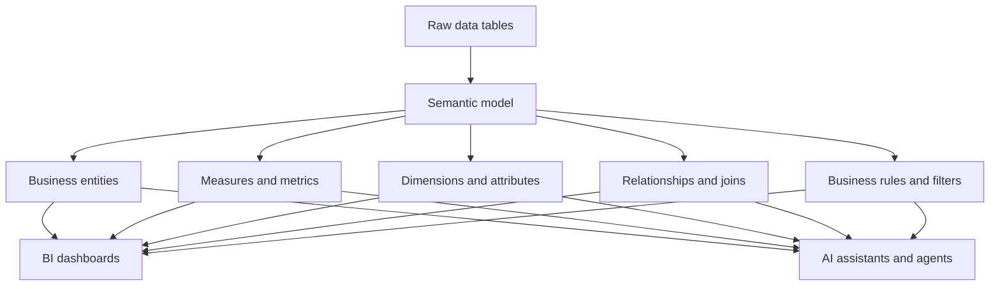

---
aliases:
  - Semantic Model
  - semantic model
  - semantic models
date_created: 2026-08-21
date_modified: 2026-08-21
tags:
  - Data-Science-Concepts
  - Data-Sovereignty
  - Graph-RAG
  - Graph-Engineering
  - Knowledge-Graphs
  - Vector-Databases
site_uuid: 7638aee7-0a49-4125-b71b-6b18188e985d
publish: true
title: Semantic Models
slug: semantic-models
at_semantic_version: 0.0.1.1
cf_last_run: 2026-08-21T16:28:17.963Z
cf_last_run_model: Perplexity sonar-pro
for_clients:
  - Laerdal
  - Param
  - FullStackVC
---

[[concepts/Explainers for AI/Ontology Management|Ontology Management]]
[[Tooling/AI-Toolkit/Models/GraphRAG|GraphRAG]]
[[Knowledge AI]]
[[Vocabulary/Knowledge Bases|Knowledge Bases]]
[[concepts/Concept Model|Concept Model]]
[[Vocabulary/Data Model|Data Model]]
[[concepts/Content Model|Content Model]]

# Defining and Describing Semantic Models

*_Semantic models turn raw tables and columns into a machine-readable “business language” that people and software can reason with consistently._  

A **semantic model** is a structured, machine-readable abstraction that defines the *business meaning* of data elements, the *relationships* between them, and the *rules* for calculating metrics, independent of how the data is technically stored. [^rlmi8p] [^rq5j5j] [^3khnhs] [^e0hdkl] [^wh6o5i] [^6nsm8x] It sits as a **translation layer** between raw data sources and downstream consumers (BI tools, reports, APIs, AI assistants), mapping physical database objects (tables, columns, joins) to logical business concepts such as *Customer*, *Order*, *Revenue*, or *Region* so that analytical queries produce consistent answers regardless of who asks or which tool they use. [^rlmi8p] [^jz9wsb] [^h071hk] [^6b5xtn] [^rq5j5j] [^omz4ih] [^wh6o5i] [^gk75vf] In modern analytics and AI contexts, semantic models matter because they encode organizational definitions (“what counts as a customer,” “how revenue is computed”) and align terminology across systems, reducing ambiguity, duplicated logic, and misinterpretation in data-driven decisions. [^rq5j5j] [^3khnhs] [^omz4ih] [^wh6o5i] [^6nsm8x] [^gk75vf]

Key characteristics of semantic models include:

- They **capture what data means, not just how it is stored**, defining business entities (customers, orders, subscriptions), metrics (revenue, churn, active users), dimensions (region, plan, month), and relationships that connect them. [^rlmi8p] [^rq5j5j] [^3khnhs] [^wh6o5i] [^6nsm8x] [^gk75vf]  
- They act as a **metadata layer** that maps physical database structures (tables, columns, joins) to business concepts and calculation logic, extending basic metadata with business meaning and contextual understanding. [^jz9wsb] [^6b5xtn] [^wh6o5i] [^6nsm8x]  
- They are often described as “the **language of the business made explicit, computable, and shareable**,” providing a governed, reusable representation of definitions that can be interpreted consistently by people and AI systems. [^rq5j5j] [^omz4ih] [^6nsm8x]  
- In database theory, a **semantic data model (SDM)** is a high-level, semantics-based formalism for describing and structuring databases, capturing more of an application environment’s meaning than traditional models such as purely relational schemas. [^e0hdkl] [^z5j4ou] [^ubpbn8]

# Uses in Context

- In modern analytics stacks, a semantic model is described as “**the layer of your analytics that captures what your data means**,” defining business objects, metrics, dimensions, and relationships so that users work with concepts instead of raw tables. [^rlmi8p] [^h071hk] [^gk75vf]  
- Data engineering and BI teams use semantic models as a “**business translation layer that sits between your raw data and the people who use it**,” providing a single source of truth for measures and definitions. [^jz9wsb] [^h071hk] [^gk75vf]  
- Governance teams treat semantic models as a **governed translation layer** that defines entities, metrics, and approved sources (e.g., what counts as a customer or trusted service account) so people and AI systems interpret terms consistently. [^omz4ih] [^rq5j5j]  
- In database design literature, **semantic data models** are invoked as a high-level conceptual modeling approach that “captures more of the meaning of an application environment than contemporary database models do.” [^e0hdkl] [^z5j4ou] [^ubpbn8]  
- Organizations use semantic models to align terminology and relationships across systems, defined as “a structured representation of the meaning of data, concepts, and their relationships, designed so that different systems and stakeholders interpret information in a consistent way.” [^3khnhs] [^rq5j5j] [^omz4ih]  
- AI and agentic applications rely on semantic models as machine-readable descriptions of datasets—mapping columns to measures, dimensions, relationships, and business rules—so tools can “generate correct queries without re-deriving business logic.” [^6b5xtn] [^spex5c] [^omz4ih] [^ubpbn8]

# History of Use

## Origins

- In database theory, the notion of a **semantic data model (SDM)** emerged as a response to limitations of early relational models, defined as a “high-level, semantics-based formalism for describing and structuring databases” that captures more of the meaning of an application environment. [^e0hdkl] [^z5j4ou]  
- Early conceptual database modeling work framed semantic models as a way to represent data elements and their relationships to *real-world concepts*, not just storage structures of tables and columns. [^e0hdkl] [^z5j4ou] [^ubpbn8]  
- Subsequent analytic and BI practice adopted the term “semantic model” or “semantic layer” to describe the governed business abstraction sitting between physical schemas and user-facing tools, emphasizing consistent measures and definitions. [^rlmi8p] [^h071hk] [^rq5j5j] [^6nsm8x] [^gk75vf]

## Evolution

- **1980s–1990s (Database research):** Semantic data models in academic and industry literature formalized high-level conceptual models that represent entities, relationships, and constraints closer to how users perceive the application domain, beyond classical ER or relational models. [^e0hdkl] [^z5j4ou]  
- **2000s–2010s (BI and data warehousing):** Enterprise BI platforms popularized the idea of a **semantic layer** that exposes business-friendly entities and measures over complex warehouse schemas, making “semantic models” a standard term in analytics practice. [^e0hdkl] [^wh6o5i] [^gk75vf]  
- **2020s (Cloud analytics and AI):** Cloud-native analytics, metrics layers, and AI assistants reframed semantic models as machine-readable metadata describing datasets—measures, dimensions, joins, and business rules—so multiple tools and agents can share consistent logic and query generation. [^rlmi8p] [^h071hk] [^6b5xtn] [^spex5c] [^rq5j5j] [^omz4ih] [^6nsm8x] [^gk75vf]

# Best Real-World Examples

- [Cube semantic layer](url) — a cloud-native analytics platform that defines semantic models as “the layer of your analytics that captures what your data means,” structuring entities, measures, and dimensions for downstream tools. [^rlmi8p]  
- [Hex semantic modeling](url) — a data app environment that uses semantic modeling as a “business translation layer” between raw data and users, creating a single source of truth for metrics and dimensions. [^gk75vf]  
- [Data-Lingua semantic models](url) — an independent practitioner resource framing semantic models as “metadata that knows not just the structure of your data, but the significance of it,” bridging data engineering and business strategy. [^rq5j5j] [^6nsm8x]  
- [Datus semantic model catalog](url) — a startup defining a semantic model as a “machine-readable description of a data source that translates physical schema into business-meaningful objects—measures, dimensions, relationships, and rules—so downstream tools (BI, APIs, agents) can generate correct queries.” [^6b5xtn] [^spex5c]  
- [Supaboard semantic data model](url) — a metrics and analytics product emphasizing semantic data models that capture structure, meaning, context, and business relationships, with explicit relationship semantics like “Customer places Order.” [^ubpbn8]  
- [OvalEdge semantic data model for analytics and AI](url) — a governance-focused platform that explains semantic data models as representing real-world concepts (customers, products, policies) along with meanings, relationships, and business rules. [^wh6o5i]  
- [Connect981 semantic model glossary](url) — an applied knowledge-management glossary defining semantic models as structured representations of data meaning and relationships used to align terminology across systems and organizations. [^3khnhs]

# Case Studies

### Case Study 1: Startup Cataloging Semantic Models for Agents and BI

A data startup (exemplified by Datus’s published definition) focuses on building a catalog where each **semantic model** is “a single entry—one dataset, described in business terms: which columns are measures you can quantify, which are dimensions you can group by, how this dataset connects to others, and what business rules apply.” [^6b5xtn] [^spex5c] In this approach, analytics engineers define models that turn fields like `fact_orders.amount_usd` into explicit business concepts such as “Net Revenue, filtered to completed orders,” encoding filters and joins as part of the model itself. [^6b5xtn] [^spex5c] Once defined, these models are machine-readable and exposed to BI tools, APIs, and AI agents, allowing them to “generate correct queries without re-deriving business logic,” which reduces duplicated metric definitions and inconsistent reporting across teams and tools. [^6b5xtn] [^spex5c] [^omz4ih] This case illustrates how semantic models operationalize data sovereignty and graph-style reasoning by making the business layer explicit and reusable for both humans and intelligent systems. [^6b5xtn] [^rq5j5j] [^omz4ih] [^6nsm8x]

### Case Study 2: Semantic Modeling as Business Translation in Analytics Apps

Hex, a collaborative analytics and data app platform, presents semantic modeling as “a semantic model, sometimes called a semantic layer, [being] the fix: a business translation layer that sits between your raw data and the people who use it,” emphasizing that a semantic model defines *what* data means to the business rather than just its schema. [^gk75vf] [^rlmi8p] In practice, teams using this approach design semantic models that unify definitions of core metrics (e.g., *Active Users*, *MRR*, *Churn Rate*) and dimensions (e.g., *Plan*, *Region*, *Cohort*) across notebooks, dashboards, and experiments, so different analysts and product managers are all querying the same governed layer. [^gk75vf] [^h071hk] [^rq5j5j] The impact is a reduction in “dashboard sprawl” and conflicting metrics: instead of each report embedding its own SQL logic, semantic models centralize metric calculations and exposure, enabling non-technical users to self-serve analysis without unintentionally changing business rules. [^h071hk] [^rq5j5j] [^6nsm8x] [^gk75vf] This demonstrates semantic models as a practical tool for data teams to create a single source of truth that both humans and downstream tools can safely rely on.

### Case Study 3: Semantic Models Bridging Data Engineering and Business Strategy

Independent practitioners and consultancies, such as those behind Data-Lingua’s “Semantic Models” essays, frame semantic models as where “data engineering meets business strategy,” describing them as an abstraction that “defines the business meaning of data elements and their relationships, independent of underlying technical storage.” [^rq5j5j] [^6nsm8x] In consulting engagements, they extend basic metadata with layers of business meaning, calculation logic, and contextual understanding—arguing that “a semantic model is not just a layer on top of data, it’s the language of the business made explicit, computable, and shareable.” [^rq5j5j] [^6nsm8x] By modeling entities (customers, orders, policies), metrics, and relationships in a governed way, they help organizations align terminology across departments and systems, so that finance, operations, and product analytics all interpret core concepts the same way. [^rq5j5j] [^3khnhs] [^omz4ih] [^wh6o5i] This case shows semantic models as socio-technical artifacts: they are both technical metadata structures and codified agreements about meaning, central to data sovereignty, knowledge-graph construction, and trustworthy analytics. [^rq5j5j] [^3khnhs] [^omz4ih] [^6nsm8x]

***

# Sources

[^rlmi8p]: [What Is a Semantic Model?](https://cube.dev/articles/what-is-a-semantic-model)
[^jz9wsb]: [What Is a Semantic Model? The Layer Between Your Data ...](https://www.coryholmes.com/semantic-model/)
[^h071hk]: [What is a Semantic Model? A Primer | Thinklytics Insights](https://thinklytics.com/insights/what-is-a-semantic-model)
[^6b5xtn]: [What Is a Semantic Model? Definition, Examples & How It Differs ...](https://datus.ai/blog/what-is-semantic-model/)
[^spex5c]: [What Is a Semantic Model? Definition, Examples & How It Differs From a Semantic View](https://datus.ai/blog/posts/what-is-semantic-model)
[^rq5j5j]: [Semantic Models - Where Data Engineering Meets Business Strategy](https://data-lingua.com/semantic-models/)
[^3khnhs]: [semantic model](https://connect981.com/glossary/semantic-model)
[^omz4ih]: [Examples And Use Cases](https://nhimg.org/glossary/semantic-model/)
[^e0hdkl]: [What Is a Semantic Model?](https://bloomfire.com/resources/what-is-a-semantic-model/)
[^z5j4ou]: [What Is a Semantic Data Model?](https://www.gooddata.ai/blog/what-a-semantic-data-model/)
[^wh6o5i]: [Semantic Data Model Explained for Analytics and AI](https://www.ovaledge.com/blog/semantic-data-model)
[12]: [Semantic Parsing: Choosing...](https://academic.oup.com/database/article/doi/10.1093/database/baag030/8699725)
[^ubpbn8]: [What is a Semantic Data Model and Why Every Data Team Needs ...](https://supaboard.ai/blog/what-is-a-semantic-data-model)
[^6nsm8x]: [Understanding Semantic Models in Database Design](https://data-lingua.com/semantic-models-2/)
[^gk75vf]: [Semantic Modeling: How to Build a Single Source of Truth](https://hex.tech/blog/semantic-modeling/)
