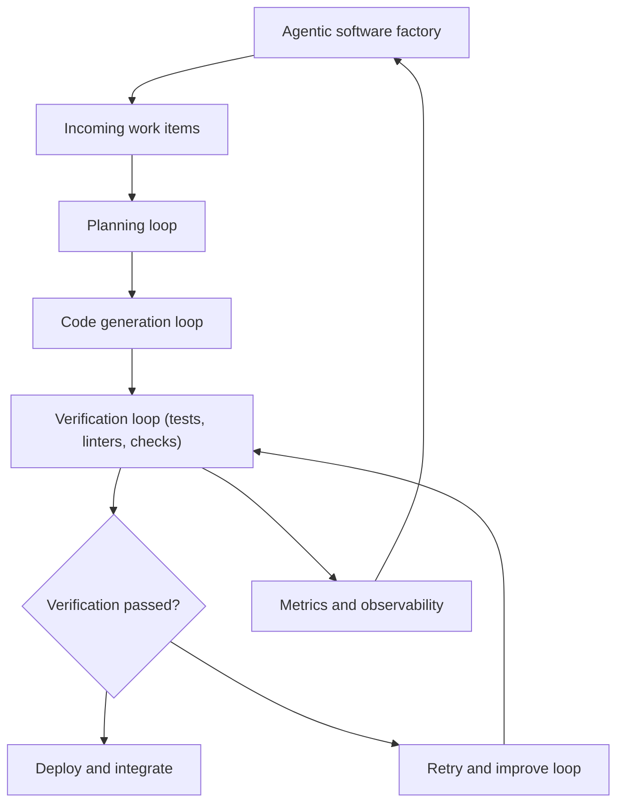

[[concepts/Explainers for AI/Agentic Engineering|Agentic Engineering]]
[[concepts/Explainers for AI/Loop Engineering|Loop Engineering]]
[[concepts/Explainers for AI/Graph Engineering]]

_“Software factories” in [[concepts/Explainers for AI/Loop Engineering|Loop Engineering]] are agentic AI-powered development systems where connected verification loops turn code production into an instrumented, repeatable, quality‑gated workflow rather than a series of ad‑hoc prompts or tickets. [^pq49kl] [^sv5ko2]_

In the Loop Engineering sense, a **software factory** is what emerges when you connect many agentic “loops” (plan–act–verify–retry cycles around AI agents) into an end‑to‑end [[concepts/Software Development Lifecycle|Software Development Lifecycle]], so that tickets move from idea to shipped code through nested agent workflows instead of manual hand‑offs between people. [^pq49kl] [^sv5ko2] It applies when teams use LLM agents, [[concepts/Explainers for AI/Code Generators|Code Generators]], tests, and static analysis inside a unified loop architecture that continually measures outcomes and improves itself. [^pq49kl] [^7fvbex] This matters because it reframes AI coding tools from isolated helpers into a **production system**—a factory whose throughput is measured in successful changes, defects caught by the process, and human engineers only focusing on high‑judgment calls. [^pq49kl] [^sv5ko2]

# Defining and Describing Software Factories (from Loop Engineering)

A **software factory** in [[concepts/Explainers for AI/Loop Engineering|Loop Engineering]] is described as what you get when “connect enough of these loops and you’re no longer managing agents one at a time. You’re running a system that produces outcomes, measures itself, and improves: a software factory.” [^pq49kl] [^sv5ko2] In this formulation, each loop is a repeatable workflow around an AI agent—task plus check—that runs until a verification step passes or a stopping rule fires; the factory is the composition of many such loops across the software development lifecycle. [^pq49kl] [^sv5ko2] [^7fvbex] The emphasis is not just volume of code but “instrumented, repeatable, quality-gated production: throughput measured in outcomes, issues caught by the process, and skilled people spending their time on the highest-leverage judgment calls.” [^pq49kl] Within agentic engineering, a software factory is thus a *large-codebase AI* environment where agents generate code, run deterministic checks (linters, tests, type checkers), and either advance changes or route them back into the loop for retries or human review. [^pq49kl] [^7fvbex] [^cyf4pj]

Within this concept:

- **Agentic AI**: The factory is built from loops around AI agents that “take a task and a check, run the task, examine the result against the check, and continue until the check passes or a stopping condition fires.” [^sv5ko2]  
- **Code generators and [[concepts/Code Intelligence|Codebase Intelligence]]**: AI coding agents (e.g., tools akin to [[Tooling/AI-Toolkit/Generative AI/Code Generators/Claude Code|Claude Code]] or [[Tooling/AI-Toolkit/Generative AI/Code Generators/Codex|Codex]]) operate inside loops that also call deterministic tools—formatters, linters, type checkers, and tests—with pass/fail conditions that drive further iterations. [^7fvbex] [^cyf4pj]  
- **Large-codebase AI**: Loops use memory and codebase context so agents can reason over existing systems, not just isolated snippets, guided by fixed verification checks rather than the agent’s subjective opinion. [^sv5ko2] [^7fvbex] [^773y0p] [^6arnq5]

# Uses in Context

- Loop Engineering essays describe software factories as emerging when “connected agentic [[concepts/Software Development Lifecycle|SDLC]] loops compound into a software factory,” emphasizing that it is a *system that produces outcomes, measures itself, and improves* rather than a single agent or tool. [^pq49kl]  
- Practitioner guides on Loop Engineering explain that, at the team level, “loop engineering describes an emerging software development lifecycle in which the units of work move from ticket to shipped code through nested agent loops rather than through hand-offs between people,” which is precisely the structure of a software factory. [^sv5ko2]  
- Agentic engineering commentary contrasts traditional “prompting an agent one step at a time” with building “AI developer workflows inside their own software factory,” scaling a simple engineer–agent workflow into a fully instrumented system that routes through build agents and automated checks. [^cyf4pj]  
- Educational content on Loop Engineering discusses how adding deterministic code—“linters, formatters, type checkers, tests—with pass/fail conditions that route back into your build agent” turns a simple coding loop into an industrialized software factory workflow. [^7fvbex] [^cyf4pj]  
- IBM’s discussion of loop engineering frames the practice as designing “agentic workflows that iteratively guide agents toward a user-defined goal with minimal human intervention,” which, when applied across a development organization, amounts to a software factory built from agentic loops. [^2x1sk9] [^sv5ko2]  

# History of Use

## Origins

- The *software factory* idea predates Loop Engineering as a general metaphor for industrialized, repeatable software production, but Loop Engineering materials explicitly redefine it in an **agentic AI** context: “Connect enough of these loops and you’re no longer managing agents one at a time. You’re running a system that produces outcomes, measures itself, and improves: a software factory.” [^pq49kl] [^sv5ko2]  
- In this framing, the origin is not a big-tech marketing page but practitioner essays and guides on Loop Engineering that treat software factories as **connected agentic SDLC loops**, making the factory an emergent property of loop composition rather than a static process template. [^pq49kl] [^sv5ko2] [^7fvbex]  

## Evolution

- **2025–early 2026 – Agentic SDLC framing**: Articles and guides begin to describe loop engineering as an “emerging software development lifecycle” in which work moves from ticket to shipped code through nested agent loops, explicitly naming the resulting system a software factory once enough loops are connected. [^sv5ko2] [^pq49kl]  
- **Mid‑2026 – [[concepts/Explainers for AI/Agentic Engineering|Agentic Engineering]] vs. Loop Engineering**: Commentary and videos argue that “the engineers pulling ahead of the entire AI industry aren’t building loops, they’re building AI developer workflows inside their own software factory,” shifting emphasis from single-loop design to factory‑level orchestration and workflow scaling. [^cyf4pj] [^7fvbex]  
- **Late‑2026 – Best practices for production loops**: Practitioner field guides codify software factory practices around agent loops—requiring plan/act/verify shapes, code‑based verification, objective exit conditions, escalating retries, and budgets on iterations and cost—effectively turning the factory into a disciplined runtime architecture for agentic development. [^7fvbex] [^6arnq5] [^773y0p]  

# Best Real-World Examples

- [AugmentCode](url) — a startup blog that describes how “connected agentic SDLC loops compound into a software factory,” using loop-driven workflows for code generation, verification, and continuous improvement. [^pq49kl] [^sv5ko2]  
- [DevelopersDigest Agentic Loop Harness](url) — a practitioner implementation where each agent loop has explicit plan/act/verify structure, code‑based checks, and bounded retries, exemplifying the core building blocks of a software factory. [^7fvbex] [^6arnq5]  
- [Tosea AI Loop Engineering Toolkit](url) — an indie guide and tools showing how to design loops that “prompt, check, remember, and re-run an AI agent” until a termination condition is met, providing patterns for factory‑scale orchestration. [^7c8rrb] [^7fvbex]  
- [ExplainX Agentic Loop Workflows](url) — educational material that asks “What system should I build so the agent finds the work, does it, verifies it, and remembers what it did—without me in the loop at all?”, capturing the factory mindset of self‑directing agent workflows. [^kat4gc] [^sv5ko2]  
- [Eesel Loop Runtime](url) — an implementation that treats loop engineering as “the runtime layer on top of the basic AI agent loop,” covering tools, stopping rules, verification, memory, and guardrails typical of a software factory architecture. [^773y0p] [^sv5ko2]  
- [IBM Think agentic workflows](url) — a large incumbent acting as a **popularizer**, defining loop engineering as the practice of designing agentic workflows that guide agents toward goals with minimal human intervention, which can be composed into a software factory. [^2x1sk9] [^sv5ko2]  
- [Agentic Engineering “Forget Loop Engineering” talk](url) — a video walk‑through of scaling from a single engineer‑agent workflow to “a full software factory” by adding deterministic tools and routing logic around build agents. [^cyf4pj] [^7fvbex]  

# Case Studies

### Case Study 1: From Single Agent to Factory at a Loop-First Startup

A loop‑first startup described in practitioner essays begins with a simple workflow: an engineer prompts a coding agent (similar to modern LLM code assistants), reviews the result, and either accepts or edits the change. [^pq49kl] [^cyf4pj] Over time, they add deterministic tools—formatters, linters, type checkers, and unit tests—with pass/fail conditions that automatically route failures back into the build agent loop. [^7fvbex] [^cyf4pj] Each iteration of the loop is designed with a plan/act/verify shape, where verification is “code, not the model’s opinion,” and exit conditions are objective and include stall detection and budget limits. [^7fvbex] [^6arnq5] As they connect loops for ticket intake, code generation, test execution, and deployment, the team realizes they are “no longer managing agents one at a time” but running a “system that produces outcomes, measures itself, and improves: a software factory.” [^pq49kl] [^sv5ko2] This shows how software factories emerge incrementally from disciplined loop engineering, not from a single monolithic platform.

### Case Study 2: Indie Practitioner Building an Agentic SDLC

An independent practitioner’s field guide on loop engineering walks through building an agentic SDLC that behaves like a software factory. [^6arnq5] [^7fvbex] They start with a measurable goal per change, keep actions small and reversible, and use a fixed check—“the same test/benchmark/rubric/approval after every change”—so the check, not the agent, determines whether work improved. [^6arnq5] They define explicit stop conditions (success, no‑op, ask‑for‑approval, blocked/out‑of‑budget) and implement escalating retries: feedback, fresh context, new strategy, and human escalation, each with caps. [^7fvbex] [^6arnq5] When applied across a large codebase, these patterns create nested loops for refactors, feature work, and maintenance that run continually with self‑paced backoff when there is no work, matching the description of a factory as “instrumented, repeatable, quality-gated production.” [^pq49kl] [^sv5ko2] This case demonstrates that the concept is pioneered and refined by indie practitioners designing real systems, with incumbents later adopting and popularizing the terminology.

### Case Study 3: Popularization via IBM Agentic Workflows

IBM’s Think team publishes an overview of loop engineering as the practice of designing “agentic workflows that iteratively guide agents toward a user-defined goal with minimal human intervention,” helping mainstream audiences understand the loop‑based approach. [^2x1sk9] [^sv5ko2] In their examples, teams build workflows where AI agents are triggered by events, act on tasks, and are guided by verification checks and stopping rules, all orchestrated by a system rather than step‑by‑step human prompting. [^2x1sk9] [^sv5ko2] While IBM acts as a **popularizer** rather than originator, this material helps solidify the idea that many such workflows, connected across planning, coding, testing, and deployment, constitute a software factory built from agentic loops. [^2x1sk9] [^pq49kl] [^sv5ko2] It shows how the Loop Engineering notion of software factories moves from indie and startup practice into broader enterprise discourse without losing its core emphasis on instrumentation, verification, and minimal human intervention.

***

# Sources

[^pq49kl]: [What Is Loop Engineering? The Agentic ...](https://www.augmentcode.com/blog/what-is-loop-engineering-and-how-are-leading-software-engineering-teams-using-it)
[^2x1sk9]: [What Is Loop Engineering?](https://www.ibm.com/think/topics/loop-engineering)
[^7c8rrb]: [What Is Loop Engineering? A Complete Guide from Prompt to ...](https://tosea.ai/blog/loop-engineering-ai-agents-complete-guide-2026)
[4]: [Agentic AI - Loop Engineering](https://www.youtube.com/watch?v=_aQD-AYzwfU)
[5]: [Loop Engineering: A Guide for Engineers and Practitioners](https://medium.com/@adnanmasood/loop-engineering-a-guide-for-engineers-and-practitioners-893bb65ea943)
[6]: [Loop Engineering: Why Everyone is Talking About Agentic Loops?](https://www.youtube.com/watch?v=7BrxIBkX3mg)
[7]: [Loop Engineering Explained: Start Building AI Agents That Think](https://www.youtube.com/watch?v=-gPiI4iku_Q)
[8]: [Learn Loop Engineering in 30 Minutes: Build AI Agents That Think, Check & Retry](https://www.youtube.com/watch?v=e9xOW7mH_vY)
[^sv5ko2]: [What Is Loop Engineering? Definition & Process - PuppyGraph](https://www.puppygraph.com/learn/loop-engineering)
[^7fvbex]: [Loop Engineering: How to Design Agent Loops That Actually ...](https://www.developersdigest.tech/blog/loop-engineering-designing-agent-loops)
[^kat4gc]: [What Is Loop Engineering? Beyond Prompt ...](https://explainx.ai/blog/what-is-loop-engineering-ai-agents-2026)
[^773y0p]: [Loop engineering explained: designing AI agent loops in 2026](https://www.eesel.ai/blog/loop-engineering)
[^6arnq5]: [The Agentic Loop Loop Engineering : A Practical Field Guide](https://dev.to/truongpx396/the-agentic-loop-a-practical-field-guide-mnc)
[14]: [The Art of Loop Engineering: How to Build Agents That Improve Over Time](https://www.youtube.com/watch?v=jPPiZ22DY3g)
[^cyf4pj]: [FORGET Loop Engineering. Agentic Engineering is about THIS](https://www.youtube.com/watch?v=VQy50fuxI34)
