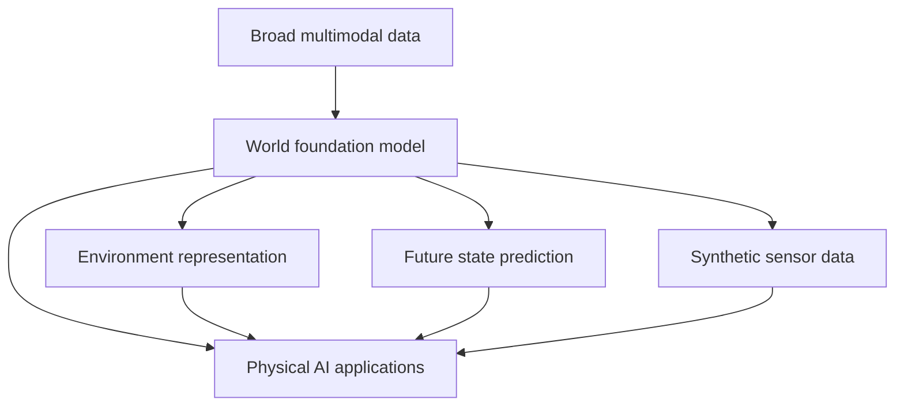

[[concepts/Explainers for AI/AI Research Labs|AI Research Labs]]
[[concepts/Explainers for AI/Foundation Models in AI|Foundation Models]]

# Defining and Describing World Foundation Models

- 
- _World foundation models are large, reusable models that learn how environments change so [[Physical AI]] systems can predict, simulate, and act in the real world._
- The term combines **world models**, which predict how the state of an environment changes after actions, with **[[concepts/Explainers for AI/Foundation Models in AI|Foundation Models]]**, which are trained on broad datasets and adapted to downstream tasks. [^4gl233] [^ff9ae2] World foundation models are therefore intended to provide general-purpose representations and simulations of physical environments rather than a model for only one fixed task. [^ff9ae2] [^jnpr52]
- Typical capabilities include generating sensor data, predicting future trajectories and world states, and representing physical interactions. [^dle7hp] Applications include autonomous vehicles, robotics, network autonomy, simulation, synthetic-data generation, and validation of AI systems. [^jnpr52] [^dle7hp] [^2a9551]

# Uses in Context

- **Physical-AI development:** The term describes models used to build and validate systems that operate in the physical world, including robots and autonomous vehicles. [^dle7hp] [^2a9551]
- **Simulation:** WFMs are invoked as scalable alternatives for creating realistic simulations of real-world environments. [^2a9551]
- **[[concepts/Explainers for AI/Synthetic Data|Synthetic Data]]:** Developers use them to generate diverse sensor data across weather, lighting, and operational-design conditions. [^dle7hp]
- **Autonomous driving:** In driving research, WFMs are described as controllable simulators for future physical states and as part of next-generation autonomous-driving systems. [^eupmv2]
- **Network autonomy:** In telecommunications, a foundation world model represents a network and predicts how it responds to sequences of actions. [^jnpr52]
- **Agent learning:** Recent research uses the phrase for persistent representations that help agents learn, verify, adapt, and synthesize policies beyond static environments. [^4gl233]

# History of Use

## Origins

- The underlying **world-model** idea predates the current phrase. World models broadly describe systems that model an environment’s state and predict what happens after an action, a concept associated with reinforcement-learning research. [^ff9ae2]
- The modern expression **world foundation model** emerged by combining that older world-model concept with the foundation-model paradigm: large models trained on broad data and adapted to many downstream tasks. [^ff9ae2] [^jnpr52]
- The term is now used especially in physical-AI contexts, where models learn from large-scale video, three-dimensional data, and sensor data to represent environmental structure and dynamics. [^ff9ae2] [^dle7hp]

## Evolution

- **Earlier world models — predictive control:** World models were initially discussed as internal predictive models for reinforcement learning and action selection, with emphasis on forecasting environmental transitions. [^ff9ae2]
- **Foundation-model expansion — broad pretraining:** The concept expanded when large, broadly pretrained models began to be adapted to multiple environments and tasks rather than trained for one narrowly defined simulator. [^ff9ae2] [^jnpr52]
- **Physical-AI systems — generation and verification:** By 2026, WFM research and products emphasized photorealistic sensor generation, controllable future-state prediction, physical interaction, domain adaptation, and validation of autonomous systems. [^4gl233] [^dle7hp] [^2a9551]

# Best Real-World Examples

- [NVIDIA Cosmos World Foundation Models](https://www.nvidia.com/en-us/ai/cosmos/) — a platform for generative world models, tokenizers, guardrails, and video processing intended to accelerate physical-AI development. [^2a9551]
- [Applied Intuition World Foundation Models](https://www.appliedintuition.com/engineering-blog/world-foundation-models-from-research-to-reality) — a production-oriented approach combining pretrained models with autonomy-domain data, simulation, fine-tuning, and validation tools. [^dle7hp]
- [Foundation World Models for Agents](https://arxiv.org/abs/2602.23997) — a research agenda for persistent, compositional models that support learning, verification, adaptation, and test-time synthesis. [^4gl233]
- [Telecom Foundation World Models](https://www.ericsson.com/en/reports-and-papers/white-papers/telecom-foundation-world-models-toward-higher-levels-of-network-autonomy) — an application of the concept to networks, where the model predicts network responses to action sequences. [^jnpr52]
- [Driving World Models research](https://github.com/honalele/Foundation-Models-Meet-Driving-World-Models) — a collection framing video WFMs, vision-language-action models, and related foundation models as tools for physics-aware driving simulation and sequential decision-making. [^eupmv2]
- [World-model safety research](https://www.alphaxiv.org/abs/2604.01346) — work examining safety, security, and cognitive risks when large world models are deployed in specific environments. [^9jl44u]

# Case Studies

**Applied Intuition and physical-AI development.** Applied Intuition presents WFMs as a way to address two development needs: large-scale pretraining and domain-specific adaptation for physical-AI systems. [^dle7hp] Its described workflow combines data pipelines, simulation tooling, fine-tuning infrastructure, GPU orchestration, interaction layers, and metrics-based validation. [^dle7hp] The case shows that a WFM is not merely a generative model: its practical value depends on integration with domain data, simulation, evaluation, and deployment infrastructure. [^dle7hp]

**NVIDIA [[Tooling/AI-Toolkit/Models/Cosmos World Foundation|Cosmos World Foundation]] and general-purpose physical-AI tooling.** NVIDIA’s Cosmos initiative is described as a suite combining generative WFMs, tokenizers, guardrails, and high-speed video processing for systems such as autonomous vehicles and robots. [^2a9551] This illustrates the popularization of the WFM concept by packaging world-model components into a reusable platform for developers rather than requiring each organization to construct a simulator from scratch. [^2a9551] The example also shows the field’s movement toward synthetic-data generation and controllable environment simulation as core infrastructure for physical AI. [^2a9551]

**Foundation world models for adaptive agents.** A 2026 research proposal defines foundation world models as persistent, compositional representations that unify reinforcement learning, program synthesis, abstraction, verification, and adaptation. [^4gl233] Its proposed components include learnable reward models, adaptive formal verification, online calibration of abstractions, and test-time world-model generation guided by verifiers. [^4gl233] This case extends the concept beyond visual simulation: the model becomes a substrate for agents that must learn from limited interaction, generate policies, and maintain reliability when environments change. [^4gl233]

***

# Sources

[^4gl233]: [Foundation World Models for Agents that Learn, Verify, and Adapt ...](https://arxiv.org/abs/2602.23997)
[^ff9ae2]: [【第22回】「ワールド基盤モデル」とは――AIが現実世界を学ぶ“頭 ...](https://ai.watch.impress.co.jp/docs/serial/glossary/2138669.html)
[^jnpr52]: [Telecom foundation world models for autonomy - Ericsson](https://www.ericsson.com/en/reports-and-papers/white-papers/telecom-foundation-world-models-toward-higher-levels-of-network-autonomy)
[^dle7hp]: [World Foundation Models for autonomy | Applied Intuition](https://www.appliedintuition.com/engineering-blog/world-foundation-models-from-research-to-reality)
[^2a9551]: [World Foundation Models: 10 Use Cases](https://aimultiple.com/world-foundation-model)
[6]: [What Has a Foundation Model Found? Using Inductive Bias to ...](https://github.com/zhaoyang97/Paper-Notes-en/blob/main/docs/ICML2025/self_supervised/what_has_a_foundation_model_found_using_inductive_bias_to_probe_for_world_models.md)
[7]: [Web World Models - alphaXiv](https://www.alphaxiv.org/abs/2512.23676)
[8]: [A Step Toward World Models: A Survey on Robotic ...](https://www.alphaxiv.org/abs/2511.02097)
[9]: [stable-worldmodel-v1: Reproducible World Modeling Research and ...](https://www.alphaxiv.org/abs/2602.08968)
[10]: [AIの未来を形づくる10の世界モデル｜アールグレイ](https://note.com/jolly_garlic5361/n/n91707c975f63)
[^9jl44u]: [Safety, Security, and Cognitive Risks in World Models | alphaXiv](https://www.alphaxiv.org/abs/2604.01346)
[12]: [World Foundation Modelとは何か｜香川友志](https://note.com/kagawatomo/n/n9b75b05eb956)
[^eupmv2]: [honalele/Foundation-Models-Meet-Driving-World-Models - GitHub](https://github.com/honalele/Foundation-Models-Meet-Driving-World-Models)
[14]: [From Masks to Worlds: A Hitchhiker's Guide to World Models](https://www.alphaxiv.org/abs/2510.20668)
[15]: [Research on World Models Is Not Merely Injecting World Knowledge ...](https://www.alphaxiv.org/abs/2602.01630)
