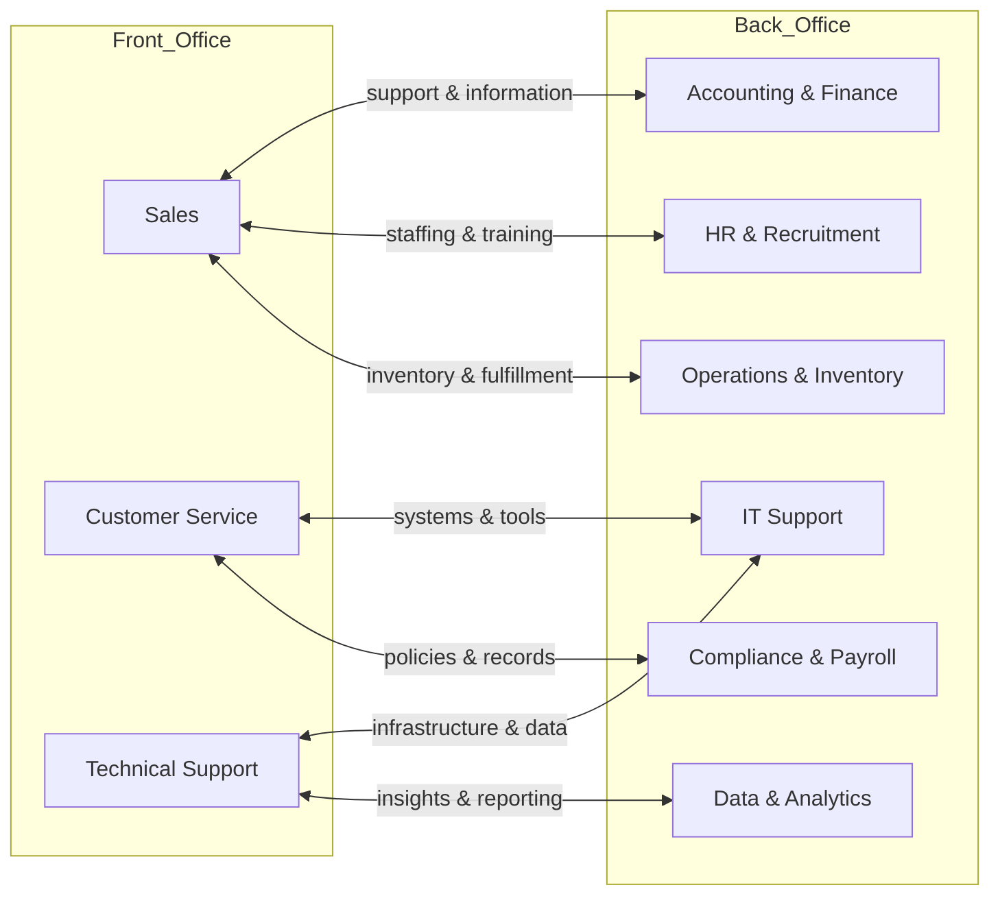

---
aliases:
  - back-office
  - Back Office
  - Back-Office
  - Back Office Management
  - BOM
date_created: 2026-05-13
date_modified: 2026-05-23
cf_last_run: 2026-05-23T20:57:19.585Z
cf_last_run_model: Perplexity sonar-pro
tags:
  - Management-Strategies
  - Best-Practices
  - Company-Leadership
  - Company-Brains
---

# Defining and Describing Back Office

_The “back office” is the part of an organization that customers never see but that quietly runs the processes, records, and infrastructure that let the front line function._

In business, the back office refers to internal, non–client-facing functions such as accounting and finance, human resources (HR), information technology (IT) support, data entry, and inventory management that “support the front office.”[^ieo3nf] [^k3klwh] These teams handle administrative and operational work like payroll, tax filings, compliance, workforce management, and systems maintenance, often described as “the backbone of a business.”[^dut07d] [^1ewvsu] While they “stay away from the limelight,” effective back-office operations increasingly influence productivity, cost optimization, and data-driven decision-making across the organization. [^k3klwh] [^dut07d]

# Uses in Context

- In organizational design, firms contrast the “front office,” which is “the client-facing part of a business, where employees directly interact with customers,” with “the back office,” which “isn’t client-facing but supports the front office.”[^ieo3nf]  
- In business process outsourcing (BPO), providers advertise handling “front- and back-office tasks,” where back-office work includes “administrative tasks in accounting and finance, recruitment and human resources (HR), and research and development (R&D)” as well as “data entry, inventory management, and information technology (IT) support.”[^ieo3nf] [^k22u9g]  
- In operations and management writing, back office is framed as a strategic asset: back offices “play a crucial role in managing the day-to-day operations along with the vision to achieve the long-term goals” and “have transformed into the driving force of the business.”[^k3klwh]  
- In financial and staffing services, “back office solutions” are marketed around payroll funding, tax filings, workers’ compensation, and regulatory “compliance,” often via an Employer of Record that “acts as the legal entity that manages payroll funding, tax filings, workers’ compensation, and compliance.”[^1ewvsu]  
- In technology and consulting, the term appears in discussions of automation and AI: “back-office AI” is said to unlock “cost-saving opportunities” by using data “in more strategic and impactful ways, minimize risk, trim costs, enhance decision-making, and create a ripple effect of value across the organization.”[^dut07d]  
- In family office and wealth-management contexts, the “back office” is implied in guidance on technology, security, and vendor management for “operations, expenditures and investments,” where tools help offices “create sophisticated data sets and generate insights” for better decisions and risk control. [^tw8i87]  

# History of Use

## Origins

- In corporate and financial services jargon, “front office / middle office / back office” emerged to distinguish customer-facing roles from administrative and operations functions, especially in banking and securities firms; the back office covered trade processing, record-keeping, and settlement while remaining non–client-facing, similar to how it is now described as not “client-facing but [supporting] the front office.”[^ieo3nf]  
- As business services industrialized, outsourcing firms adopted the term to describe non-core, internal processes that could be handed to specialized vendors, collectively marketed as “back-office tasks” within broader BPO offerings. [^ieo3nf] [^k22u9g]  

## Evolution

- **Late 20th century – Early outsourcing and specialization**: As companies focused on core competencies, they began contracting out functions like payroll, data entry, and call-center administration; BPO firms framed these bundled services as “front- and back-office tasks,” turning the back office into a distinct market category. [^ieo3nf] [^k22u9g]  
- **2000s–2010s – Digital operations and management systems**: Back-office management (BOM) became more formalized, with frameworks emphasizing the need “to administer and coordinate various operations of the businesses that provide assistance to their front-end activities,” aiming to “streamline the front-end operations” and improve decision-making, productivity, and cost optimization. [^k3klwh]  
- **2020s – AI-driven back office**: Consulting and technology providers highlighted “back-office AI” as “essential for operational transformation,” using machine learning, neural networks, deep learning, and generative AI to “automate routine back-office processes for greater efficiency, accuracy, and savings,” reframing the back office as a hub of data and automation strategy. [^dut07d] [^k3klwh]  

# Best Real-World Examples

- [Unity Communications – Back Office BPO Services](https://unity-connect.com/our-resources/blog/business-process-outsourcing-examples/) – Illustrates typical outsourced back-office functions such as accounting, HR, R&D support, data entry, inventory management, and IT support. [^ieo3nf]  
- [Bill Gosling Outsourcing – Back-Office Management](https://www.billgosling.com/blog/behind-the-scenes-the-back-office-revolution-shaping-tomorrows-business/) – Showcases a BPO provider positioning back-office management as a driver of decision-making, productivity, cost optimization, and innovation using tools, analytics, and AI. [^k3klwh]  
- [Back Office Staffing Solutions (BOSS)](https://backofficestaffingsolutions.com) – An Employer of Record model where the provider becomes the “legal entity that manages payroll funding, tax filings, workers’ compensation, and compliance” for staffing agencies, exemplifying a specialized back-office service niche. [^1ewvsu]  
- [The Hour – Back Office & Virtual Assistant Services](https://clutch.co/profile/hour-back-office-virtual-assistant-services) – A U.S.-based BPO and virtual assistant provider that focuses on back-office work in insurance operations, real estate, and e-commerce, illustrating how smaller firms package internal processes as managed services. [^k22u9g]  
- [Deloitte – Back-Office AI Advisory](https://www.deloitte.com/us/en/services/consulting/articles/uncovering-hidden-value-through-back-office-ai.html) – A consulting offering that frames the back office as “the backbone of a business” and a primary target for AI-driven cost savings, risk reduction, and better decision-making. [^dut07d]  
- [Bank of America Private Bank – Family Office Technology Guidance](https://www.privatebank.bankofamerica.com/articles/creating-an-efficient-back-office-for-your-family-office.html) – A large financial institution’s perspective on how family offices should design and periodically reassess their technology and vendor stack to manage data access, security, and outsourcing decisions, effectively describing modern back-office concerns. [^tw8i87]  

# Case Studies

## 1. BPO-Driven Back-Office Support for Core Operations

Unity Communications (profiled as a BPO provider) describes how companies “entrust some of [their] business operations to a third-party service provider” and specifically engage BPO firms “to handle some of your front- and back-office tasks.”[^ieo3nf] In this model, back-office personnel at the provider perform “administrative tasks in accounting and finance, recruitment and human resources (HR), and research and development (R&D),” as well as “data entry, inventory management, and information technology (IT) support” on behalf of the client. [^ieo3nf] This arrangement shows how the back office’s routine yet essential activities can be modularized and externally managed, allowing client organizations to keep customer-facing work in-house while offloading the internal processes that sustain it. [^ieo3nf] It illustrates the back office as a portable service layer that can be optimized by specialists without changing the client’s brand or direct customer interactions. [^ieo3nf]  

## 2. Back-Office Management as a Strategic Lever

Bill Gosling Outsourcing presents a narrative of “the back-office revolution,” arguing that back-office operations have “transformed into the driving force of the business” rather than a mere cost center. [^k3klwh] Their description of Back Office Management (BOM) emphasizes coordinating internal operations that “provide assistance to their front-end activities” and highlights outcomes such as better “decision-making” because the back office “has access to all the data of the overall business,” “enhanced productivity” by minimizing errors, and “cost optimization” through eliminating repetitive tasks and effectively managing the workforce. [^k3klwh] The case shows how treating back-office work as an integrated management discipline—supported by tools, data analytics, and technologies like AI and machine learning—can shift it into “the driver’s seat” of organizational performance and innovation. [^k3klwh]  

## 3. Employer of Record as a Specialized Back Office for Staffing Firms

[[Back Office Staffing Solutions]] (BOSS) exemplifies how the back office can be externalized in highly regulated niches such as staffing and contingent labor. [^1ewvsu] As an Employer of Record, BOSS “acts as the legal entity that manages payroll funding, tax filings, workers’ compensation, and compliance,” effectively taking on core administrative and regulatory responsibilities that staffing agencies would otherwise need to maintain internally. [^1ewvsu] This configuration demonstrates the back office as a risk and compliance shield: by concentrating expertise in payroll, tax, and workers’ compensation, an EOR enables smaller staffing firms to focus on client relationships and recruiting while relying on a specialized provider for accurate, compliant back-office execution at scale. [^1ewvsu]  

***

# Sources

[^ieo3nf]: [Front vs Back Office: Business Process Outsourcing Examples](https://unity-connect.com/our-resources/blog/business-process-outsourcing-examples/)
[^k3klwh]: [The Back-Office Revolution Shaping Tomorrow's Business](https://www.billgosling.com/blog/behind-the-scenes-the-back-office-revolution-shaping-tomorrows-business/)
[^1ewvsu]: [Back Office Staffing Solutions](https://backofficestaffingsolutions.com)
[^tw8i87]: [Family Office Technology: Key Services & When to Outsource](https://www.privatebank.bankofamerica.com/articles/creating-an-efficient-back-office-for-your-family-office.html)
[^dut07d]: [Uncovering hidden value through back-office AI - Deloitte](https://www.deloitte.com/us/en/services/consulting/articles/uncovering-hidden-value-through-back-office-ai.html)
[^k22u9g]: [The Hour - Back Office and Virtual Assistant Services - Clutch](https://clutch.co/profile/hour-back-office-virtual-assistant-services)
