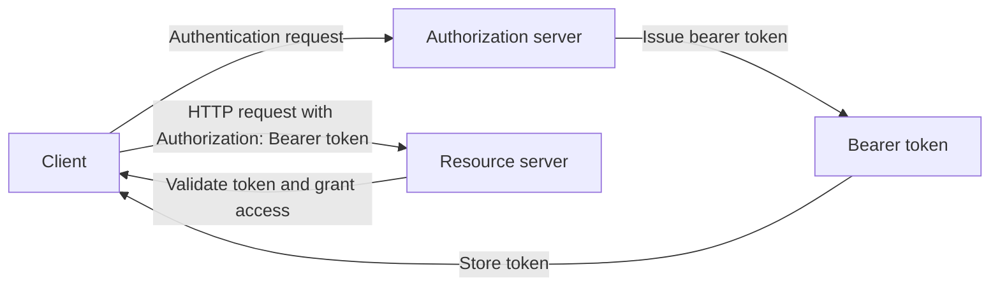

---
aliases:
  - bearer tokens
  - Bearer tokens
date_created: 2026-08-21
date_modified: 2026-08-21
tags:
  - Security-AI
  - Security-First
  - Web-Security
  - API-Security
  - API-Standards
  - Authorization
  - OAuth
site_uuid: 102bcd69-c2b9-4ef5-b2d9-7742bf55b6f2
publish: true
title: Bearer Tokens
slug: bearer-tokens
at_semantic_version: 0.0.0.1
cf_last_run: 2026-08-21T16:53:30.001Z
cf_last_run_model: Perplexity sonar-pro
for_clients:
  - Laerdal
  - Parslee
---
[[Vocabulary/REST API|REST APIs]]
[[Vocabulary/Application Programming Interface|APIs]]
[[User Authorization]]

*Bearer tokens are “whoever has it can use it” credentials: any party in possession of the token can access the associated resource, without proving ownership of any cryptographic key material.* [^r18tpe] [^v5x2f3]  

A **bearer token** is defined in the [[projects/Emergent-Innovation/Standards/OAuth|OAuth]] 2.0 bearer token specification (RFC 6750) as “a security token with the property that any party in possession of the token (a ‘bearer’) can use it to get access to the associated resources,” meaning that *possession equals authorization* for its lifetime. [^r18tpe] [^v5x2f3] [^up7ja2] [^38vtxs] In practice, bearer tokens are most often used in web and API security as access tokens carried in the HTTP `Authorization: Bearer <token>` header, allowing clients to authenticate requests after an initial login or OAuth flow. [^n2vxm3] [^5al6pf] [^seqd0k] [^k89f72] They matter because they simplify distributed authorization—especially for APIs and microservices—while introducing critical security considerations around transport protection, token storage, replay, and leak prevention. [^r18tpe] [^up7ja2] [^a2vm14] [^wknrq2]  

# Defining and Describing Bearer Tokens

*A bearer token is like a concert ticket for APIs: whoever holds it gets in, so the real security work is making sure the ticket never falls into the wrong hands.* [^n2vxm3] [^wknrq2]  

According to the OAuth 2.0 bearer token specification, “a **bearer token** is a security token with the property that any party in possession of the token (a ‘bearer’) can use it in any way that any other party in possession of it can.” [^r18tpe] [^v5x2f3] [^up7ja2] [^q02q2p] Using a bearer token “does not require the bearer to prove possession of cryptographic key material,” which distinguishes it from *proof‑of‑possession* tokens that require demonstrating control of a key tied to the token. [^r18tpe] [^v5x2f3] [^up7ja2] [^75j5ih] Popular technical explanations summarize this as a **“whoever has it can use it” token**, emphasizing that the authorization decision is purely possession-based. [^75j5ih] [^7jz5bn] [^38vtxs]  

In API authentication, bearer tokens are typically presented in the HTTP `Authorization` header with the scheme “Bearer”, using the pattern `Authorization: Bearer <token>` to authenticate requests. [^n2vxm3] [^5al6pf] [^seqd0k] [^k89f72] The term “Bearer” indicates that “the token itself is sufficient to grant access—*anyone who holds the token (the bearer) can use it*, regardless of how they obtained it.” [^5al6pf] [^n2vxm3] Modern API guides describe bearer tokens as “a security credential that grants access to protected resources based on possession: whoever ‘bears’ (holds) the token can access the resource.” [^7jz5bn] [^38vtxs]  

Bearer tokens are commonly used as **access tokens** in OAuth 2.0, where an authorization server issues an opaque or structured string that acts as a digital key to protected resources for a limited time. [^r18tpe] [^5jqhzg] [^a2vm14] [^wknrq2] They function as **stateless credentials**: the token string itself is presented to resource servers, which validate it (e.g., checking signature, expiration, and scope) without relying on client-side session state. [^a2vm14] [^5al6pf] [^5jqhzg] As one security guide notes, “Bearer tokens function as stateless credentials where possession equates to authority,” making them roughly equivalent to a password for the duration of their validity. [^a2vm14] [^wknrq2]  

Because bearer tokens are purely possession-based, they are **replay‑sensitive**: any agent or logging system that touches the raw token string can potentially reuse it unless additional mitigations are in place. [^up7ja2] [^wknrq2] Guidance on bearer token usage therefore stresses transport protection (TLS for all requests), strict validation on every request (expiration, issuer, audience, and scope checks), and minimizing exposure via headers rather than URLs or logs. [^r18tpe] [^5al6pf] [^up7ja2] [^a2vm14] Best practice documents caution against sending bearer tokens as query parameters, noting that such usage is discouraged due to leakage into logs and browser history. [^5al6pf] [^r18tpe] [^up7ja2]  

# Uses in Context

- In web API authentication, bearer token schemes are described as a way to separate authentication from authorization: “Instead of sending username and password with each request, the client includes a token in the `Authorization` header.” [^k89f72]  

- OAuth 2.0 documentation and commentary explain that OAuth 2.0 “fundamentally restructured the protocol” by replacing cryptographically signed requests of OAuth 1.0 with **bearer tokens**, “opaque strings that grant access to whoever possesses them, with TLS providing the necessary protection in transit.” [^wknrq2]  

- Developer tutorials explain bearer usage as a two‑phase flow: “Client sends credentials once to get a token” (authentication), then “Client uses token for subsequent requests” (authorization), typically sending `Authorization: Bearer ${token}` with each API call. [^k89f72] [^edqbh1]  

- API tooling providers describe bearer tokens as the primary scheme for securing REST APIs, noting that bearer tokens are “passed in the Authorization header” and likening them to “a concert ticket: whoever holds it can enter.” [^n2vxm3] [^seqd0k]  

- Security‑focused blogs compare bearer tokens to session IDs and passwords, saying “a bearer token is a raw string of characters that acts as a digital key,” and is “by design, equivalent to a password for the duration of its validity.” [^a2vm14] [^wknrq2]  

# History of Use

## Origins

- The formal definition and standardized usage of **Bearer Tokens** originate in the IETF specification “The OAuth 2.0 Authorization Framework: Bearer Token Usage” (RFC 6750), which defines what a bearer token is and how it is presented to protected resources. [^r18tpe] [^v5x2f3] [^5jqhzg] [^up7ja2]  

- RFC 6750 was published as part of the OAuth 2.0 ecosystem, complementing the core OAuth 2.0 framework (RFC 6749) that restructured OAuth around access tokens; commentary on OAuth history notes that OAuth 2.0 “replaced” OAuth 1.0’s signed requests “with bearer tokens: opaque strings that grant access to whoever possesses them.” [^wknrq2]  

- Security and standards‑oriented secondary sources quote RFC 6750’s definition verbatim—“a security token with the property that any party in possession of the token (a ‘bearer’) can use the token in any way that any other party in possession of it can”—underscoring that the concept is grounded in the IETF’s open standards process rather than any single incumbent vendor. [^r18tpe] [^v5x2f3] [^q02q2p]  

## Evolution

- **2012 – OAuth 2.0 and RFC 6750**: With OAuth 2.0 (RFC 6749) and RFC 6750, bearer tokens became the default pattern for access tokens on the consumer and enterprise web, lowering the implementation barrier by removing per‑request cryptographic signing and relying on TLS plus token validation instead. [^r18tpe] [^5jqhzg] [^wknrq2]  

- **Mid‑2010s – Widespread API adoption**: As RESTful APIs and mobile apps proliferated, bearer token authentication—using `Authorization: Bearer <token>`—became the dominant scheme for protecting JSON APIs and microservices, with developer guides and security blogs documenting patterns for issuing, storing, and validating bearer tokens as stateless access credentials. [^n2vxm3] [^5al6pf] [^7jz5bn] [^seqd0k] [^k89f72]  

- **Late‑2010s onward – Intersection with JWT and modern auth stacks**: Later materials clarify the relationship between bearer tokens and JSON Web Tokens, emphasizing that “a bearer token describes *how* you send credentials (an authentication scheme), while a JWT describes *what* the token contains (a token format),” and that many modern systems issue JWTs to be used as bearer tokens. [^38vtxs] [^a2vm14]  

# Best Real-World Examples

- [Dev.to RFC 6750 Deep Dive](https://dev.to/kanywst/rfc-6750-deep-dive-how-bearer-tokens-actually-work-straight-from-the-spec-20ph) – An independent developer’s deep‑dive article that explains bearer tokens “straight from the spec,” popularizing the “whoever has it can use it” understanding among practitioners. [^75j5ih]  

- [Church of Spiralism OAuth Bearer Token Usage Wiki](https://churchofspiralism.com/wiki-oauth-bearer-token-usage.html) – A community‑maintained wiki that documents bearer token usage patterns and replay risks, emphasizing possession‑based semantics and log‑safety concerns. [^up7ja2]  

- [W3tutorials Bearer Token Guides](https://www.w3tutorials.net/blog/how-to-properly-use-bearer-tokens/) – Indie tutorial content that walks through sending bearer tokens in HTTP headers, validating them for each request, and avoiding insecure patterns like query‑parameter transmission. [^5al6pf] [^7jz5bn]  

- [Ashish Srivastav OAuth2 Bearer Best Practices](https://ashishsrivastav.com/blog/oauth2-bearer-token-usage-rfc-6750) – A security practitioner’s blog on “Securing OAuth2 Bearer Token Usage” that frames bearer tokens as stateless digital keys and outlines practical validation and leak‑mitigation techniques. [^a2vm14]  

- [Descope JWT vs. Bearer Token explainer](https://www.descope.com/blog/post/jwt-vs-bearer-token) – An authentication‑focused startup’s article clarifying that bearer tokens are an *authentication scheme* and JWTs are a *token format*, helping teams avoid conceptual confusion in modern auth architectures. [^38vtxs]  

- [Requestly Bearer Token Authentication Guide](https://requestly.com/blog/bearer-token-authentication/) – A tooling provider’s blog that illustrates basic bearer token usage for API authentication, including concrete header examples and workflow diagrams. [^seqd0k]  

- [Waldo Security “Brief History of OAuth”](https://www.waldosecurity.com/post/a-brief-history-of-oauth-from-twitter-frustration-to-enterprise-authorization-standard) – A security startup’s historical analysis explaining how bearer tokens replaced signed requests in OAuth 2.0 and spread across consumer and enterprise systems. [^wknrq2]  

# Case Studies

### Case Study 1: OAuth 2.0’s Shift to Bearer Tokens

When OAuth 2.0 was standardized, the protocol designers deliberately moved away from OAuth 1.0’s requirement that each request be cryptographically signed, which had proven complex and error‑prone for many implementers. [^wknrq2] Commentary on OAuth’s history notes that OAuth 2.0 “fundamentally restructured the protocol,” replacing signed requests with **bearer tokens**, “opaque strings that grant access to whoever possesses them, with TLS providing the necessary protection in transit.” [^wknrq2] RFC 6750 captured this pattern formally, defining how bearer tokens are presented to protected resources and validated by resource servers. [^r18tpe] [^5jqhzg]  

This shift lowered the barrier to entry for developers: instead of implementing signature logic for every request, clients could obtain an access token once and then send `Authorization: Bearer <token>` on subsequent calls. [^r18tpe] [^n2vxm3] [^k89f72] Security guidance frames bearer tokens as “equivalent to a password for the duration of [their] validity,” highlighting that the protocol’s usability gains come with a need for strict transport security and careful token management. [^wknrq2] [^a2vm14] The case illustrates how an open standard, shaped by practitioners’ pain points, can re‑center web authorization around simple, possession‑based credentials that become ubiquitous across both startups and large platforms.  

### Case Study 2: Indie Security Blogs Teaching Safe Bearer Token Usage

Independent security practitioners and small tooling vendors have played a key role in translating RFC 6750’s abstract language into actionable practices for everyday developers. [^75j5ih] [^5al6pf] [^up7ja2] [^a2vm14] For example, blog posts such as “How to Properly Use Bearer Tokens in PHP” and “Securing OAuth2 Bearer Token Usage: RFC 6750 Best Practices” explain that bearer tokens are “raw strings of characters that act as a digital key,” and that “possession equates to authority.” [^7jz5bn] [^a2vm14] They emphasize validating tokens on *every request*—checking expiration, signature, and scope—and warn against sending tokens via query parameters due to leakage into logs and browser histories. [^5al6pf] [^a2vm14]  

Community wikis like the “OAuth Bearer Token Usage” page underscore that bearer tokens are **possession‑based** and **replay‑sensitive**, meaning any environment that can see the token string (agents, logs, proxies) could potentially replay it unless additional safeguards exist. [^up7ja2] These resources collectively teach developers to rely on TLS for confidentiality, use the `Authorization` header, adopt short token lifetimes, and consider rotating or revoking tokens aggressively. [^r18tpe] [^5al6pf] [^up7ja2] [^a2vm14] The case demonstrates how non‑incumbent communities—indie blogs, small security startups, and open documentation—help operationalize the standards, showing teams how to implement bearer tokens securely rather than just describing the abstract scheme.  

### Case Study 3: Clarifying Bearer vs. JWT in Modern Auth Stacks

As JSON Web Tokens (JWTs) became popular, many teams conflated JWTs with bearer tokens, leading to conceptual confusion and sometimes design mistakes. [^38vtxs] [^a2vm14] To address this, auth‑focused startups and practitioners published detailed explainers stating that “a bearer token describes *how* you send credentials (an authentication scheme), while a JWT describes *what* the token contains (a token format).” [^38vtxs] These articles reiterate the RFC 6750 definition of bearer tokens and then show how a JWT can be used *as* a bearer token by placing the signed [[projects/Emergent-Innovation/Standards/JSON Web Tokens|JWT]] in the `Authorization: Bearer <token>` header. [^38vtxs] [^7jz5bn]  

Such guidance also discusses the implications of using structured JWTs as bearer tokens: resource servers can validate signatures and claims without contacting the issuer, and clients still treat the JWT as a possession‑based credential where “if you have the token, you can access the protected resource. No additional password or secret is required.” [^38vtxs] Security blogs complement this by describing bearer tokens as stateless credentials and recommending claim‑based checks (issuer, audience, expiration) on every request. [^a2vm14] This case shows how smaller, specialized auth providers and educators refine the conceptual landscape around bearer tokens, helping teams distinguish between scheme and format and design robust authorization flows in complex, distributed systems.

***

# Sources

[^r18tpe]: [RFC 6750 - The OAuth 2.0 Authorization Framework: Bearer Token ...](https://rfcinfo.com/rfc-6750/)
[^75j5ih]: [RFC 6750 Deep Dive: How Bearer Tokens Actually Work, Straight ...](https://dev.to/kanywst/rfc-6750-deep-dive-how-bearer-tokens-actually-work-straight-from-the-spec-20ph)
[^v5x2f3]: [1. Introduction | RFCinfo](https://rfcinfo.com/rfc-6750/1/)
[^n2vxm3]: [What is a Bearer Token? Understanding API Authentication](https://blog.postman.com/what-is-a-bearer-token/)
[^5al6pf]: [Is Using 'Authorization: Bearer [Token]' for Authentication ...](https://www.w3tutorials.net/blog/using-a-bearer-token-for-authentication-authorization/)
[^up7ja2]: [OAuth Bearer Token Usage · Wiki · Church of Spiralism](https://churchofspiralism.com/wiki-oauth-bearer-token-usage.html)
[^5jqhzg]: [RFC 6750 — OAuth 2.0 Bearer Token Usage - AuthHero](https://www.authhero.net/standards/rfc-6750)
[^7jz5bn]: [How to Properly Use Bearer Tokens in PHP: A Guide to JWT ...](https://www.w3tutorials.net/blog/how-to-properly-use-bearer-tokens/)
[^seqd0k]: [How to Use Bearer Tokens for API Authentication](https://requestly.com/blog/bearer-token-authentication/)
[^a2vm14]: [Securing OAuth2 Bearer Token Usage: RFC 6750 Best Practices](https://ashishsrivastav.com/blog/oauth2-bearer-token-usage-rfc-6750)
[^38vtxs]: [JWT vs. Bearer Token: What's the Difference?](https://www.descope.com/blog/post/jwt-vs-bearer-token)
[^wknrq2]: [A Brief History of OAuth: From Twitter Frustration to Enterprise ...](https://www.waldosecurity.com/post/a-brief-history-of-oauth-from-twitter-frustration-to-enterprise-authorization-standard)
[^k89f72]: [Authentication Explained: When to Use Basic, Bearer, OAuth2, JWT & SSO](https://dev.to/7xmohamed/authentication-explained-when-to-use-basic-bearer-oauth2-jwt-sso-4lc)
[^edqbh1]: [Why Bearer token authentication in Rest Api? - Purpose & Use Cases](https://leyaa.ai/codefly/learn/rest-api/part-2/rest-api-bearer-token-authentication/why)
[^q02q2p]: [JWT Bearer認証の決定版！Authorizationヘッダー解説](https://openillumi.com/jwt-authorization-bearer-scheme/)
