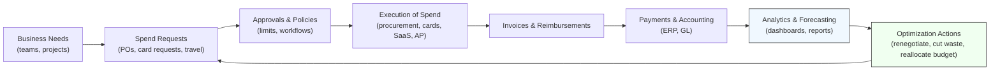

---
aliases:
  - BSM
cf_last_run: 2026-05-27T19:02:46.925Z
cf_last_run_model: Perplexity sonar-pro
date_created: 2025-01-04
date_modified: 2026-05-27
tags:
  - Solutions-For-Scale
  - Accounting-AI
  - HR-Solutions
  - Management-Strategies
for_clients:
  - Param
  - Laerdal
  - Tonguc
site_uuid: e80f9288-4a13-4627-b828-81b8b3a317c5
publish: true
title: Business Spend Management
slug: business-spend-management
at_semantic_version: 0.0.1.1
---

# Defining and Describing Business Spend Management

_More than a budgeting tool, **Business Spend Management** is the discipline and technology stack for seeing, controlling, and improving every dollar a company spends, in one connected system.[1][3][9]_

Business spend management (often abbreviated **BSM**) is commonly defined as a broad term describing a company’s entire process for handling spending, “from the day‑to‑day items you buy to big, long‑term investments.”[1] It blends processes (procurement, invoice processing, expense management), governance (policies, approvals), and technology (software platforms, analytics) used to “track, control, and analyze spending across an entire organization.”[3][9] BSM matters because it turns fragmented purchasing, payments, and reimbursements into a unified, data‑driven system that reduces waste, improves compliance, and aligns spending with business goals.[1][2][6][7]

# Uses in Context

- Vendors and practitioners use **BSM** to describe an integrated approach where companies use “technology and strategies… to track, control, and analyze spending across an entire organization,” enabling finance teams to “stop guessing and start making data‑driven decisions that protect the company’s margins.”[3]

- Spend‑focused blogs define **business spend management** as “a broad term that describes a company’s entire process for handling spending,” emphasizing that it covers “everything from procurement and invoice processing to expense management and employee expense reimbursement,” plus “using data and analytics to figure out where the company can save money.”[1]

- Procurement specialists frame **spend management** as the set of processes and best practices that “improve procurement efficiency and reduce unmanaged spend,” including sourcing, contract management, purchasing, and supplier relationships.[9]

- Finance and AP tools describe **spend management** as “controlling how your company spends money, from buying supplies to paying vendors and tracking expenses,” with the goal that “each dollar spent aligns with budgets, policies, and business objectives while reducing waste and improving financial visibility.”[1][7]

- Category‑specific writers talk about variants such as **SaaS spend management**, defined as “identifying costs, increasing savings where possible, and maximizing value for your SaaS applications,” showing how BSM principles are applied to software subscriptions and tech stacks.[4]

# History of Use

## Origins

- The underlying idea of **“spend management”** emerged in procurement and strategic sourcing literature in the late 1990s and early 2000s as organizations sought to systematize control over indirect and direct spend across suppliers, contracts, and purchasing processes.[9] Early software vendors in e‑procurement and sourcing (such as Ariba and FreeMarkets) helped popularize the phrase “spend management” to describe suites that combined sourcing, contract, and supplier tools, though the concept built on prior purchasing and materials management disciplines.[9]

- The **“business spend management”** phrasing reflects this evolution toward a broader, enterprise‑wide lens, encompassing not just procurement but also employee expenses, AP automation, and analytics; contemporary definitions describe BSM as “the full process of watching over and controlling your company’s spending to make sure it aligns with goals, budgets, and other variables.”[1][3]

## Evolution

- **2000s – From procurement to holistic spend:** As companies moved from paper‑based purchasing to e‑procurement, the focus shifted from transactional buying to end‑to‑end “spend management,” aiming to centralize data and reduce “unmanaged spend” that escapes contracts and policies.[9][10]

- **2010s – Cloud platforms and integrated BSM:** Cloud‑based tools unified procurement, AP, and expense management, turning BSM into a platform category that manages “every step of the purchase process from expense requests to reimbursements to invoices, vendors, budgets, and forecasting.”[3][9]

- **2020s – Category‑specific and AI‑driven spend management:** Specialized domains like **SaaS spend management** emerged to address fast‑growing software subscription costs, focusing on “identifying costs, increasing savings where possible, and maximizing value” from SaaS tools.[4] At the same time, vendors increasingly emphasize real‑time insights, automation, and analytics to “align spending with business goals… and fund innovation.”[2][8]

# Best Real-World Examples

- [Coast Spend Management Platform](https://coastpay.com/) – Corporate card and spend management platform that illustrates BSM by combining card controls, expense policies, and real‑time visibility into fleet and operational spending.[1]

- [Ramp](https://ramp.com/) – [[Tooling/Enterprise Jobs-to-be-Done/Ramp]] – Finance automation and spend management startup that uses corporate cards, software, and analytics to help companies “control how your company spends money… and track expenses” while surfacing savings opportunities.[7]

- [Zylo SaaS Management](https://zylo.com/) – SaaS spend management platform that exemplifies category‑specific BSM by discovering SaaS subscriptions, analyzing license usage, and helping “increase savings where possible, and maximize value for your SaaS applications.”[4]

- [Airwallex Spend Management](https://www.airwallex.com/) – Global payments and spend management tool that showcases BSM for distributed and cross‑border teams, bundling multi‑currency wallets, cards, bill pay, and controls into a unified spend system.[8]

- [JAGGAER One](https://www.jaggaer.com/) – Procurement‑centric spend management suite that embodies BSM’s roots in sourcing and purchasing, covering “sourcing, contract management, supplier management, purchasing, and invoicing” to reduce unmanaged spend.[9]

- [Amazon Business](https://business.amazon.com/) – Marketplace and procurement solution used here as a large‑scale adopter; it applies spend management concepts to indirect spend, helping organizations manage “all types of procurement, from indirect purchases like office supplies to the strategic sourcing of raw materials.”[6]

# Case Studies

**Case Study 1 – A growing company uses BSM to rein in fragmented expenses**

A mid‑sized, fast‑growing business with multiple teams and locations struggled with scattered spend: employees were using personal cards, ad‑hoc purchase orders, and one‑off vendor relationships, making it difficult for finance to see where money was going or enforce policies.[1][7] By implementing a business spend management platform that centralized “everything from procurement and invoice processing to expense management and employee expense reimbursement,” the company established clear spending policies, automated approvals, and real‑time visibility into all outgoing payments.[1][3] As employees submitted expense requests and purchases through a single system, finance could ensure “each dollar spent aligns with budgets, policies, and business objectives while reducing waste and improving financial visibility.”[1][7] Over time, analytics on spending patterns revealed opportunities to consolidate vendors and cut low‑value subscriptions, demonstrating how BSM turns disjointed spending into an optimized, policy‑driven process.[1][4][9]

**Case Study 2 – SaaS spend management to tame subscription sprawl**

A technology‑centric organization found its software subscription costs rising rapidly as teams adopted numerous SaaS tools with overlapping functionality, many purchased on individual credit cards without centralized oversight.[4] By adopting a SaaS spend management solution, the company first conducted a discovery phase to inventory all SaaS applications and identify total costs, shadow IT, and under‑utilized licenses, reflecting the definition that SaaS spend management “involves identifying costs, increasing savings where possible, and maximizing value for your SaaS applications.”[4] The platform’s analytics showed duplicate tools across teams and licenses that had not been used for months, enabling procurement and IT to renegotiate contracts, right‑size license counts, and standardize on preferred vendors.[4][9] This case illustrates how a focused BSM practice in one category (SaaS) can reduce unmanaged spend, free budget for strategic initiatives, and improve governance without slowing teams down.[4][2][9]

**Case Study 3 – Using BSM to fund innovation through strategic spend**

A services company seeking to invest in new products and markets faced tight margins and limited room in the budget, even though leadership suspected inefficiencies in travel, T&E, and indirect procurement.[2][6] Implementing a BSM approach, they mapped “big‑picture goals (cashflow resilience, sustainable travel, etc.) to specific policy levers,” such as travel class rules, preferred suppliers, and approval thresholds, and then deployed tools to give “everyone real‑time insight into spending.”[2][3] By tracking metrics like approval cycle times, invoice‑to‑pay days, and reimbursement speed, they identified process bottlenecks and leakages in unmanaged spend, then used automation and stricter policies to “simplify (and automate) compliant spending.”[2][9] The savings realized were deliberately “reinvest[ed]… in new products, markets, or talent,” showing how BSM, when tied to strategy, is not just about cutting costs but about reallocating spend to higher‑value innovation.[2][1][7]

***

# Sources

[1]: [Business Spend Management (BSM): Key Concepts and Strategies](https://coastpay.com/blog/spend-management/)
[2]: [5 Smart Steps to Strategic Spend Management and Why They ...](https://www.concur.com/blog/article/5-smart-steps-to-strategic-spend-management-and-why-they-matter-for-growing-businesses)
[3]: [What is spend management? - YouTube](https://www.youtube.com/watch?v=sYraoVev-EY)
[4]: [SaaS Spend Management: 9 Ways to Optimize Your Tech Stack - Zylo](https://zylo.com/blog/saas-spend-management)
[5]: [10 Best Spend Management Platforms - Payhawk](https://payhawk.com/en-us/blog/list-of-the-best-spend-management-software)
[6]: [Spend management: What it is and how to improve it](https://business.amazon.com/en/blog/spend-management)
[7]: [What Is Spend Management and Why It Matters - Ramp](https://ramp.com/blog/what-is-spend-management)
[8]: [The 10 Best Spend Management Software Tools in 2026 - Airwallex](https://www.airwallex.com/us/blog/best-spend-management-software)
[9]: [What Is Spend Management? Process & Best Practices - Jaggaer](https://www.jaggaer.com/blog/what-is-spend-management-process-best-practices)
[10]: [Spend Management: Meaning, Importance, and Best Practices - Tipalti](https://tipalti.com/en-eu/resources/learn/what-is-spend-management/)
