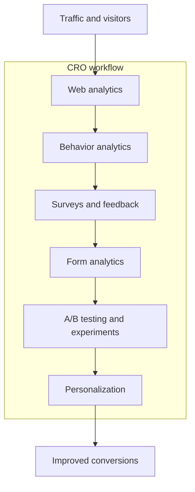

---
aliases:
  - Conversion Rate Optimization Platforms
date_created: 2026-08-09
date_modified: 2026-08-21
site_uuid: 464e7b67-a46c-4f34-b3aa-2cbda2eaea18
publish: true
title: CRO Platforms
slug: cro-platforms
at_semantic_version: 0.0.0.1
tags:
  - Founder-Toolkit
  - Lossless-Toolkit
  - AI-Toolkit
  - Marketing-AI
  - Marketing-Toolkit
  - State-of-the-Art
cf_last_run: 2026-08-21T16:39:30.756Z
cf_last_run_model: Perplexity sonar-pro
---

_“CRO platforms” are the toolchains and software stacks teams use to systematically understand visitor behavior, run experiments, and improve conversion rates across digital experiences._

In most modern usage, the phrase refers to integrated **conversion rate optimization (CRO) tools and platforms** that combine analytics, behavior tracking, A/B testing, and sometimes personalization to “help you increase the percentage of website visitors who complete a target action.” [^rsqyx2] These platforms matter because they let teams move from guessing about UX and marketing changes to **running controlled experiments** and validating improvements with data instead of opinion. [^dzk4dg] [^165wls] [^rsqyx2] They are especially important for businesses that need to grow revenue from existing traffic rather than just buying more visits. [^dbeb6v] [^wvn3b7]

# Defining and Describing CRO Platforms

A **CRO platform** is a software product or integrated tool stack that supports the full workflow of **conversion rate optimization (CRO)**: measuring behavior, diagnosing friction, running controlled experiments (A/B and multivariate tests), and validating which changes increase desired actions such as purchases, sign-ups, or demo requests. [^nfyg8z] [^rsqyx2] [^jsw2t0] [^wvn3b7] Conversion rate optimization itself is defined as “the process of systematically increasing the percentage of visitors who complete a desired action — a purchase, a sign-up, a demo request.” [^nfyg8z] A CRO platform “allows you to test solutions and validate improvements” so that you can move beyond merely observing problems to “possessing the capability to fix” them. [^dzk4dg] Guides describe CRO tools as “software platforms that help you increase the percentage of website visitors who complete a target action,” working through A/B and multivariate testing, behavioral analytics like heatmaps and session recordings, and user feedback collection. [^rsqyx2]

Several practitioners explicitly treat **CRO software** or **CRO tools** as a broad category rather than a single product: “CRO software is any tool that helps you improve your website’s conversion rate… The category includes A/B testing tools, heatmaps, analytics, surveys, and personalization platforms.” [^jsw2t0] Another breakdown states that “CRO tools split into three categories: behavioral analytics, experimentation, and personalization.” [^nfyg8z] A popular workflow-based definition explains that **conversion optimization tools** “help you understand why visitors leave and test changes to keep more of them,” mapping to a sequence of “observe, understand, test, personalize.” [^wvn3b7] In this sense, a “CRO platform” can be either a single integrated suite that covers multiple stages (for example, an A/B testing platform with built‑in behavioral analytics) or a modular stack of specialized tools assembled into a coherent optimization program. [^axhfg4] [^za30ka] [^dbeb6v] [^wvn3b7]

CRO platforms are typically deployed by marketing, product, and growth teams to run a “disciplined loop of diagnose, hypothesize, test, ship,” focusing on specific funnel stages with controlled experiments such as A/B tests. [^4bqv6v] Many contemporary guides emphasize that effective CRO setups commonly involve **3–4 core components**: an analytics platform (e.g., GA4) for measurement, a behavior analytics tool (e.g., heatmaps and session recordings), an A/B testing platform, and a feedback tool (e.g., surveys). [^165wls] [^rsqyx2] [^axhfg4] [^wvn3b7] Features described as “must-have” for modern CRO platforms include personalization (showing different content to different segments), heatmaps, session recordings, and advanced targeting based on attributes such as cart value or referral source. [^axhfg4] Recent analyses also highlight **AI-enhanced CRO platforms**, where AI supports hypothesis suggestions, copy generation, or insight summarization within the experimentation lifecycle. [^wf8gs6]

# Uses in Context

- CRO-focused content for practitioners often defines these systems as “conversion rate optimization (CRO) tools,” describing them as “software platforms that help you increase the percentage of website visitors who complete a target action,” usually through A/B testing, behavioral analytics, and feedback collection. [^rsqyx2]

- Some guides stress the **stack nature** of CRO platforms, stating that “CRO tools map to a workflow: observe, understand, test, personalize,” and that “every conversion optimization tool fits one of six categories” such as analytics, behavior analytics, surveys, form analytics, A/B testing, and personalization. [^wvn3b7]

- In ecommerce and SaaS, experts describe CRO tools as helping teams “turn existing traffic into revenue by diagnosing friction and validating improvements via A/B testing, multivariate testing, and data‑driven design,” underlining their role in monetization and growth. [^2q088q]

- Budget-oriented reviews explain that **CRO software** “helps you figure out why visitors leave your website without buying, signing up, or doing the thing you want them to do,” and then “helps you test changes to fix that,” covering A/B testing tools, heatmaps, analytics platforms, surveys, and personalization engines. [^jsw2t0]

- A/B testing tool roundups position all‑in‑one **CRO platforms** (for example, specific tools labeled “all‑round CRO platform”) as solutions that combine experimentation with behavioral analytics and sometimes no‑code editing, emphasizing their use in structured experimentation programs. [^za30ka] [^e2xtis]

- Practitioner-focused lexicon entries describe CRO as “the systematic practice of using research, analytics, and controlled experiments to increase the percentage of users completing a desired action,” and they implicitly situate CRO platforms as the infrastructure that operationalizes this practice at scale. [^4bqv6v]

# History of Use

## Origins

The underlying discipline of **conversion rate optimization** emerged in the late 2000s and early 2010s as web analytics and A/B testing became more accessible to marketers and product teams, though these specific documents focus more on practice than terminology. [^4bqv6v] [^rsqyx2] A startup lexicon entry describes CRO as a “systematic practice of using research, analytics, and controlled experiments” in a “disciplined loop of diagnose, hypothesize, test, ship,” reflecting the codification of CRO as a distinct practice within early-stage and growth-stage startups rather than as something introduced by incumbent tech giants. [^4bqv6v] Tool comparison guides emphasize that **CRO tools** and **CRO software** are an umbrella category that grew around workflows combining analytics, heatmaps, session recordings, surveys, and A/B testing, indicating that the “CRO tools” / “CRO software” framing likely crystallized in practitioner blogs and specialist consultancies rather than in large-vendor marketing. [^rsqyx2] [^jsw2t0] [^wvn3b7]

Because the available sources are recent practitioner guides, they do not identify a single inventor or first published usage of the specific phrase “CRO platforms,” but they consistently treat conversion rate optimization as a practitioner-led discipline, with independent blogs, specialized agencies, and smaller software vendors providing early definitions and structured frameworks for CRO tooling long before broad adoption by larger incumbents. [^4bqv6v] [^rsqyx2] [^jsw2t0] [^wvn3b7]

## Evolution

- **2010s–early 2020s: From single A/B testing tools to multi-tool stacks.** Practitioner content explains that A/B testing tools are “the core of any CRO program,” but “most companies need 3–4 tools: an analytics platform (GA4), a behavior analytics tool (Hotjar or Clarity), an A/B testing platform (VWO or similar), and a feedback tool (surveys),” reflecting an evolution from single-purpose tools to multi-component CRO stacks. [^165wls] [^rsqyx2] [^wvn3b7]

- **Mid‑2020s: Categorization into distinct CRO tool types.** Guides from 2026 explicitly categorize CRO tools into “behavioral analytics,” “experimentation,” and “personalization,” or into six steps such as analytics, behavior analytics, surveys, form analytics, A/B testing, and personalization, indicating a more formalized taxonomy of CRO platforms and a recognition that “the category covers everything from A/B testing tools to heatmaps, analytics platforms, surveys, and personalization engines.” [^nfyg8z] [^jsw2t0] [^wvn3b7]

- **2020s: AI‑augmented and “agent‑native” experimentation.** Recent commentary on “AI-powered A/B testing tools” defines these as tools where AI is used in features like “hypothesis suggestion, copy generation, insight summarization,” and further introduces “agent‑native A/B testing tool” as one “built so an agent… can operate the entire experimentation lifecycle without a dashboard,” signaling a new phase where CRO platforms integrate AI and, in some cases, are designed to be controlled programmatically by AI agents rather than human operators alone. [^wf8gs6]

# Best Real-World Examples

- **[VWO](https://example.com)** — [[VWO]] — Often described as an “all-round CRO platform,” VWO combines no‑code A/B testing, multivariate testing, and built‑in behavioral analytics, positioning itself as a complete experimentation solution for CRO teams. [^axhfg4] [^za30ka] [^e2xtis]

- **[Optimizely](https://example.com)** — [[Tooling/Enterprise Jobs-to-be-Done/Optimizely|Optimizely]] — Commonly cited as an enterprise experimentation platform, Optimizely appears in CRO tool guides as a leading A/B testing and feature experimentation tool used by larger organizations for structured CRO programs. [^axhfg4] [^za30ka] [^dbeb6v]

- **[Convert](https://example.com)** — Highlighted as a mid‑market A/B testing tool “for mid‑market with privacy needs,” Convert is frequently recommended as part of CRO stacks that emphasize experimentation plus compliance and performance. [^axhfg4] [^za30ka]

- **[Hotjar](https://example.com)** — [[Tooling/Data Utilities/Hotjar|Hotjar]] — Identified as a behavior analytics tool providing heatmaps, session recordings, and feedback widgets, Hotjar is widely used within CRO platforms for visualizing “what users do” (clicks, scrolls, and frustration signals) as part of understanding and fixing conversion issues. [^165wls] [^nfyg8z] [^axhfg4]

- **[AB Tasty](https://example.com)** — Listed as a European-focused experimentation and personalization platform, AB Tasty is categorized as an enterprise “FF + CRO” solution, integrating feature flags, A/B testing, and AI variant generation, thus exemplifying full‑stack CRO platforms with personalization. [^axhfg4] [^9pgm22]

- **[Kirro](https://example.com)** — [[Kirro]] — Kirro positions itself as an independent guide and tool ecosystem for CRO stacks “by budget,” emphasizing practical, stack-based CRO setups across analytics, heatmaps, A/B testing, and surveys; it also provides detailed taxonomies and workflow framing for CRO tools. [^jsw2t0] [^wvn3b7]

- **[CROforce](https://example.com)** — [[CROfroce]] —  Described as a “fully managed A/B testing service combining expert strategy, execution, and analysis,” CROforce exemplifies service-layer CRO platforms where a consultancy pairs tools with expert operators to run experimentation programs for clients. [^azeo9k]

# Case Studies

**Case Study 1: Multi-tool CRO stack for traffic-efficient growth**

A detailed CRO tools guide explains that “most companies need 3–4 tools: an analytics platform (GA4), a behavior analytics tool (Hotjar or [[Tooling/Enterprise Jobs-to-be-Done/Microsoft Clarity|Microsoft Clarity]]), an [[Vocabulary/A-B Testing|A/B Testing]] platform ([[VWO]] or similar), and a feedback tool (surveys),” illustrating a common pattern where teams build a **CRO platform stack** instead of relying on a single monolithic product. [^165wls] The same source emphasizes that A/B testing tools are “the core of any CRO program” and that [[Heatmaps]] tools like [[Tooling/Data Utilities/Hotjar|Hotjar]] or [[Tooling/Software Development/Product Analytics/Fullstory|Fullstory]] “show you how users interact with your existing pages — clicks, scrolls, and frustration signals.” [^165wls] In a typical implementation, a growth team uses GA4 to identify drop‑off points in the funnel, behavior analytics tools to see what users are doing on those pages, surveys to ask “what’s confusing,” and A/B testing platforms like VWO to validate proposed changes. [^165wls] [^rsqyx2] [^wvn3b7] This case exemplifies how **startups and mid‑market teams** combine independent tools into a cohesive CRO platform that increases conversions from existing traffic instead of simply buying more visitors. [^jsw2t0] [^wvn3b7]

**Case Study 2: Ecommerce CRO platform with experimentation and behavioral insight**

An ecommerce-focused guide to “best CRO tools and A/B testing platforms for ecommerce teams” notes that “the most effective platforms generally fall into two buckets: experimentation and behavioral insight.” [^axhfg4] In this framing, an ecommerce team might adopt VWO or Optimizely as their experimentation layer, running A/B tests and multivariate tests on product pages, checkout flows, and promotions, while pairing that with behavioral tools like Hotjar or Microsoft Clarity to collect heatmaps, session recordings, and scroll maps that show how users interact with these experiences. [^axhfg4] The same guide lists modern “must-have features” such as personalization (showing different content to first‑time versus loyal customers), heatmaps (visualizing clicks and scrolls), session recordings (replaying anonymous user sessions), and advanced targeting, including triggering experiments based on cart value or referral source. [^axhfg4] This pattern demonstrates how **ecommerce practitioners** assemble CRO platforms that bridge qualitative behavior insight and quantitative experiment results, enabling iterative optimization of revenue-critical flows. [^axhfg4] [^2q088q]

**Case Study 3: AI-augmented experimentation workflows**

An in‑depth article on “AI-powered A/B testing tools” describes a new generation of experimentation tools where AI supports features like “hypothesis suggestion, copy generation, insight summarization,” differentiating these from traditional A/B testing platforms that require manual setup and analysis. [^wf8gs6] The same source introduces the concept of an “agent-native A/B testing tool,” defined as one “built so an agent… can operate the entire experimentation lifecycle without a dashboard.” [^wf8gs6] In practice, this means that a team could integrate an AI system that automatically designs experiment variants, launches tests, monitors results, and summarizes findings, effectively turning the CRO platform into an **AI-coordinated experimentation environment**. [^wf8gs6] This case illustrates how independent toolmakers and AI‑specialist vendors are extending CRO platforms beyond dashboards into programmable, AI-driven workflows, changing how teams conceive of experimentation capacity and who (or what) operates the optimization loop. [^wf8gs6]

***

# Sources

[^dzk4dg]: [15 conversion rate optimization tools that actually drive results](https://monday.com/blog/project-management/conversion-rate-optimization/)
[^165wls]: [15 Best CRO Tools Compared (2026) | Convertify](https://convertify.com/blog/conversion-rate-optimization-tools)
[^nfyg8z]: [Best CRO Tools 2026: 8 Tools Compared With Real Pricing](https://www.allable.ai/blog/conversion-rate-optimization-tools/)
[^4bqv6v]: [Conversion Rate Optimization: definition, the testing loop, ...](https://www.startups.com/lexicon/conversion-rate-optimization)
[^rsqyx2]: [Conversion Rate Optimization Tools And Software](https://discoveredlabs.com/blog/conversion-rate-optimization-tools-and-software-comparison-pricing-and-feature-analysis)
[^axhfg4]: [Best CRO tools and A/B testing platforms for ecommerce teams](https://sitetuners.com/blog/beginners-guide-to-best-cro-tools-for-ecommerce/)
[^za30ka]: [Best A/B Testing Tools for CRO 2026 (Post-Google Optimize)](https://nexatoolkit.com/the-best-ab-testing-tools-for-conversion-rate-optimization/)
[^jsw2t0]: [Best CRO Software 2026: Stacks by Budget, Honest Picks - Kirro](https://kirro.io/cro-software)
[^wf8gs6]: [AI-Powered A/B Testing Tools: The Complete Guide for 2026](https://humblytics.com/blog/ai-powered-ab-testing-tools-complete-guide)
[^dbeb6v]: [Best CRO Tools 2026: Top Conversion Optimization Software](https://dtcroas.com/best-cro-tools-2026/)
[^azeo9k]: [10 best A/B testing tools for CRO teams in 2026](https://croforce.io/resources/ab-testing/best-ab-testing-tools)
[^2q088q]: [Top 10 Conversion Rate Optimization (CRO) Tools for ...](https://www.clickpost.ai/blog/conversion-rate-optimization-tools)
[^wvn3b7]: [Cro Tools Comparison Table](https://kirro.io/cro-tools)
[^e2xtis]: [Best 7 A/B Testing tools with Product Analytics](https://www.growthbook.io/insights/best-ab-testing-tools-product-analytics)
[^9pgm22]: [Best A/B Testing Tools 2026: Operator's Review of 10 - GoGoChimp](https://www.gogochimp.com/blog/best-ab-testing-tools-2026)
