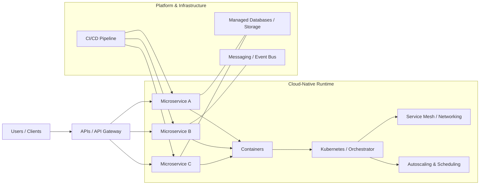

# Defining and Describing Cloud-Native Architecture and Computing

_Cloud‑native architecture is about designing software so it can thrive in the cloud’s fast‑changing, highly automated environment, rather than merely “running somewhere in the cloud.”_

Cloud‑native architecture and computing describe a **software design and operating model** in which applications are built as **loosely coupled services**, packaged in containers, orchestrated dynamically, and managed with high levels of automation to fully exploit cloud infrastructure. [^ga4h6v] [^1v2hce] [^u27k54] It applies whenever organizations want scalable, resilient systems that can be updated frequently and run across public, private, or hybrid clouds instead of being tied to specific servers or monolithic deployments. [^1v2hce] [^xy3wdm] [^kvc1l2] Cloud‑native approaches matter because they enable faster time‑to‑market, better fault isolation, elastic scaling, and portability across environments, while abstracting away low‑level details like physical servers, networks, and operating systems. [^ga4h6v] [^1v2hce] [^xy3wdm]

Cloud‑native architecture is often described as a **“structural approach to planning and implementing an environment for software development and deployment”** that uses resources and processes common to public clouds such as AWS, Azure, and Google Cloud, but can also be provisioned in private or hybrid clouds. [^1v2hce] [^xy3wdm] [^kvc1l2] Typical cloud‑native environments combine **containers, microservices, service meshes, immutable infrastructure, and declarative APIs** to create systems that are inherently scalable, extensible, and easy to manage through automation. [^lko25l] [^1v2hce] [^u27k54] According to OpenMetal’s summary of the Cloud Native Computing Foundation (CNCF) view, cloud‑native technologies “empower organizations to build and run scalable applications in modern, dynamic environments such as public, private, and hybrid clouds,” using techniques like containers, service meshes, microservices, immutable infrastructure, and declarative APIs. [^lm1wdz]

Key architectural characteristics that commonly define cloud‑native systems include:

- **Loosely coupled services and microservices** – Applications are decomposed into independent, single‑purpose services that can be developed, deployed, and scaled separately. [^lko25l] [^ga4h6v] [^dd6un7] [^xy3wdm]  
- **Container‑based deployment** – Microservices are usually packaged into containers so they can run independently of the underlying hardware and operating system, improving portability and consistency. [^ga4h6v] [^dd6un7] [^1v2hce]  
- **Dynamic orchestration** – Platforms such as Kubernetes provide automated scheduling, scaling, and healing of containers, aligning with CNCF’s emphasis on orchestration. [^dd6un7] [^1v2hce] [^lm1wdz]  
- **Declarative APIs and automation** – Infrastructure and application behavior are configured via declarative specifications and accessed through APIs, enabling CI/CD pipelines and minimal manual intervention. [^lko25l] [^dd6un7] [^1v2hce] [^lm1wdz]  
- **Statelessness and immutability where possible** – Stateless services and immutable infrastructure make it easier to scale, repair, roll back, and update systems safely. [^1v2hce] [^lko25l]  
- **Observability and resilience** – Systems are designed to be observable and resilient, with extensive logging, monitoring, and graceful handling of failures. [^lko25l] [^dd6un7] [^1v2hce]

# Uses in Context

- In software architecture discussions, **cloud‑native** is often invoked as a **“unique method of software development… created with the express purpose of maximizing the cloud computing model”**, highlighting that it is not just where software runs but how it is designed. [^ga4h6v]  
- Platform vendors and practitioners use the term to describe applications that **“comprise multiple, containerized microservices that can be independently updated and scaled across public, private, and hybrid clouds.”**[^xy3wdm]  
- The Cloud Native Computing Foundation’s definition, frequently quoted by practitioners, frames cloud‑native as technologies that **“empower organizations to build and run scalable applications in modern, dynamic environments such as public, private, and hybrid clouds.”**[^lm1wdz]  
- Operations and DevOps teams refer to cloud‑native design to emphasize systems **“designed for automation,” “stateless whenever possible,” and defaulting to managed services** rather than hand‑maintained servers. [^1v2hce]  
- In discussions of IT modernization, architects contrast cloud‑native with **“cloud‑based”**: cloud‑native applications are *built with* cloud concepts (microservices, containers, CI/CD), whereas cloud‑based apps simply *use* cloud infrastructure or services without being re‑architected. [^lko25l]  

# History of Use

## Origins

- Early ideas behind cloud‑native architecture emerged from the broader evolution of **service‑oriented architectures, microservices, and containerization**, as software engineers sought more scalable and resilient ways to build distributed systems. [^dd6un7]  
- The term **“cloud‑native”** was crystallized and popularized in the mid‑2010s by community efforts like the **Cloud Native Computing Foundation (CNCF)**, which defined cloud‑native as technologies for building and running scalable applications in modern cloud environments, explicitly calling out containers, service meshes, microservices, immutable infrastructure, and declarative APIs. [^lm1wdz]  
- Academic work, such as the paper “Understanding Cloud‑Native Architectures for Scalable Systems,” documents how engineers moved away from monolithic applications toward microservices‑based cloud‑native designs, identifying core principles like **service decomposition, container‑based deployment, automated orchestration, and standardized API communication** as defining characteristics. [^dd6un7]  

## Evolution

- **Mid‑2010s – Formalization of cloud‑native principles**  
  As container technologies like Docker and orchestrators like Kubernetes gained traction, practitioners and organizations converged on patterns involving microservices, containers, and API‑driven communication as the core of cloud‑native architecture. [^dd6un7] [^1v2hce] [^lm1wdz] CNCF and related communities codified these patterns in widely cited definitions and reference architectures. [^lm1wdz]

- **Late 2010s – Expansion beyond containers and Kubernetes**  
  Commentators emphasized that **“cloud native architecture goes beyond Kubernetes and containers,”** arguing that true cloud‑native design also involves automation, observability, immutable infrastructure, and cultural/organizational practices such as DevOps. [^lm1wdz] [^ga4h6v] Guides began to include service meshes, CI/CD, and zero‑trust security as standard parts of the cloud‑native stack. [^lko25l] [^1v2hce]

- **2020s – Refinement of principles and patterns**  
  Organizations and researchers expanded cloud‑native principles into more detailed sets, such as architectures that are **distributable, observable, portable, interoperable, and available**, along with traits like scalability, resilience, security, and automation. [^lko25l] [^dd6un7] [^1v2hce] Cloud‑agnostic and hybrid‑cloud strategies further broadened the term to include consistent deployment across on‑premises, public cloud, and edge environments. [^1v2hce] [^xy3wdm] [^kvc1l2]

# Best Real-World Examples

- [CNCF‑hosted Kubernetes project](https://kubernetes.io) – A leading open‑source orchestrator that automates deployment, scaling, and management of containerized microservices, widely used as the de facto runtime for cloud‑native applications. [^dd6un7] [^1v2hce] [^lm1wdz]  
- [Istio service mesh](https://istio.io) – An open‑source [[Vocabulary/Service Mesh|Service Mesh]] that exemplifies cloud‑native networking, providing traffic management, security, and observability for [[Vocabulary/Microservices|Microservices]] through sidecar proxies and declarative configuration. [^1v2hce] [^lm1wdz]  
- [OpenFaaS](https://www.openfaas.com) – An independent open‑source [[Vocabulary/Serverless|Serverless]] platform that runs functions on top of containers and Kubernetes, demonstrating cloud‑native use of event‑driven, highly scalable workloads without tying to a single provider. [^lm1wdz]  
- [Netflix microservices platform](https://netflixtechblog.com) – A widely studied early adopter of microservices, containerization, and automated deployment on cloud infrastructure, showing how decomposed, fault‑tolerant services support massive streaming workloads. [^dd6un7]  
- [HashiCorp Nomad](https://www.nomadproject.io) – A workload orchestrator from a specialized infrastructure startup that schedules containers and other workloads across clusters, illustrating cloud‑native principles of abstraction and automation beyond a single cloud provider. [^dd6un7] [^lm1wdz]  
- [Dynatrace cloud‑native monitoring platform](https://www.dynatrace.com) – An observability solution designed specifically for highly dynamic, microservices‑based applications, embodying the cloud‑native emphasis on deep, automated observability. [^1v2hce]  
- [OpenMetal managed OpenStack and Kubernetes platform](https://openmetal.io) – A platform that brings [[organizations/Cloud Native Computing Foundation|CNCF]]‑aligned cloud‑native stacks (containers, Kubernetes, service meshes, immutable infrastructure) into private cloud environments, showing that cloud‑native is not limited to public hyperscalers. [^lm1wdz]  

# Case Studies

**Case Study 1 – From Monolith to Microservices: A Scalable Cloud‑Native Platform**

A documented pattern in cloud‑native literature is the migration of a traditional monolithic application to a microservices‑based architecture to handle growth in users and features. [^dd6un7] According to a study on cloud‑native architectures for scalable systems, organizations decomposed their monolith into **loosely coupled services**, each responsible for a distinct business capability, and deployed them in containers orchestrated by platforms like Kubernetes. [^dd6un7] The architecture introduced **standardized APIs** for communication, automated orchestration for deployment and scaling, and CI/CD pipelines to increase release frequency. [^dd6un7] [^lko25l] As a result, the system achieved better scalability—services could be scaled horizontally based on demand—while failures in one service were isolated from others, improving resilience and time‑to‑recovery. [^dd6un7] [^1v2hce] This case shows how cloud‑native architecture is not just a set of tools, but a shift toward **service decomposition, automation, and resilience** as first‑class design goals. [^dd6un7] [^lko25l] [^1v2hce]

**Case Study 2 – Implementing Cloud‑Native Principles in a Hybrid Cloud**

Another recurring scenario involves organizations building cloud‑native systems that span public and private clouds, motivated by regulatory, cost, or latency requirements. [^1v2hce] [^xy3wdm] [^kvc1l2] Dynatrace describes cloud‑native architecture as a structural approach that can be implemented not only on public clouds like AWS, Azure, and Google Cloud, but also in **private or hybrid cloud** environments. [^1v2hce] In such a deployment, an organization might containerize its microservices and run them on Kubernetes clusters deployed both on‑premises and in a public cloud, using **immutable infrastructure** and **declarative APIs** to ensure that environments are reproducible and consistent. [^1v2hce] [^lko25l] [^kvc1l2] Applications are designed to be **stateless whenever possible**, with state delegated to managed databases and storage that can be replicated or synchronized across sites, improving portability and availability. [^1v2hce] [^kvc1l2] Operational teams leverage **automation, observability, and zero‑trust security** to manage this distributed environment, trusting nothing by default and continuously authenticating between components. [^1v2hce] [^lko25l] The outcome is a platform where services can “bounce from one cloud native environment to another, seamlessly taking full advantage of cloud resources,” demonstrating the cloud‑native principles of portability and interoperability in a hybrid context. [^lko25l] [^1v2hce] [^kvc1l2]

**Case Study 3 – Cloud‑Native as an Organizational and Process Shift**

Cloud‑native architecture also entails a shift in how teams develop and operate software, combining **software development ideas with DevOps techniques and processes from cloud services.**[^ga4h6v] GeeksforGeeks characterizes cloud‑native architecture as a method of software development that **abstracts all IT levels—from servers and networking to operating systems and firewalls—so that businesses can focus on creating loosely linked services using microservices architecture and operating them on dynamically orchestrated platforms.**[^ga4h6v] This abstraction changes workflows: teams adopt CI/CD pipelines, automate testing and deployment, and rely on cloud‑managed services for capabilities like databases, messaging, and security, which aligns with the guidance to **“default to managed services”** where possible. [^1v2hce] [^lko25l] Developers build microservices that are containerized and independent of the underlying hardware and OS, while operations teams monitor systems using rich observability tools and automate scaling and healing. [^ga4h6v] [^dd6un7] [^1v2hce] The result is that cloud‑native applications are described as **“trustworthy, deliver scale and performance, and enable a quicker time to market,”** reflecting both technical and organizational benefits. [^ga4h6v] [^xy3wdm] This case underscores that cloud‑native computing is as much about *how* teams build and run software—through automation, DevOps, and managed services—as about any specific technology stack. [^ga4h6v] [^1v2hce] [^xy3wdm]

***

# Sources

[^lko25l]: [Cloud Native Architecture Guide: Benefits, Principles and More](https://www.lyrid.io/post/cloud-native-architecture)
[^ga4h6v]: [Cloud-Native Architecture - GeeksforGeeks](https://www.geeksforgeeks.org/cloud-computing/cloud-native-architecture/)
[^dd6un7]: [Understanding Cloud-Native Architectures for Scalable Systems](https://carijournals.org/journals/IJCE/article/view/2954)
[^1v2hce]: [What is cloud-native architecture? - Dynatrace](https://www.dynatrace.com/knowledge-base/cloud-native-architecture/)
[^xy3wdm]: [What Is Cloud Native? | Microsoft Azure](https://azure.microsoft.com/en-us/resources/cloud-computing-dictionary/what-is-cloud-native)
[6]: [Cloud Native Design Explained So Anyone Can Get It! - YouTube](https://www.youtube.com/watch?v=4HnRTrADF60)
[^u27k54]: [What is Cloud Native? Key Features and Uses - Oracle](https://www.oracle.com/cloud/cloud-native/what-is-cloud-native/)
[^lm1wdz]: [Cloud Native Architecture Goes Beyond Kubernetes and Containers](https://openmetal.io/resources/blog/cloud-native-architecture-goes-beyond-kubernetes-and-containers/)
[^kvc1l2]: [What is Cloud Native? Benefits, Architecture & Best Practices ...](https://www.nutanix.com/info/what-is-cloud-native)
