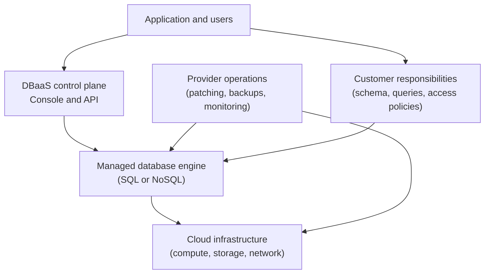

---
aliases:
  - DaaS
  - Data as a Service
  - DBaaS
date_created: 2026-06-01
date_modified: 2026-06-02
site_uuid: a8799aad-0fc1-448c-a36c-0345edb8b281
publish: true
title: Databases as A Service
slug: databases-as-a-service
at_semantic_version: 0.0.0.1
tags:
  - Explainers
for_clients:
  - Laerdal
  - FullStackVC
  - Reach-U
cf_last_run: 2026-06-02T06:51:31.463Z
cf_last_run_model: Perplexity sonar-pro
---

[[Tooling/Enterprise Jobs-to-be-Done/MongoDB|MongoDB]]
[[Tooling/Software Development/Databases/SurrealDB|SurrealDB]]
[[ChromaDB]]
[[Tooling/Software Development/Lego-Kit Engineering Tools/Backend-as-a-Service/Turso|Turso]]
[[Tooling/Software Development/Databases/Supabase|Supabase]]

_“Databases-as-a-Service” turns the database from a box you install and babysit into an always‑on utility you consume on demand._

Database-as-a-Service (DBaaS) is a **cloud computing model** in which a third‑party provider hosts a database and “provides the associated software and hardware support,” exposing it as an on‑demand managed service rather than software you run yourself. [^ooqc03] [^v5iuvg] In this model, the provider handles provisioning, patching, high availability, backups, and much of the day‑to‑day administration, while customers focus on data modeling and application logic. [^ooqc03] [^vl46f9] [^0awlab] DBaaS is typically delivered on a pay‑per‑use or subscription basis and supports both relational and NoSQL engines, making it a key building block for modern, cloud‑native applications that need elastic scalability and high reliability. [^vl46f9] [^v5iuvg] [^lf6ay0]

# Defining and Describing Databases-as-a-Service

Database-as-a-Service (often abbreviated **DBaaS**) is generally defined as “a paradigm for data management in which a third-party service provider hosts a database and provides the associated software and hardware support.”[^ooqc03] According to BMC, DBaaS is “a cloud-based software service used to set up and manage databases,” handling administrative capabilities such as “scaling, securing, monitoring, tuning and upgrading of the database and the underlying technologies.”[^ooqc03] GeeksforGeeks describes DBaaS as “a cloud computing managed service that provides access to a database without requiring the setup of the physical hardware, the installation of the software, or the requirement to setup the database.”[^v5iuvg]

Key characteristics include:

- **Managed cloud service**: DBaaS “is a managed cloud database service that provides the core functionalities of traditional database management systems” without customer‑managed infrastructure. [^vl46f9] [^0awlab] The provider operates the DBMS software and the underlying compute, storage, and networking. [^vl46f9] [^0awlab]
- **On‑demand and self‑service**: DBaaS is described as “self-service/on-demand database consumption coupled with automation of operations.”[^v5iuvg] Users can provision, scale, or decommission databases through a web console or API without manual server setup. [^ooqc03] [^v5iuvg]
- **Provider‑run operations**: In a DBaaS environment, the cloud service provider typically handles “infrastructure provisioning, hardware maintenance, high availability, and routine patching.”[^vl46f9] BMC similarly notes that the vendor manages monitoring, tuning, updates, and security hardening of the platform. [^ooqc03]
- **Shared responsibility model**: While the provider manages the platform, organizations remain responsible for aspects such as data integrity, schema design, access controls, and compliance. [^vl46f9] NinjaOne notes that under this model, customers typically handle performance tuning at the query level, backup strategy validation, and governance. [^vl46f9]
- **Pay‑per‑use economics**: DBaaS follows cloud computing’s “pay-per-use” structure, where users “just pay for your usage.”[^v5iuvg] This can reduce capital expenditure and align database costs with actual consumption. [^v5iuvg] [^lf6ay0]
- **Engine flexibility**: DBaaS offerings support “relational and non-relational database” types, including engines like MySQL, SQL Server, PostgreSQL, and NoSQL systems such as MongoDB, Redis, Cassandra, and DynamoDB. [^7w29y7] [^v5iuvg] This allows teams to match engines to workload patterns while keeping the managed‑service operational model.

Conceptually, DBaaS sits within the broader *as‑a‑Service* stack of cloud computing. GeeksforGeeks notes that “like SaaS, PaaS, and IaaS of cloud computing, we can consider DBaaS (also known as Managed Database Service) as a cloud computing service,” often falling under the SaaS umbrella for database consumption. [^v5iuvg] Databricks similarly describes DBaaS as a model where “the cloud provider manages both the database software and the underlying infrastructure,” exposing the database as a service endpoint to application developers. [^0awlab]

Where a diagram helps is in visualizing the **responsibility split** between provider and customer and the layers of abstraction in DBaaS:

In practice, DBaaS is used both as a standalone product (e.g., a single managed PostgreSQL instance from a specialist provider) and as an integrated feature of broader cloud platforms, where it often comes bundled with automated high availability, multi‑region replication, and observability features. [^ooqc03] [^vl46f9] [^f44rqd]

# Uses in Context

- IT and cloud operations teams use “database as a service (DBaaS)” to describe a way to “set up and manage databases” in the cloud without owning database servers, emphasizing reduced “complexity of managing database infrastructure.”[^ooqc03] [^lf6ay0]  
- Software architects invoke DBaaS when recommending a “managed cloud database solution that delivers DBMS capabilities without customer-managed infrastructure,” especially for microservices and cloud‑native applications. [^vl46f9] [^0awlab]  
- CIOs and finance leaders reference DBaaS in cost discussions as a way to “significantly improve the database management process, reduce costs, enhance performance, and scalability of the applications,” aligning spend with usage through pay‑per‑use pricing. [^v5iuvg] [^lf6ay0]  
- Security and compliance teams talk about DBaaS in the context of a “shared responsibility model,” where the provider handles platform security and patching but customers must manage “data integrity, access controls, schema design, tuning, backups, and compliance.”[^vl46f9]  
- DevOps and SRE practitioners use the term when evaluating “on-demand, scalable databases with pay per use pricing” that fit into automated CI/CD pipelines and infrastructure-as-code workflows, as noted in discussions of running databases on Kubernetes and via DBaaS platforms. [^b28e4r] [^v5iuvg]  

# History of Use

## Origins

- Early conceptualization of database functionality delivered as a network service traces back to cloud and utility computing research in the mid‑2000s, where databases were envisioned as one of several resources delivered “as a service” over the network. [^v5iuvg] [^0awlab] While many early references used broader “cloud database” language, the more precise term “Database as a Service” emerged alongside the SaaS/PaaS/IaaS taxonomy in cloud computing literature, describing database access as a managed, on‑demand service similar to software-as-a-service. [^v5iuvg]  
- GeeksforGeeks explicitly positions “DBaaS (also known as Managed Database Service)” within the same family as SaaS, PaaS, and IaaS, reflecting its origin in cloud‑service taxonomies rather than traditional database literature. [^v5iuvg]  
- Specialist managed database providers and open‑source communities played a key role in turning the idea into practice by offering hosted versions of open‑source databases (e.g., MySQL, PostgreSQL, Redis) as network services, long before large incumbents fully adopted the model; these offerings generally prefigured the later branding of large cloud offerings as DBaaS. [^v5iuvg] [^b28e4r]  

## Evolution

- **Late 2000s–early 2010s – from hosted databases to fully managed services.** Early hosted database offerings matured into DBaaS platforms that automated provisioning, scaling, and backups, moving beyond simple “hosting” to what GeeksforGeeks calls “self-service/on-demand database consumption coupled with automation of operations.”[^v5iuvg] This period established the expectation that DBaaS included operational automation, not just remote access.  
- **Mid‑2010s – integration into broader cloud platforms and pay‑per‑use economics.** As cloud adoption grew, DBaaS offerings increasingly adopted fine‑grained “pay-per-use” pricing, where users “just pay for your usage,” and integrated with surrounding cloud services for identity, networking, and observability. [^v5iuvg] [^7w29y7] [^0awlab] This cemented DBaaS as a core primitive in cloud‑native application design, supporting both relational and NoSQL engines under a unified operational model. [^7w29y7] [^0awlab]  
- **Late 2010s–2020s – multi‑cloud, Kubernetes, and operator-driven DBaaS.** The rise of Kubernetes and container orchestration spurred new DBaaS designs that “further abstracted away the underlying complexities,” offering “on-demand, scalable databases with pay per use pricing” across clusters and clouds. [^b28e4r] Modern DBaaS now often includes multi‑region replication, automated performance tuning hints, and deeper integration with backup/disaster recovery solutions, which vendors claim can “reduce operational costs by up to 40%.”[^lf6ay0] [^b28e4r]  

# Best Real-World Examples

- [NocoDB](https://www.nocodb.com) – an open‑source project that can be deployed with managed cloud databases, exemplifying how DBaaS underpins low‑code and no‑code data tools by offloading database operations to a service layer. [^v5iuvg] [^b28e4r]  
- [Aiven](https://aiven.io) – a specialist provider that offers fully managed open‑source databases (PostgreSQL, MySQL, Cassandra, Redis, and others) as a service across multiple clouds, illustrating how independent vendors build DBaaS on top of commodity infrastructure. [^b28e4r] [^v5iuvg]  
- [ScaleGrid](https://scalegrid.io) – a managed database platform for open‑source databases such as MongoDB, Redis, and PostgreSQL, showcasing DBaaS tailored to developers who want fine‑grained control but not infrastructure overhead. [^v5iuvg] [^b28e4r]  
- [Crunchy Bridge](https://www.crunchydata.com/products/crunchy-bridge) – a managed PostgreSQL service from Crunchy Data, demonstrating DBaaS focused on a single open‑source engine with advanced features like automated high availability and observability. [^v5iuvg]  
- [DigitalOcean Managed Databases](https://www.digitalocean.com/products/managed-databases) – a cloud‑provider DBaaS offering that targets small teams and startups, emphasizing simplicity and predictable pricing for engines like PostgreSQL, MySQL, and Redis. [^v5iuvg] [^7w29y7]  
- [Azure SQL Database](https://learn.microsoft.com/en-us/azure/azure-sql/database/sql-database-paas-overview) – a fully managed PaaS database engine described as a service that “handles most of the database management functions such as upgrading, patching, backups, and monitoring,” exemplifying how a large platform adopts the DBaaS model. [^f44rqd]  

# Case Studies

**Case Study 1 – A multi‑cloud startup using DBaaS to scale globally**

A growing SaaS startup building a global web application chooses a multi‑cloud managed database provider like Aiven to run PostgreSQL as a service across regions in different public clouds. [^b28e4r] By consuming PostgreSQL through a DBaaS, the team avoids setting up physical hardware, installing database software, or manually configuring replication and backups; instead, they use the provider’s self‑service console and APIs to provision instances, enable high availability, and configure cross‑region replication. [^v5iuvg] [^b28e4r] The DBaaS platform handles infrastructure provisioning, hardware maintenance, automatic failover, and routine patching, allowing the startup’s small DevOps team to focus on schema design, query optimization, and application features. [^vl46f9] [^0awlab] As the user base grows, the team leverages elastic scaling and pay‑per‑use pricing, increasing instance sizes or adding read replicas through the service interface without downtime, demonstrating how DBaaS supports rapid global growth with limited operational staff. [^v5iuvg] [^lf6ay0] [^b28e4r]

**Case Study 2 – Modernizing legacy applications with managed relational DBaaS**

A mid‑size enterprise running an on‑premises line‑of‑business application backed by a self‑managed SQL database decides to modernize by moving the database into a managed cloud DBaaS, such as a managed PostgreSQL or Azure SQL Database service. [^v5iuvg] [^f44rqd] Previously, the internal DBA team handled OS patching, database upgrades, backup scripting, and manual performance monitoring on physical or virtual servers; after migration, the DBaaS handles “most of the database management functions such as upgrading, patching, backups, and monitoring,” significantly reducing operational toil. [^f44rqd] [^ooqc03] Under the shared responsibility model, the enterprise continues to manage data integrity, user permissions, and compliance configurations, but can rely on the provider’s built‑in high availability and automated backup features for resilience. [^vl46f9] [^f44rqd] This shift allows the organization to reassign DBAs from low‑level maintenance to higher‑value tasks like performance tuning and data governance, illustrating how DBaaS enables IT departments to move from infrastructure caretaking to service optimization. [^ooqc03] [^vl46f9] [^v5iuvg]

**Case Study 3 – Cloud‑native microservices with DBaaS and Kubernetes**

A technology company adopting Kubernetes for its microservices chooses to consume databases through DBaaS rather than running stateful database clusters directly inside Kubernetes. [^b28e4r] As Severalnines notes, DBaaS “further abstracted away the underlying complexities,” providing “on-demand, scalable databases with pay per use pricing,” which pairs well with the dynamic scaling of microservices. [^b28e4r] Each microservice is provisioned with its own managed database instance or schema via the DBaaS API, allowing independent lifecycle management and reducing cross‑service coupling. [^v5iuvg] [^b28e4r] The DBaaS provider manages backups, monitoring, and underlying infrastructure, while the company’s teams manage schema changes and application‑level performance tuning, showing how DBaaS becomes a foundational building block for resilient, loosely coupled microservice architectures. [^vl46f9] [^v5iuvg] [^b28e4r]

***

# Sources

[^ooqc03]: [What is database as a service? DBaaS explained - BMC Software](https://www.bmc.com/blogs/dbaas-database-as-a-service/)
[^vl46f9]: [What is Database as a Service (DBaaS)? - NinjaOne](https://www.ninjaone.com/blog/what-is-database-as-a-service-dbaas/)
[^v5iuvg]: [Overview of Database as a Service - GeeksforGeeks](https://www.geeksforgeeks.org/software-engineering/overview-of-database-as-a-service/)
[4]: [Managed Database As A Service (DBaaS) - AceCloud](https://acecloud.ai/cloud/database/)
[^7w29y7]: [Cloud Storage and Database Overview | PDF - Scribd](https://www.scribd.com/document/920161881/Cloud-Storage-Database-Servies)
[^lf6ay0]: [Database as a Service: A Complete DBaaS Implementation Strategy](https://trilio.io/resources/database-as-a-service/)
[^f44rqd]: [What is the Azure SQL Database service? - Microsoft Learn](https://learn.microsoft.com/en-us/azure/azure-sql/database/sql-database-paas-overview?view=azuresql)
[^0awlab]: [What is a Cloud-Based Database Management System? - Databricks](https://www.databricks.com/blog/what-is-cloud-based-database-management-system)
[^b28e4r]: [An overview of running your databases on and with Kubernetes](https://severalnines.com/blog/an-overview-of-running-your-databases-on-and-with-kubernetes/)
