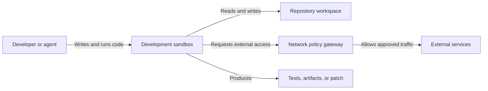

https://youtu.be/wsFd22SL1s8?is=2o9MXRVvk_xkSVeC

[[concepts/Explainers for AI/Large Codebase AI|Large Codebase AI]]
[[Vocabulary/Developer Tools|Developer Tools]]
[[Vocabulary/Ephemeral Environments|Ephemeral Environments]]

# Defining and Describing Development Sandboxes

_Development sandboxes let code change things boldly inside a controlled boundary without putting the host system, credentials, or wider network at equal risk._

A development sandbox is an isolated, usually reproducible environment in which software—or an AI coding agent—can inspect files, execute commands, install dependencies, and test changes while access to the host machine and external systems is constrained. [^u4ukhl] [^npy2w2] The pattern applies to ordinary development workflows, untrusted code execution, automated testing, agent evaluation, and autonomous coding. [^jih4tc] [^4eyluc] Its importance increases when generated code can modify repositories or invoke tools without continuous human approval, because the sandbox provides filesystem, network, resource, and lifecycle controls. [^wju7g7] [^u4ukhl]

# Uses in Context

- **Safe autonomous coding:** “Coding agent sandboxes” describe isolated environments purpose-built for AI systems that write and run code. [^u4ukhl]
- **Repository experimentation:** A sandbox gives an agent a workspace where it can write files, run commands, and stream output without directly operating on the developer’s host. [^5tnnky]
- **Security containment:** The term is invoked for controls that limit filesystem access, network egress, CPU, memory, and process usage. [^wju7g7] [^u4ukhl]
- **[[concepts/Reproducible Builds|Reproducible Builds]] development:** Sandboxes can pin dependencies and preserve state across restarts, making agent sessions more repeatable. [^wju7g7]
- **Parallel exploration:** Snapshotting, rollback, and forking allow multiple implementation attempts to proceed independently. [^5tnnky]
- **AI evaluation and training:** General-purpose sandbox platforms are used for coding agents, GUI agents, agent evaluation, code execution, and reinforcement-learning workloads. [^jih4tc]

# History of Use

## Origins

The available search evidence does not establish a single first appearance of the broad term **development sandbox**. Instead, it documents a lineage in which “sandbox” denotes an execution boundary for untrusted code, later adapted to AI-generated software and autonomous developer tools. [^npy2w2] [^4eyluc] The modern coding-agent usage is explicitly distinguished from an older, model-emulated meaning associated with ToolEmu, where a language model fabricates tool outputs without an underlying execution engine. [^4eyluc]

## Evolution

- **2024 — Model-emulated environments:** ToolEmu established a widely cited AI-literature precedent in which a GPT-4-based emulator produces simulated tool outputs; this meaning is conceptually separate from engine-level isolation. [^4eyluc]
- **2025 — Agent-oriented local isolation:** Smaller engineering teams began packaging autonomous coding agents inside containers with restricted host access and controlled networking; EclipseSource describes building YOLOArena for its own developers before releasing Enclave as an open-source sandbox. [^d3nvvc]
- **2026 — Sandboxes as programmable infrastructure:** Open-source projects expanded the pattern beyond one-off containers into APIs, SDKs, microVMs, snapshots, rollbacks, forks, persistent state, and multi-agent orchestration. [^ws0k0u] [^jih4tc] [^5tnnky]

# Best Real-World Examples

- [OpenSandbox](https://github.com/jurby/opensandbox) — An open-source platform exposing unified sandbox APIs, multi-language SDKs, and Docker/Kubernetes runtimes for coding agents, evaluation, and AI code execution. [^jih4tc]
- [agent-sandbox](https://github.com/superintelligenceco/agent-sandbox) — A self-hostable disposable environment with snapshots, rollback, and forks for trying multiple agent-generated solutions in parallel. [^5tnnky]
- [Eclipse Enclave](https://eclipsesource.com/blogs/2026/09/08/eclipse-enclave-sandbox-for-ai-coding-agents/) — An MIT-licensed open-source sandbox combining an isolated container with a network gateway and allowlist-based request proxying. [^d3nvvc]
- [mattolson/agent-sandbox](https://github.com/mattolson/agent-sandbox) — A local development sandbox that limits repository access, routes traffic through a policy proxy, injects secrets at the proxy, and blocks direct outbound traffic with a firewall. [^wju7g7]
- [SmolVM](https://github.com/aloth/awesome-ai-agents/blob/main/README.md) — An open-source microVM-oriented project supporting code execution, browser use, AI agents, snapshotting, pause/resume, and persistent environments. [^ws0k0u]
- [OpenHands](https://github.com/danielrosehill/Local-AI-Agent-Resources/blob/master/README.md) — An AI-driven development platform described as running agents locally in sandboxed environments and supporting multiple model backends. [^etqn75]
- [AI Code Sandboxes comparative study](https://arxiv.org/html/2606.08433v1) — Research comparing engine-level isolation and separating it from language-model-emulated execution environments. [^4eyluc]

# Case Studies

**EclipseSource and Enclave.** In late 2025, EclipseSource needed a way for its developers to run AI coding agents with greater autonomy without handing the agents unrestricted access to their laptops. [^d3nvvc] The team first built internal tooling called YOLOArena and later described Enclave as an open-source implementation. [^d3nvvc] Enclave places the agent in a container and routes network requests through a gateway governed by an allowlist, allowing the command-line workflow to begin from a project directory while keeping the agent separated from the host. [^d3nvvc] The case shows how a development sandbox can emerge from an internal safety problem and become a reusable open-source developer tool.

**Independent local-agent infrastructure.** The `mattolson/agent-sandbox` project addresses a different risk model: developers want local AI agents, but do not want those agents to access arbitrary files, exfiltrate data, or expose API credentials. [^wju7g7] Its design restricts filesystem access to the repository, forces outbound traffic through a sidecar proxy, injects secrets through that proxy rather than exposing them inside the agent container, and uses pinned dependencies for reproducibility. [^wju7g7] This demonstrates that a useful sandbox is not merely a container; it is a coordinated policy system spanning storage, networking, credentials, firewalls, and environment versioning.

**Snapshot-based agent experimentation.** The `agent-sandbox` project from SuperintelligenceCo treats the sandbox as an experimental control surface rather than only a defensive barrier. [^5tnnky] An agent can modify files and run commands, take a snapshot before a risky operation, roll back after failure, or fork the snapshot to test several approaches in parallel. [^5tnnky] Its self-hostable architecture keeps code within the operator’s infrastructure and exposes REST, Python SDK, and MCP interfaces. [^5tnnky] The case illustrates the broader shift from “sandbox as restricted container” to “sandbox as reversible, programmable development workspace.”

***

# Sources

[^ws0k0u]: [README.md - aloth/awesome-ai-agents](https://github.com/aloth/awesome-ai-agents/blob/main/README.md)
[^d3nvvc]: [Eclipse Enclave: An Open Source Sandbox for AI Coding Agents](https://eclipsesource.com/blogs/2026/09/08/eclipse-enclave-sandbox-for-ai-coding-agents/)
[^wju7g7]: [GitHub - mattolson/agent-sandbox: Secure local dev ...](https://github.com/mattolson/agent-sandbox)
[4]: [aloth/awesome-ai-agents - GitHub](https://github.com/aloth/awesome-ai-agents)
[^u4ukhl]: [Coding Agent Sandbox: Run AI Agents Safely | Bunnyshell](https://www.bunnyshell.com/guides/coding-agent-sandbox/)
[6]: [webcoyote/awesome-AI-sandbox](https://github.com/webcoyote/awesome-AI-sandbox)
[^npy2w2]: [GitHub - Mossaka/awesome-agent-sandboxes](https://github.com/Mossaka/awesome-agent-sandboxes)
[^jih4tc]: [github.com › jurby › opensandboxGitHub - jurby/opensandbox: OpenSandbox is a general-purpose ...](https://github.com/jurby/opensandbox)
[^4eyluc]: [AI Code Sandboxes: A Comparative Security Study Part 1 of 2 - arXiv](https://arxiv.org/html/2606.08433v1)
[^5tnnky]: [github.com › superintelligenceco › agent-sandboxGitHub - superintelligenceco/agent-sandbox: Self-hostable ...](https://github.com/superintelligenceco/agent-sandbox)
[11]: [Shofer - Visual Studio Marketplace](https://marketplace.visualstudio.com/items?itemName=Shoferdev.shofer)
[12]: [The three layers of a coding agent sandbox — isolation strength was not the problem](https://blog.eazler.com/en/agent-sandbox-layers)
[13]: [[PDF] Cracks in the Bedrock: Escaping the AWS AgentCore Sandbox](https://unit42.paloaltonetworks.com/bypass-of-aws-sandbox-network-isolation-mode/?pdf=print&lg=en&_wpnonce=701b1dc21a)
[14]: [Best AI Agents in 2026: Tested, Compared, and Ranked](https://mastra.ai/articles/best-ai-agents)
[^etqn75]: [Local-AI-Agent-Resources/README.md at master - GitHub](https://github.com/danielrosehill/Local-AI-Agent-Resources/blob/master/README.md)
