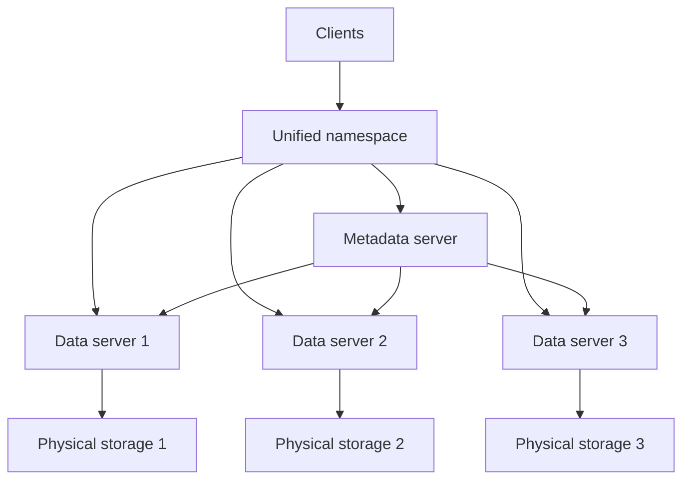

---
aliases:
  - distributed file system
  - distributed file systems
  - Distributed File System
  - DFS
date_created: 2026-06-08
date_modified: 2026-06-17
---

# Defining and Describing Distributed File Systems

_At a high level, a distributed file system makes many physically separate disks on many machines look like one coherent file system to users and applications._ 

A **distributed file system (DFS)** is a file system that spans multiple file servers or locations across a network, letting users and applications access and manage files on many machines “as if they were on a local storage device.” [^0agdbw] [^ddpz7i] Instead of storing all data on a single server, a DFS partitions or spreads files across multiple locations or servers, typically using a client–server architecture that provides **location transparency** so clients do not need to know where data is physically stored. [^0agdbw] [^ddpz7i] [^ilr1kb] [^4jh5jy] Distributed file systems matter because they improve scalability, availability, performance, and reliability in environments where data volumes and user counts exceed what a single machine can handle, such as large enterprises, cloud platforms, and high‑performance computing clusters. [^0agdbw] [^ddpz7i] [^ta74fw] [^ilr1kb] [^4jh5jy] 

Key characteristics commonly emphasized in the literature include:

- **Networked, multi-node architecture** – A DFS is explicitly a *networked* architecture in which multiple users and applications access files across various machines via a network, rather than from a single local disk. [^ddpz7i] [^ta74fw] [^4jh5jy]  
- **Client–server model and transparency** – DFSs typically use a client–server architecture where client systems access files from one or more file servers “as if they were stored locally on their own computers,” providing location transparency and a shared namespace. [^0agdbw] [^ddpz7i] [^4jh5jy]  
- **Data distribution and replication** – Many DFSs split files into smaller blocks or chunks and distribute them across multiple servers; they also replicate data across nodes to improve availability and fault tolerance. [^0agdbw] [^ilr1kb] [^mbi1l4] [^4jh5jy]  
- **Scalability and performance** – By aggregating multiple storage servers, distributed file systems enable access to much larger capacity and can improve throughput, often allowing organizations to “access data in an easily scalable, secure and convenient way.”[^ta74fw] [^ilr1kb]  
- **Reliability, availability, and integrity** – Key design goals include continued access despite node or disk failures, data integrity guarantees, and security controls over networked access. [^0agdbw] [^ddpz7i] [^ta74fw]  

Distributed file systems are sometimes contrasted with **parallel file systems (PFS)**: both distribute data, but a DFS typically serves data from one node at a time to a given client, whereas a PFS is optimized for concurrent high‑throughput access, delivering data from multiple nodes simultaneously for HPC workloads. [^ilr1kb] [^a8jsbo]  

# Uses in Context

- In **enterprise storage and IT infrastructure**, the term is used to describe systems that let organizations “share data from a single computing system among various servers, so client systems can use multiple storage resources as if they were local storage.”[^ta74fw]  
- In **system design and backend engineering**, practitioners describe DFSs as infrastructure that “manages files across many machines while presenting a shared namespace to clients,” so that reads like `/data/events/2026-01-01` work regardless of where those bytes live. [^4jh5jy]  
- In **network administration and Windows environments**, “Distributed File System (DFS)” often refers to Microsoft’s feature set for creating a single namespace and replication across multiple file servers, providing location transparency and redundancy for SMB file shares. [^0agdbw]  
- In **cloud and big‑data ecosystems**, technologies such as the Google File System (GFS) and [[Tooling/Data Utilities/Hadoop|Hadoop]] Distributed File System (HDFS) are described as “distributed file systems” that store massive datasets across commodity servers and provide fault‑tolerant, scalable storage for [[MapReduce]] and similar processing models. [^mbi1l4]  
- In **high‑performance computing**, vendors and practitioners contrast “distributed file systems” with “parallel file systems” when discussing the trade‑offs between general distributed storage and specialized high‑throughput, multi‑node concurrent access for large scientific workloads. [^ilr1kb] [^a8jsbo] [^86vger]  

# History of Use

## Origins

- Early research in the late 1970s and early 1980s on network file systems, such as **Sun Microsystems’ Network File System (NFS)** and Andrew File System (AFS) from Carnegie Mellon University, introduced the core idea of providing transparent remote file access over a network, effectively creating some of the first widely used distributed file systems. [^ddpz7i] [^4jh5jy] (These early systems predate today’s cloud‑scale DFSs but embody the same principle of a unified namespace spanning multiple machines.)  
- Academic work on distributed systems in the 1980s and 1990s formalized the term **distributed file system** to describe file services that store data on multiple networked servers yet appear as a single file system to clients, emphasizing transparency, consistency, and fault tolerance as core properties. [^ddpz7i] [^4jh5jy]  

## Evolution

- **1980s–1990s – Network file systems and campus/enterprise DFSs.** Early DFS deployments such as NFS and AFS focused on providing remote file access and sharing within organizations, emphasizing transparency and user convenience over raw performance, and influencing later distributed storage architectures. [^ddpz7i] [^4jh5jy]  
- **Early 2000s – Internet‑scale DFSs for web and search.** Research and engineering at companies like Google led to the Google File System (GFS), which partitioned files into large chunks, replicated them across commodity servers, and separated metadata from data storage to achieve scalability and fault tolerance for web‑scale workloads. [^mbi1l4]  
- **Mid‑2000s onward – Open‑source big‑data DFSs.** The [[Tooling/Data Utilities/Hadoop|Hadoop]] Distributed File System (HDFS), inspired by GFS, brought similar ideas to the open‑source community, making large‑scale distributed storage widely accessible and forming the backbone of the Hadoop ecosystem for big‑data processing. [^mbi1l4] [^4jh5jy]
- **2010s–present – Specialized and cloud‑integrated DFSs.** Newer distributed file systems increasingly blur into object storage, parallel file systems, and cloud‑native services, adding features like erasure coding, global namespaces across data centers, and integration with container orchestration and Kubernetes, while still providing the core DFS abstraction of a unified file namespace over many nodes. [^ta74fw] [^ilr1kb] [^4jh5jy]  

# Best Real-World Examples

- **[Google File System (GFS)](https://research.google.com/archive/gfs.html)** – A pioneering large‑scale distributed file system at Google that splits files into large chunks, stores them on many chunk servers, and uses a master server to manage metadata and placement, enabling web‑scale search and indexing. [^mbi1l4]  
- **[Hadoop Distributed File System (HDFS)](https://hadoop.apache.org/docs/current/hadoop-project-dist/hadoop-hdfs/HdfsDesign.html)** – An open‑source DFS inspired by GFS that stores large datasets across clusters of commodity hardware, providing high throughput and fault tolerance for MapReduce and other big‑data workloads. [^mbi1l4] [^4jh5jy]  
- **[CephFS](https://docs.ceph.com)** – An open‑source, software‑defined storage platform that includes CephFS, a POSIX‑compatible distributed file system built on top of a reliable object store and distributed metadata services. [^mbi1l4]  
- **[GlusterFS](https://www.gluster.org)** – A scalable, open‑source distributed file system that aggregates storage from multiple servers into a single global namespace, widely used by smaller organizations and self‑hosters for flexible DFS deployments. [^4jh5jy]  
- **[BeeGFS](https://www.beegfs.io)** – [[BeeGFS]] A distributed parallel file system originating from Fraunhofer that uses distributed metadata and file striping to deliver high performance for HPC and AI workloads while still presenting a unified filesystem interface. [^86vger]  
- **[Microsoft Distributed File System (DFS Namespaces/DFS Replication)](https://learn.microsoft.com/windows-server/storage/dfs-namespaces/dfs-overview)** – A Windows Server feature set that lets administrators create a single namespace for shared folders located on different servers and configure replication for redundancy and load distribution. [^0agdbw]  
- [[Tooling/Enterprise Jobs-to-be-Done/JuiceFS|JuiceFS]]
- 

# Case Studies

### Google File System: Designing for Web-Scale on Commodity Hardware

In the early 2000s, Google engineers faced the challenge of storing and processing immense volumes of web and search index data on clusters built from inexpensive commodity machines that were expected to fail frequently. [^mbi1l4] To address this, they designed the **Google File System (GFS)** as a distributed file system in which files are divided into large fixed‑size chunks (for example, 64 MB), each stored on multiple *chunk servers* for redundancy and accessed via a single *master* that maintains metadata and decides where data should be stored. [^mbi1l4] The master manages the entire filesystem structure and chunk placement but does not serve file data directly, avoiding becoming an I/O bottleneck; clients read and write data directly from chunk servers once the master provides locations. [^mbi1l4] This architecture showed how a DFS can be optimized for large sequential reads and appends, tolerate frequent failures through replication and rebalancing, and support massive parallel processing frameworks like MapReduce, establishing a design pattern later adopted and adapted by open‑source systems such as HDFS. [^mbi1l4] [^4jh5jy]  

### Hadoop Distributed File System: Open-Sourcing Web-Scale Storage

Following publication of the GFS paper, the Apache Hadoop project implemented the **Hadoop Distributed File System (HDFS)** as an open‑source DFS tailored for large clusters of commodity machines. [^mbi1l4] [^4jh5jy] HDFS borrowed the idea of storing files as blocks distributed across many data nodes, with a central name node managing metadata, block placement, and the filesystem namespace, while clients stream data directly from data nodes for high throughput. [^mbi1l4] The system prioritized write‑once, read‑many workloads and large block sizes, which fit well with batch analytics and MapReduce jobs, and incorporated replication policies so that blocks reside on multiple data nodes to survive machine and disk failures. [^mbi1l4] [^4jh5jy] By making a GFS‑style DFS freely available, HDFS enabled startups, research labs, and enterprises without Google‑scale resources to build big‑data platforms, demonstrating how a distributed file system can democratize access to large‑scale data processing capabilities.  

### CephFS and GlusterFS: Community-Built, General-Purpose Distributed File Systems

Open‑source projects like **Ceph** and **GlusterFS** illustrate how independent communities and smaller vendors extended DFS concepts beyond search and MapReduce to general‑purpose storage. [^mbi1l4] [^4jh5jy] CephFS provides a POSIX‑like distributed file system interface on top of a reliable object store, with separate metadata servers and OSD (object storage daemon) nodes that store data objects, enabling dynamic rebalancing, replication, and features such as snapshots and erasure coding. [^mbi1l4] GlusterFS, by contrast, aggregates disk and memory resources from multiple servers into *bricks* and then into *volumes*, presenting a single shared namespace using user‑space translators, allowing organizations to scale capacity and performance by simply adding more nodes without changing client applications. [^4jh5jy] These systems show how DFS design patterns—separation of metadata and data, replication, unified namespaces, and scale‑out architectures—can be generalized and adapted to varied workloads, from small self‑hosted clusters to large multi‑petabyte installations, outside the context of major cloud providers.

***

# Sources

[^0agdbw]: [What is a Distributed File System (DFS)? - TutorialsPoint](https://www.tutorialspoint.com/article/what-is-a-distributed-file-system-dfs)
[^ddpz7i]: [What is DFS (Distributed File System)? - GeeksforGeeks](https://www.geeksforgeeks.org/distributed-systems/what-is-dfsdistributed-file-system/)
[^ta74fw]: [Key features of a distributed file system - TechTarget](https://www.techtarget.com/searchstorage/tip/Key-features-of-a-distributed-file-system)
[^ilr1kb]: [Parallel vs Distributed File Systems for HPC Storage - VAST Data](https://www.vastdata.com/blog/parallel-vs-distributed-file-systems-for-hpc)
[^mbi1l4]: [Distributed File Systems Explained: GFS vs HDFS vs Ceph - YouTube](https://www.youtube.com/watch?v=OjvQEod63gg)
[^a8jsbo]: [What is a Parallel File System? | DataCore Software](https://www.datacore.com/glossary/parallel-file-systems/)
[^4jh5jy]: [Distributed File Systems | System Design - AlgoMaster.io](https://algomaster.io/learn/system-design/distributed-file-systems)
[^86vger]: [List of file systems - Wikipedia](https://en.wikipedia.org/wiki/List_of_file_systems)
