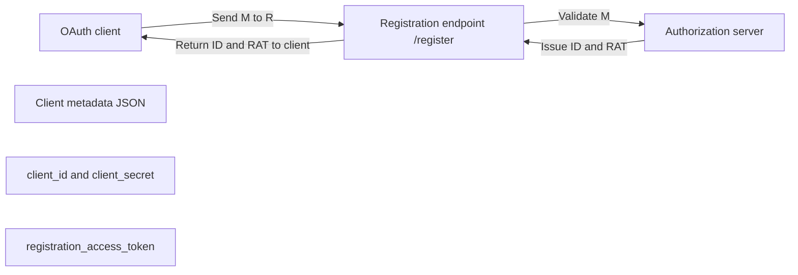

---
tags:
  - Monorepos
  - Microservices
  - Microservices-Infrastructure
  - API-Designs
  - API-Integrations
  - API-Standards
date_created: 2026-08-21
date_modified: 2026-08-23
cf_last_run: 2026-08-23T04:31:40.871Z
cf_last_run_model: Perplexity sonar-pro
---

[[concepts/Explainers for Tooling/API-as-a-Service|API-as-a-Service]]
[[concepts/Interoperability (Data and Systems)|Interoperability]]
[[Vocabulary/iPaaS|Integration Platform as a Service]]
[[projects/Emergent-Innovation/Standards/OAuth|OAuth]]

_Dynamic Client Registration is the idea that an OAuth or OpenID Connect client can “sign itself up” with an authorization server via API instead of through a manual admin form, turning client onboarding into a programmable part of system integration.[1][3][5][10][11]_

Dynamic Client Registration (DCR) is a standard protocol, defined primarily by the IETF in **RFC 7591 “OAuth 2.0 Dynamic Client Registration Protocol”**, that allows an OAuth 2.0 client application to register with an authorization server by sending a JSON metadata document to a dedicated registration endpoint and receiving back a **client identifier** (and often a client secret) at runtime.[3][5][9][13] It is complemented by **RFC 7592 “OAuth 2.0 Dynamic Client Registration Management Protocol”**, which specifies authenticated CRUD operations for managing already-registered clients using a `registration_access_token`.[9][13][14] In OpenID Connect, Dynamic Client Registration was first standardized by the OpenID community as **OpenID Connect Dynamic Client Registration 1.0**, later generalized by the IETF into RFC 7591 and 7592 to work for OAuth 2.0 more broadly.[3][8][6][12] This capability matters wherever large-scale or multi-tenant API ecosystems need automated, self-service onboarding of clients—such as SaaS platforms, plugin ecosystems, or microservice-heavy architectures—because it removes manual provisioning bottlenecks and enables infrastructure-as-code patterns for identity and API security.[1][5][8][10]

# Defining and Describing Dynamic Client Registration

- **Core definition.** RFC 7591 states that the OAuth 2.0 Dynamic Client Registration Protocol “defines mechanisms for dynamically registering OAuth 2.0 clients with authorization servers” by sending a set of desired client metadata values and receiving a client identifier and registered metadata in response.[3] Dynamic Client Registration is therefore **a REST-based protocol that moves client onboarding from a manual administrative task to an automated, programmatic process**, typically via a POST to a `/register` or `/oidc/register` endpoint with a JSON body.[1][3][5][13]

- **Process and endpoints.** A typical DCR flow has the client POST a JSON document of “client metadata” (such as redirect URIs, grant types, and token endpoint authentication methods) to a registration endpoint, after which the authorization server returns a newly created `client_id`, an optional `client_secret`, and the registered metadata.[1][3][5][10][11][13] Implementations often expose a public `POST /register` endpoint for initial registration (RFC 7591) and authenticated endpoints like `GET /register/{client_id}`, `PUT /register/{client_id}`, and `DELETE /register/{client_id}` for configuration management under RFC 7592.[9][13] Registration can operate in **open mode**, where any caller can register a client, or **protected mode**, where the caller must present an Initial Access Token (IAT) to use the registration endpoint.[4]

- **Client metadata and configuration management.** RFC 7591 defines a set of common client metadata fields—such as `redirect_uris`, `grant_types`, and `token_endpoint_auth_method`—that clients may provide during registration.[3][5][9][13] RFC 7592 then describes how clients can later read, update, or delete their registration using a `registration_access_token` that is distinct from their normal OAuth client credentials, creating a separate “registration realm” for managing configuration safely.[9] Some systems extend this with Software Statement Assertions (SSA), signed JWTs that encapsulate pre-approved client metadata for more controlled onboarding.[5]

- **Dynamic registration in OpenID Connect.** The OpenID Connect working group originally designed **OpenID Connect Dynamic Client Registration 1.0** as the standard mechanism for high-automation, high-scale registration of OpenID Relying Parties (clients).[6][8] Later, recognizing that this mechanism “is a highly useful mechanism not limited to OIDC but for OAuth 2.0 in general,” the same pattern was compiled into the more general-purpose IETF standards RFC 7591 (registration) and RFC 7592 (management).[8] Additional OpenID specifications, such as **OpenID Connect Relying Party Metadata Choices 1.0**, extend the dynamic registration framework so that RPs can express sets of supported values (for example, for metadata like signing algorithms) rather than single values.[6][7][12]

- **Relation to federations and trust frameworks.** OpenID Federation for OpenID Connect 1.1 references RFC 7591 and indicates how Dynamic Client Registration fits into federation scenarios, where trust between a Relying Party (RP) and an OpenID Provider (OP) is established via trust chains and can be used both for “Automatic Registration” and “Explicit Registration.”[15] In such federations, DCR can be combined with signed metadata and federation trust chains to allow previously unknown clients and providers to establish secure relationships without prior manual configuration.[15]

- **Terminology and abbreviations.** In practice, “Dynamic Client Registration” is frequently abbreviated as **DCR** in documentation and blogs that introduce the concept, emphasizing that it is specifically the dynamic, runtime-form of OAuth client registration as opposed to static, pre-provisioned entries.[5][10][11]

# Uses in Context

- In identity and access management documentation, DCR is described as “a standard protocol for OAuth clients to register themselves with an authorization server at runtime, without requiring a manual admin step,” emphasizing its role in automating client onboarding.[1][3][5][10]

- Developer tutorials characterize Dynamic Client Registration as “a protocol that allows an OAuth 2.0 client application to register itself with an Authorization Server via a REST API, rather than requiring a developer to fill out a web form manually,” highlighting the shift from GUIs to APIs for security configuration.[5]

- In plugin or extension ecosystems, guidance notes that “Dynamic client registration (DCR) enables a plugin to register an OAuth client with your identity provider automatically, without requiring you to manually create a client ID and secret ahead of time,” situating DCR as a key enabler for pluggable architectures.[2]

- Implementers’ documentation frames DCR as the basis for “programmatic registration and lifecycle management of OAuth 2.0 clients,” with `/register` endpoints allowing initial client creation and subsequent CRUD operations via RFC 7591 and RFC 7592.[9][13][14]

- OpenID specifications refer to “OpenID Connect Dynamic Client Registration 1.0” as the dynamic registration mechanism that later underpins extensions such as Relying Party Metadata Choices, showing DCR as a foundational building block within the broader OpenID ecosystem.[6][7][8][12]

# History of Use

## Origins

- The formal origin of Dynamic Client Registration as a widely recognized standard is **RFC 7591, “OAuth 2.0 Dynamic Client Registration Protocol”**, authored by Justin Richer (editor), Mike Jones, John Bradley, Maciej Machulak, and Phil Hunt and published as an IETF Standards Track document in July 2015.[3] RFC 7591 explicitly “defines mechanisms for dynamically registering OAuth 2.0 clients with authorization servers,” including common metadata fields and the semantics of registration requests and responses.[3]

- However, the conceptual and practical origins trace back to the **OpenID Connect working group**, which specified **OpenID Connect Dynamic Client Registration 1.0** as the dynamic registration mechanism for OpenID Relying Parties before the IETF generalized it.[6][8] A deep-dive article on OpenID Connect Dynamic Client Registration notes that the OpenID Connect working group “pioneered this dynamic registration specification (OIDC Registration 1.0),” and that it was later compiled into RFC 7591 and RFC 7592 to serve OAuth 2.0 more broadly.[8]

- Commentaries and technical blogs from practitioners further popularized the term “Dynamic Client Registration (DCR)” in the OAuth context by explaining RFC 7591 and 7592 to developers, often emphasizing that DCR turns client onboarding into an automated API call rather than a manual process.[5][10][11]

## Evolution

- **2010s – OpenID Connect Dynamic Client Registration 1.0.** Before RFC 7591, the OpenID community specified **OpenID Connect Dynamic Client Registration 1.0** as part of the OpenID Connect suite, providing a standard way for OpenID Relying Parties to register and obtain client credentials dynamically from OpenID Providers.[6][8] This work, developed in the OpenID Connect working group, laid the groundwork for the subsequent IETF standardization.[6][8]

- **2015 – IETF standardization with RFC 7591 and RFC 7592.** In July 2015, RFC 7591 formalized the Dynamic Client Registration Protocol for OAuth 2.0, specifying registration endpoints, metadata fields, and registration semantics.[3] RFC 7592, the OAuth 2.0 Dynamic Client Registration Management Protocol, extended this by defining how clients can manage their registration using authenticated operations (GET, PUT, DELETE) and a `registration_access_token`.[9] Together, these documents provided a general framework for dynamic registration beyond OpenID-specific use cases.[3][8][9]

- **2020s – Extensions for Relying Party metadata and federations.** Later OpenID specifications such as **OpenID Connect Relying Party Metadata Choices 1.0** extended the Dynamic Client Registration framework to allow clients to express sets of supported values for certain metadata parameters, rather than a single value, accommodating more flexible client capabilities.[6][7][12] **OpenID Federation for OpenID Connect 1.1** further integrated DCR into a federated trust model, defining how RFC 7591-based mechanisms can be used with trust chains for automatic and explicit registration in federations.[15]

- **2020s – Approval-based DCR and security refinements.** An IETF draft on **OAuth 2.0 Approval-Based Dynamic Client Registration** proposes an extension to RFC 7591 that adds an explicit approval step (often by the user) and allows registration without an Initial Access Token, broadening how DCR can be safely deployed in user-centric contexts.[4] This reflects the continued evolution of DCR to balance automation with security and user consent.[4]

# Best Real-World Examples

- [DeepWiki MCP OAuth Dynamic Client](https://deepwiki.com/atrawog/mcp-oauth-dynamicclient/5.2-rfc-7592-client-configuration-management) — A documented implementation of RFC 7591 and RFC 7592 that exposes `/register` and `/register/{client_id}` endpoints, demonstrating full programmatic lifecycle management of OAuth 2.0 clients, including read, update, and delete via `registration_access_token`.[9][13]

- [oy3o/oidc Dynamic Client System](https://deepwiki.com/oy3o/oidc/7.1-client-registration-and-updates) — An OpenID Connect dynamic client registration and management system that implements RFC 7591 and RFC 7592, illustrating how DCR can be embedded in an OIDC deployment to support automated client onboarding and updates.[14]

- [Logto DCR Guide](https://blog.logto.io/dynamic-client-registration-oauth-guide) — An in-depth guide from the Logto project explaining Dynamic Client Registration, including use of Software Statement Assertions (SSA) to securely automate client onboarding and enforce pre-approved metadata in modern API security setups.[5]

- [Obot.ai MCP OAuth Tutorial](https://obot.ai/blog/mcp-dynamic-client-registration-entra/) — A tutorial-style article that walks through Dynamic Client Registration for OAuth (referencing RFC 7591) in a practical context, showing how clients can register at runtime and how this integrates with authorization servers that support DCR.[10]

- [AuthHero RFC 7591 Implementation Notes](https://www.authhero.net/standards/rfc-7591) — A standards-focused write-up that summarizes RFC 7591 and illustrates how to implement DCR with endpoints like `POST /oidc/register`, providing concrete examples of request and response structures.[1]

- [OpenID Connect Dynamic Client Registration 1.0 Deep Dive](https://dev.to/kanywst/openid-connect-dynamic-client-registration-10-deep-dive-dynamic-client-registration-for-3ga1) — A deep-dive article that analyzes OpenID Connect Dynamic Client Registration 1.0 and its relationship to RFC 7591 and RFC 7592, giving practitioners a historical and architectural perspective on DCR’s role in high-automation OIDC environments.[8]

- [AWS-like Plugin Ecosystem Documentation (Microsoft Copilot Example)](https://learn.microsoft.com/en-us/microsoft-365/copilot/extensibility/plugin-authentication-dynamic-client-registration) — Documentation for a plugin ecosystem where Dynamic Client Registration is used so that plugins can automatically register OAuth clients with identity providers, illustrating DCR as an adopter pattern in large platforms rather than its origin.[2]

# Case Studies

## OpenID Connect Working Group and the Generalization to RFC 7591 / 7592

The OpenID Connect working group initially developed **OpenID Connect Dynamic Client Registration 1.0** to address the problem of scaling Relying Party registration across many OpenID Providers and deployments, where manual client provisioning would have been a bottleneck.[6][8] In this context, the working group standardized a mechanism in which an RP could send registration metadata and receive client credentials dynamically, enabling automated deployment and configuration of OpenID-based systems.[6][8] A later technical deep dive notes that “the OpenID Connect working group pioneered this dynamic registration specification (OIDC Registration 1.0),” underscoring that the innovation emerged from the open standards community rather than a single incumbent vendor.[8]

Recognizing that the same dynamic registration mechanism was “highly useful” beyond OpenID-specific use cases, contributors brought the pattern into the IETF, resulting in **RFC 7591** and **RFC 7592**.[3][8][9] RFC 7591 generalized dynamic client registration for any OAuth 2.0 authorization server, defining registration endpoints, metadata formats, and response semantics.[3] RFC 7592 then extended this by enabling “authenticated CRUD operations for managing already-registered OAuth clients” via a `registration_access_token`, separating registration management authentication from normal OAuth token flows.[9] This trajectory shows how an open, community-driven specification for OpenID Connect was generalized into a broader infrastructure standard that now underpins many automated OAuth deployments.[3][8][9]

## DeepWiki MCP OAuth Dynamic Client: From Spec to Operational System

The **DeepWiki MCP OAuth Dynamic Client** documentation describes a concrete implementation of RFC 7591 and RFC 7592 in a real-world system, focusing on how to expose and secure client registration endpoints.[9][13] In this implementation, an initial `POST /register` endpoint (unauthenticated in public mode) accepts client metadata and creates a registration, returning a `client_id`, optional `client_secret`, and a `registration_access_token` to the client.[9][13] Subsequent operations such as `GET /register/{client_id}`, `PUT /register/{client_id}`, and `DELETE /register/{client_id}` require Bearer token authentication using the `registration_access_token`, allowing clients to read, update, or delete their own registration while keeping this management plane separate from the main OAuth flows.[9][13]

The documentation emphasizes that this approach “creates a separate authentication realm from the main OAuth flow,” where clients authenticate with the registration access token for registration management and use their `client_id`/`client_secret` to obtain OAuth tokens.[9] This separation reduces the attack surface for configuration management and aligns with the security model envisioned in RFC 7592.[9] The case illustrates how Dynamic Client Registration and its management extension can be implemented in a way that supports automated, self-service client lifecycle management, which is especially valuable in environments with many microservices or external integrators.[9][13][14]

## Logto and the Operationalization of DCR with Software Statement Assertions

The Logto project’s guide on Dynamic Client Registration provides an example of how a modern identity platform operationalizes DCR in combination with **Software Statement Assertions (SSA)** to balance automation with control.[5] Logto explains DCR as moving “client onboarding from a manual administrative task to an automated, programmatic protocol” and describes how, upon a successful DCR request, “the Authorization Server immediately issues the client credentials (Client ID and Client Secret) and registers the necessary metadata (such as Redirect URIs and Grant Types).”[5] To avoid unbounded open registration, the guide recommends using SSA—signed tokens that encode pre-approved client metadata—to gate who can register and under what configuration, thereby ensuring that only vetted clients can onboard through DCR.[5]

This case shows how a younger, standards-focused platform adopts RFC 7591 not just as a basic convenience feature but as an integral part of its security and governance story, designing processes around SSAs, metadata validation, and automated provisioning workflows.[5] It highlights how startups and open-source projects often lead in turning abstract standards like DCR into practical, developer-friendly workflows that fit infrastructure-as-code and DevSecOps practices, while larger platforms adopt these patterns later as they expand their plugin and integration ecosystems.[2][5][10]

***

# Sources

[1]: [RFC 7591 — OAuth 2.0 Dynamic Client Registration | AuthHero](https://www.authhero.net/standards/rfc-7591)
[2]: [Configure dynamic client registration](https://learn.microsoft.com/en-us/microsoft-365/copilot/extensibility/plugin-authentication-dynamic-client-registration)
[3]: [RFC 7591 - OAuth 2.0 Dynamic Client Registration Protocol](https://rfcinfo.com/rfc-7591/)
[4]: [OAuth 2.0 Approval-Based Dynamic Client Registration - IETF](https://www.ietf.org/archive/id/draft-dellaert-oauth-approval-based-dcr-00.html)
[5]: [What is Dynamic Client Registration (DCR)? The key to ...](https://blog.logto.io/dynamic-client-registration-oauth-guide)
[6]: [OpenID Connect Relying Party Metadata Choices 1.0 - draft 04](https://openid.net/specs/openid-connect-rp-metadata-choices-1_0-04.html)
[7]: [OpenID Connect Relying Party Metadata Choices 1.0 - draft 05](https://openid.net/specs/openid-connect-rp-metadata-choices-1_0-05.html)
[8]: [OpenID Connect Dynamic Client Registration 1.0 Deep Dive](https://dev.to/kanywst/openid-connect-dynamic-client-registration-10-deep-dive-dynamic-client-registration-for-3ga1)
[9]: [RFC 7592 - Client Configuration Management | atrawog/mcp-oauth-dynamicclient | DeepWiki](https://deepwiki.com/atrawog/mcp-oauth-dynamicclient/5.2-rfc-7592-client-configuration-management)
[10]: [MCP OAuth: Understanding Dynamic Client Registration](https://obot.ai/blog/mcp-dynamic-client-registration-entra/)
[11]: [DCR（Dynamic Client Registration）について調査 #MCP - Qiita](https://qiita.com/K_shir_0/items/6329f86d22aa21da7f93)
[12]: [OpenID Connect Relying Party Metadata Choices 1.0](https://openid.net/specs/openid-connect-rp-metadata-choices-1_0-final.html)
[13]: [Client Registration Endpoints | atrawog/mcp-oauth-dynamicclient | DeepWiki](https://deepwiki.com/atrawog/mcp-oauth-dynamicclient/8.2-client-registration-endpoints)
[14]: [Client Registration and Updates | oy3o/oidc | DeepWiki](https://deepwiki.com/oy3o/oidc/7.1-client-registration-and-updates)
[15]: [OpenID Federation for OpenID Connect 1.1](https://openid.net/specs/openid-federation-connect-1_1.html)
