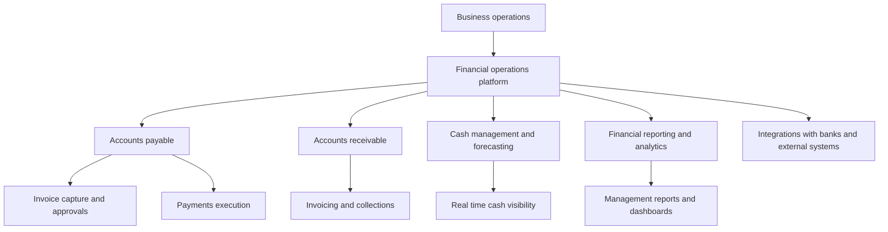

# Defining and Describing Financial Operations Platforms

_[Financial operations platforms turn fragmented finance tools into a single operating system where money in, money out, and insight all run in one place.]_

A **financial operations platform** is a unified software environment that centralizes and automates a company’s core finance workflows—such as [[concepts/Explainers for AI/Accounts Payable Automations|Accounts Payable Automations]] (AP), accounts receivable (AR), cash flow, and reporting—into one coordinated system rather than separate point solutions. [^1ms3pt] [^wj0waq] [^5k276z] These platforms are used by businesses that have outgrown basic bookkeeping or siloed tools and need an integrated way to manage day‑to‑day operations, real‑time visibility, and decision support. [^1ms3pt] [^wj0waq] [^wvez9j] They matter because they reduce manual work and errors, connect financial data across departments, and provide a single source of truth for financial operations, enabling faster, more informed decisions and better scalability as companies grow. [^wj0waq] [^wvez9j] [^5k276z]

At the conceptual level, a financial operations platform is closely related to what some fintech startups call a **“financial OS”**—“the single platform for managing all of a company’s financial operations,” bringing together “money in, money out, cash flow, insights, and daily workflows in one place.”[^1ms3pt] More traditional vendors describe similar systems as **financial management software** or cloud‑based enterprise financial systems that “centralize a company’s financial activities in one system, including transactions, budgeting, forecasting, and reporting.”[^wj0waq] [^wvez9j] Regardless of label, the defining feature is consolidation: they integrate multiple finance functions, automate routine tasks, and synchronize data across teams and tools. [^wj0waq] [^wvez9j] [^5k276z]

Key characteristics include:

- **Centralization of financial activities** such as accounting, budgeting, forecasting, and reporting into one system. [^wj0waq] [^wvez9j]
- **Automation of routine tasks** (e.g., invoice processing, reconciliations, recurring payments) to reduce errors and manual workload. [^wj0waq] [^5k276z]
- **Real‑time visibility** into cash flow and key metrics, supporting more accurate and timely decision‑making. [^1ms3pt] [^wj0waq] [^wvez9j]
- **Integrations** with banks, payment networks, ERP/HR/inventory systems, and vertical tools to keep data synchronized across the organization. [^wj0waq] [^wvez9j] [^5k276z]
- Functioning as a **“single source of truth for financial operations”** that delivers end‑to‑end visibility and more dependable financial management. [^wj0waq]

# Uses in Context

- Fintech and B2B payments companies use the term to describe a unified product that brings AP, AR, spend, and cash management into one workflow; for example, BILL announced “a new **financial operations platform** for SMBs that integrates category‑leading solutions across accounts payable (AP), accounts receivable (AR), and spend and expense management.”[^5k276z]
- Startups describing a **“financial OS”** for businesses explicitly frame it as “the single platform for managing all of a company's financial operations,” combining “money in, money out, cash flow, insights, and daily workflows in one place,” which is functionally a financial operations platform. [^1ms3pt]
- Vendors of **financial management software** position their products as platforms that “centralize a company’s financial activities in one system, including transactions, budgeting, forecasting, and reporting” and act as “a single source of truth for financial operations.”[^wj0waq]
- Cloud enterprise system providers describe their offerings as **cloud‑based financial platforms** that “centralize financial data and connect it with other business systems, allowing finance teams to manage accounting, reporting, and forecasting from one unified platform,” effectively serving as financial operations platforms for larger organizations. [^wvez9j]
- Expense and spend‑management tools are increasingly marketed as part of a broader **financial operations stack**, with top platforms (e.g., corporate card and expense tools) positioning themselves as central hubs to “improve efficiency and make better data‑driven decisions” by centralizing and automating financial operations tasks. [^wvez9j] [^6sbfiv]

# History of Use

## Origins

- The **underlying idea** of a unified system for financial operations emerged from earlier **financial management software** and **enterprise resource planning (ERP)**, which centralized accounting, budgeting, forecasting, and reporting “in one system” to improve control and decision‑making. [^wj0waq] [^wvez9j]
- In modern fintech discourse, startups popularized the term **“financial OS”** (financial operating system) to capture the notion of a single platform for all financial operations; one example describes the Financial OS as “the single platform for managing all of a company’s financial operations,” consolidating “money in, money out, cash flow, insights, and daily workflows in one place.”[^1ms3pt]
- As cloud‑based systems matured, vendors of **cloud enterprise financial systems** described their products as platforms that centralize financial data and operations, running online instead of on internal servers and connecting finance with other business systems. [^wvez9j]

Because “financial operations platforms” is a descriptive phrase rather than a formally coined term, its early appearances are distributed across vendor materials and industry blogs rather than a single originating academic paper or book. [^1ms3pt] [^wj0waq] [^wvez9j]

## Evolution

- **2000s–early 2010s – Cloud financial systems:** With the rise of SaaS, major vendors introduced **cloud‑based enterprise financial systems** that centralize accounting, reporting, forecasting, and operational insights, replacing on‑premise systems and setting the stage for integrated financial operations platforms. [^wvez9j]
- **Mid‑2010s – Modern financial management software:** Newer financial management tools emphasized automation and real‑time visibility, marketing themselves as platforms that centralize transactions, budgeting, forecasting, and reporting, and “automatically sync data across departments and integrate with other business functions such as inventory management and HR.”[^wj0waq]
- **Late 2010s–2020s – “Financial OS” and integrated SMB platforms:** Fintech startups began framing their products explicitly as a **financial OS** or **financial operations platform** for SMBs, emphasizing the unification of money flows, workflows, and insights in a single product. [^1ms3pt] [^5k276z] Solutions such as BILL’s SMB platform integrated AP, AR, and spend/expense management under one umbrella, reflecting this integrative trend. [^5k276z]
- **2020s – Vertical specialization and analytics:** Parallel to core operations platforms, specialized **financial data analytics platforms** emerged to provide advanced analytics on top of finance data, offering “AI‑powered insights” and integrations with accounting and banking data, often plugging into or sitting alongside financial operations platforms. [^g6rdrr]

# Best Real-World Examples

- **[BILL](https://www.bill.com/)** – Offers a **financial operations platform for SMBs** that “integrates category‑leading solutions across accounts payable (AP), accounts receivable (AR), and spend and expense management” into a unified experience. [^5k276z]
- **[Rutter Financial OS](https://www.rutter.com/)** – Describes a **Financial OS** that acts as “the single platform for managing all of a company’s financial operations,” bringing together “money in, money out, cash flow, insights, and daily workflows in one place.”[^1ms3pt]
- **[Rho](https://www.rho.co/)** – [[Rho]] – Provides integrated financial software for startups, combining banking, cards, payables, and cash management with software to “automate tasks, track real‑time cash flow, and scale your startup efficiently,” effectively functioning as a financial operations platform for high‑growth companies. [^o00yye]
- **[Yooz](https://www.getyooz.com/)** – A modern financial management and AP automation platform that centralizes financial activities like accounting, budgeting, forecasting, and reporting, and automates routine tasks to provide real‑time visibility and a single source of truth for financial operations. [^wj0waq]
- **[HubiFi](https://www.hubifi.com/)** – Focuses on **financial data analytics platforms**, providing centralized financial analysis and AI tools that integrate with accounting and banking systems to support smarter financial decisions, often complementing an underlying financial operations stack. [^g6rdrr]
- **[OFX Expense Management Stack](https://www.ofx.com/)** – OFX’s overview of “the best expense management software” highlights integrated platforms such as Brex, Ramp, SAP Concur, Expensify, and Zoho Expense that consolidate spend, reimbursements, and reporting, functioning as key components of a broader financial operations platform. [^6sbfiv]
- **[FIS Financial Technology Platforms](https://www.fisglobal.com/)** – Provides scalable financial technology products that support payments, banking, and investment operations, offering large institutions a platform layer for their financial operations. [^aekmf1]

# Case Studies

## BILL: Unifying AP, AR, and Spend for SMBs

BILL, a U.S.‑based fintech company focused on small and midsize businesses, launched what it calls a **financial operations platform for SMBs** that “integrates category‑leading solutions across accounts payable (AP), accounts receivable (AR), and spend and expense management.”[^5k276z] Before such platforms, SMBs often used separate tools—or even manual processes—for bills, invoices, and employee expenses, leading to fragmented data and duplicated work. [^wj0waq] [^5k276z] BILL’s platform connects these workflows, allowing users to manage payables, receivables, and card‑based spend in one interface while synchronizing data with accounting systems, which reduces manual entry and improves cash‑flow visibility. [^5k276z] This case illustrates how a purpose‑built financial operations platform can bring enterprise‑grade integration and automation to smaller organizations that historically relied on disconnected systems. [^wj0waq] [^5k276z]

## Financial OS as Infrastructure: Rutter’s Unified Financial Operations Layer

Rutter positions its product as a **Financial OS**, defining it as “the single platform for managing all of a company's financial operations,” combining “money in, money out, cash flow, insights, and daily workflows in one place.”[^1ms3pt] Rather than being a direct end‑user accounting system, Rutter focuses on aggregating and standardizing financial data from multiple sources—such as commerce platforms and accounting tools—so that other applications can build on a consistent view of financial operations. [^1ms3pt] By providing unified APIs and data models, it enables other fintechs and SaaS products to embed financial operations capabilities without building integrations to every individual system themselves. [^1ms3pt] This case shows how the concept of a financial operations platform can extend down into **infrastructure‑level services**, not only end‑user applications, enabling an ecosystem of specialized tools to share a coherent financial backbone.

## Cloud Enterprise Financial Systems: Centralizing Finance in Large Organizations

For larger organizations, cloud‑based enterprise financial systems play the role of financial operations platforms by centralizing accounting, reporting, and forecasting and connecting financial data with other business systems. [^wvez9j] A typical deployment involves moving from legacy, on‑premise finance software to a cloud platform where “financial data” is centralized and integrated with HR, CRM, and supply chain modules, allowing finance teams to manage core processes “from one unified platform.”[^wvez9j] Vendors in this space highlight how these platforms help organizations centralize financial operations, improve efficiency, and make better data‑driven decisions by giving leadership real‑time access to financial metrics and operational insights. [^wvez9j] This case underscores that the financial operations platform concept scales from SMB‑focused fintech tools to enterprise‑grade cloud systems, with the common through‑line of integrating workflows and data across the financial function.

***

# Sources

[^1ms3pt]: [What is the Financial OS? The Future of SMB Banking and Fintech](https://www.rutter.com/blog/what-is-the-financial-os-the-future-of-smb-banking-and-fintech)
[^wj0waq]: [Financial Management Software: Choosing Your Solution - Yooz](https://www.getyooz.com/blog/financial-management-software)
[^wvez9j]: [Who Provides Cloud-Based Enterprise Financial Systems? - YouTube](https://www.youtube.com/watch?v=6m0eY6XMTzk)
[4]: [Financial Software Development Services & AI Solutions - Abstracta](https://abstracta.us/industries/financial-software-development-services)
[^5k276z]: [Your financial operations platform is here - BILL](https://www.bill.com/blog/your-financial-operations-platform-is-here)
[6]: [What is Finance Operations (FinOps)? | DealHub AI](https://dealhub.io/glossary/finance-operations/)
[^g6rdrr]: [Financial Data Analytics Platforms: Top 10 Services Reviewed | HubiFi](https://www.hubifi.com/blog/financial-data-analytics-platforms)
[^6sbfiv]: [The Best Expense Management Software 2026 - OFX](https://www.ofx.com/en-us/blog/best-expense-management-software-solutions/)
[^o00yye]: [Financial Software for Startups: 2026 Guide - Rho](https://www.rho.co/blog/financial-management-software)
[^aekmf1]: [Scalable Financial Technology Platforms | FIS Products](https://www.fisglobal.com/products/product-catalog)
