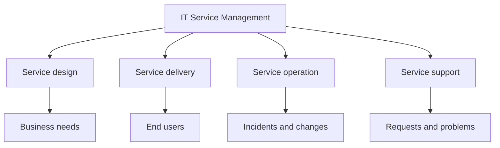

---
aliases:
  - ITSM
date_created: 2026-06-02
date_modified: 2026-06-02
cf_last_run: "2026-06-02T23:16:19.043Z"
cf_last_run_model: "Perplexity sonar-pro"
tags: [Investment-Categories, Explainers]
for_clients:
  - Laerdal
  - Param
  - Tonguc
  - Reach-U
site_uuid: f4e66e69-ba91-407a-a6ba-a738405dd9f4
publish: true
title: "IT Service Management"
slug: it-service-management
at_semantic_version: 0.0.0.1
---
[[Tooling/Enterprise Jobs-to-be-Done/Console|Console]]
[[Tooling/Enterprise Jobs-to-be-Done/Zendesk|Zendesk]]

# Defining and Describing IT Service Management

- _IT Service Management is the discipline of making IT behave like a dependable service, not a pile of disconnected fixes._ [^3kgqnz] [^2wphxj]
- IT Service Management (ITSM) refers to the activities an organization performs to **design, build, operate, and maintain** information technology services for internal and external customers. [^3kgqnz]
- It is commonly described as a **framework** or **playbook** for delivering IT services in ways that align with business needs, improve reliability, and support continuous improvement. [^qana30] [^3kgqnz]
- In practice, ITSM covers structured work such as **incident management**, **problem resolution**, **service request management**, **change management**, and **asset tracking**. [^m6z9qc] [^qana30] [^2wphxj]

# Uses in Context

- ITSM is used to describe a **framework for delivering IT services to customers and employees**. [^qana30]
- It is invoked to emphasize **aligning IT services with business needs** so organizations can improve efficiency, reliability, and continuous improvement. [^qana30] [^3kgqnz]
- Vendors use the term to describe managing **access and availability of services** and streamlining core IT processes. [^m6z9qc]
- In operational settings, ITSM refers to handling **employee service requests through ticketing systems**, **resolving unplanned service disruptions**, and **distributing new hardware or software**. [^qana30]
- ITSM is also used as a broader description of **structured, repeatable processes** that create consistency and accountability across IT support. [^2wphxj]

# History of Use

## Origins

ITSM emerged as an **industry discipline and management approach** rather than a single invention by one company, and modern descriptions consistently frame it as the strategy underlying how organizations deliver IT services. [^a0r6ln] [^3kgqnz] Public-facing explainers now define it in terms of the shift to delivering IT “as a service,” with processes, people, and technology working together. [^a0r6ln] [^3kgqnz]

## Evolution

- **1980s–1990s:** ITSM was shaped by ITIL, which later descriptions characterize as a set of methods, practices, and processes for managing IT operations and services. [^pk1c4q]
- **2000s–2010s:** Vendor platforms popularized ITSM as software-supported service desks and workflow systems, with ServiceNow explicitly tying ITSM to ITIL-aligned management of incidents, problems, changes, requests, and availability. [^m6z9qc]
- **2020s:** ITSM discussions increasingly emphasize automation and AI, with newer explainers describing AI and agentic automation as modernizing the service desk. [^aurgt4] [^781dtu]

# Best Real-World Examples

- [ServiceNow ITSM](https://www.servicenow.com/in/products/itsm.html) — an ITSM platform that aligns with ITIL standards and manages incidents, problems, changes, requests, and availability. [^m6z9qc]
- [Zendesk for employee service](https://www.zendesk.com/blog/employee-service/itsm/what-is-itsm/) — a service-management approach positioned around IT service delivery for customers and employees. [^qana30]
- [Red Hat IT service management](https://www.redhat.com/en/topics/automation/what-is-it-service-management-itsm) — an explanation of ITSM as design, build, operation, and maintenance of IT services. [^3kgqnz]
- [Intel IT service management overview](https://www.intel.com/content/www/us/en/learn/what-is-it-service-management.html) — a business-oriented framing of ITSM as a strategy for streamlining IT service delivery. [^a0r6ln]
- [USU IT Service Management](https://www.usu.com/en/it-service-management) — an AI-powered ITSM suite spanning service design, delivery, operations, and support. [^aurgt4]
- [Automation Anywhere on AI in ITSM](https://www.automationanywhere.com/company/blog/automation-ai/ai-in-itsm) — an example of ITSM being discussed through the lens of automation and AI modernization. [^781dtu]
- [Coursera ITSM Foundations](https://www.coursera.org/learn/itsm-foundations-optimizing-it-service-management) — a learning example showing ITSM as a structured professional discipline. [^s4m2b2]

# Case Studies

[[Tooling/Enterprise Jobs-to-be-Done/ServiceNow]] is a clear example of how ITSM became a software category, not just a management idea. Its product page says ITSM “aligns with ITIL standards” and is used to manage access and availability, fulfill service requests, and “automate core IT processes” around incidents, problems, and changes. [^m6z9qc] That shows how the concept moved from process theory into workflow platforms that standardize service delivery across enterprise IT. [^m6z9qc]

[[Tooling/Enterprise Jobs-to-be-Done/Zendesk|Zendesk]]’s ITSM guide shows the concept in employee-service operations rather than only traditional help desks. It defines ITSM as a framework for delivering services to customers and employees, then gives examples such as ticket-based service requests, outage handling, and hardware or software distribution. [^qana30] This illustrates a broader evolution: ITSM is no longer limited to internal IT support, but is used to coordinate service delivery across the employee experience. [^qana30]

[[Tooling/AI-Toolkit/Agentic AI/Automation Anywhere|Automation Anywhere]]’s ITSM material shows a newer layer of change: AI and agentic automation. The company frames these tools as modernizing the service desk to reduce costs and boost efficiency, which reflects how ITSM is increasingly paired with automation rather than relying only on manual ticket handling. [^781dtu] In concept terms, this shows ITSM adapting from process discipline into a platform for continuous optimization and machine-assisted operations. [^781dtu]

***

# Sources

[^m6z9qc]: [IT Service Management (ITSM) - ServiceNow](https://www.servicenow.com/in/products/itsm.html)
[^qana30]: [What is ITSM? The ultimate IT service management guide - Zendesk](https://www.zendesk.com/blog/employee-service/itsm/what-is-itsm/)
[^a0r6ln]: [What Is IT Service Management (ITSM)? - Intel](https://www.intel.com/content/www/us/en/learn/what-is-it-service-management.html)
[^3kgqnz]: [What is IT service management (ITSM)? - Red Hat](https://www.redhat.com/en/topics/automation/what-is-it-service-management-itsm)
[^2wphxj]: [ITSM Explained: Quick Guide to IT Service Management & ITIL Basics](https://www.youtube.com/watch?v=kYpy2sBfsBU)
[^aurgt4]: [IT Service Management | Enhance Efficiency and Reduce Costs - USU](https://www.usu.com/en/it-service-management)
[^781dtu]: [What is ITSM? IT Service Management Explained](https://www.automationanywhere.com/company/blog/automation-ai/ai-in-itsm)
[8]: [Top 10: IT Service Management Tools (ITSM) | Technology Magazine](https://technologymagazine.com/top10/top-10-it-service-management-tools-itsm)
[^pk1c4q]: [The 5 Pillars of ITSM: A Guide to IT Service Management Best ...](https://www.teamdynamix.com/blog/the-5-pillars-of-itsm-a-guide-to-it-service-management-best-practices/)
[^s4m2b2]: [ITSM Foundations: Optimizing IT Service Management - Coursera](https://www.coursera.org/learn/itsm-foundations-optimizing-it-service-management)
