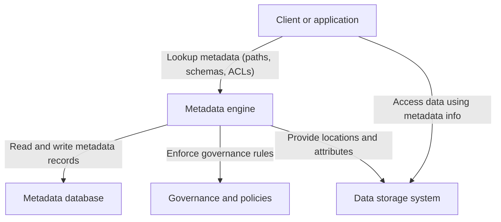

[[Tooling/Enterprise Jobs-to-be-Done/JuiceFS|JuiceFS]]

_“Metadata engines” are the components (or services) that store, index, and serve **metadata** so that filesystems, analytics stacks, or applications can look up “data about data” fast enough to function at scale. [^n83b73] [^byrhp8]_

In practice, a **metadata engine** is a database-backed service or subsystem dedicated to tracking objects, schemas, permissions, and relationships, often separated from the raw data path so different storage or analytics layers can share a common metadata view. [^n83b73] [^byrhp8] They matter wherever you have many data objects (files, tables, models, dashboards) and need low‑latency operations like listing, searching, enforcing access rules, or powering agentic/AI selection of the right asset. [^8t83uw] [^n83b73] [^608qql] As data platforms and AI agents increasingly depend on rich metadata for discovery, governance, and automation, metadata engines have become a core architectural building block rather than an implementation detail. [^8t83uw] [^4hbim5] [^608qql]

# Defining and Describing Metadata Engines

A **metadata engine** is a logical or physical component that stores, manages, and serves **metadata—structured “data about data”**—for a system, typically using a general-purpose database or catalog technology under the hood. [^8t83uw] [^n83b73] In distributed or decoupled systems, the metadata engine is explicitly separated from data storage so that metadata (names, paths, sizes, schemas, ACLs, lineage, and other descriptors) can be managed independently and often shared across multiple services. [^n83b73] [^4hbim5] Vendors and open‑source projects commonly describe the database that holds metadata as the “metadata engine” and provide specific configuration for using key‑value stores, relational databases, or embedded engines in this role. [^n83b73] [^byrhp8]

More broadly, as [[concepts/Explainers for Tooling/Data Catalogs|Data Catalogs]], [[concepts/Explainers for AI/AI‑Ready Data Platforms]], and dynamic discovery tools have evolved, the term “metadata engine” is also used informally to describe the **core service that continuously discovers, enriches, and indexes metadata** so that humans, applications, or AI agents can search, govern, and reason over assets. [^8t83uw] [^4hbim5] [^608qql] In this sense, the metadata engine is not just storage, but the combination of storage, APIs, policies, and sometimes automation that keeps metadata current and usable across an organization. [^4hbim5] [^608qql]

Because the concept is inherently about relationships and indirection, a diagram clarifies the role of a metadata engine within a decoupled storage architecture:

# Uses in Context

- In decoupled or cloud‑native filesystems such as JuiceFS, the **database that stores filesystem metadata** (paths, inodes, attributes, etc.) is explicitly called the **“metadata engine,”** and can be implemented using Redis, TiKV, PostgreSQL, MySQL, SQLite, or other supported databases. [^n83b73] JuiceFS documentation notes that “Metadata can be stored in any supported database (called Metadata Engine).”[^n83b73]

- Within data and analytics platforms, vendors describe a **“metadata engine” or “metadata management system”** as the subsystem that makes metadata “searchable,” adds context, and improves organization, enabling efficient discovery of data assets by humans and AI. [^8t83uw] [^4hbim5] Such engines underpin catalog features like search, lineage, and documentation by storing descriptive, structural, and administrative metadata. [^8t83uw] [^4hbim5]

- Governance and security tooling uses metadata engines to **apply access control and masking policies** based on tags and attributes, with some platforms advocating a “metadata‑driven framework that automatically applies access and masking policies based on predefined tags and user attributes.”[^8t83uw] Here, the metadata engine serves as the policy lookup and enforcement point for sensitive fields.

- Dynamic discovery products describe an underlying **“dynamic metadata discovery”** capability that constantly updates metadata so “an AI agent picks the right” asset and a human can verify the choice. [^608qql] In these contexts, the “engine” is the combination of crawlers, classifiers, and indexers that update metadata in real time. [^608qql]

- Tooling built on SAS’s metadata framework distinguishes between **native engines** that access data directly and the **“Metadata LIBNAME Engine,”** which uses SAS metadata to resolve librefs and enforce metadata‑level authorization. [^byrhp8] In this ecosystem, the “metadata engine” notionally mediates access by consulting a repository of metadata objects and permissions before data is touched. [^byrhp8]

# History of Use

## Origins

- The core idea of a **dedicated metadata layer** predates the phrase “metadata engine” and emerged from early database systems and mainframe catalogs, where catalog tables and directory services stored schema and authorization information separate from raw data. [^4hbim5] Data management histories trace the rise of enterprise **metadata repositories** and data dictionaries to the 1980s and 1990s, when organizations began building centralized stores to document data elements and schemas. [^4hbim5]

- The term **“metadata engine”** appears prominently in documentation for decoupled storage systems such as JuiceFS, which describes its architecture as separating data and metadata, with the latter stored in a pluggable “metadata engine” backed by external databases like Redis or MySQL. [^n83b73] This usage reflects a community practice in distributed filesystems and object stores to name the dedicated metadata service or database layer as an “engine” responsible for all metadata operations. [^n83b73]

- In analytics ecosystems built on SAS, the notion of a **metadata engine** is reflected in the “Metadata LIBNAME Engine,” which accesses metadata objects (libraries, tables) via a metadata server rather than direct data connections, effectively treating metadata access as a distinct engine with its own configuration and authorization model. [^byrhp8]

Because the phrase is descriptive rather than branded, it seems to have arisen independently in multiple technical communities (filesystem design, analytics platforms, and data governance) as a convenient label for the **dedicated subsystem handling metadata operations.**[^n83b73] [^4hbim5] [^byrhp8]

## Evolution

- **1990s–2000s – From repositories to operational metadata services.** As businesses recognized the value of enterprise metadata repositories for supporting data warehousing and governance, metadata management evolved from static documentation to more operational services that could integrate with ETL and BI tools. [^4hbim5] This shift laid the groundwork for treating metadata storage and access as a first‑class engine rather than passive documentation. [^4hbim5]

- **2010s – Decoupled storage architectures and pluggable metadata engines.** With the rise of cloud‑native and decoupled filesystems, projects like JuiceFS explicitly separated metadata from data and allowed multiple databases to serve as the **metadata engine**, emphasizing pluggability, performance, and scale. [^n83b73] Documentation details how Redis, TiKV, PostgreSQL, and MySQL can each be configured as metadata engines, with different performance and storage characteristics. [^n83b73]

- **Late 2010s–2020s – AI‑ and governance‑driven metadata engines.** Modern data platforms frame metadata as essential for AI and governance, with guidance that “metadata is data about your data” and is required so that AI agents can interpret information and provide relevant responses. [^8t83uw] Dynamic metadata discovery tools describe engines that continuously update metadata so AI and humans can reliably select the right assets, while governance frameworks lean on metadata‑driven engines to automatically apply policies and ensure compliance. [^8t83uw] [^4hbim5] [^608qql]

# Best Real-World Examples

- [JuiceFS](https://juicefs.com/docs/community/databases_for_metadata/) – A decoupled filesystem that explicitly defines its pluggable database back‑end (Redis, TiKV, PostgreSQL, MySQL, SQLite, BadgerDB) as the **metadata engine** responsible for all filesystem metadata operations. [^n83b73]

- [SAS Metadata LIBNAME Engine](https://documentation.sas.com/doc/en/bidsag/9.4/n0dyqm6uiptmx0n10c1wuuiavuqh.htm) – A SAS engine that accesses libraries and tables via the SAS Metadata Server, using metadata objects and metadata authorization as the primary interface rather than direct data connections. [^byrhp8]

- [Atlan dynamic metadata discovery](https://atlan.com/know/dynamic-metadata-discovery/) – A modern data platform capability that functions as a **metadata engine** by continuously discovering and updating metadata so AI agents and humans can “pick the right” assets, keeping catalogs current. [^608qql]

- [Salesforce Data Cloud metadata framework](https://www.salesforce.com/data/what-is-metadata/) – An enterprise data platform that emphasizes metadata‑driven organization, governance, and AI access, using metadata to make data “searchable,” add context, and drive automated policy application. [^8t83uw]

- [Huwise metadata governance practice](https://www.huwise.com/en/blog/what-is-metadata-and-why-is-it-important-data/) – A consultancy perspective that treats metadata as “just as important as the data itself,” highlighting the role of metadata engines in optimal searchability, understanding, and data governance in modern organizations. [^saarh1]

# Case Studies

### 1. JuiceFS: Pluggable Metadata Engines in a Decoupled Filesystem

JuiceFS is a distributed filesystem designed with a **decoupled structure that separates data and metadata**, allowing metadata to be stored in an external database referred to as the **metadata engine**. [^n83b73] Its documentation explains that “Metadata can be stored in any supported database (called Metadata Engine),” and lists Redis, TiKV, PostgreSQL, MySQL, SQLite, and BadgerDB among the supported options. [^n83b73] For example, using BadgerDB as the metadata storage engine involves specifying a `badger://` URL, while using SQLite requires a URL such as `sqlite3:///home/herald/my-jfs.db` when mounting the filesystem. [^n83b73] By abstracting metadata operations behind a pluggable engine, JuiceFS lets operators trade off performance, durability, and operational complexity (e.g., in‑memory Redis vs. durable PostgreSQL) without changing filesystem semantics. [^n83b73] This case illustrates a **pure infrastructure interpretation** of a metadata engine: a configurable, database‑backed service that must deliver low‑latency, consistent metadata operations to keep a distributed filesystem viable at scale. [^n83b73]

### 2. SAS Metadata LIBNAME Engine: Metadata‑Mediated Access and Authorization

In the SAS ecosystem, the **Metadata LIBNAME Engine** provides a concrete example of a metadata engine mediating access to data through a metadata repository and server. [^byrhp8] SAS distinguishes between **native engines**, which access underlying data directly, and the Metadata LIBNAME Engine, which resolves libraries and tables via metadata objects stored on a SAS Metadata Server. [^byrhp8] Documentation emphasizes that the SAS metadata layer “provides a metadata authorization layer that enables you to control which users can access which metadata objects,” such as libraries and tables, with the Metadata LIBNAME Engine enforcing these controls when users assign librefs through metadata. [^byrhp8] This architecture shows a different facet of metadata engines: rather than focusing on filesystem‑like path operations, the engine here is central to **governance and indirection**, ensuring that all access passes through a metadata‑aware layer that can enforce policies independent of the physical data sources. [^byrhp8]

### 3. Dynamic Metadata Discovery for AI‑Ready Data Platforms

Modern data platforms oriented toward AI and self‑service analytics use dynamic discovery tools that effectively act as **metadata engines** for the organization. [^8t83uw] [^4hbim5] [^608qql] Atlan, for example, describes “dynamic metadata discovery” that “keeps assets current so an AI agent picks the right one and a human can verify what the agent picked,” emphasizing continuous crawling and updating of metadata across systems. [^608qql] In parallel, guidance from enterprise data providers stresses that metadata “provides essential context and structure to data, making it easier to find, manage, and understand,” and that AI agents need high‑quality metadata to generate reliable outputs such as insights and recommendations. [^8t83uw] These practices show metadata engines evolving beyond static repositories into **active services** that discover, enrich, and index metadata in near real time, serving both human users and AI agents that rely on metadata for asset selection, compliance, and interpretation. [^8t83uw] [^4hbim5] [^608qql]

***

# Sources

[1]: [Metadata.io](https://metadata.io)
[^8t83uw]: [What Is Metadata: Definition, Types, & Uses - Salesforce](https://www.salesforce.com/data/what-is-metadata/)
[^n83b73]: [How to Set Up Metadata Engine | JuiceFS Document Center](https://juicefs.com/docs/community/databases_for_metadata/)
[^4hbim5]: [The Evolution and Role of Metadata Management - EWSolutions](https://www.ewsolutions.com/metadata-history/)
[^saarh1]: [What is metadata and why is it as important as the data itself? - Huwise](https://www.huwise.com/en/blog/what-is-metadata-and-why-is-it-important-data/)
[^608qql]: [Dynamic Metadata Discovery: How It Works, Use Cases, Setup - Atlan](https://atlan.com/know/dynamic-metadata-discovery/)
[^byrhp8]: [Understanding Native Engines and the Metadata LIBNAME Engine](https://documentation.sas.com/doc/en/bidsag/9.4/n0dyqm6uiptmx0n10c1wuuiavuqh.htm)
