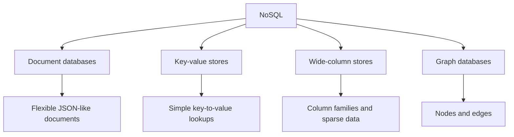

https://youtu.be/TPl45z8jdwg?is=caBNDWJ7Zrwj0ZHA

# Defining and Describing NoSQL

_NoSQL is best understood as a family of database approaches that reject a single rigid table model in favor of flexibility, scale, and fit-for-purpose design._ [^pnp1ee][^bv91i7][^chnet9]

NoSQL is commonly used as an umbrella term for non-relational databases, though some sources note that it is more accurately read as “Not Only [[projects/Emergent-Innovation/Standards/SQL|SQL]]” rather than “Non-SQL.” [^semgr3][^bv91i7] It typically applies when data is semi-structured or unstructured, when schemas need to be flexible, or when horizontal scaling matters more than strict relational modeling. [^pnp1ee][^nnl78i][^chnet9] In practice, NoSQL systems are chosen for application workloads that need rapid development, distributed storage, or data models that do not map cleanly to rows and tables. [^pnp1ee][^semgr3][^bv91i7]

# Uses in Context

- NoSQL is invoked to describe databases that manage “structured, semi-structured, and unstructured data” with “flexible schemas” and “high scalability.” [^pnp1ee]
- Vendors use the term when contrasting systems that do not rely on “fixed tables” or “predefined schemas” with relational databases. [^pnp1ee]
- NoSQL is often framed as an alternative to, not a replacement for, SQL; one source quotes the “Golden Rule” that “NoSQL isn’t a replacement for SQL.” [^semgr3]
- It is used to justify architectural choices such as “horizontal scaling” for “modern, data-intensive applications.” [^pnp1ee]
- In database guidance, NoSQL appears as shorthand for “non-relational” designs that include document, key-value, column, and graph models. [^nnl78i][^chnet9]
- In cloud product documentation, NoSQL is invoked in the context of modeling “self-contained items” as JSON documents and deciding when embedded versus normalized structures are appropriate. [^k5mo9d]

# History of Use

## Origins

NoSQL emerged as a label for database systems that departed from the classic relational model, and later commentary explains the term as “Not Only SQL” rather than simply “Non-SQL.” [^semgr3][^bv91i7] Contemporary explanatory sources trace the concept to the need for flexible, scalable data management outside rigid table structures, especially for systems handling diverse data types and distributed workloads. [^pnp1ee][^bv91i7]

## Evolution

- By the time of modern NoSQL explainers, the term had broadened from a narrow “non-relational” label to a family of database models including document, key-value, column, and graph systems. [^semgr3][^nnl78i][^chnet9]
- Cloud-era documentation reframed NoSQL design around data modeling tradeoffs, emphasizing “self-contained items” in document databases and choosing embedded versus normalized modeling based on relationship shape and growth. [^k5mo9d]
- Vendor and educational sources increasingly tied NoSQL to operational needs such as “horizontal scaling,” “high scalability,” and frequent querying of data stored together. [^k5mo9d][^pnp1ee]

# Best Real-World Examples

- [MongoDB](https://www.mongodb.com/) — [[Tooling/Enterprise Jobs-to-be-Done/MongoDB|MongoDB]] — a document database often used as a canonical NoSQL example in practice. [^nnl78i][^chnet9]
- [Apache Cassandra](https://cassandra.apache.org/) — [[Tooling/Software Development/Databases/Cassandra|Cassandra]] — a wide-column NoSQL database associated with distributed scale. [^nnl78i][^chnet9]
- [Redis](https://redis.io/) — [[Tooling/Software Development/Databases/Redis|Redis]] — a key-value system commonly used for fast lookups and caching-style workloads. [^nnl78i][^chnet9]
- [Neo4j](https://neo4j.com/) — [[Tooling/Software Development/Databases/Neo4j|Neo4j]] — a graph database used for highly connected data. [^semgr3][^nnl78i]
- [Azure Cosmos DB](https://learn.microsoft.com/en-us/azure/cosmos-db/) — [[CosmosDB]] — Microsoft’s cloud database service documents NoSQL-style modeling with self-contained JSON items. [^k5mo9d]
- [Reltio](https://www.reltio.com/) — uses NoSQL storage in entity-history workflows that require low-latency handling of records. [^u8sa3h]
- [MySQL](https://www.mysql.com/) — not a NoSQL database itself, but repeatedly appears in comparisons as a representative relational alternative. [^semgr3][^bv91i7]

# Case Studies

MongoDB illustrates how NoSQL became useful for product teams that wanted a flexible document model instead of fixed relational rows. Educational overviews describe NoSQL document databases as using flexible schemas and handling diverse data types, which helps explain why document stores became a default NoSQL pattern for application data that changes over time. [^pnp1ee][^nnl78i][^chnet9] In this framing, the concept shows that schema flexibility is not just a technical preference but a design choice for faster iteration and better fit to application objects. [^pnp1ee][^semgr3]

Azure Cosmos DB shows how large cloud platforms popularized NoSQL modeling without originating the underlying idea. Microsoft documentation advises treating entities as “self-contained items” in JSON documents and choosing embedded data when relationships are contained, one-to-few, infrequently changing, and frequently queried together. [^k5mo9d] The same guidance recommends normalized models for one-to-many or many-to-many relationships and for data that changes frequently or grows without bound, which shows how NoSQL is often less about abandoning structure than about selecting the right structure for the workload. [^k5mo9d]

[[Reltio]]’s entity-history workflow shows a more operational NoSQL use case: storing and retrieving changing records with low-latency requirements. Its support documentation explicitly says entity history uses a NoSQL database technology that provides low-latency storage behavior. [^u8sa3h] This example shows how NoSQL is used in systems where responsiveness and update handling matter more than traditional relational joins. [^u8sa3h]

***

# Sources

[^k5mo9d]: [Data Modeling - Azure Cosmos DB - Microsoft Learn](https://learn.microsoft.com/en-us/azure/cosmos-db/modeling-data)
[^pnp1ee]: [Introduction to NoSQL - GeeksforGeeks](https://www.geeksforgeeks.org/nosql/introduction-to-nosql/)
[^semgr3]: [Introduction to NoSQL - by David Andrés - Machine Learning Pills](https://mlpills.substack.com/p/issue-126-what-is-nosql)
[^bv91i7]: [What Is NoSQL in Database Design? - Cloudera](https://www.cloudera.com/resources/faqs/a-guide-to-nosql.html)
[^nnl78i]: [SQL vs. NoSQL: Differences, Advantages, and Uses - Pandora FMS](https://pandorafms.com/blog/nosql-vs-sql-key-differences/)
[^u8sa3h]: [FAQ about Entity History - Reltio Support](https://support.reltio.com/hc/en-us/articles/34702915493901-FAQ-about-Entity-History)
[^chnet9]: [Relational Vs Non-Relational Databases: When To Use Each](https://www.thoughtspot.com/data-trends/data-modeling/relational-vs-non-relational-databases)
