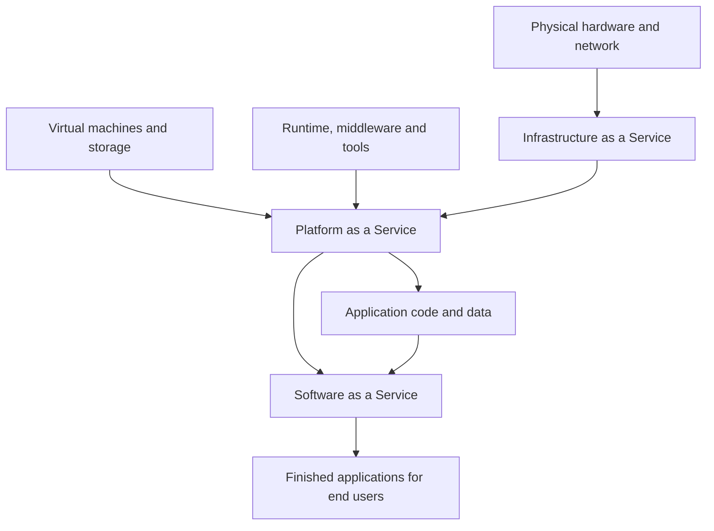

---
aliases:
  - platform-as-a-service
  - PaaS
date_created: 2026-08-21
date_modified: 2026-08-23
cf_last_run: 2026-08-23T06:32:34.874Z
cf_last_run_model: Perplexity sonar-pro
tags:
  - DevOps
  - Developer-Experience
  - Cloud-Infrastructure
---
:::tool-showcase
- [[Tooling/Software Development/Cloud Infrastructure/Vercel|Vercel]]
- [[Vocabulary/Infrastructure as a Service|Infrastructure as a Service]]
- [[Vocabulary/Data Centers|Data Centers]]
- [[Tooling/Software Development/Cloud Infrastructure/Google Cloud|Google Cloud]]
- [[Tooling/Software Development/Cloud Infrastructure/Azure|Microsoft Azure]]
- [[Tooling/Software Development/Cloud Infrastructure/Amazon Web Services|Amazon Web Services]]
- [[Tooling/Software Development/Cloud Infrastructure/Netlify|Netlify]]
- [[Tooling/Software Development/Cloud Infrastructure/Cloudflare|Cloudflare]]
:::

*Platform-as-a-Service turns “deploying software” from a hardware chore into an opinionated online platform where you ship code and let someone else run everything underneath. [^vv9orl] [^rlpa3m]*

Platform-as-a-Service (PaaS) is a **cloud computing model** in which a provider delivers a complete, pre-configured environment for developing, testing, deploying, and scaling applications while hiding the underlying servers, storage, networking, and much of the system software from the user. [^vv9orl] [^rlpa3m] [^bs7ayl] [^ug3zlp] [^2ic8dx] In this model, developers focus on application code and data, while the PaaS provider manages operating systems, runtimes, middleware, and often databases and DevOps tooling. [^rlpa3m] [^qucc0v] [^ug3zlp] [^2ic8dx] [^83o2gh] PaaS matters because it shortens the software delivery lifecycle, reduces operational overhead, and standardizes deployment practices, enabling smaller teams and startups to ship reliable services without building their own infrastructure stacks. [^rlpa3m] [^bs7ayl] [^83o2gh] [^3klhp3] It sits conceptually between Infrastructure-as-a-Service (IaaS), where teams manage virtual machines and OS layers, and Software-as-a-Service (SaaS), where they simply consume finished applications. [^rlpa3m] [^ug3zlp] [^2ic8dx]

# Defining and Describing Platform-as-a-Service

Platform-as-a-Service (PaaS) is commonly defined as a **managed application platform** delivered over the cloud that includes runtime environments, language frameworks, middleware, and development tools so that teams can build, deploy, and run applications without managing the underlying infrastructure. [^vv9orl] [^rlpa3m] [^qucc0v] [^ug3zlp] [^2ic8dx] [^83o2gh] Several technical explainers emphasize that PaaS “provides a complete, pre-configured, and managed cloud environment that allows developers to build, test, deploy, and scale applications without the burden of managing the underlying infrastructure.” [^vv9orl] Other sources describe PaaS as “a managed platform layer that hosts application runtimes, services, and development tooling,” typically including deployment, scaling, logging, networking configuration, and service bindings. [^rlpa3m] [^qucc0v]

In cloud reference models, PaaS is specifically identified as a **delivery model** where the consumer can “develop, test, debug, deploy and manage” applications on an environment already configured by the provider, rather than provisioning compute resources directly. [^bs7ayl] [^fp4m4j] Guides aimed at practitioners explain that PaaS “gives developers a ready-made environment to build, deploy and run applications without managing the servers, storage or networking underneath,” with the provider running the infrastructure and bundling the operating system, runtime, middleware, tools, and often a database. [^ug3zlp] Another description characterizes PaaS as “a pre-packaged combination of cloud computing hardware and software tools that let you develop and deploy applications with ease.” [^83o2gh]

Conceptually, PaaS is often framed as **the middle layer in cloud service taxonomies**, where IaaS exposes virtualized infrastructure and SaaS exposes complete applications, while PaaS exposes a development and runtime platform: a customer “only handles the application code and the data,” with runtime, OS, and scaling already configured by the provider. [^3p300l] Security-focused descriptions stress that PaaS is designed “to help organizations build and deploy software applications on scalable infrastructure,” while leaving responsibility for application logic and data security with the customer. [^2rblgm] Collectively, these definitions converge on the idea that PaaS abstracts and automates infrastructure provisioning, runtime configuration, and much of the DevOps workflow to streamline application lifecycle management for developers and delivery teams. [^vv9orl] [^rlpa3m] [^qucc0v] [^bs7ayl] [^ug3zlp] [^2ic8dx] [^83o2gh] [^fp4m4j]

# Uses in Context

- In technical documentation and tutorials, PaaS is invoked to describe a **development-centric cloud model**, where “PaaS provides a complete environment for developing, running, and managing applications without the complexity of building and maintaining the infrastructure typically associated with developing and launching an app.” [^2ic8dx]
- Practitioner guides use the term to clarify responsibility boundaries, explaining that in PaaS “you manage your application code and data, while the cloud provider manages the underlying operating systems, hardware, network, and middleware.” [^2ic8dx]
- Business-focused descriptions talk about PaaS as a **sales or subscription model**, stating that “Platform as a service (PaaS) is a sales model in which the customer buys virtual access to the servers and infrastructure they need to design and deploy apps,” while the provider manages the cloud platform. [^fp4m4j]
- Cloud overviews explicitly situate PaaS in **cloud service taxonomies**, introducing sections titled “PaaS — Platform as a Service” and defining it as a provider delivering “a development and runtime platform with the runtime, operating system, and automatic scaling already configured,” where the customer “only handles the application code and the data.” [^3p300l]
- Security and IT operations materials use the term to emphasize managed scalability and shared responsibility, describing PaaS as a service “designed to help organizations build and deploy software applications on scalable infrastructure,” where infrastructure management rests with the provider. [^2rblgm]
- Developer-oriented histories invoke PaaS when recounting specific platforms, such as describing Heroku as “a platform-as-a-service (PaaS) that lets developers deploy a web application by running `git push heroku main`, with no server administration,” highlighting PaaS as a deployment model defined by developer experience. [^3klhp3] [^7ce9bn] [^lj056z]

# History of Use

## Origins

Discussion of PaaS emerges in the broader context of **cloud computing terminology** that coalesced in the mid-2000s, following the popularization of the term “cloud computing” in 2006. [^3p300l] Historical retrospectives attribute the modern sense of “cloud computing” to a 2006 talk by Eric Schmidt, then CEO of Google, at the Search Engine Strategies Conference, where he said, “we call it cloud computing — they should be in a cloud somewhere,” and note that PaaS later became one of the standard service categories within this framework. [^3p300l] General cloud guides describe PaaS as one of three primary service models (alongside IaaS and SaaS), in which the provider delivers a “development and runtime platform” with runtime, OS, and scaling configured, suggesting that the PaaS label crystallized as industry and academic communities formalized these layered models. [^3p300l]

Because many mainstream PaaS products appeared as **startup offerings**, subsequent explainers tend to illustrate the term using early independent platforms rather than large incumbent providers. [^3klhp3] [^7ce9bn] Histories of Heroku, founded in June 2007 by James Lindenbaum, Adam Wiggins, and Orion Henry, describe it as a platform-as-a-service that allowed developers to deploy Ruby web applications by simply pushing code, indicating that the PaaS concept was closely tied to developer-centric deployment automation in the late 2000s. [^3klhp3] [^7ce9bn] [^lj056z]

## Evolution

- **Late 2000s — Early web application PaaS platforms.** Histories of Heroku recount that it was founded in 2007 and launched commercially with Ruby support in 2009, offering a platform-as-a-service where “you ran git push and Heroku built, packaged, and ran your web application on managed servers,” turning deployment from a multi-day operations task into a single command. [^3klhp3] [^7ce9bn] [^lj056z] [^x6i1ow] These narratives characterize Heroku’s developer-first model as a template that many later application platforms adopted, indicating an early evolution of PaaS toward *opinionated* workflows rather than just raw infrastructure. [^3klhp3] [^x6i1ow]
- **2010s — PaaS as a standard cloud category and managed layer.** Cloud computing guides from this period formalized PaaS as the intermediate layer between IaaS and SaaS, describing it as “a managed platform layer that hosts application runtimes, services, and development tooling” and emphasizing features like automatic scaling, service bindings, and integrated logging. [^rlpa3m] [^qucc0v] [^bs7ayl] [^ug3zlp] [^2ic8dx] [^3p300l] Over time, definitions broadened to include multiple language runtimes, containers, and integrated DevOps pipelines, with PaaS framed as a delivery model that “abstracts and automates infrastructure provisioning, runtime environment, middleware, and development tools” for application lifecycle management. [^rlpa3m] [^qucc0v] [^bs7ayl]
- **2020s — Expanded scope and hybrid PaaS patterns.** Recent explainers portray PaaS not only as a public cloud service but as a pattern that can span hybrid and multi-cloud environments, still defined by providing “a complete, pre-configured, and managed cloud environment” for building and scaling apps. [^vv9orl] [^bs7ayl] [^ug3zlp] [^2ic8dx] Security and business-oriented discussions highlight PaaS as a way to adopt cloud-native practices, focusing on managed scalability and shared responsibility models, while historical articles on platforms like Heroku describe how their original PaaS experiences are being adapted or reinvented for contemporary workloads. [^2rblgm] [^3klhp3] [^7ce9bn] [^x6i1ow]

# Best Real-World Examples

- **[Heroku](https://ai-solutions.wiki/history/heroku/)** — A platform-as-a-service that lets developers deploy web applications via `git push`, with the platform building, packaging, and running code on managed servers, initially launched commercially with Ruby support in 2009 and widely cited as a template for modern app platforms. [^3klhp3] [^7ce9bn] [^lj056z] [^x6i1ow]
- **[Azin Platform (Azin’s Heroku-compatible environment)](https://azin.run/blog/what-is-heroku)** — An independent platform discussed in the context of Heroku’s model, where Heroku’s sustain-mode status has encouraged compatible PaaS offerings that replicate the “push your code, get a URL” developer experience without server management. [^7ce9bn]
- **[Cloudfluently PaaS guidance](https://cloudfluently.com/blog/what-is-platform-as-a-service-paas)** — Though primarily an educational resource, it exemplifies PaaS usage by describing environments that deliver a “complete development and deployment environment in the cloud” where teams manage code and data while providers manage OS, hardware, network, and middleware. [^2ic8dx]
- **[OpenLegacy PaaS examples](https://www.openlegacy.com/blog/platform-as-a-service-examples)** — Illustrates PaaS in the context of integrating legacy systems, describing managed application platforms and runtimes delivered over the cloud so teams can build, deploy, and run apps while infrastructure is provider-managed. [^qucc0v]
- **[DevOpsSchool PaaS practices](https://devopsschool.org/blog/paas/)** — Highlights real-world PaaS usage patterns focusing on managed platform layers that host runtimes, services, and DevOps tooling, including app deployment, scaling, logging, and network configuration, all exposed via APIs and deployment models. [^rlpa3m]
- **[Cloudwards PaaS solution overviews](https://www.cloudwards.net/what-is-paas/)** — Surveys multiple PaaS offerings as “delivery models that offer pre-configured environments” for the software development lifecycle, illustrating how these platforms streamline development, testing, debugging, deployment, and management across providers. [^bs7ayl]
- **[Amnic PaaS in cloud computing](https://amnic.com/blogs/what-is-platform-as-a-service-in-cloud-computing)** — Uses concrete examples of “ready-made environments” that bundle OS, runtime, middleware, development tools, and managed databases to show how businesses adopt PaaS for application delivery without managing physical infrastructure. [^ug3zlp]

# Case Studies

## Heroku’s “git push” model and the reshaping of web deployment

Histories of Heroku describe it as a platform-as-a-service that fundamentally changed how developers deploy web applications by letting them “deploy a web application by running `git push heroku main`, with no server administration.” [^3klhp3] Founded in June 2007 by James Lindenbaum, Adam Wiggins, and Orion Henry, Heroku initially focused on Ruby and launched commercially with Ruby support in 2009, offering a platform that built, packaged, and ran applications on managed servers when developers pushed code. [^3klhp3] [^7ce9bn] [^lj056z] Retrospective articles characterize this as turning deployment from a “multi-day operations task into a single command,” emphasizing how the PaaS model shifted responsibility for provisioning, scaling, and deployment from operations teams to an automated platform. [^3klhp3] [^x6i1ow] Salesforce acquired Heroku in 2010, and commentators note that its developer-first PaaS model became a template that many later application platforms adopted, illustrating how an independent PaaS innovator influenced broader cloud and DevOps practices by popularizing opinionated workflows rather than raw infrastructure access. [^3klhp3] [^lj056z] [^x6i1ow]

## PaaS as a managed layer between infrastructure and applications

Educational resources and practitioner guides use composite scenarios to show how organizations adopt PaaS as a **managed layer** between infrastructure and applications. [^vv9orl] [^rlpa3m] [^qucc0v] [^bs7ayl] [^ug3zlp] [^2ic8dx] [^3p300l] In these narratives, a development team building a new web or API service chooses a PaaS that provides a “complete, pre-configured, and managed cloud environment” with runtimes, middleware, and tools, allowing them to build, test, deploy, and scale applications without managing underlying servers. [^vv9orl] [^bs7ayl] [^ug3zlp] The team is responsible for application code and data, while the provider manages operating systems, hardware, networking, and often managed databases, aligning with the framing that “you manage your application code and data, while the cloud provider manages the underlying operating systems, hardware, network, and middleware.” [^ug3zlp] [^2ic8dx] Security and infrastructure documents describe this arrangement as enabling organizations to “build and deploy software applications on scalable infrastructure” while delegating much of the operational complexity and capacity planning to the PaaS provider. [^2rblgm] These examples demonstrate how PaaS is used as a practical pattern for accelerating delivery, enforcing consistent deployment pipelines, and adopting cloud-native practices without fully adopting raw infrastructure management. [^rlpa3m] [^qucc0v] [^bs7ayl] [^ug3zlp] [^2ic8dx] [^3p300l]

## Cloud-native education and the codification of PaaS patterns

Contemporary tutorials and explainer articles play a significant role in codifying how PaaS is understood and implemented, particularly for teams transitioning from traditional hosting to cloud-native architectures. [^vv9orl] [^rlpa3m] [^qucc0v] [^bs7ayl] [^ug3zlp] [^2ic8dx] [^3p300l] Step-by-step guides describe PaaS as “a managed platform layer that hosts application runtimes, services, and development tooling,” often highlighting features such as automatic scaling, application logs, and service bindings to illustrate typical developer workflows. [^rlpa3m] [^qucc0v] Cloud overviews present PaaS in structured sections alongside IaaS and SaaS, explaining that the provider delivers a “development and runtime platform” with runtime, OS, and scaling configured so that the customer “only handles the application code and the data,” embedding PaaS into canonical cloud taxonomies. [^3p300l] Security-focused explainers reinforce the pattern by describing PaaS as a service “designed to help organizations build and deploy software applications on scalable infrastructure,” highlighting shared responsibility between provider-managed platform components and customer-managed application logic. [^2rblgm] Collectively, these educational case studies show how PaaS has evolved into a widely taught and standardized model for building, deploying, and operating applications in the cloud, influencing both tool design and organizational practices. [^vv9orl] [^rlpa3m] [^qucc0v] [^bs7ayl] [^ug3zlp] [^2rblgm] [^2ic8dx] [^3p300l]

***

# Sources

[^vv9orl]: [Platform As A Service (PaaS) and its Types](https://www.geeksforgeeks.org/cloud-computing/platform-as-a-service-paas-and-its-types/)
[^rlpa3m]: [What is PaaS? Meaning, Examples, Use Cases, and How to use it ...](https://devopsschool.org/blog/paas/)
[^qucc0v]: [What Is Platform as a Service (PaaS)? [Types, Benefits & ...](https://www.openlegacy.com/blog/platform-as-a-service-examples)
[^bs7ayl]: [What Is PaaS? Platform as a Service Explained in 2026](https://www.cloudwards.net/what-is-paas/)
[^ug3zlp]: [What Is Platform as a Service (PaaS) in Cloud Computing?](https://amnic.com/blogs/what-is-platform-as-a-service-in-cloud-computing)
[^2rblgm]: [What is Platform-as-a-Service (PaaS)](https://www.bitdefender.com/en-us/business/infozone/what-is-platform-as-a-service-paas)
[^2ic8dx]: [What is Platform as a Service (PaaS)?](https://cloudfluently.com/blog/what-is-platform-as-a-service-paas)
[^83o2gh]: [What Is PaaS? How Platform as a Service is Different from ...](https://kinsta.com/blog/what-is-paas/)
[^fp4m4j]: [What Is Paas Used For?](https://www.zendesk.com/blog/customer-service/support/what-is-paas/)
[^3klhp3]: [Heroku: The Git Push That Replaced the Server](https://ai-solutions.wiki/history/heroku/)
[^7ce9bn]: [What Is Heroku? History, How It Works, and What Sustain Mode Means in 2026 — Azin Blog](https://azin.run/blog/what-is-heroku)
[^lj056z]: [Heroku and the Twelve-Factor App with Vish Abrams - Software Engineering Daily](https://softwareengineeringdaily.com/podcasts/heroku-and-the-twelve-factor-app-with-vish-abrams/)
[13]: [Herokuとは？特徴・歴史・今でも使えるのかをわかりやすく解説](https://lancetier.co.jp/blogs/bni70uww2vln)
[^3p300l]: [What the cloud is: definition, IaaS, PaaS, and SaaS](https://polimake.com/en-us/kb/que-es-la-nube)
[^x6i1ow]: [Heroku's Reinvention Gambit: How Salesforce's Once- ...](https://www.webpronews.com/herokus-reinvention-gambit-how-salesforces-once-dominant-cloud-platform-is-betting-everything-on-a-comeback/)
