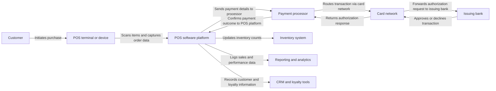

# Point-of-Sale Platforms

Point-of-sale platforms are integrated combinations of hardware, software, and networked services that allow businesses to process transactions, capture sales data, manage inventory, and orchestrate broader financial and operational workflows at the moment and place of purchase. [^3yccid] [^jfzz9n] [^16busp] [^e8ps8d] [^wyxgh2] In contemporary commerce, these platforms have evolved from simple cash registers into cloud-connected, omnichannel hubs that bridge in‑store, online, and mobile sales while deeply integrating with payment processors, banking systems, and fintech services. [^jfzz9n] [^790x3g] [^sh4eny] [^e8ps8d] [^wyxgh2] [^ahxr6k] As such, point-of-sale platforms sit at the intersection of retail operations and financial technology, shaping how value is exchanged, recorded, and analyzed across modern economies. [^16busp] [^z3d2zl] [^e8ps8d] [^wyxgh2]

## Defining and Describing Point-of-Sale-Platforms

_At its core, a point-of-sale platform is the “operational hub of your entire store,” turning every checkout into a real-time event in your financial, inventory, and customer data systems. [^jfzz9n] [^yrklb7] [^wyxgh2]_

A point-of-sale platform is best understood as a specialized technology stack that combines point-of-sale software, payment devices, and supporting infrastructure to calculate what a customer owes, accept payment, and synchronize business data whenever a transaction occurs. [^3yccid] [^jfzz9n] [^16busp] [^wyxgh2] The U.S. Chamber of Commerce describes a point-of-sale system as the "software and hardware that small businesses use at checkout," noting that it "processes payments, captures sales data, and syncs inventory in real time." [^3yccid] Similarly, Adyen defines the point of sale as "the physical location and technology where a customer completes a transaction for goods or services," emphasizing that a POS system manages inventory, tracks customer data, and "integrates with other business software" beyond basic cash handling. [^jfzz9n] In fintech glossaries, point of sale refers to systems used by retailers to process card or cash transactions, capturing real-time information about product quantities, prices, and customer details, which frames POS platforms as data engines as much as payment tools. [^16busp] Shopify’s retail perspective pushes this further, describing a POS system as "the central hub for running your retail operations," encompassing not just payment processing but inventory tracking, customer databases, marketing capabilities, and staff management. [^wyxgh2] Taken together, these descriptions underscore that point-of-sale platforms are multi-function, data-rich systems that mediate the moment of payment while serving as key nodes in a business’s digital infrastructure. [^3yccid] [^jfzz9n] [^16busp] [^wyxgh2]

Point-of-sale platforms differ from traditional cash registers in both scope and architecture. A cash register is typically a standalone mechanical or electronic device that records sales totals and stores cash securely, functioning essentially as a "bulky calculator" devoted to ringing up sales, printing receipts, and managing a cash drawer. [^g1qn72] By contrast, modern POS platforms interlink multiple components, including terminals or tablets, card readers, receipt printers, cash drawers, and cloud-based software that synchronizes sales, inventory, and customer data across locations and channels. [^jfzz9n] [^790x3g] [^yrklb7] [^g1qn72] [^wyxgh2] Shopline notes that POS systems "automate inventory updates with every transaction, accept diverse payment methods, and generate real-time analytics," while connecting physical storefronts with ecommerce operations through shared data layers. [^g1qn72] This integrated architecture means that each transaction triggers workflows across inventory management systems, [[Vocabulary/CRM|Customer Relationship Management]] databases, accounting tools, and reporting dashboards, often without any manual intervention. [^jfzz9n] [^yrklb7] [^e8ps8d] [^wyxgh2] As a result, point-of-sale platforms have become central to [[concepts/Explainers for Tooling/Back Office|back-office]] operations as well as front-of-house customer interactions.

A defining feature of point-of-sale platforms is their ability to operate across multiple environments and devices. Cloud-based POS platforms run online rather than on local servers, hosting sales and business data on secure remote infrastructure that can be accessed from any internet-connected device. [^790x3g] Square emphasizes that a "cloud POS" lets businesses process payments without "clunky and expensive servers, or pricy software that requires an upgrade every few months," instead relying on web-based software that automatically updates and backs up data. [^790x3g] Because cloud POS software can run on tablets and smartphones, point-of-sale platforms can extend beyond fixed countertop terminals to mobile form factors, making them well-suited for food trucks, home repair services, and market stalls that need to accept payments on the move. [^790x3g] [^4wn950] [^7zquvy] [^wyxgh2] This mobility, combined with centralized cloud data, allows a single platform to unify transactions from physical stores, pop-up events, and online channels, providing retailers and service businesses with a consolidated view of their operations. [^jfzz9n] [^790x3g] [^sh4eny] [^wyxgh2] [^ahxr6k]

The term "platform" in this context highlights extensibility and integration rather than a single monolithic product. Adyen explicitly notes that modern POS systems connect to backend systems "through a POS API" to track inventory, collect customer data for loyalty programs, and generate financial reports. [^jfzz9n] Evincedev’s analysis of POS payment software development similarly emphasizes integration layers that connect POS applications to payment gateways, banking systems, lending services, and other fintech solutions for functions such as buy-now-pay-later (BNPL), instant settlement, and merchant analytics. [^e8ps8d] [^hm199m] Shopify’s commerce stack illustrates the platform concept by positioning Shopify POS as one component in a broader omnichannel environment that includes ecommerce, CRM, and marketing applications, all unified through shared customer and inventory data. [^wyxgh2] [^ahxr6k] Voyado’s overview of omnichannel commerce platforms reinforces this, arguing that the best solutions connect smoothly with enterprise resource planning (ERP), POS, and CRM systems to ensure consistent customer experiences and centralized data management across online and offline channels. [^ahxr6k] In practice, this means that point-of-sale platforms provide APIs, app marketplaces, and native integrations that allow third-party services—ranging from loyalty programs to accounting tools—to plug into transaction flows and business records.

From a functional standpoint, modern point-of-sale platforms support a broad array of tasks that extend far beyond payment authorization. They calculate totals and taxes, apply promotions or loyalty rewards automatically, and accept diverse payment methods including cash, chip cards, swipe cards, contactless taps, and mobile wallets. [^jfzz9n] [^yrklb7] [^1sn6y6] [^wyxgh2] They update on-hand inventory in real time, maintain centralized ledgers for multi-location retailers, and feed transaction data into reporting and analytics systems. [^jfzz9n] [^sh4eny] [^yrklb7] [^g1qn72] [^wyxgh2] Celerant describes the POS as "far more than a cash register or payment terminal—it’s the operational hub of your entire store," connecting "everything from the sales floor to the back office" by processing sales, updating inventory, managing customer data, and generating reports. [^yrklb7] In a typical retail transaction, items are scanned, payments are processed, inventory is updated, data is synced across locations, reports are generated, and downstream systems such as ecommerce platforms and accounting tools are automatically updated, all within seconds. [^yrklb7] [^g1qn72] [^wyxgh2] These workflows illustrate why POS platforms are viewed not merely as checkout tools but as central nervous systems for retail and hospitality operations. [^sh4eny] [^yrklb7] [^wyxgh2]

[IMAGE 1: Conceptual diagram showing a modern point-of-sale platform connecting storefront terminals, cloud POS software, payment processors, inventory systems, CRM, and analytics dashboards.]

Because point-of-sale platforms often mediate sensitive financial information and personal data, they must also embody advanced security and compliance measures. Payment processing within POS environments typically involves multiple parties, including payment processors, card networks, and issuing banks, each governed by security standards such as PCI DSS and network-specific rules. [^jfzz9n] [^1sn6y6] PosHighway explains that every card or digital wallet payment triggers payment processing fees that cover the costs of securely authorizing, routing, and settling transactions, with interchange fees set by card networks and paid to issuing banks as a percentage of the transaction plus a fixed fee. [^1sn6y6] The technical path from customer to settlement involves card-present or card-not-present classifications, device-level encryption, tokenization of card data, and compliance with network protocols, all orchestrated by the POS platform and its connected payment services. [^jfzz9n] [^e8ps8d] [^1sn6y6] As POS platforms expand into embedded finance—offering BNPL, merchant lending, and instant settlement—they must also navigate regulatory frameworks around consumer credit, disclosure, and dispute resolution, further reinforcing their role as fintech infrastructure rather than simple retail tools. [^e8ps8d] [^hm199m]

This mermaid diagram illustrates the core transactional workflow of a point-of-sale platform, showing how customer interactions at a terminal propagate through payment processing intermediaries and back into business systems such as inventory, reporting, and CRM. [^jfzz9n] [^sh4eny] [^yrklb7] [^e8ps8d] [^1sn6y6] [^wyxgh2] The diagram underscores why point-of-sale platforms are conceptualized as platforms rather than isolated systems: they coordinate multiple external services and internal data stores in real time whenever a transaction occurs. [^jfzz9n] [^e8ps8d] [^wyxgh2] [^ahxr6k]

## Uses in Context

The phrase "point-of-sale platform" appears across business, technology, and fintech discourse as a shorthand for systems that unify the mechanics of transactions with broader operational and financial capabilities. [^jfzz9n] [^16busp] [^e8ps8d] [^wyxgh2] In retail management contexts, stakeholders often refer to POS platforms when discussing the "operational hub" that connects the sales floor to back-office functions like inventory control, purchasing, and reporting. [^yrklb7] Celerant’s guidance on retail POS selection frames the point-of-sale platform as the system that "records the transaction, adjusts on-hand inventory, logs purchase history, and feeds data into reporting and accounting tools" every time a customer checks out, emphasizing how these platforms underpin daily store operations. [^yrklb7] Shopify likewise depicts its POS as the digital hub a retailer logs into every day, where sales, inventory, customer data, and staff activity converge. [^wyxgh2] In these contexts, the term conveys both the physical presence of terminals and the cloud-based software environment that orchestrates retail performance.

Within technology and product design discussions, point-of-sale platforms are described as integrated software ecosystems rather than single applications. [^jfzz9n] [^790x3g] [^e8ps8d] [^wyxgh2] [^ahxr6k] Adyen’s explanation of POS systems highlights their role in bridging online and offline sales channels, providing a unified view of customers and business performance by connecting data across all sales channels. [^jfzz9n] Square characterizes its environment as an "all in one platform built for small businesses," combining payment processing, POS software, and business management tools into a single ecosystem that is "easy to learn and fast to deploy." [^7zquvy] Evincedev’s account of POS payment software development situates POS platforms within fintech architecture, describing them as systems that include transaction tools, inventory modules, CRM features, analytics dashboards, and integration layers for external services such as payment gateways and embedded finance. [^e8ps8d] In these technology narratives, the term "platform" emphasizes modularity, extensibility, and API-driven integration, positioning POS as a foundation upon which other digital services can be built.

In fintech and financial services discourse, point-of-sale platforms are increasingly referenced as gateways for transactional finance products, particularly buy-now-pay-later (BNPL) and merchant lending. [^e8ps8d] [^1sn6y6] [^hm199m] Evincedev analyzes "fintech POS solutions" as platforms built around payment gateways, digital wallets, instant settlements, BNPL, merchant portals, and financial analytics, stressing their role in bridging payments and broader financial services. [^e8ps8d] A legal and regulatory series on point-of-sale finance discusses BNPL offerings at checkout, highlighting how POS environments have become distribution points for consumer credit products with varying fee structures and repayment terms. [^hm199m] PosHighway’s breakdown of payment processing fees further anchors POS platforms in the economics of card-present versus card-not-present transactions, interchange fees, and network charges, reinforcing the idea that POS platforms are central to how payment costs and risk are allocated in digital commerce. [^1sn6y6] Across these fintech contexts, point-of-sale platforms are seen not just as technical systems but as strategic locations where financial products are surfaced and regulated.

In omnichannel and ecommerce strategy, point-of-sale platforms are invoked as linchpins for creating cohesive customer experiences across physical and digital touchpoints. [^sh4eny] [^wyxgh2] [^ahxr6k] Lightspeed describes an "omnichannel POS system" as unifying in-store, online, and mobile sales into a single platform that syncs inventory, customer data, and payments in real time, thereby enabling flexible shopping experiences such as buy-online-pick-up-in-store (BOPIS) and buy-online-return-in-store (BORIS). [^sh4eny] Shopify emphasizes that its POS "connects your in-store and online sales to a unified inventory system," allowing product availability, pricing, and customer history to remain consistent regardless of where a transaction occurs. [^wyxgh2] Voyado’s analysis of omnichannel ecommerce platforms stresses the need for smooth connections with ERP, POS, and CRM systems to manage customer data centrally and deliver consistent experiences across channels. [^ahxr6k] In these strategic articulations, point-of-sale platforms are understood as the critical junction points where data from different channels is reconciled, making them essential for omnichannel retail execution.

Finally, in discussions of small-business enablement and mobile commerce, point-of-sale platforms are framed as tools that lower barriers to entry for accepting digital payments and managing operations. [^3yccid] [^790x3g] [^4wn950] [^z3d2zl] [^7zquvy] [^wyxgh2] The Qualtrics timeline notes that in 2009, Square introduced a system that turned any smartphone into a register, dramatically lowering the barrier to entry for small businesses. [^z3d2zl] Square’s own messaging continues this theme, portraying its platform as built for small businesses that "don’t have time for complicated setups" and need to take payments "almost anywhere"—in person, online, via invoices, by phone, or through social channels. [^7zquvy] Video reviews of mobile POS systems like Paysafe, Stax, and PaymentCloud emphasize how such platforms support flexible payment methods and help small businesses close more sales and improve customer retention. [^4wn950] Shopify likewise markets its POS as "the easiest way to start selling in-person," enabling businesses to accept payments, manage inventory and payouts, and "sell everywhere" their customers are. [^wyxgh2] Across these narratives, point-of-sale platforms are portrayed as democratizing access to sophisticated payment and data capabilities that were once the domain of larger enterprises. [^3yccid] [^790x3g] [^4wn950] [^z3d2zl] [^7zquvy] [^wyxgh2]

## Technical Architecture and Components of POS Platforms

Point-of-sale platforms can be decomposed into core architectural components that collaborate to deliver transactional, operational, and analytical functionality. [^jfzz9n] [^790x3g] [^yrklb7] [^g1qn72] [^e8ps8d] [^wyxgh2] At a high level, these platforms encompass user-facing terminals or devices, POS application software, payment integration layers, data management subsystems, and external service connectors. Celerant refers to POS software as the "brain of the operation," managing transactions, back-office operations, reporting, and integrations with other business tools. [^yrklb7] Hardware elements include terminals or touchscreens, barcode scanners, receipt printers, cash drawers, card readers, and, increasingly, mobile devices such as tablets and smartphones. [^790x3g] [^yrklb7] [^g1qn72] [^wyxgh2] Shopline emphasizes that POS systems require connected hardware components and cloud-based or installed software, differentiating them from standalone cash registers that operate locally and store minimal data. [^g1qn72] The interplay between these hardware and software layers allows POS platforms to capture detailed transaction information at the edge and propagate it back into centralized systems for processing and analysis. [^jfzz9n] [^790x3g] [^yrklb7] [^g1qn72] [^wyxgh2]

The software architecture of POS platforms often follows a client–server or cloud-native model. Traditional on-premises POS systems installed software on local servers or desktops at each store, storing sales and inventory data on-site. [^790x3g] [^g1qn72] Cloud-based POS platforms replace this with web-based or mobile applications that communicate with remote servers over the internet, hosting data centrally and delivering functionality through browser interfaces or native mobile clients. [^790x3g] [^yrklb7] [^e8ps8d] [^wyxgh2] Square describes its cloud POS as software that runs online, with all payment transactions and updates processed on secure remote servers rather than local machines. [^790x3g] The benefits of this architecture include remote accessibility, automatic software updates, and reduced hardware maintenance, since businesses no longer need to invest in bulky servers or frequent software upgrades. [^790x3g] [^yrklb7] [^g1qn72] [^wyxgh2] Evincedev notes that modern POS platforms often incorporate integration layers that expose APIs for external services, enabling payment gateways, digital wallets, BNPL providers, and banking systems to interact seamlessly with the core POS application. [^e8ps8d] This API-centric design is characteristic of platforms rather than standalone systems, allowing multiple services to consume transactional data and contribute additional functionality.

A typical transaction life cycle within a POS platform demonstrates how different architectural components collaborate in real time. Adyen explains that a point-of-sale system connects the business’s storefront to a payment processor and its bank to authorize and complete a transaction. [^jfzz9n] The process begins when a customer decides to buy a product and ends when funds are scheduled for settlement, encompassing device input, POS software logic, payment routing, and ledger updates. [^jfzz9n] [^1sn6y6] During checkout, barcodes are scanned or items selected, with POS software referencing product catalogs to compute totals, taxes, and applicable discounts or loyalty rewards. [^yrklb7] [^g1qn72] [^wyxgh2] The customer’s chosen payment method is captured through card readers, NFC taps, or digital wallets, and the POS platform forwards encrypted payment details to the payment processor. [^jfzz9n] [^e8ps8d] [^1sn6y6] The processor routes the transaction through card networks to the issuing bank, which either approves or declines the authorization request, sending the response back through the network to the processor and then the POS platform. [^jfzz9n] [^1sn6y6] On approval, the POS platform confirms payment, prints or emails a receipt, and updates inventory and customer records while logging the transaction in sales reports and analytics dashboards. [^jfzz9n] [^sh4eny] [^yrklb7] [^g1qn72] [^e8ps8d] [^wyxgh2] This multi-party, multi-system workflow depends on well-designed interfaces and error handling within the POS platform to ensure speed, accuracy, and resilience.

Data management is a critical aspect of point-of-sale platform architecture, as each transaction generates granular records that must be stored, indexed, and made available for downstream analysis. [^jfzz9n] [^16busp] [^yrklb7] [^e8ps8d] [^wyxgh2] Fintech definitions stress that POS systems capture real-time data on product quantities, prices, and customer information for each sale. [^16busp] Retail-focused platforms extend this to include staff identifiers, store locations, device IDs, and timestamps, creating rich datasets for performance tracking. [^yrklb7] [^wyxgh2] Cloud-based POS platforms typically store this information in centralized databases, with schema designed to support multi-store and multi-channel queries. [^790x3g] [^yrklb7] [^e8ps8d] [^wyxgh2] Celerant describes how advanced POS systems allow retailers to manage inventory across multiple locations from a single dashboard, implying that underlying data models treat locations, products, and transactions as linked entities accessible through unified interfaces. [^yrklb7] Shopify highlights that a solid POS software platform should generate performance reports, export sales data, and analyze trends, suggesting that analytical layers sit atop transactional data stores to provide insights into revenue, product mix, and customer behavior. [^wyxgh2] In more sophisticated fintech POS platforms, data pipelines feed into embedded financial analytics, settlement reconciliation tools, and credit risk models, further expanding the scope of data processing. [^e8ps8d] [^hm199m]

Security and compliance mechanisms are embedded throughout POS platform architecture due to the sensitivity of payment and personal data. [^jfzz9n] [^e8ps8d] [^1sn6y6] Payment processing within POS environments is governed by standards like PCI DSS, which dictate practices for encrypting cardholder data, limiting access to sensitive information, and regularly assessing system vulnerabilities. [^1sn6y6] PosHighway emphasizes that payment processing fees cover the costs of "securely authorize, route, and settle card and digital payments," underscoring the infrastructural investments in secure communication channels and fraud detection systems. [^1sn6y6] Card-present transactions, where the card or mobile wallet is physically present at the time of sale, are typically processed using secure in-store devices connected to the POS system, which can reduce certain categories of risk and fees. [^1sn6y6] Card-not-present transactions, such as remote or online orders, involve different risk profiles and often higher processing costs. [^1sn6y6] Modern POS platforms must manage tokenization, where actual card numbers are replaced with surrogate tokens, as well as secure storage of limited transaction data for refunds and audits without retaining full card details. [^e8ps8d] [^1sn6y6] Additionally, platforms offering BNPL and other credit products must incorporate mechanisms for consent capture, disclosure presentation, and regulatory reporting, making compliance a first-class architectural concern. [^e8ps8d] [^hm199m]

Finally, the architectural scope of POS platforms increasingly includes omnichannel and enterprise integration capabilities. Lightspeed describes its omnichannel POS as acting "as the central nervous system for your retail operations," maintaining a single ledger for inventory across all locations and channels to solve visibility issues and prevent overselling. [^sh4eny] Shopify similarly notes that its POS connects in-store and online sales to a unified inventory system, ensuring consistent product availability and pricing. [^wyxgh2] Voyado argues that effective omnichannel ecommerce platforms must connect smoothly with ERP and POS systems to keep operations aligned, meaning that POS platforms must expose reliable interfaces for enterprise software to pull and push data related to orders, stock, and customer records. [^ahxr6k] Enterprise POS reviews highlight systems such as MT-POS Cloud that provide cloud-based sales, inventory, and customer profile management for multi-location businesses, indicating that scalability and multi-tenant design are essential architectural characteristics in larger deployments. [^j15tig] These cross-system connections transform POS platforms into central components of broader digital commerce architectures, influencing supply chain planning, marketing personalization, and financial reporting.

## Business Models and Pricing in POS SaaS

Point-of-sale platforms are commonly delivered as software-as-a-service (SaaS), with pricing models that reflect feature scope, user counts, deployment choices, data usage, and support levels. [^790x3g] [^yrklb7] [^a6359u] [^4wn950] [^j15tig] [^7zquvy] [^wyxgh2] [^6b8axe] Retail Control Systems notes that one of the biggest influences on SaaS pricing is the scope of features a solution offers, with basic plans offering core tools like reporting and analytics, while advanced functionality such as AI-powered analytics, automated workflows, multi-location management, and third-party integrations commands higher price points. [^6b8axe] Many POS SaaS providers use tiered pricing models that may charge per user, per site, or offer enterprise-level pricing for larger teams. [^j15tig] [^6b8axe] For example, reviews of restaurant POS systems mention starter plans around \$69 per month, essential plans at \$189 per month, and premium tiers at \$399 per month, reflecting escalating functionality and support. [^a6359u] Mobile POS providers often charge per terminal or device, with one system reviewed at \$29.99 per month per terminal and lower pricing for backend reporting modules. [^a6359u] These examples illustrate the diversity of pricing strategies used by POS platform vendors targeting different segments and use cases. [^a6359u] [^j15tig] [^6b8axe]

Deployment choices significantly affect POS SaaS pricing structures. [^790x3g] [^yrklb7] [^g1qn72] [^6b8axe] Retail Control Systems explains that cloud-based SaaS typically offers subscription models with predictable monthly costs and easy scalability, whereas hybrid systems may require both software licensing and setup fees, and on-premises solutions involve higher upfront costs plus ongoing maintenance. [^6b8axe] Shopline compares the upfront cost of cash registers, typically \$100 to \$500 with no recurring fees, against POS systems that require higher initial hardware investments plus monthly subscriptions. [^g1qn72] Cloud POS providers like Square emphasize the elimination of expensive servers and frequent software upgrades, noting that cloud-based solutions also avoid annual maintenance or support fees that often accompany traditional licensed software. [^790x3g] Celerant further points out that the best POS systems are cloud-based or hybrid, supporting access from anywhere and automatic updates, which may justify subscription fees by reducing internal IT burden. [^yrklb7] These pricing and deployment combinations allow businesses to trade off capital expenditure and operational flexibility, choosing POS platforms that align with their growth trajectories and resource constraints. [^g1qn72] [^6b8axe]

Integrated payment processing is another major dimension of POS platform business models. [^jfzz9n] [^4wn950] [^1sn6y6] [^7zquvy] Many POS providers bundle payment processing services, earning revenue from transaction-based fees in addition to software subscriptions. [^4wn950] [^1sn6y6] [^7zquvy] PosHighway describes how payment processing fees consist primarily of interchange fees and network fees set by card networks and banks, often calculated as a percentage of the transaction amount plus a fixed per-transaction fee. [^1sn6y6] Some providers offer interchange-plus pricing plans with competitive rates and fast payouts, targeting small businesses with low to medium transaction volumes. [^4wn950] [^1sn6y6] Square markets its platform as combining payment processing and POS software into a single ecosystem, implying that merchants can access unified services and potentially simplified pricing rather than managing separate contracts. [^7zquvy] Mobile POS services like [[Paysafe]] and Leaders Merchant Services emphasize flexible credit card processing options, global reach, and security features, positioning themselves as merchant account providers that work alongside or within POS platforms. [^4wn950] The economics of these arrangements can be complex, as providers balance subscription revenue with payment margins while merchants evaluate total cost of ownership, including both software fees and per-transaction charges. [^g1qn72] [^1sn6y6] [^6b8axe]

Feature bundling and vertical specialization further shape POS platform pricing and business strategies. [^yrklb7] [^a6359u] [^j15tig] [^7zquvy] [^izl800] Some platforms offer separate product lines for retail, restaurants, and appointments, as Square once did, but have shifted toward unified accounts where a single subscription can be adapted to different modes of selling. [^7zquvy] Restaurant POS platforms may emphasize table management, floor plans, and kitchen display integration, justifying specialized tiers and add-ons. [^a6359u] [^izl800] Enterprise POS systems reviewed by Retail Exec highlight tools tailored for specific niches, such as BRAVO for pawn shop management or TouchBistro for restaurant floor plans, demonstrating how vertical functionality can differentiate offerings. [^j15tig] Toast’s platform for restaurants links POS with guest marketing, team scheduling, vendor tools, financing, and AI, adding value through ecosystem breadth rather than POS features alone. [^izl800] SaaS pricing often reflects these bundled capabilities, with higher tiers including multi-location support, advanced analytics, integrated loyalty programs, and omnichannel sales management. [^sh4eny] [^yrklb7] [^j15tig] [^6b8axe] Providers must therefore align their monetization strategies with the specific operational problems they solve for different industries.

Data storage and usage are emerging factors in POS platform pricing, particularly for cloud-native and analytics-heavy solutions. [^e8ps8d] [^wyxgh2] [^6b8axe] Retail Control Systems notes that many SaaS providers base pricing tiers on how much data is stored or how much bandwidth is used, with limited storage plans costing less and high-volume usage pushing customers into higher tiers. [^6b8axe] Given that POS platforms continuously collect transaction logs, inventory updates, and customer interactions, data footprints can expand rapidly in multi-location or omnichannel environments. [^sh4eny] [^yrklb7] [^wyxgh2] [^ahxr6k] Fintech POS platforms that incorporate extensive financial analytics, settlement histories, and risk scoring models may generate especially large datasets. [^e8ps8d] [^hm199m] As a result, some providers may differentiate pricing based on retention periods, access to historical data, or inclusion of advanced reporting and visualization tools. [^wyxgh2] [^6b8axe] Businesses choosing POS platforms must therefore consider not only the surface subscription costs but also how their transaction volume and data growth might affect long-term SaaS expenses.

Support, implementation, and training complete the business model picture for POS platforms. [^yrklb7] [^j15tig] [^6b8axe] Celerant stresses that strong onboarding, training, and responsive support are crucial, especially when issues arise during peak hours, implying that premium support may justify higher subscription tiers. [^yrklb7] Enterprise POS reviews similarly highlight 24/7 support services as key differentiators for platforms targeting large or complex operations. [^j15tig] Retail Control Systems suggests that contract length and customization requirements also influence SaaS pricing, as longer commitments or bespoke integrations may involve discounted rates or additional fees. [^6b8axe] From a merchant perspective, the total value of a POS platform includes not just features and core costs but also the reliability of vendor support, the ease of rollout and migration, and the adaptability of the system as their business evolves. [^yrklb7] [^j15tig] [^6b8axe] Consequently, POS platform vendors often position themselves as long-term partners rather than mere software providers, embedding training programs, consultation services, and continuous updates into their business models.

## History of Use

### Origins

The concept behind point-of-sale platforms has deep historical roots in the evolution of commerce, exchange, and transaction recording. [^z3d2zl] Qualtrics’ timeline of point-of-sale advancements traces the lineage of POS technology from early bartering and symbolic exchange systems, such as beads, shells, and tally sticks, through the invention of mechanical cash registers and the eventual rise of digital and cloud-based systems. [^z3d2zl] In the late nineteenth century, James Ritty invented the first mechanical cash register, nicknamed the "Incorruptible Cashier," to prevent employee theft in his bar by creating a paper trail of transactions. [^z3d2zl] Shortly thereafter, John H. Patterson founded the National Cash Register Company (NCR) and improved upon Ritty’s design by adding paper rolls to record sales and provide receipts, marking a major turning point in the history of POS. [^z3d2zl] These early devices embodied the core idea of a point-of-sale system—recording transactions at the moment and place of purchase—but operated entirely mechanically, without the digital connectivity that characterizes modern platforms.

The twentieth century saw significant advances in POS technology that paved the way for contemporary platforms. Qualtrics notes that the first product barcode was scanned in June 1974, when a pack of Wrigley’s Juicy Fruit gum bearing a Universal Product Code (UPC) was read at a Marsh Supermarkets checkout in Troy, Ohio. [^z3d2zl] This event revolutionized inventory management by allowing products to be identified automatically at the point of sale. [^z3d2zl] In August 1974, William Brobeck developed the first microprocessor-controlled cash register system for McDonald’s Restaurants, using the Intel 8008 to create a local POS system that improved speed and accuracy in fast-food operations. [^z3d2zl] This microprocessor-based system set a precedent for POS technology in the restaurant industry, illustrating how computing power could enhance transaction handling. [^z3d2zl] By the 1980s, IBM launched the first PC-based POS system, quickly followed by graphical interfaces, touchscreen software, and self-checkout machines, bringing POS into the realm of personal computing and user-friendly interfaces. [^z3d2zl] These innovations shifted POS from mechanical devices to electronic and digital systems, laying the groundwork for PC-based and later cloud-based platforms.

The language of "point of sale" and its abbreviation "POS" emerged as these technical systems proliferated in retail and hospitality environments, especially as barcodes, electronic cash registers, and card payments became commonplace. [^z3d2zl] [^1sn6y6] Over the last fifty years, POS technology has moved "from manual to machine-based, and from handwritten ledgers to computer-based systems," according to Qualtrics, with cash registers becoming electric and then digital. [^z3d2zl] As credit and debit cards spread and loyalty programs gained traction, POS systems increasingly incorporated card processing capabilities and customer tracking features, further expanding their scope. [^z3d2zl] [^1sn6y6] By the 1990s, the advent of the internet enabled early forms of e-commerce, beginning with simple online food orders and gradually evolving into sophisticated marketplaces, prompting POS systems to integrate with online ordering and payment solutions. [^z3d2zl] In this period, the term "POS system" became widely used within retail and payments industries to denote computer-based checkout systems equipped with inventory and sales tracking functionality, although these systems were often siloed and localized rather than platform-like. [^z3d2zl] [^g1qn72] [^1sn6y6]

### Evolution

The evolution from point-of-sale systems to point-of-sale platforms unfolded over several technological and commercial inflection points. In 2009, Square introduced a system that turned any smartphone into a register, dramatically lowering the barrier to entry for small businesses seeking to accept card payments. [^z3d2zl] This innovation, pioneered by a startup rather than a large incumbent, represented a significant leap toward mobile POS, allowing merchants to plug a small card reader into a phone and use software to process transactions and track basic sales data. [^z3d2zl] [^790x3g] [^7zquvy] By harnessing smartphones and cloud connectivity, Square’s approach reimagined the POS device as a software-defined terminal, exemplifying the shift from hardware-centric systems to software platforms accessible on commodity devices. [^790x3g] [^z3d2zl] [^7zquvy] This democratization of POS capability triggered a wave of mobile and cloud-based POS solutions aimed at micro-merchants, food trucks, and pop-up retailers, many built by startups focusing on usability and low upfront costs. [^790x3g] [^4wn950] [^7zquvy]

During the 2010s, POS technology continued to evolve into fully-fledged cloud platforms with omnichannel capabilities. Cloud-based POS systems, as described by Square and others, began storing all sales and business data on remote servers, enabling access from any internet-connected device and automatic updates without local server maintenance. [^790x3g] [^yrklb7] [^g1qn72] [^wyxgh2] Lightspeed’s development of omnichannel POS systems that "unify in-store, online and mobile sales channels into a single platform" marked another inflection point, as retailers sought to provide flexible experiences like BOPIS and BORIS while maintaining real-time inventory visibility across channels. [^sh4eny] Shopify’s integration of POS into its ecommerce ecosystem provided a concrete manifestation of POS as a platform, where in-store and online sales share unified inventory and customer data, and POS acts as a "marketing engine" and "business dashboard" in addition to a checkout tool. [^wyxgh2] Voyado’s articulation of omnichannel ecommerce platforms that connect ERP, POS, and CRM systems exemplified how POS became embedded in broader platform strategies aiming to unify customer interactions and operational data. [^ahxr6k] Through these developments, POS shifted from isolated store systems to nodes within interconnected, cloud-based commerce platforms.

In the 2020s, the fusion of POS with fintech deepened, transforming POS systems into platforms for embedded financial services. Evincedev describes modern POS payment systems as including transaction tools, inventory modules, CRM features, reporting and analytics dashboards, and integration with payment gateways and financial services such as BNPL, lending, and instant settlements. [^e8ps8d] These "fintech POS solutions" are portrayed as bridging the gap between payments and financial services, enabling merchants to access value-added offerings through their POS platforms. [^e8ps8d] Simultaneously, regulatory and legal analyses of point-of-sale finance, particularly BNPL, highlight the complexities of these products and the transformation of payment models with varying fee structures and repayment terms, underscoring the need for careful design and compliance at the POS. [^hm199m] As POS platforms began to host BNPL options, merchant financing tools, and even working-capital loans, they emerged as distribution platforms for financial products rather than mere transaction handlers. [^e8ps8d] [^hm199m] This evolution solidified the idea of POS as a platform—an extensible, integrated environment where retail, payments, and finance converge.

## Best Real-World Examples

Several contemporary services exemplify the concept of point-of-sale platforms by combining transaction processing, operational management, and extensible integrations within unified ecosystems. [^790x3g] [^sh4eny] [^yrklb7] [^6rjxbw] [^j15tig] [^7zquvy] [^wyxgh2] [^izl800] [^ahxr6k] The following table illustrates key examples, with each row offering a concise profile grounded in available descriptions.

| Platform                                                                                     | Type and Focus                                     | Illustrative Platform Characteristics                                                                                                                                                                                                                                                                      |
| -------------------------------------------------------------------------------------------- | -------------------------------------------------- | ---------------------------------------------------------------------------------------------------------------------------------------------------------------------------------------------------------------------------------------------------------------------------------------------------------- |
| [Square POS](https://squareup.com)                                                           | Cloud and mobile POS for small businesses          | [[vertical-toolkits/FinTech/Square\|Square]] is described as an "all in one platform built for small businesses" that combines payment processing, POS software, and business management tools, letting merchants take payments almost anywhere and manage fundamental operations from a unified account.  |
| [Shopify POS](https://www.shopify.com/pos)                                                   | Omnichannel retail POS integrated with ecommerce   | [[Shopify]] POS is framed as "the easiest way to start selling in-person," functioning as the central hub where sales, inventory, customer data, and staff activity converge, and connecting in-store and online sales to a unified inventory system within a broader ecommerce and app ecosystem.         |
| [Lightspeed Omnichannel POS](https://www.lightspeedhq.com)                                   | Omnichannel POS for multi-channel retail           | Lightspeed’s omnichannel POS system "unifies in-store, online and mobile sales channels into a single platform," syncing real-time inventory, customer data, and payments, and acting as the "central nervous system" for retail operations with flexible fulfillment options like BOPIS and BORIS.        |
| [Toast Platform](https://pos.toasttab.com/toast-platform)                                    | Restaurant POS and management platform             | [[Toast]]’s all-in-one restaurant management software connects POS, guest marketing, team scheduling, vendor tools, financing, and AI in a single platform, illustrating vertical specialization where POS sits at the core of a broader operational and financial ecosystem tailored to hospitality.      |
| [POS SaaS](https://codecanyon.net/item/pos-saas-purchase-and-sales-management-tool/26199980) | All-in-one POS and inventory management SaaS       | POS SaaS is described as a modern POS software that helps businesses manage "sales, inventory, purchases, customers, vendors, and daily operations from a single platform," combining POS billing, inventory, invoice management, and shop management tools for retail stores and multi-branch businesses. |
| [MT-POS Cloud for Retail](https://theretailexec.com/tools/best-enterprise-pos-systems/)      | Enterprise cloud POS for multi-location retail     | MT-POS Cloud is presented as an enterprise POS system providing cloud-based sales, inventory, and customer profile management for multi-location businesses, targeting retail managers and corporate executives overseeing complex operations.                                                             |
| [Odoo Point of Sale](https://www.odoo.com)                                                   | Integrated POS within a modular business app suite | Reviews of enterprise POS systems highlight [[Tooling/Productivity/Odoo\|Odoo]] Point of Sale as a tool for "integrated business apps," exemplifying a POS module embedded within a larger open-source ERP-like platform that coordinates sales, inventory, and other business functions.                  |
Sources for Table: [^790x3g] [^z3d2zl] [^7zquvy] [^wyxgh2] [^ahxr6k] [^sh4eny] [^izl800] [^6rjxbw] [^j15tig]

Each of these platforms demonstrates the defining characteristics of point-of-sale platforms: combining transactional capabilities with inventory, customer, and analytics functions; operating on cloud or mobile architectures; and integrating with broader ecosystems of business or financial software. [^790x3g] [^sh4eny] [^yrklb7] [^6rjxbw] [^j15tig] [^7zquvy] [^wyxgh2] [^izl800] [^ahxr6k] Importantly, most of these examples originate from specialized startups or independent software vendors rather than large generalist tech companies, underscoring how innovation in POS platforms has often been driven by focused firms responding to specific retail and hospitality needs. [^790x3g] [^sh4eny] [^6rjxbw] [^j15tig] [^z3d2zl] [^7zquvy] [^izl800]

## Case Studies

### Square and the Democratization of Mobile Point-of-Sale

Square’s introduction of smartphone-based POS in 2009 provides a significant case study in how point-of-sale platforms can democratize access to digital payments and operational tools for micro-merchants. [^z3d2zl] [^790x3g] [^7zquvy] Prior to Square’s solution, many small and itinerant businesses faced substantial barriers to accepting card payments, including hardware costs, complex merchant account setup, and minimum transaction volumes. [^z3d2zl] [^1sn6y6] Square, founded as a startup, leveraged the ubiquity of smartphones to create a system that turned "any smartphone into a register," as Qualtrics describes, using a portable card reader and lightweight software connected to cloud-based payment processing. [^z3d2zl] This design allowed street vendors, artisans, and small service providers to accept card payments with minimal hardware investment, while simultaneously capturing basic sales data in the cloud. [^790x3g] [^z3d2zl] [^7zquvy] By framing its offering as an "all in one platform built for small businesses" that combines payment processing, POS software, and business management tools, Square emphasized ease of setup, unified services, and low friction onboarding. [^7zquvy]

As [[vertical-toolkits/FinTech/Square|Square]]’s platform matured, it expanded from simple mobile card readers into more comprehensive POS capabilities. Square’s messaging highlights its ability to support payments "almost anywhere"—in person, online, through invoices, by phone, or via social channels—while integrating Apple Pay, Google Pay, Cash App, and traditional card methods into a single system. [^7zquvy] This omnichannel payment support, layered atop a unified POS account, allowed small businesses to consolidate their transactional workflows and reporting, gaining visibility across diverse sales contexts. [^790x3g] [^7zquvy] Square’s ecosystem grew to include separate but interoperable products for retail, restaurants, and appointments, eventually streamlined so that merchants could choose one plan and "turn on the mode that fits" their business without managing multiple subscriptions. [^7zquvy] This evolution illustrates a progression from a narrow payment tool to a flexible platform, where POS functionality is embedded within a broader suite of operational services such as inventory management and basic analytics. [^790x3g] [^7zquvy] The underlying architecture leveraged cloud storage and web-based interfaces, ensuring that transaction data remained accessible across devices without local server maintenance. [^790x3g]

The impact of Square’s platform on the small-business landscape highlights several broader themes about point-of-sale platforms. First, it shows how leveraging commodity hardware and cloud infrastructure can significantly lower barriers to POS adoption, shifting the economic calculus from capital expenditure to manageable subscription and per-transaction fees. [^790x3g] [^z3d2zl] [^7zquvy] Second, it demonstrates how platform design—integrating payments, POS, and basic business tools—can simplify vendor relationships and workflows for merchants, providing a single point of contact for critical services. [^e8ps8d] [^7zquvy] Third, it underscores the role of startups in pioneering POS innovations, as Square’s approach predated similar offerings from larger incumbents and helped reframe expectations around mobile POS usability and pricing. [^z3d2zl] [^7zquvy] Finally, as Square later expanded into merchant financing and ancillary services, its POS platform became a channel for embedded financial products, exemplifying the fintech turn in POS and reinforcing the idea of POS as an extensible, multi-service platform. [^e8ps8d] [^hm199m]

### Omnichannel POS in Retail: From Disjointed Systems to Unified Platforms

The transition from disjointed retail systems to [[concepts/Omnichannel Marketing|Omnichannel Marketing]] POS platforms offers another instructive case study, even when viewed through generalized rather than brand-specific lenses. [^sh4eny] [^yrklb7] [^wyxgh2] [^ahxr6k] Historically, many retailers operated separate systems for their brick-and-mortar stores and ecommerce sites, resulting in siloed inventory, inconsistent pricing, and fragmented customer records. [^sh4eny] [^g1qn72] [^ahxr6k] Lightspeed describes this situation as one where "your ecommerce site doesn’t talk to your physical store," leading to visibility issues and operational friction. [^sh4eny] In such environments, store staff might be unable to see online stock levels or customer purchase histories, and online shoppers could encounter inaccurate availability information based on outdated or unconnected in-store data. [^sh4eny] [^g1qn72] [^wyxgh2] This fragmentation made it difficult to offer modern shopping options like buy-online-pick-up-in-store or seamless returns across channels, which consumers increasingly expect. [^sh4eny] [^ahxr6k]

The advent of omnichannel POS platforms sought to resolve these issues by unifying sales, inventory, and customer data across all physical and digital channels into a single system. [^sh4eny] [^wyxgh2] [^ahxr6k] Lightspeed explains that an omnichannel POS system "acts as the central nervous system for your retail operations," maintaining a single inventory ledger across locations and channels to prevent overselling and data silos. [^sh4eny] Shopify similarly emphasizes that its POS connects in-store and online sales to a unified inventory system, ensuring that product availability, pricing, and customer history are consistently accessible regardless of transaction location. [^wyxgh2] Voyado’s conception of omnichannel ecommerce platforms, which connect ERP, POS, and CRM systems, reinforces the idea that POS systems must expose interfaces for the broader enterprise stack, enabling central management of customer data and consistent experiences. [^ahxr6k] When a retailer implements such an omnichannel POS platform, each transaction—whether scanned in-store, placed via a mobile app, or completed on a website—flows into a central system that updates inventory and customer records in real time. [^sh4eny] [^yrklb7] [^wyxgh2] [^ahxr6k]

The practical implications of this shift can be illustrated through common retail workflows. With a unified POS platform, retailers can support BOPIS by allowing online orders to pull from store inventory, notifying staff to prepare items for pickup while decrementing stock in both online and in-store views. [^sh4eny] [^wyxgh2] [^ahxr6k] BORIS workflows—where customers return online purchases in-store—become feasible because the POS platform can reconcile original ecommerce order records with in-store return processes, updating refunds and inventory consistently. [^sh4eny] [^wyxgh2] [^ahxr6k] Customer profiles, built from purchase histories across channels, enable personalized marketing campaigns and loyalty programs delivered through email, apps, or in-store interactions, supported by POS-linked CRM features. [^jfzz9n] [^sh4eny] [^wyxgh2] [^ahxr6k] Staff can access unified dashboards that show sales performance by channel, location, and timeframe, allowing more informed merchandising and staffing decisions. [^yrklb7] [^wyxgh2] From a technical standpoint, these capabilities rely on the POS platform’s ability to handle multi-channel data streams and expose integration points to other systems, confirming its status as a platform rather than a standalone application. [^sh4eny] [^wyxgh2] [^ahxr6k]

The shift to omnichannel POS platforms also illustrates how retail strategies increasingly hinge on technology architecture. Retailers implementing such platforms often need to redesign processes around unified data flows, retraining staff to use new systems and reconfiguring back-office tasks like replenishment and reporting. [^sh4eny] [^yrklb7] [^wyxgh2] Celerant’s advice on choosing POS systems highlights the need for scalability, integrations, and reliability, especially for multi-location retailers seeking centralized control and consolidated reporting. [^yrklb7] The success of omnichannel strategies thus depends not only on platform functionality but also on organizational readiness and vendor support for implementation and training. [^yrklb7] [^j15tig] [^6b8axe] Importantly, many of the pioneering omnichannel POS solutions have been created by specialized retail technology firms rather than large generalist tech companies, reflecting a pattern where startups and focused vendors lead design innovations tailored to retailers’ specific workflows. [^sh4eny] [^yrklb7] [^j15tig] [^wyxgh2] [^ahxr6k] As omnichannel POS becomes table-stakes, however, larger players have increasingly adopted and popularized these concepts, extending them into broader commerce clouds and unified customer platforms. [^wyxgh2] [^ahxr6k]

### Fintech POS Platforms and Embedded Financial Services

The emergence of fintech POS platforms that integrate embedded financial services offers a third case study in how point-of-sale environments are transforming. [^e8ps8d] [^1sn6y6] [^hm199m] Evincedev positions modern POS payment systems as combinations of transaction processing tools, inventory management modules, CRM features, reporting dashboards, and integration layers for payment gateways and financial services. [^e8ps8d] These platforms enable not just card and digital wallet payments, but also embedded finance offerings such as BNPL, lending, instant settlements, and flexible payment options. [^e8ps8d] [^hm199m] For example, BNPL products surfaced at the point of sale allow customers to split purchases into installments with varying fee structures and repayment terms, often presented as options alongside traditional card payments. [^hm199m] Legal and regulatory analysis of point-of-sale finance underscores the complexity of these offerings, noting that they transform existing payment models and require careful oversight. [^hm199m]

From a platform design perspective, supporting embedded finance within POS environments involves integrating external service providers through APIs and designing user interfaces that present financial choices clearly and compliantly. [^e8ps8d] [^hm199m] The integration layer described by Evincedev connects POS systems to payment gateways, digital wallets, and banking systems, enabling real-time authorization, settlement, and financial data tracking. [^e8ps8d] BNPL providers must receive transaction details, perform risk assessments, and return approval decisions within the transaction flow, which the POS platform then uses to finalize the sale and record the financing arrangement. [^e8ps8d] [^hm199m] Merchant tools within fintech POS platforms allow businesses to track payment status, handle refunds, and generate reports on settlement timelines and outstanding financed balances. [^e8ps8d] Financial dashboards provide analytics on sales, revenue, transaction trends, and performance, helping merchants understand the impact of embedded finance offerings on conversion rates and cash flow. [^e8ps8d] [^hm199m] These capabilities transform POS platforms into environments where payments and credit operations converge.

The integration of embedded finance within POS platforms illustrates broader shifts in the role of POS in financial ecosystems. Rather than being end points for payment flows, POS platforms become origination points for credit and short-term financing products, directly influencing consumer behavior and merchant economics. [^e8ps8d] [^hm199m] Payment processing fees, as detailed by PosHighway, already structure the costs associated with card and digital payments through interchange and network fees. [^1sn6y6] Adding BNPL and similar products introduces additional fee layers and revenue-sharing arrangements between merchants, POS providers, and financial institutions. [^1sn6y6] [^hm199m] Regulators and consumer advocates scrutinize these models to ensure transparency and fairness, making compliance features within POS platforms—such as clear disclosures, consent capture, and dispute resolution workflows—essential components of design. [^e8ps8d] [^hm199m] As fintech POS platforms expand, they highlight the growing interdependence of retail, payments, and credit markets and underscore the importance of platform architecture in managing that complexity.

[IMAGE 2: Schematic overview of a fintech POS platform showing POS application, payment gateway, BNPL provider, merchant portal, and financial analytics dashboard interconnected via APIs.]

This case study also underscores the role of specialized fintech and retail-tech firms in pioneering POS platform innovations. Evincedev’s focus on POS payment software development reflects a broader ecosystem of companies building bespoke POS solutions for retail, hospitality, and service industries with deep fintech integration. [^e8ps8d] Large incumbents in payments and technology often adopt and scale these innovations, but the conceptual framing of "fintech POS solutions" originates within communities that experiment with embedded finance, multi-rail payments, and data-driven analytics. [^e8ps8d] [^hm199m] As merchants evaluate POS platforms, understanding the financial services embedded within them—and the providers behind those services—becomes as important as assessing core transaction and inventory features, reinforcing the idea that POS platforms now sit at the heart of fintech strategy as much as retail technology. [^e8ps8d] [^1sn6y6] [^hm199m]

## Conclusion

Point-of-sale platforms have evolved into complex, multi-layered systems that anchor contemporary retail, hospitality, and service operations at the critical juncture where customer interactions, payment flows, and data generation intersect. [^3yccid] [^jfzz9n] [^16busp] [^yrklb7] [^z3d2zl] [^e8ps8d] [^wyxgh2] Initially rooted in mechanical cash registers designed to prevent fraud and record sales, POS technology has undergone successive waves of innovation, including barcodes for automated product identification, microprocessor-controlled cash registers for fast-food operations, PC-based POS systems with graphical interfaces, and, more recently, cloud-based and mobile POS platforms accessible on everyday devices. [^790x3g] [^z3d2zl] [^g1qn72] The concept of POS has expanded from simple transactional recording to comprehensive platforms that manage inventory, customer data, reporting, staff activity, and integrations with broader enterprise and fintech systems. [^jfzz9n] [^sh4eny] [^yrklb7] [^e8ps8d] [^wyxgh2] [^ahxr6k]

Definitional views from business and fintech sources converge on the idea that point-of-sale platforms are combinations of hardware and software that not only process payments but also capture real-time sales data, synchronize inventory, and provide interfaces to other business tools. [^3yccid] [^jfzz9n] [^16busp] [^yrklb7] [^e8ps8d] [^wyxgh2] Architectural analyses reveal POS platforms as cloud-native or hybrid systems comprising terminals, POS applications, payment integration layers, data stores, and APIs that connect them to payment processors, card networks, banks, and enterprise software. [^jfzz9n] [^790x3g] [^yrklb7] [^g1qn72] [^e8ps8d] [^1sn6y6] [^wyxgh2] [^ahxr6k] Transaction workflows demonstrate how customer actions at the POS propagate through these systems, triggering inventory updates, customer record changes, and financial reporting in real time. [^jfzz9n] [^sh4eny] [^yrklb7] [^g1qn72] [^e8ps8d] [^wyxgh2] Security and compliance considerations, particularly around payment processing and embedded finance, further entrench POS platforms as critical nodes in financial infrastructure. [^e8ps8d] [^1sn6y6] [^hm199m]

In usage contexts, point-of-sale platforms are described as the "operational hub" of retail stores, the central nervous system of omnichannel operations, and the gateway for embedded financial services. [^sh4eny] [^yrklb7] [^e8ps8d] [^wyxgh2] [^hm199m] They fulfill distinct roles in business management, technology ecosystems, fintech strategies, and small-business enablement. Retailers and hospitality operators rely on POS platforms to unify in-store and online sales, manage multi-location inventories, and offer flexible fulfillment options like BOPIS and BORIS. [^sh4eny] [^yrklb7] [^wyxgh2] [^ahxr6k] Fintech-oriented POS platforms bridge payments and financial services, integrating BNPL, lending, and instant settlements directly into checkout flows. [^e8ps8d] [^hm199m] Small businesses benefit from mobile and cloud POS offerings that lower entry barriers for accepting card and digital wallet payments and accessing basic operational tools, often through platforms pioneered by startups such as Square. [^790x3g] [^4wn950] [^z3d2zl] [^7zquvy] [^wyxgh2]

Historical and case study perspectives highlight the importance of non-incumbent innovators in the development of POS platforms. James Ritty’s mechanical cash register and John Patterson’s improvements laid early foundations for POS, while William Brobeck’s microprocessor-controlled system for McDonald’s signaled the potential of computing in fast-food transactions. [^z3d2zl] IBM’s PC-based POS systems popularized digital POS in the 1980s, but smartphone-based POS innovations such as Square’s in 2009 were introduced by startups that reconceived POS as software on commodity hardware. [^z3d2zl] [^7zquvy] Omnichannel POS solutions and fintech POS platforms have likewise been advanced by specialized retail-tech and fintech vendors, with larger companies later adopting and scaling these paradigms. [^sh4eny] [^yrklb7] [^j15tig] [^e8ps8d] [^wyxgh2] [^izl800] [^ahxr6k] These trajectories underscore that point-of-sale platforms are the product of cumulative innovation across hardware, software, and financial domains.

The economic and business model dimensions of POS platforms reflect their platform nature. SaaS pricing, deployment choices, integrated payment processing, feature bundling, data usage tiers, and support arrangements all play roles in how POS platforms are monetized and adopted. [^790x3g] [^yrklb7] [^a6359u] [^j15tig] [^g1qn72] [^1sn6y6] [^7zquvy] [^wyxgh2] [^6b8axe] Merchants must consider total cost of ownership, including both subscription fees and transaction costs, as well as the strategic value of features like omnichannel integration, analytics, and embedded finance. [^g1qn72] [^1sn6y6] [^6b8axe] [^hm199m] As POS platforms increasingly serve as channels for financial products, the alignment between platform providers, payment networks, and financial institutions becomes critical for both commercial and regulatory reasons. [^e8ps8d] [^1sn6y6] [^hm199m]

Looking forward, point-of-sale platforms are poised to remain central to the evolution of retail and fintech. Their roles as data hubs and integration layers make them prime sites for applying advanced analytics and AI to optimize pricing, inventory, and personalized offers. [^yrklb7] [^e8ps8d] [^wyxgh2] [^izl800] [^6b8axe] Their embedded finance capabilities suggest further convergence between commerce and credit, with POS platforms potentially mediating new forms of customer financing, merchant capital access, and real-time settlement. [^e8ps8d] [^hm199m] Omnichannel and enterprise integration trends indicate that POS platforms will continue to be key connectors between front-of-house experiences and back-office systems, bridging gaps across physical and digital domains. [^sh4eny] [^wyxgh2] [^ahxr6k] In this landscape, understanding point-of-sale platforms as platforms—extensible, integrable, and strategically central—rather than mere checkout tools is essential for businesses, technologists, and policymakers seeking to navigate and shape the future of commerce. [^jfzz9n] [^sh4eny] [^yrklb7] [^e8ps8d] [^wyxgh2] [^hm199m] [^ahxr6k]

[IMAGE 3: Timeline visualization showing key milestones in POS evolution, from mechanical cash registers and barcodes to PC POS, mobile POS (Square), cloud POS, omnichannel POS, and fintech-integrated POS.]

***

# Sources

[^3yccid]: [What Is a Point-of-Sale (POS) System? | CO](https://www.uschamber.com/co/run/technology/what-is-a-pos-system)
[^jfzz9n]: [Point of sale (POS): Understanding POS systems](https://www.adyen.com/knowledge-hub/point-of-sale)
[^790x3g]: [What is a Cloud-Based POS System and How Does It Work?](https://squareup.com/ca/en/the-bottom-line/selling-anywhere/cloud-pos)
[^sh4eny]: [Omnichannel POS System and Retail Fulfillment](https://www.lightspeedhq.com/blog/omnichannel-pos-system/)
[^16busp]: [Point of Sale (POS)](https://fintech.com/glossary/point-of-sale-pos)
[^yrklb7]: [POS Systems for Retail: How to Choose the Right One](https://www.celerant.com/blog/pos-systems-for-retail-how-to-choose-the-right-one/)
[^a6359u]: [The 4 Best Restaurant POS Systems](https://www.youtube.com/watch?v=ZB3Y8-Ubazc)
[^4wn950]: [Best Mobile POS Systems for Small Businesses](https://www.youtube.com/watch?v=7R1jXQYeCsA)
[^6rjxbw]: [Pos SaaS - POS (Point Of Sale) System for Inventory ...](https://codecanyon.net/item/pos-saas-purchase-and-sales-management-tool/26199980)
[^j15tig]: [10 Best Enterprise POS Systems Reviewed in 2026](https://theretailexec.com/tools/best-enterprise-pos-systems/)
[^z3d2zl]: [Timeline of point of sale advancements in history ...](https://www.qualtrics.com/articles/customer/sale-advancements-history/)
[^g1qn72]: [Cash Register vs. POS System: Which is Right for Your ...](https://www.shopline.com/blog/cash-register-vs-pos-system)
[^e8ps8d]: [POS Payment Software Development for Retail & FinTech](https://evincedev.com/blog/pos-payment-software-development-retail-fintech/)
[^1sn6y6]: [Payment Processing Fees Explained](https://www.poshighway.com/payment-processing-fees-explained/)
[^7zquvy]: [What Is Square POS & How Does It Work?](https://www.youtube.com/watch?v=TJequbO_Qoc)
[^wyxgh2]: [What Is a POS System? Types, Benefits, and POS Options ...](https://www.shopify.com/blog/point-of-sale-system)
[^izl800]: [Toast Platform: All-In-One Restaurant Management Software](https://pos.toasttab.com/toast-platform)
[^6b8axe]: [What Factors Influence SaaS Pricing?](https://www.retailcontrolsystems.com/blog/what-factors-influence-saas-pricing-retail-control-systems/)
[^hm199m]: [Point-of-Sale Finance Series: Understanding the ...](https://www.consumerfinancialserviceslawmonitor.com/2025/11/point-of-sale-finance-series-understanding-the-development-and-regulation-of-buy-now-pay-later-products-pp/)
[^ahxr6k]: [Best Omnichannel E-Commerce Platforms for Retail 2025](https://voyado.com/resources/blog/best-omnichannel-ecommerce-platforms/)
