[[Vocabulary/DataOps|DataOps]]
[[Vocabulary/Data Science|Data Science]]
[[Vocabulary/Data Analysis|Data Analysis]]
[[concepts/Explainers for Tooling/Data-as-a-Service|Data-as-a-Service]]

*FAIR Data is digital information managed so it is “Findable, Accessible, Interoperable, and Reusable” for both humans and machines, guided by a concrete set of fifteen principles for data management and stewardship.* [^ahocx2] [^6qt8bz]

FAIR Data refers to data and associated metadata that follow the FAIR Guiding Principles, originally articulated to improve the **findability, accessibility, interoperability, and reusability of digital assets** and thereby support research reproducibility. [^yrcn92] [^zht1nu] These principles, published in 2016 as “The FAIR Guiding Principles for scientific data management and stewardship,” break FAIR into specific sub-principles (F1–F4, A1–A2, I1–I3, R1–R1.3) that can be evaluated in practice. [^ahocx2] [^6qt8bz] [^7lfxqv] FAIR is explicitly described as a set of *aspirational properties* or *guidelines*, not a formal standard or certification, aimed at maximising data value and enabling robust data sharing across disciplines, institutions, and countries. [^6qt8bz] [^zht1nu] [^e7ayq3] The concept now underpins many research-data policies by funders, universities, and infrastructures, especially in open science and data governance. [^yrcn92] [^zht1nu] [^kfz9r6]

```mermaid
flowchart TD
    F["Findable"]
    A["Accessible"]
    I["Interoperable"]
    R["Reusable"]

    F1["Globally unique identifiers"]
    F2["Rich descriptive metadata"]
    F3["Metadata include data identifier"]
    F4["Registered in searchable resource"]

    A1["Standardised open protocol"]
    A2["Metadata accessible even if data unavailable"]

    I1["Shared formal languages"]
    I2["Use of common vocabularies"]
    I3["Qualified links to related data"]

    R1["Clear usage licence"]
    R2["Detailed provenance"]
    R3["Community standards &amp;amp; documentation"]

    F --> F1
    F --> F2
    F --> F3
    F --> F4

    A --> A1
    A --> A2

    I --> I1
    I --> I2
    I --> I3

    R --> R1
    R --> R2
    R --> R3
```

---

# Defining and Describing FAIR Data

FAIR is an acronym for **Findable, Accessible, Interoperable, and Reusable**, describing desired properties of data and metadata rather than a specific technology stack. [^6qt8bz] [^e7ayq3] [^kfz9r6] The FAIR Guiding Principles were developed as *community guidelines* for **scientific data management and stewardship**, intended to make digital objects discoverable and usable by both humans and computers. [^ahocx2] [^6qt8bz] [^yrcn92] [^e7ayq3] FAIR does not require that data be openly available in all cases; instead it insists that at least the metadata remain searchable and that access conditions be clearly described. [^9wd1n8] [^pe65jp] [^fs1kfe] Many library and data-management guides emphasise that FAIR complements, but is distinct from, “open data”: information can be closed or controlled and still be FAIR if it meets the principles. [^9wd1n8] [^pe65jp] [^zht1nu]

**Findable.** Data should be “easy to discover and identify by people and machines,” with a **persistent, unique identifier** such as a DOI and rich metadata that can be located through catalogues or portals. [^9wd1n8] [^pe65jp] [^fs1kfe] The sub-principles F1–F4 specify that data and metadata are assigned globally unique persistent identifiers; are described with rich metadata; metadata clearly include the identifier of the data; and both data and metadata are registered or indexed in a searchable resource. [^6qt8bz] [^7lfxqv]

**Accessible.** Data and metadata should be **retrievable using standardized protocols** that are open, free, and universally implementable. [^9wd1n8] [^pe65jp] [^6qt8bz] [^tu2xmm] FAIR explicitly recognises that “FAIR does not mean that all data must be open”; instead, access conditions and licences must be clearly documented, and protocols must support authentication and authorization where necessary while still allowing metadata access. [^9wd1n8] [^pe65jp] [^6qt8bz] [^46zyv4]

**Interoperable.** Data and metadata should use **languages, formats, and controlled vocabularies that are widely recognized** in the relevant research community, enabling integration and exchange across systems, disciplines, and countries. [^9wd1n8] [^pe65jp] [^6qt8bz] The interoperable principles require formal, accessible, shared languages for knowledge representation, common vocabularies, and qualified references to other data and metadata. [^6qt8bz] [^tu2xmm] [^7lfxqv]

**Reusable.** To enable long-term reuse, data must include **comprehensive documentation, provenance information, and clear licensing**, retaining their full informational value beyond what is used in any single publication. [^9wd1n8] [^pe65jp] [^fs1kfe] [^jdbaj7] The reusable principles emphasise rich description with accurate and relevant attributes, a clear and accessible data usage licence, detailed provenance (where data came from and how they were processed), and adherence to community standards. [^6qt8bz] [^fs1kfe] [^tu2xmm] [^7lfxqv]

Several research-data guides describe FAIR as supporting *research reproducibility*, arguing that when data satisfy the FAIR criteria, it becomes significantly easier for others to verify results, extend analyses, and combine datasets. [^yrcn92] [^zht1nu] [^kfz9r6] Stakeholder initiatives such as GO FAIR are cited as maintaining the canonical breakdown of the principles and promoting practical implementation. [^7lfxqv] [^kfz9r6]

---

# Uses in Context

- Research-data management policies and institutional guides invoke FAIR as “community developed guiding principles for making data Findable, Accessible, Interoperable, and Reusable,” framing it as a baseline for good practice in managing digital research outputs. [^yrcn92] [^zht1nu] [^kfz9r6]

- Explanatory materials often describe FAIR as “15 guiding principles for scientific data management and stewardship” that are *not a standard or a certification* but “a set of aspirational properties that data and metadata should have to maximise their value for both humans and machines.” [^6qt8bz]

- Library and data-governance resources summarise FAIR as “guidelines to improve the findability, accessibility, interoperability and reusability of digital assets; all of which support research reproducibility,” situating FAIR within broader open-science and reproducibility agendas. [^yrcn92] [^kfz9r6]

- Practical checklists frame FAIR as a *pass/fail* set of conditions: Wilkinson et al.’s paper “breaks Findable, Accessible, Interoperable, and Reusable into specific sub-principles (F1–F4, A1–A2, I1–I3, R1–R1.3), each of which is satisfiable or not,” which GO FAIR and similar initiatives use to structure implementation guidance. [^7lfxqv]

- Data-governance articles for industry audiences describe “FAIR data principles” as “a set of standards designed to make data findable, accessible, interoperable, and reusable,” connecting the academic-origin principles to enterprise data governance frameworks. [^tu2xmm]

- Life-science communication pieces emphasise FAIR as a practical lens: they explain accessibility as “a defined retrieval protocol, with authentication where a dataset is sensitive,” interoperability as “shared vocabularies and formats rather than conventions specific to one lab,” and reusability as documentation and provenance “complete enough for someone outside the original team to reuse the result with confidence.” [^jdbaj7]

---

# History of Use

## Origins

- The term **FAIR Data** and the associated **FAIR Guiding Principles** were introduced in a 2016 paper by Mark D. Wilkinson and co-authors titled “The FAIR Guiding Principles for scientific data management and stewardship,” published in *Scientific Data*. [^ahocx2] [^6qt8bz] [^tu2xmm] [^7lfxqv] [^0waqq4] This paper is consistently cited as the origin of the FAIR acronym and the formal breakdown into findable, accessible, interoperable, and reusable sub-principles. [^ahocx2] [^6qt8bz] [^46zyv4] [^7lfxqv]

- The principles emerged from a “diverse set of stakeholders—representing academia, industry, funding agencies, and scholarly publishers—[who] have come together to design and jointly endorse a concise and measurable set of principles that we refer to as the FAIR Data Principles.” [^10wx2c] This origin is frequently linked to members of the Force11 organization and related open-science communities rather than to any single incumbent technology firm. [^46zyv4]

- Early descriptions stress that FAIR is intended to be **machine-actionable**, guiding how data and metadata should be structured so that computational agents can find and reuse information without manual intervention. [^ahocx2] [^6qt8bz] [^e7ayq3]

## Evolution

- **2016 – Canonical statement and sub-principles.** Wilkinson et al.’s 2016 article established the acronym FAIR, articulated fifteen sub-principles (F1–F4, A1–A2, I1–I3, R1–R1.3), and framed them as guiding principles for scientific data management and stewardship. [^ahocx2] [^6qt8bz] [^7lfxqv] [^0waqq4]

- **Late 2010s – Institutional and funder adoption.** Subsequent guides note that the principles “have since been widely endorsed by research communities, governments, funders and publishers,” with libraries and data infrastructures embedding FAIR into their research-data policies and training materials. [^yrcn92] [^zht1nu] [^kfz9r6]

- **2020s – Formalisation in governance and implementation resources.** Data-governance frameworks for enterprises describe “FAIR data principles” as a set of standards for making data findable, accessible, interoperable, and reusable, and initiatives like GO FAIR and CASRAI maintain checklists and canonical formulations that practitioners can apply step by step. [^tu2xmm] [^7lfxqv] [^kfz9r6]

---

# Best Real-World Examples

- [Open Neuroscience Graph FAIR Principles](https://openneuroscience.org/Governance/FAIR-Principles) – An open-science initiative that explicitly structures its governance around the fifteen FAIR principles, detailing each sub-principle (F1–F4, A1–A2, I1–I3, R1–R1.3) for neuroscience data. [^6qt8bz]

- [GO FAIR](https://casrai.org/guides/how-to-make-your-dataset-fair-a-step-by-step-checklist) – A stakeholder-driven initiative that publishes the canonical statement of the FAIR principles and practical guidance, cited as maintaining the community standard breakdown used across disciplines. [^7lfxqv] [^kfz9r6]

- [CASRAI FAIR data in practice](https://casrai.org/news/fair-data-in-practice-making-research-data-findable-and-reusable/) – A non-profit community resource providing applied explanations of FAIR, illustrating how to deposit datasets with globally unique persistent identifiers and rich provenance to meet FAIR criteria. [^fs1kfe] [^7lfxqv]

- [EUI Research Data Guide – FAIR Principles](https://eui.libguides.com/research-data-guide/foundational-concepts/fair-principles) – An academic library guide that embeds FAIR into its foundational concepts, linking FAIR to reproducibility and offering detailed interpretations of each component for researchers. [^yrcn92]

- [UCD Library FAIR Data Guide](https://libguides.ucd.ie/FAIR) – A university-level guide presenting the FAIR Data Principles as “community developed guiding principles” for making data F, A, I, and R, exemplifying institutional adoption in higher education. [^zht1nu]

- [Technology Networks – FAIR Data Principles in Practice](https://www.technologynetworks.com/informatics/articles/fair-data-principles-in-practice-how-to-make-your-research-data-findable-accessible-and-reusable-414560) – A life-science-focused article that translates FAIR into concrete practices for labs, such as using shared vocabularies, defined retrieval protocols, and comprehensive documentation to enable reuse. [^jdbaj7]

- [Snowflake – What Are FAIR Data Principles in Data Governance?](https://www.snowflake.com/en/data-governance/frameworks/fair-principles/) – An example of a large data-platform provider acting as a **popularizer**, framing the FAIR principles within enterprise data-governance practices and mapping them to organisational criteria. [^tu2xmm]

---

# Case Studies

## GO FAIR and community codification of the principles

GO FAIR is frequently cited as the stakeholder initiative that maintains the canonical statement of the FAIR principles and their sub-structure, building directly on the 2016 Wilkinson et al. paper. [^7lfxqv] [^kfz9r6] After the original publication, GO FAIR and related communities took on the task of elaborating the fifteen sub-principles (F1–F4, A1–A2, I1–I3, R1–R1.3) into practical criteria and checklists that researchers could evaluate as “satisfiable or not.” [^7lfxqv] CASRAI’s step-by-step checklist explicitly references GO FAIR’s formulation as the authoritative breakdown, showing how community organisations, rather than incumbent vendors, have driven the operationalisation of FAIR in day-to-day research practice. [^7lfxqv] [^kfz9r6] This trajectory illustrates how FAIR Data matured from a conceptual paper into a widely adopted, community-governed framework for data stewardship.

## Academic library integration: EUI and UCD guides

Academic libraries at institutions such as the European University Institute (EUI) and University College Dublin (UCD) have integrated FAIR Data deeply into their research-data support services. [^yrcn92] [^zht1nu] The EUI Research Data Guide presents the FAIR guiding principles “for scientific data management and stewardship” as foundational concepts and explicitly ties them to improving “the findability, accessibility, interoperability and reusability of digital assets; all of which support research reproducibility.” [^yrcn92] UCD’s FAIR Data guide similarly describes the principles as “community developed guiding principles for making data Findable, Accessible, Interoperable, and Reusable,” signalling institutional endorsement and offering practical instructions on identifiers, metadata, access protocols, and licences. [^zht1nu] Together, these cases show how universities have adopted FAIR not just as a slogan but as a working framework for training researchers, reviewing data management plans, and shaping repository and catalogue design.

## Translating FAIR into lab practice in the life sciences

In the life sciences, communication pieces like Technology Networks’ “FAIR Data Principles in Practice for Life Scientists” demonstrate how FAIR is being interpreted and implemented at the bench level. [^jdbaj7] The article explains accessibility as requiring “a defined retrieval protocol, with authentication where a dataset is sensitive,” which directly addresses common lab concerns about privacy and controlled access. [^jdbaj7] It defines interoperability as using “shared vocabularies and formats rather than conventions specific to one lab,” encouraging teams to adopt community standards so their data can be integrated and compared. [^jdbaj7] For reusability, it emphasises that documentation, provenance, and licensing must be “complete enough for someone outside the original team to reuse the result with confidence,” highlighting the importance of thinking beyond the initial publication. [^jdbaj7] This case illustrates FAIR Data as a practical lens through which smaller research groups can improve the long-term value and impact of their datasets without relying on proprietary frameworks from large incumbents.

***

# Sources

[^10wx2c]: [The FAIR Guiding Principles for scientific data management and stewardship](https://zenodo.org/records/18179116)
[^9wd1n8]: [The FAIR Principles](https://mshl.is/en/research-data-management/fair/)
[^ahocx2]: [FAIR Data Principles for Researchers: Complete Guide 2026](https://tesify.app/fair-data-principles-research-data-management-2026/)
[^pe65jp]: [FAIR data - Library Guides](https://libguides.rcsi.ie/fair)
[^6qt8bz]: [FAIR Principles - Open Neuroscience Graph](https://openneuroscience.org/Governance/FAIR-Principles)
[^yrcn92]: [LibGuides: Research Data Guide: FAIR Principles](https://eui.libguides.com/research-data-guide/foundational-concepts/fair-principles)
[^46zyv4]: [FAIR Principles - NNLM](https://www.nnlm.gov/resources/data/data-glossary/fair-principles)
[^zht1nu]: [Introduction - FAIR Data - LibGuides at UCD Library](https://libguides.ucd.ie/FAIR)
[^e7ayq3]: [FAIR basics](https://fairmetroline.org/fair_basics)
[^fs1kfe]: [FAIR data in practice: making research data… — CASRAI](https://casrai.org/news/fair-data-in-practice-making-research-data-findable-and-reusable/)
[^tu2xmm]: [What Are FAIR Data Principles in Data Governance?](https://www.snowflake.com/en/data-governance/frameworks/fair-principles/)
[^jdbaj7]: [FAIR Data Principles in Practice for Life Scientists](https://www.technologynetworks.com/informatics/articles/fair-data-principles-in-practice-how-to-make-your-research-data-findable-accessible-and-reusable-414560)
[^7lfxqv]: [How to Make Your Dataset FAIR: A Step-by-Step Checklist - CASRAI](https://casrai.org/guides/how-to-make-your-dataset-fair-a-step-by-step-checklist)
[^kfz9r6]: [How to make data FAIR](https://www.slu.se/en/library/manage-data/slus-data-management-guides/how-to-make-data-fair/)
[^0waqq4]: [The FAIR Guiding Principles for Scientific Data Management ...](https://library.award.org.za/gl_ES/dataset/wilkinson-2016-fair-principles)

[^78nyr8]: "[The FAIR Assessment Conundrum: Reflections on Tools and Metrics | Data Science Journal | Data Science Journal](https://datascience.codata.org/articles/10.5334/dsj-2024-033)". s (**[Jacobsen et al. 2020](https://datascience.codata.org/articles/10.5334/dsj-2024-033#B19)**; **[Mons et al. 2017](https://datascience.codata.org/articles/10.5334/dsj-2024-033#B25)**).  (**[Mangione. [Data Science Journal](https://datascience.codata.org).
