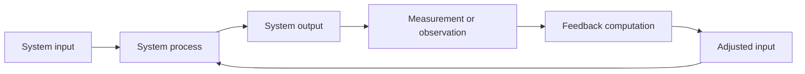

# Defining and Describing Feedback Loops

_Whenever a system’s outputs circle back to influence its future inputs, a feedback loop is quietly shaping how it evolves._  

A **feedback loop** is a circular process in which the outputs of a system are routed back as inputs, creating a “circular chain of cause and effect.”[^tzwgq1] This structure means that a change in one part of the system eventually returns to affect its own source, so the system’s behavior depends on its history rather than simple one-way causation. [^tzwgq1] [^f2fgzp] Feedback loops are fundamental in control theory, biology, economics, distributed systems, and AI, because they enable **self-regulation**, **adaptation**, and sometimes **runaway growth or collapse**. [^4g79wc] [^tzwgq1] [^uux704] [^f2fgzp] Practically, they matter wherever we care about keeping systems stable (like thermostats), helping them learn (like reinforcement learning agents), or understanding complex dynamics (like financial bubbles or social media virality). [^4g79wc] [^tzwgq1] [^uux704] [^f2fgzp]

Common general-purpose definitions include:  

- Feedback loops are “closed-chain processes in which a system’s outputs are recurrently used as inputs to influence future system behavior, enabling self-regulation, dynamic adaptation, optimization, or stability.”[^4g79wc]  
- Feedback loops occur when “the outputs of a system are routed back as inputs, forming a circular chain of cause and effect.”[^tzwgq1]  
- More informally, a feedback loop is “a system in which a change in something causes a change in something else, which in turn loops back around and causes a further change in the first thing, perhaps after intermediate steps.”[^f2fgzp]  

Two canonical types are widely recognized:  

- **Reinforcing (positive) feedback loops**: an initial change triggers more change in the same direction, “amplify[ing] changes” and driving exponential growth, bubbles, or cascading failures. [^tzwgq1] [^f2fgzp]  
- **Balancing (negative) feedback loops**: changes are counteracted by responses in the opposite direction, promoting stability and “pull[ing] the system back towards” an equilibrium or goal state, like a thermostat maintaining a set temperature. [^tzwgq1] [^uux704] [^f2fgzp]  

In engineered and automated settings, feedback loops typically include explicit components such as **sensors/telemetry**, **feedback signal computation** (e.g., error or anomaly), and **programmable updates** (e.g., controller tuning or model retraining) that run with minimal human intervention. [^4g79wc] [^uux704]

# Uses in Context

- In **complexity economics and organizational analysis**, feedback loops are invoked to explain why markets, firms, and societies exhibit nonlinear and often unpredictable behavior, because “simple causal reasoning breaks down” once circular cause and effect dominates. [^tzwgq1]  
- In **systems thinking and policy analysis**, practitioners distinguish “reinforcing” and “balancing” feedback loops to model how interventions can unintentionally accelerate problems (e.g., housing bubbles) or stabilize systems (e.g., regulation that dampens volatility). [^f2fgzp]  
- In **distributed systems and cloud infrastructure**, feedback loops are used for autoscaling, congestion control, and fault tolerance: the system “self-regulate[s] and adapt[s] based on its performance and external conditions.”[^uux704]  
- In **AI and machine learning**, automated feedback loops use measured outputs (like model errors or user interactions) as inputs to retrain models, adjust prompts, or tune hyperparameters, enabling “dynamic adaptation, optimization, and robust control” without continuous human oversight. [^4g79wc] [^0v2yl3]  
- In **customer experience and product management**, the “AI feedback loop” describes continuous cycles where customer signals are “collected, analyzed by AI, routed to the right team, acted on, and then measured” again to refine products and services in near real time. [^vgqw65]  
- In **music and sound art**, feedback loops in audio mixers and signal chains (e.g., “no-input mixer” practices) are used as creative tools, where performers interact with self-referential sound systems that respond to their own output. [^7dgitb]  

# History of Use

## Origins

- The underlying idea of feedback and feedback loops was formalized in **control engineering** in the early 20th century, especially in automatic control systems where the output (e.g., speed, temperature) is continuously measured and fed back to adjust inputs (e.g., valve position, motor power) to reach a target. [^uux704]  
- The term “feedback” became central in **cybernetics**, notably through Norbert Wiener’s mid-20th-century work, where feedback loops were described as the basic mechanism of control and communication in animals and machines, although specific modern definitions like those above are later syntheses rather than a single canonical first use. [^tzwgq1] [^f2fgzp]  
- As complexity science matured, economists and organizational theorists began explicitly defining “feedback loops” as circular causal chains in economic and organizational systems, emphasizing how reinforcing and balancing feedback create emergent behavior beyond linear cause–effect models. [^tzwgq1] [^f2fgzp]  

## Evolution

- **Mid–20th century – Control theory and cybernetics**: Feedback loops were formalized mathematically for engineering and biological systems, providing tools like transfer functions and stability criteria (e.g., negative feedback for stable control) that remain foundational in electrical, mechanical, and biological regulation models. [^uux704]  
- **Late 20th century – Systems thinking and complexity economics**: Systems theorists and complexity economists adopted “reinforcing” and “balancing” feedback loops as core building blocks for causal loop diagrams and system dynamics models, using them to explain phenomena like market bubbles, organizational learning, and ecological resilience. [^tzwgq1] [^f2fgzp]  
- **21st century – Automated and AI feedback loops**: With large-scale computation and data, researchers and practitioners now design **automated feedback loops** where measurement, feedback signal extraction, and control-law adaptation are implemented programmatically, driving real-time optimization and fairness adjustments in cyber-physical systems, deep learning, and recommender systems. [^4g79wc] [^uux704] [^vgqw65]  

# Best Real-World Examples

- [Nest Learning Thermostat](https://nest.com) – Uses a **balancing feedback loop** between measured home temperature and heating/cooling output to maintain a setpoint, while also learning user preferences from historical interactions. [^uux704]  
- [Kubernetes Horizontal Pod Autoscaler](https://kubernetes.io) – Implements a feedback loop that monitors metrics like CPU utilization and scales the number of pods up or down, enabling distributed systems to “self-regulate and adapt based on [their] performance and external conditions.”[^uux704]  
- [Reinforcement Learning agents in OpenAI Gym](https://gym.openai.com) – Exemplify automated feedback loops where agents receive reward feedback from the environment and update their policies, mirroring the same feedback structure used in many real-world AI applications. [^4g79wc] [^0v2yl3]  
- [Opik for Observability and Optimization](https://www.arize.com) – A startup tool that instruments LLM applications with tracing and evaluation so that “observations” of model behavior are collected and “feed[ed] back into the system so the system can learn [and] improve over time,” closing a practical feedback loop for AI apps. [^0v2yl3]  
- [Zonka Feedback’s AI Feedback Loop](https://www.zonkafeedback.com) – A customer-experience platform describing an “AI feedback loop” where customer feedback is continuously collected, analyzed, routed, acted on, and then re-measured, forming a closed loop from “signals to action in real time.”[^vgqw65]  
- [No-input mixer performance practices](https://nime.org/proceedings/2025/nime2025_13.pdf) – In experimental music, performers patch mixing boards with feedback loops so that the mixer’s own output re-enters its input, creating a self-referential sound system that the instrumentalist dynamically influences. [^7dgitb]  

# Case Studies

### 1. Distributed System Autoscaling via Feedback Loops

In modern cloud-native architectures, autoscaling controllers implement explicit feedback loops to keep performance within target bounds while minimizing cost. [^uux704] A typical setup monitors metrics such as CPU usage, latency, or queue length (the **output**), compares them to desired thresholds, and adjusts the number of instances or pods (the **input**) accordingly, repeating this process continuously. [^uux704] This is a classic **balancing feedback loop**: when load increases and metrics exceed the target, the system automatically scales out, and when load drops, it scales back in, pulling the system toward an equilibrium level of resource utilization. [^uux704] The case shows how feedback loops provide **self-regulation and adaptability** in distributed systems, allowing operators to define goals while the system continuously corrects itself in response to changing conditions without manual intervention. [^uux704]  

### 2. Automated Feedback Loops in AI Application Optimization

Tools for LLM and ML observability such as **Opik** model AI application development as a feedback loop in which real-world observations of model behavior are fed back into the development pipeline. [^0v2yl3] In a described workflow, teams “trace all the inputs and outputs every step” of an AI application, attach evaluation metrics to those observations, and then use optimization algorithms to update prompts, model choices, or configurations based on those metrics. [^0v2yl3] Over time, new user interactions are “collect[ed]… feeding it back into the system so the system can learn, [and] improve over time,” with datasets that grow as a living record of observed behavior. [^0v2yl3] This illustrates a **continuous, automated feedback loop** where monitoring, evaluation, and optimization are tightly coupled, enabling AI products to improve iteratively after deployment rather than only during offline training. [^4g79wc] [^0v2yl3]  

### 3. Customer Experience “AI Feedback Loop” in Service Platforms

Customer-experience platforms such as **Zonka Feedback** describe an “AI feedback loop” that connects customer signals directly to operational changes in organizations. [^vgqw65] In their framing, customer feedback is continuously **collected** from channels like surveys and touchpoints, **analyzed by AI** to detect patterns and sentiment, **routed to the right team**, **acted on** through product or process changes, and then **measured** again to see whether those actions improved customer outcomes. [^vgqw65] Because this cycle runs repeatedly and often in near real time, it forms a feedback loop where each iteration refines both the AI models and the organization’s responses, turning raw feedback into structured learning for the business. [^vgqw65] This case highlights how feedback loops can be engineered not only in technical systems but also across socio-technical workflows, aligning organizational behavior with evolving customer needs.

***

# Sources

[^4g79wc]: [Automated Feedback Loops Overview - Emergent Mind](https://www.emergentmind.com/topics/automated-feedback-loops)
[^tzwgq1]: [Feedback Loops - Joseph Byrum](https://josephbyrum.com/joseph-byrum-glossary/feedback-loops/)
[^uux704]: [Feedback Loops in Distributed Systems - GeeksforGeeks](https://www.geeksforgeeks.org/system-design/feedback-loops-in-distributed-systems/)
[^f2fgzp]: [Getting Started: What are Feedback Loops? - Loops Behind the News](https://loopsbehindnews.substack.com/p/what-are-feedback-loops)
[^0v2yl3]: [GPH Vol 2 Ep 3: Opik for Observability and Optimization - YouTube](https://www.youtube.com/watch?v=E0HC0lt0vCs)
[^7dgitb]: [[PDF] Out-of-Control Feedback Systems and Collaborative Influence with ...](https://nime.org/proceedings/2025/nime2025_13.pdf)
[^vgqw65]: [The AI Feedback Loop: From Signals to Action in Real Time](https://www.zonkafeedback.com/blog/ai-feedback-loop)
