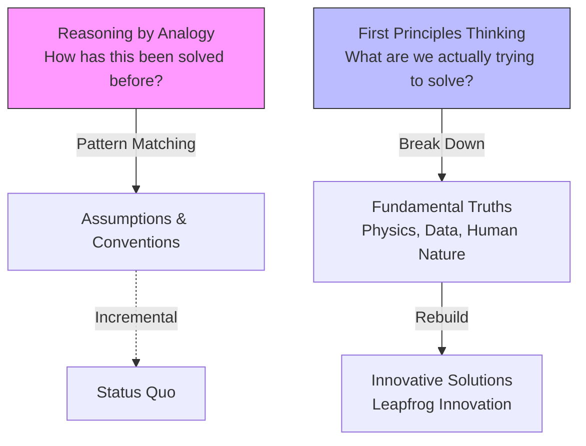

# Defining and Describing First Principles Thinking, Strategy, & Design

*_First principles thinking breaks complex problems into undeniable atomic truths, discards assumptions, and rebuilds superior strategies from the ground up for breakthrough innovation.*_  [^e0ch15] [^ojal3a] [^80frlx]

First principles thinking is "the practice of removing assumptions to get down to the fundamental truth of a problem," contrasting with analogy-based reasoning by asking "What are we actually trying to solve?" rather than mimicking past solutions. [^e0ch15] It applies in strategy and design to reimagine products, organizations, and processes amid complexity, enabling "sharper strategic pivots grounded in reality, not market mimicry" and "faster innovation cycles." [^yjd2an] This matters because it fosters adaptability, with research showing such firms are "twice as likely to outperform industry peers on key metrics like ROIC and market share growth." [^yjd2an]

# Uses in Context
- In AI and product development, it counters pattern-matching biases to build better products by drilling to "fundamental truth." [^e0ch15]
- In organizational problem-solving, it involves "breaking down complex issues to their most basic components, questioning assumptions, and rebuilding solutions from the ground up" for innovation. [^ojal3a]
- In corporate strategy, it transforms decision-making via a 4-part model: state challenge, deconstruct truths vs. assumptions, validate foundations, and reintegrate constraints. [^yjd2an]
- As a mental model for inventors, it decomposes problems into "basic, indivisible elements" like raw materials, then rebuilds to uncover hidden efficiencies. [^80frlx]
- In design and tech leadership, it powers "first-principles reasoning" to reduce costs dramatically, as in questioning rocket production expenses. [^80frlx]

# History of Use

## Origins
- The structured modern practice traces to Elon Musk's application at SpaceX, where he deconstructed rocket costs to raw materials like "aluminum alloys, titanium, copper, carbon fiber," revealing overpricing and enabling cheaper builds—"Boil things down to the most fundamental truths and reason up from there." [^yjd2an] [^80frlx]
- Musk's method built on scientific traditions of breaking to axioms, formalized in his interviews as asking "What do we know to be true? What are the obstacles?" to shift from assumption to physics-based innovation. [^80frlx]

## Evolution
- **2000s (SpaceX Era):** Musk popularized it in rocketry, proving first principles could slash launch costs by rebuilding from validated material truths rather than industry norms. [^80frlx]
- **2010s (Broader Strategy):** Adapted into leadership frameworks, with McKinsey-linked research validating its edge in outperforming peers via foundational reframing. [^yjd2an]
- **2020s (AI/Design Expansion):** Integrated into AI product design and nonprofit strategy, emphasizing pilots and co-creation to "break free from historical limitations." [^e0ch15] [^ojal3a]

# Best Real-World Examples
- [SpaceX Falcon 9](https://www.spacex.com/vehicles/falcon-9/) deconstructed rocket costs to raw materials, enabling reusable launches at 1/10th industry price. [^80frlx]
- [Maray AI Framework](https://www.maray.ai/posts/first-principles-thinking) systematizes problem decomposition for indie AI builders. [^80frlx]
- [Atomic Object AI Products](https://spin.atomicobject.com/first-principles-thinking-ai/) used it to strip assumptions in software design. [^e0ch15]
- [Ability Path Fundraising Redesign](https://abilitypath.org/wp-content/uploads/2025/09/Essential-Lessons-Article-4.pdf) broke down donor processes to truths for novel pilots. [^ojal3a]
- [Healthcare Onboarding Pivot](https://www.habitsforthinking.in/article/first-principles-thinking-how-elon-musks-approach-transforms-corporate-strategy) rebuilt from behavioral science, adapting to regulations. [^yjd2an]
- [Habits for Thinking Zero-Base Labs](https://www.habitsforthinking.in/article/first-principles-thinking-how-elon-musks-approach-transforms-corporate-strategy) monthly sessions for cross-functional strategy resets. [^yjd2an]

# Case Studies

At SpaceX, founded by Elon Musk in 2002, first principles thinking was applied to the rocket industry plagued by $60M+ launch costs. Musk's team asked "What is a rocket made of?" and priced raw materials (aluminum alloys, titanium, etc.) at ~2% of market rates, exposing markup assumptions. They rebuilt with vertical integration and reusability, launching Falcon 1 in 2008 and achieving orbital success where incumbents failed, dropping costs to ~$60M per Falcon 9 flight by 2010s. This shows the concept's power in capital-intensive design: stripping to physics truths enables 10x efficiency gains, outpacing NASA contractors. [^80frlx]

A healthcare client of Habits for Thinking (mid-2020s) faced inefficient patient onboarding. Using first principles, they stated the core goal—"seamless access to care"—deconstructed to behavioral truths (e.g., friction reduces adherence), discarded legacy forms, and rebuilt with science-backed flows. Real-world constraints like regional compliance were mapped as "true" vs. "changeable," yielding faster intake and higher retention. It demonstrates strategic design: the method clarifies constraints for resilient pivots, turning complexity into category shifts without idealism. [^yjd2an]

Ability Path, a nonprofit, applied it to fundraising in the 2020s by defining "What is fundraising?" beyond conventions—breaking to donor motivations and testing assumptions in safe pilots. Teams co-created from fundamentals, iterating models that boosted results where incremental tweaks failed. This underscores first principles in social impact strategy: inviting broad input post-deconstruction fosters adaptability and "services no one has seen before." [^ojal3a]

***

# Sources

[^e0ch15]: [First Principles Thinking and Why It Matters More in AI - Atomic Spin](https://spin.atomicobject.com/first-principles-thinking-ai/)
[^ojal3a]: [[PDF] First Principles Thinking - Ability Path](https://abilitypath.org/wp-content/uploads/2025/09/Essential-Lessons-Article-4.pdf)
[^yjd2an]: [First-Principles Thinking: How Elon Musk's Approach Transforms ...](https://www.habitsforthinking.in/article/first-principles-thinking-how-elon-musks-approach-transforms-corporate-strategy)
[^80frlx]: [First Principles Thinking: A Framework for Solving Problems - Maray](https://www.maray.ai/posts/first-principles-thinking)
[5]: [Why First Principles Thinking Will Outlast Every Trend in Tech](https://www.youtube.com/watch?v=fCfTfIrHdoQ)
